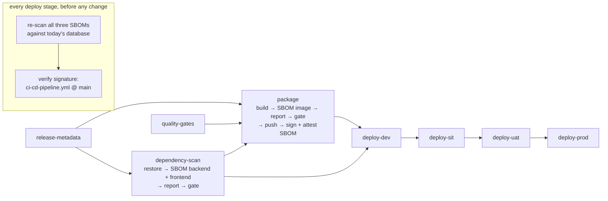

# Artifact Build, SBOM and Dependency Scanning

| Field | Value |
| --- | --- |
| Task | TASK-022 — Establish Container/Artifact Build & Dependency Scanning (P3 - Infrastructure & DevOps) |
| Depends on | TASK-018 — CI/CD pipeline with controlled promotion gates (`docs/architecture/cicd-pipeline.md`, BUILT — NOT APPLIED) |
| Record date | 2026-09-25 |
| Status | **BUILT — NOT APPLIED.** Every part that does not need a registry has been run, and the validation cell has been executed twice: locally against the pipeline's own commands, and as real GitHub Actions runs on a test branch (§5.1). The SBOMs, the dependency scan, the image scan and the gate run on every push to `main` today. Signing the pushed image and verifying that signature at each stage wait for the registry, just as the push does |
| Branch | `infra/task-022-artifact-build-dependency-scan` |
| Deliverables | Container build pipeline stage: the `dependency-scan` job and the extended `package` job in `.github/workflows/ci-cd-pipeline.yml`, plus the re-scan and signature check in `.github/actions/deploy-environment/action.yml`. SBOM output: `release-evidence-dependencies` and `release-evidence-image` artifacts (CycloneDX). Dependency-scan report: the `vulnerabilities-*.json` and `.txt` files in those artifacts, and the job summary. Supporting files: `.github/scripts/release-security-scan.sh`, `.github/scripts/verify-dependency-gate.sh` (the validation cell, executed), `.github/security/vulnerability-exceptions.yaml`, checks P-12 to P-15 in `docs/architecture/cicd-pipeline-check.py`, and this record |
| Environment variables / secrets | `CONTAINER_REGISTRY_TOKEN` (the workbook's cell for this task; already consumed by `package` since TASK-018). No new secret. Signing is keyless: `package` gains `id-token: write`, and no signing key exists to store. The brief this task was issued with said "None (network topology, not application secrets)"; that text is TASK-021's, and the sheet row governs |
| Implements | CTL-41; CTL-40's "failed security scan blocks promotion", extended from the image to both manifests and to every stage |
| Workbook read | Google Sheet "Implementation work" (ID `1JQdbw-S9wAS247cP3PpSCme_D2NAPVnWzhXhvvxrtl0`), Implementation Plan rows TASK-018, TASK-022 and TASK-080, read 2026-09-25 |

## 1. What this record is

> CI produces a signed/tagged artifact per commit on main; a dependency scan report is attached to
> every build; a build containing a known CRITICAL CVE with an available fix is blocked from
> promotion past DEV.

TASK-018 already built the image once per commit, tagged it `sha-<commit>`, and scanned it with
Trivy before pushing it. This task adds three things that scan did not have:
- **a record of what was scanned**, which is the SBOM.
- **coverage of the source manifests**, including the frontend, which is not in the image.
- **a scan result that stays true over time.** A scan is only true on the day it runs, and a release
  can wait at an approval gate for up to 30 days.

TASK-080 owns the same kind of scan on pull requests (CTL-42). This task scans the release.

## 2. The shape

Every scan reads an SBOM. `release-security-scan.sh` has four modes, and each job calls the ones it
needs:

| Mode | Reads | Writes |
| --- | --- | --- |
| `sbom-manifests` | `src/backend` after a lock-file restore; `src/frontend/package-lock.json` | `sbom-backend.cdx.json`, `sbom-frontend.cdx.json` |
| `sbom-image <ref>` | The release image in the local daemon | `sbom-api-image.cdx.json`, which covers the base image's OS packages and the published `.deps.json` closure |
| `scan` | Every `sbom-*.cdx.json` in `$EVIDENCE_DIR` | `vulnerabilities-<sbom>.json` and `.txt`, listing **every** finding, plus a severity table in the job summary. Never fails on a finding |
| `gate` | The same SBOMs, and the exceptions file | `gate-<sbom>.json`. Fails if any SBOM has a fixable HIGH or CRITICAL finding that has no exception. All SBOMs are gated before the step fails, so one red component cannot hide a second. With no SBOM to read it exits 2, never 0 |

In both jobs the report is uploaded with `if: !cancelled()` **before** the gate runs. A blocked
build therefore still carries the report that explains the block. P-12 and P-13 enforce this.

## 3. Decisions

### D-1: Scan the SBOM, not the image or the tree

The SBOM is generated once and every scan reads it. That means the report and the SBOM cannot
disagree, and a later stage can re-scan the same components without rebuilding. Before this was
adopted, the two methods were compared on the real release image: the direct image scan and the scan
of its CycloneDX SBOM returned **the same 22 findings, identical in ID and package**. TASK-018's
direct `trivy-action` image scan was replaced by this method, not run alongside it.

Trivy is the only tool used. It is already the IaC scanner (TASK-017), so the image, both manifests
and the Terraform are gated by one tool with one severity vocabulary. The version is pinned at
`v0.74.0` through `aquasecurity/setup-trivy`.

### D-2: `dependency-scan` is its own job, not a step of `package`

TASK-018 F-7 expected this task to extend `package`. The drill showed why that would fail the
second criterion. `Directory.Build.props` treats warnings as errors, so NuGet's own audit turns a
CRITICAL package into `error NU1904` and fails `dotnet restore` in `quality-gates`. `package` needs
`quality-gates`, so it would be skipped, and the one build that most needs a dependency report would
have none.

So `dependency-scan` needs only `release-metadata`. It runs its own restore with `NuGetAudit=false`,
because blocking is this job's decision and the vulnerable package must still be recorded. `package`
and `deploy-dev` both need it. P-12 fails the pull request if the job gains any other need.

The backend restore writes lock files (`RestorePackagesWithLockFile=true`), and the SBOM is read from
them. Trivy does not read `obj/project.assets.json`. Without lock files it sees only the ten direct
references in `Directory.Packages.props`. With them it sees 87 components across six projects,
transitive dependencies included. The lock files are generated in CI and not committed (F-6).

### D-3: One threshold — fixable HIGH or CRITICAL blocks

The criterion is CRITICAL. TASK-018 already blocked the image on HIGH or CRITICAL with an available
fix. Narrowing that would loosen an existing control inside a task meant to strengthen it, so the
existing threshold stays and now applies to the manifests too. "With an available fix" is
`--ignore-unfixed`: a finding that no upgrade can fix stays in the report but does not stop a
release. On the current commit the gate passes. The image has 17 MEDIUM and 5 LOW findings, none
fixable, and the manifests have none.

A fixable finding that cannot be taken right away needs a way through that is not "delete the
gate". That is `.github/security/vulnerability-exceptions.yaml`, Trivy's own ignore file, with
these limits:
- Security Lead review, through CODEOWNERS.
- P-15 requires `id`, `purls`, `statement` and an `expired_at` no more than 90 days away.
- An entry covers a CVE in one named package, not everywhere it appears.
- After its date, the finding blocks again.

Both behaviours were executed (§5, row 6).

### D-4: "Past DEV" is enforced at every stage, not only at the build

The build-time gate stops a known CVE before DEV, which already satisfies the criterion. Its weak
point is the calendar. A CVE published after the build, while the release waits days or weeks for
the G-3 or G-4 approval, was not known when the scan ran. So each deploy stage downloads the
release's three SBOMs and re-scans them against the database as it stands that day, before it
authenticates, migrates or applies. A newly published CRITICAL CVE with a fix then stops SIT, UAT
or PROD without rebuilding anything, and the re-scan report is kept as `promotion-scan-<env>`.
P-14 fails the pull request if the re-scan moves after the migration or the apply.

### D-5: Keyless signing, and every stage verifies the signer

The pushed digest is signed with `cosign sign`, and its image SBOM is attached with
`cosign attest --type cyclonedx`. The signing identity is the workflow's own OIDC token, through
Sigstore's Fulcio and Rekor, so no signing key exists to leak or rotate. This is why no new secret
was needed.

A signature nobody checks proves nothing. Each deploy stage runs `cosign verify` with the identity
pinned exactly to `…/.github/workflows/ci-cd-pipeline.yml@refs/heads/main` and GitHub's OIDC
issuer, before migrating or applying. Each of these fails at that step:
- an image built on another branch.
- an image signed by any other workflow.
- an image pushed by hand under a matching digest.

P-14 fails the pull request if the identity is widened to a regexp.

The repository is public, so the Rekor entry reveals nothing new (repository, workflow, commit).
F-4 covers the case where that changes.

## 4. What is scanned, and what is not

| Component | SBOM | Included | Excluded, and why |
| --- | --- | --- | --- |
| Base image OS packages (Ubuntu 24.04, `aspnet:10.0`) | `api-image` | All installed packages | — |
| Backend, as shipped | `api-image` | The published `PMPlatform.Api.deps.json` closure | — |
| Backend, as declared | `backend` | Every project's resolved graph, **test projects included** | Nothing. A CRITICAL finding in `xunit` blocks the release. That is deliberate (the manifest is the manifest), and the exceptions file exists for it |
| Frontend | `frontend` | `package-lock.json` production dependencies: `react`, `react-dom`, `scheduler` | Dev dependencies such as Vite, ESLint and Vitest build the bundle but do not ship in it. That supply-chain risk belongs to the PR gate (F-5) |

The SPA bundle is not in the image yet (TASK-018 F-3). When it is, the image SBOM will **still not**
list npm packages, because bundled JavaScript carries no package metadata. The manifest SBOM
remains the frontend's record either way.

## 5. Verification

Every check below was run on 2026-09-25 against the committed files.

| # | Check | Result |
| --- | --- | --- |
| 1 | `actionlint` over the three workflows and the deploy action | 0 errors |
| 2 | `shellcheck` over the eight scripts in `.github/scripts` | Clean |
| 3 | `cicd-pipeline-check.py`, and the other nine `repo-checks` scripts | All green |
| 4 | Mutation test of P-12 to P-15: 16 edits that each remove one invariant, applied one at a time | Each caught with the invariant named. Files restored, check green (§5.2) |
| 5 | The direct image scan vs the scan of the image's SBOM, on the real release image | The same 22 findings (D-1) |
| 6 | Exceptions: an entry for CVE-2019-10744 on `pkg:npm/lodash@4.17.11`, then the same entry dated in the past | Live: that CVE is suppressed and lodash's three HIGH findings still block. Expired: all four block |
| 7 | Fail-closed cases: gate with no SBOM; manifest SBOM on an unrestored tree | Both exit 2 with the reason. Neither reports a pass |
| 8 | Signing, against a throwaway local registry and a real pushed digest, with cosign v3.1.3 and a generated key pair (keyless needs a GitHub OIDC token) | `sign` OK; `attest` of the 257 KB, 125-component SBOM OK; `verify` OK; `verify-attestation` returns the CycloneDX predicate bound to the digest; an unsigned digest in the same repository is refused; a different key is refused |
| 9 | **The validation cell**, `verify-dependency-gate.sh --with-image` | 18 of 18 assertions (§5.1) |
| 10 | `gitleaks detect --no-git` over `.github/` | `no leaks found` |
| 11 | `dependency-scan` under `act` | **Not executed.** `act` needs a real GitHub token to clone `setup-trivy`'s install script, and none was available at the time. Superseded by row 12 |
| 12 | **The validation cell on GitHub Actions**: the committed pipeline, dispatched on `test/task-022-cve-drill` | Red with the CVEs planted, green once they were removed (§5.1) |

### 5.1 The validation cell, executed

> Introduce a dependency with a known CRITICAL CVE in a test branch and confirm the pipeline blocks
> it; remove it and confirm the pipeline goes green.

`verify-dependency-gate.sh` creates a scratch worktree of the commit under test. It runs the
pipeline's own restore and gate commands three times, as `dependency-scan`, as `package` (building
the real image from `api.Dockerfile`), and as a promotion stage re-scanning all three SBOMs together:

| Phase | Change | dependency-scan | package (image) | promotion re-scan |
| --- | --- | --- | --- | --- |
| baseline | none | pass | pass | pass |
| planted | `log4net 2.0.9` in the backend (CVE-2018-1285, CRITICAL, fixed in 2.0.10); `lodash 4.17.11` in the frontend (CVE-2019-10744, CRITICAL, fixed in 4.17.12) | **blocked**: both CVEs named, and both reports written although the gate failed | **blocked**: CVE-2018-1285, found in `app/PMPlatform.Api.deps.json` | **blocked**: both CVEs |
| removed | both taken out | pass | pass | pass |

The backend finding was reported in `Directory.Packages.props` and in the lock files of `Infrastructure`
(the direct reference), `Api` (transitive) and both test projects, each on its own row. That is what
a reviewer needs to see the package's reach.

**One adjustment, for the image leg only.** In the drill's copy of the Dockerfile, the restore runs
with `NuGetAudit=false`. Without it the image containing `log4net 2.0.9` cannot be built, because
NuGet's audit fails the build (D-2). The drill turns that audit off so the image gate can be seen
blocking on its own. In the pipeline that image is never built.

**On GitHub Actions.** The pipeline starts on a push to `main` or on `workflow_dispatch`, and a
dispatch runs the workflow file from the ref it names. So the cell was run on a test branch cut from
this branch, with nothing merged into `main`:

| Run | Commit on `test/task-022-cve-drill` | Result |
| --- | --- | --- |
| [36131485384](https://github.com/baderalhindi/ImplementW/actions/runs/36131485384) | `4f14a9a`: `log4net 2.0.9` and `lodash 4.17.11` planted | **failure.** `dependency-scan` ran every step through the report upload and failed at **Gate**. Its log named CVE-2018-1285 in `Directory.Packages.props` and four lock files, and CVE-2019-10744 in `package-lock.json`. `release-evidence-dependencies` (23.8 KB) is attached to the blocked run. `quality-gates / backend` also failed on NuGet's `NU1904`, the independent second block D-2 describes. `package`, `migration-dry-run` and all four deploy stages were **skipped** |
| [36131638235](https://github.com/baderalhindi/ImplementW/actions/runs/36131638235) | `b9d010c`: the plant reverted, tree identical to this branch | **success.** All four quality gates, `dependency-scan` (backend 87 components, frontend 4, gate passed), `migration-dry-run`, and `package`: image built, SBOM of 125 components (17 MEDIUM, 5 LOW, none fixable), gate passed. Both evidence artifacts attached. Push and signing skipped, and the four deploy stages skipped, because preflight is not ready (V-2) |

A third run, 36131595307, was dispatched on the planted commit by mistake and cancelled before it
ran. It is not evidence either way.

### 5.2 Mutation test

| # | Edit | Reported |
| --- | --- | --- |
| M16 | `dependency-scan` needs `quality-gates` | P-12: must need `release-metadata` alone |
| M17 | `dependency-scan` removed from `deploy-dev`'s needs | P-3: a failed dependency-scan would not block promotion |
| M18 | Restore without lock files | P-12: no lock-file restore step |
| M19 | Report uploaded only on success | P-12: a blocked build carries no report |
| M20 | Image gate removed | P-13: `package` has no gate step |
| M21 | `cosign sign` removed | P-13: no sign step |
| M22 | `package` no longer needs `dependency-scan` | P-13: an image from a blocked tree could be pushed |
| M23 | `id-token: write` dropped | P-13: cannot sign keylessly |
| M24 | `package` granted `contents: write` | P-13 |
| M25 | Promotion re-scan removed | P-14: a stage would deploy without it |
| M26 | Signer identity widened to `--certificate-identity-regexp '.*'` | P-14: any workflow or branch would pass |
| M27 | `CRITICAL` removed from `BLOCKING_SEVERITIES` | P-15 |
| M28 | Exception with no `expired_at` | P-15 |
| M29 | Exception expiring in a year | P-15: more than 90 days away |
| M30 | Exception with no `statement` | P-15 |
| M31 | Signature verification moved after `terraform apply` | P-14: `migrate` runs before it |

### 5.3 Owed

| Drill | Blocked by |
| --- | --- |
| V-2: a keyless signature on a pushed digest, verified by a deploy stage | The registry, which needs the region and tenancy (TASK-018 §2). Until then `package` builds, scans and gates, but does not push or sign |

## 6. Acceptance criteria

| # | Criterion | Status |
| --- | --- | --- |
| 1 | CI produces a signed/tagged artifact per commit on main | **Tagged: MET** (`sha-<commit>`, since TASK-018). **Signed: BUILT, not observed.** Signing runs after the push, and the push waits on the registry (V-2). The sign, attest and verify commands were executed against a real digest (§5, row 8), and every stage refuses an image this workflow did not sign on `main` (D-5) |
| 2 | A dependency scan report is attached to every build | **MET for the pipeline's own half.** `dependency-scan` needs nothing that can fail on a vulnerable dependency, and uploads its report before gating. The drill confirmed the report is written when the gate fails. P-12 enforces both. **Observed on GitHub:** the blocked run carries `release-evidence-dependencies`, and so does the green one (§5.1) |
| 3 | A build containing a known CRITICAL CVE with an available fix is blocked from promotion past DEV | **MET, executed.** It is blocked before DEV, and each stage re-scans before it deploys (D-4). Both CRITICAL CVEs blocked all three legs locally, and on GitHub the planted run stopped before `package` with every deploy stage skipped. Removing them turned both green (§5.1) |
| — | Validation cell | **EXECUTED ON GITHUB ACTIONS.** Run 36131485384 blocked the test branch with both CVEs named; run 36131638235 went green after they were removed (§5.1) |
| — | Deliverables: container build stage, SBOM output, dependency-scan report | **MET.** §2, and the Deliverables row above |

## 7. Findings and open items

| ID | Finding | Owner |
| --- | --- | --- |
| **F-1** | **The pipeline enforces the signature and the platform does not.** Anyone holding a deploy credential can run `gcloud run deploy` on an unsigned image, because the check lives in the pipeline, not in Cloud Run. Recommended: Binary Authorization on the four Cloud Run services, with a policy that admits only images whose signature matches D-5's identity. That would move the rule into the platform the IaC already manages | DevOps/Platform Lead and Security Lead; TASK-017's modules |
| **F-2** | **A rollback re-scans and rebuilds.** `workflow_dispatch` with an earlier `commit_sha` runs `package` again, so the image is rebuilt and gets a new digest. `cicd-pipeline.md` D-4 says "rebuilds nothing", which does not match the workflow. Under this task, that rebuilt release is also re-scanned against today's database, so a rollback to a release with a CVE published since then is **blocked**. For a security fix that is correct. For an incident, the way through is a dated exception, which the on-call runbook should say | TASK-098 (rollback strategy); TASK-018's record to correct D-4 |
| **F-3** | **Third-party actions are pinned by tag.** A tag can be moved to a different commit. `setup-trivy` and `cosign-installer` run in the job that holds `id-token: write`, which is the job whose identity signs releases. Recommended, across the repository: pin every `uses:` to a full commit SHA, with the tag as a comment, and let Dependabot move them | DevOps Lead; TASK-080 or a hardening task |
| **F-4** | **Signing uses the public Sigstore instance.** That is fine while the repository is public. If the repository becomes private, or AHDA Cybersecurity rules under ADR-001 C-8 that release metadata must not leave the Kingdom, switch to a Cloud KMS key in the in-Kingdom region and a signing config without a transparency log. That means one flag on `cosign sign`/`attest`, and `--key` in place of the identity flags on `verify` | AHDA Cybersecurity (C-8); DevOps |
| **F-5** | **Frontend dev dependencies are not scanned.** They do not ship, so they are outside the release gate (§4). They are still code that runs on the runner with the repository's token, so a compromised build tool is a supply-chain risk. TASK-080's PR gate is the right place, with `--include-dev-deps` | TASK-080 |
| **F-6** | **Backend lock files are generated in CI, not committed.** Committed `packages.lock.json` files with `--locked-mode` in the quality gate would make restores reproducible, and would make the SBOM a record of a reviewed file rather than of a resolution. It changes the backend's build, so it is the backend lead's decision; `release-security-scan.sh` needs no change either way | Backend lead |
| **F-7** | **A HIGH finding with a fix now blocks a release through the manifests too** (D-3). Today nothing trips it. The first time it does, expect the question "why HIGH when the criterion says CRITICAL". The answer is D-3, and the way through is an exception, not a threshold change | Security Lead, noted |

## 8. Change log

| Date | Change | By |
| --- | --- | --- |
| 2026-09-25 | Validation cell executed on GitHub Actions by dispatching the pipeline on `test/task-022-cve-drill`: blocked with log4net 2.0.9 and lodash 4.17.11 planted (run 36131485384), green once they were reverted (run 36131638235). V-1 closed; V-2 (the keyless signature) is still owed. The four GitHub deployment environments were created by the repository owner, which clears the extension's `Value 'dev' is not valid` errors; they have no protection rules yet. | DevOps (TASK-022) |
| 2026-09-25 | Initial record. `dependency-scan` job added; `package` extended with the image SBOM, report, gate, signature and SBOM attestation; every deploy stage re-scans the release SBOMs and verifies the signer before changing anything. One gate script and one threshold, with a dated exceptions file. P-12 to P-15 added to `cicd-pipeline-check.py` and mutation-tested (16 of 16). Validation cell executed with `verify-dependency-gate.sh` (18 of 18); the GitHub run and the keyless signature are owed. Seven findings raised. | DevOps (TASK-022) |
