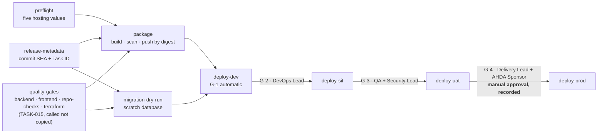

# CI/CD Pipeline — Controlled Promotion from DEV to PROD

| Field | Value |
| --- | --- |
| Task | TASK-018 — Build CI/CD Pipeline with Controlled Promotion Gates (P3 - Infrastructure & DevOps) |
| Depends on | TASK-015 — Configure Quality Gates (`docs/architecture/ci-quality-gates.md`, BUILT); TASK-016 — Environment separation (BUILT — NOT APPLIED); TASK-017 — Infrastructure as code (BUILT — NOT APPLIED) |
| Record date | 2026-09-23 |
| Status | **BUILT — NOT APPLIED.** The pipeline is written, lint-clean, and every part that does not need a cloud is executed and tested against its failure cases (§5). No environment is deployed to: five hosting values are outstanding, so `preflight` reports not-ready and the four deploy stages skip. The build, the image scan, the quality gates and the migration dry-run all run in full |
| Branch | `infra/task-018-cicd-promotion-pipeline` |
| Deliverables | `.github/workflows/ci-cd-pipeline.yml` — the four stages and the manual PROD gate; `.github/actions/deploy-environment/action.yml` — one environment's deployment; `.github/scripts/{release-metadata,deploy-preflight,migration-dry-run,migrate-environment,deployment-record}.sh`; `.github/scripts/verify-promotion.py` — the validation cell, executed; `docs/architecture/cicd-pipeline-check.py` wired into `repo-checks`; `workflow_call` on `ci-quality-gates.yml`; `platform.artifact_registry` in `infra/environments/environments.json`; this record |
| Environment variables / secrets | `DEPLOY_SERVICE_ACCOUNT_KEY` (per environment, from each GitHub environment's own secret scope), `CONTAINER_REGISTRY_TOKEN` (repository scope); repository variables `ADR001_CONFIRMATION_REF` and `MIGRATION_JOB` |
| Implements | CTL-40; CTL-48 and CTL-49 in part; the codified form of CTL-37 (expand-then-contract) and CTL-39; Release Checklist "Production Deployment Approval Recorded"; Blueprint Section 22.1 F-2 |
| Workbook read | Google Sheet "Implementation work" (ID `1JQdbw-S9wAS247cP3PpSCme_D2NAPVnWzhXhvvxrtl0`), sheets Implementation Plan (TASK-018 and the P3/P4/P14/P15 rows it touches), Environment and Secrets, Release Checklist, as read 2026-09-23 |
| Controlled sources and authority order | per TASK-001 |

## 1. What this record is

TASK-018's acceptance criteria are three properties of a pipeline, not three features of one:

> Pipeline cannot deploy to PROD without an explicit approval step recorded with approver identity
> and timestamp; a failed quality gate, security scan, or migration dry-run blocks promotion
> automatically; every deployment is traceable to a Git commit SHA and Task ID.

Each is a property that must hold for *every* release, including the one deployed at 2am by someone
who is in a hurry. So the question this task answers is not "what does a deploy pipeline contain" —
that part is conventional — but **where each property is enforced, and what an edit that removed it
would look like to a reviewer.** Three of the four sections below are about that.

Most of the shape was already decided. TASK-016 §4 fixed the promotion path, the approver of each
gate and the rule that one artifact is built once and promoted unchanged; TASK-017 made
`terraform apply` the deploy mechanism and left `container_image` as the one value the pipeline
supplies. What was missing was the thing that binds them, and the evidence each promotion leaves.

## 2. No gate decision, and five values that are not here

TASK-018's Gate Decision cell is empty. Nothing in this task is contingent on an approval; it is
contingent on values, and the same five that hold TASK-016 and TASK-017 hold it:

| Value | Owed by | Effect here |
| --- | --- | --- |
| The in-Kingdom region name (UGV-07, ADR-001 R-2) | AHDA IT | The registry hostname is `<region>-docker.pkg.dev`, so the pipeline cannot **push** an image, not merely deploy one |
| Tenancy: organisation and billing account (UGV-07, R-3) | AHDA IT | No project exists to deploy into |
| The written confirmation (ADR-001 §9, R-1) | AHDA IT | `ADR001_CONFIRMATION_REF` is unset, and every deploy stage refuses without it — the same hold `infra/environments/lib/common.sh` applies |
| The AHDA-owned DNS zone (environment-separation.md F-1) | AHDA IT | `APP_BASE_URL` is empty for all four environments, so a deployment could not be smoke-tested |
| The artifact registry's project (F-1 below) | DevOps/Platform Lead | Nobody has declared where the one shared registry lives |

The pipeline's response to all five is one job. `preflight` reads them from
`infra/environments/environments.json` and reports `ready=false` with each outstanding item named;
the four deploy stages are conditioned on `ready`, so they skip, and every stage re-checks with
`--require` before it uses a credential. A run today is green and deploys nothing, and the job
summary says which five values stand between the pipeline and its first deployment.

**Why a skip rather than a failure.** A failed gate must be red — that is CTL-40. A release that is
correct but has nowhere to go is not a failed gate, and making every push to `main` red until AHDA
IT answers would train the team to ignore a red pipeline, which is the one habit this task exists to
prevent. The distinction is mechanical: `preflight` never fails, gates always do.

## 3. What was built

### 3.1 The shape



One workflow, nine jobs, on every push to `main` — the trunk, and the only branch that promotes
(`branching-strategy.md` §2). `workflow_dispatch` takes an optional `commit_sha`, which is how an
earlier release is re-promoted; that is also how a rollback is issued (§4.4).

`concurrency` is keyed on the workflow rather than the ref, so two releases never race for the same
environments. A run waiting at an approval gate holds the queue, which is intended: the queued run
is the release that would follow this one, and it should not overtake it.

### 3.2 Property 1 — PROD cannot be deployed to without a recorded approval

Three mechanisms, because the first alone is not evidence and the second alone is not enforcement.

| # | Mechanism | What it stops |
| --- | --- | --- |
| 1 | `environment: prod` on `deploy-prod`. GitHub refuses to start the job until a reviewer of that environment approves it. The reviewers are TASK-016's (`infra/environments/github/environments.json`: `delivery`, `devops`), with `prevent_self_review` | A deployment that nobody approved. Not a policy: the job does not start |
| 2 | `deployment-record.sh` reads the approval back from the API that recorded it, and **fails the deployment** if it carries no approver login or no timestamp, or if the only approval on the run was for a different environment | An approval that left no evidence, and a UAT approval being reused for PROD |
| 3 | `cicd-pipeline-check.py` P-4 fails the pull request if `deploy-prod` stops naming the `prod` environment, or if `prod` loses its reviewer teams | The edit that removes the gate while leaving the job called `deploy-prod` |

Mechanism 3 is the one worth arguing for. `environment: prod` → `environment: uat` is a two-character
change inside a job that still reads `deploy-prod`, it passes every lint, and it silently removes the
only thing standing between a commit and production. A reviewer can miss it; the check cannot
(§5.1 M1).

The record written on each deployment is an artifact retained for 90 days and a table in the job
summary:

```json
{
  "environment": "prod",
  "gate": "UAT -> PROD",
  "task_id": "TASK-018",
  "commit_sha": "9bb274a…",
  "image_digest": "…/pmplatform/api@sha256:1f3c…",
  "approval": {
    "required": true,
    "reviewer_teams": ["delivery", "devops"],
    "approver": "aalotaibi",
    "approved_at": "2026-11-03T09:41:07Z",
    "comment": "UAT acceptance signed 2026-11-02; rollback rehearsed 2026-10-28."
  },
  "deployed_at": "2026-11-03T09:43:—",
  "run_url": "…",
  "authorisation": "AHDA IT memo 2026-10-05"
}
```

That is the Release Checklist's "Production Deployment Approval Recorded" evidence — approver
identity and timestamp against a named release candidate — produced by the deployment rather than
written up after it.

### 3.3 Property 2 — a failed gate blocks promotion, automatically

The three gates CTL-40 names are `needs` of `deploy-dev`, and each later stage needs the stage
before it. A skipped or failed need skips every job downstream of it, so one red gate stops all four
environments rather than only the first.

| Gate | Job | Fails on |
| --- | --- | --- |
| Quality | `quality-gates` | Anything TASK-015's four jobs fail on: an analyzer warning, a lint or format violation, a type error, a failing unit test, a contract or ERD drift, a Terraform format or schema error, a HIGH/CRITICAL finding in the IaC scan |
| Security | `package` | A HIGH or CRITICAL vulnerability **with an available fix** in the release image. Scanned before the push, so a failing image never reaches a registry any environment can pull from |
| Migration | `migration-dry-run` | The migrations do not build; the generated script fails against an empty database; it fails when applied a second time; or it drops a table, column or constraint (§3.5) |

The quality gate is **called, not copied**: `ci-quality-gates.yml` gained a `workflow_call` trigger
and the pipeline calls it. A copy of four jobs into this file would be four jobs that drift from the
ones guarding the pull request, and the drift would be invisible until the day they disagreed. The
same change removed `main` from that workflow's `push` trigger — otherwise a release commit runs the
same checks twice, in two places, with only one of them gating the deployment. Its `pull_request`
trigger and its job names are untouched, so the four required status checks on the protected
branches (TASK-012) are unaffected; branch protection binds to job names, and none changed.

### 3.4 Property 3 — every deployment names a commit SHA and a Task ID

`release-metadata.sh` runs first, reads the commit being released, and **fails the run** if its
message names no `TASK-nnn`. The Task ID then travels with the image into every deployment record.

This can fail, and that is the point. `pr-policy.sh` (TASK-012) already requires a pull request to
name a task, and squash merges carry the PR title onto `main`, so a commit without a Task ID is a
commit that reached the trunk outside that gate. Making the pipeline fail there rather than deploy an
untraceable release is the whole of CTL-40's third clause.

The image is deployed **by digest**, never by tag. "One artifact built once and promoted unchanged"
(TASK-016 §4) is a claim a digest can carry and a tag cannot — a tag can be moved between the SIT
approval and the PROD one, a digest is the image. `cicd-pipeline-check.py` P-5 fails the pull request
if any stage stops taking `needs.package.outputs.image_digest`.

### 3.5 The migration dry-run, and what it actually proves

`migration-dry-run.sh` runs against a scratch PostgreSQL service container, so it depends on no
environment and runs today. It does three things:

1. **Generates** the idempotent script the deployment would apply, which fails if the migrations do
   not compile or the model and the migration history disagree.
2. **Applies it twice** — to an empty database, then to the result. "Idempotent" has to mean this
   for a script that may be re-run after a partial failure, and EF Core's `--idempotent` flag is a
   claim about the generated SQL, not a test of it.
3. **Refuses a contraction.** A migration that drops a table, column or constraint is not
   backward-compatible with the release it is deployed alongside, so that deployment cannot be
   rolled back by redeploying the previous image — CTL-37's expand-then-contract rule, enforced
   rather than documented. A legitimate contraction says so in the migration with a comment
   containing `EXPAND-THEN-CONTRACT-REVIEWED`, which is a line a reviewer sees.

TASK-024 owns the migration framework and has not been built, so the release carries no migrations
and the script says so and exits 0 rather than inventing a pass. It was still tested against all
four cases by stubbing the generator (§5.2).

### 3.6 One deployment, written once

DEV, SIT, UAT and PROD are deployed by the same composite action; what differs between them is the
environment name, and through it the credential, the project and the approval. Six steps in order:

| Step | Why it is where it is |
| --- | --- |
| Preflight (`--require`) | Fails before a credential is used, rather than as an authentication error part-way through an apply |
| Authenticate | `DEPLOY_SERVICE_ACCOUNT_KEY` from *this environment's* secret scope. The job declares the environment, so GitHub resolves a different value per stage and no stage can read another's (CTL-48, F-2) |
| Migrations | Schema before the image that depends on it. A failed migration fails the step and nothing is deployed |
| `terraform apply` | Terraform is the deploy mechanism, so a deployment leaves no drift for the next plan (`infrastructure-as-code.md` §3.2). The digest arrives as `TF_VAR_container_image`; nothing else changes |
| Smoke test | `/health` on the environment's own origin, thirty attempts. A deployment nobody checked is a deployment that may have failed silently |
| Record | §3.2 |

Writing the sequence once is why SIT cannot quietly diverge from PROD: the difference between two
environments is their manifest entry, not their pipeline.

The migration step cannot run from the runner. Every environment's database has no public IP
(`infra/terraform/database`), so the only path to it is from inside that environment's VPC, and
ADR-001 C-8 has not settled whether a runner outside the Kingdom may hold a path to platform data at
all (CTL-49). `migrate-environment.sh` therefore runs the migration *in* the environment, as a Cloud
Run job on the release image, and refuses — naming what is owed — if the release carries migrations
and no such job is configured (F-2).

## 4. Decisions

### 4.1 D-1 — the image is built from `infra/docker/api.Dockerfile`, and the SPA is not in it

TASK-014's API image is already a Release publish with the repository's analyzers, and it is the
image the integration stack runs, so what is tested is what ships. Reusing it means there is one
Dockerfile rather than two that drift.

It contains the API and not the SPA bundle. TASK-016's decision D-1 puts both behind one origin per
environment, and TASK-017's load balancer routes every path to the Cloud Run service, so the
deployable eventually has to serve both. Making that true needs the API to serve static files and to
honour `X-Forwarded-Proto` behind the load balancer — two changes to `Program.cs` that decide how the
application is hosted. A CI task inventing them would be inventing application architecture in the
one place nobody would look for it. They are F-3 and F-4, with the owner named.

Until they close, a deployment of this artifact serves the API and returns 404 at `/`. That is why
they are findings rather than a footnote.

### 4.2 D-2 — the registry location is declared unresolved rather than chosen

Four environments pulling one unchanged artifact need one registry all four can read. Nobody has
declared where it lives: TASK-016 declares no shared project, and its own credential boundary (no
cross-project IAM, D-3) is in tension with any answer that puts the registry inside one environment.
The alternative — a registry per environment, with the image copied on each promotion — makes
"promoted unchanged" a property of a copy operation rather than of the artifact.

So `platform.artifact_registry` was added to the manifest with an empty `project_id` and an entry in
`platform.unresolved`, exactly as the region and the tenancy are held. Preflight blocks on it and
names the owner. The recommendation is in F-1; taking the decision here would have meant choosing
between two AHDA-owned boundaries on the strength of a pipeline's convenience.

### 4.3 D-3 — `DEPLOY_SERVICE_ACCOUNT_KEY`, as the workbook names it

The Environment and Secrets sheet specifies a downloadable service-account key per environment, and
that is what the pipeline consumes. `environment-separation.md` F-2 recommends replacing it with
Workload Identity Federation, because a downloadable key is the one credential that can leave the
environment it belongs to. That recommendation stands and is re-raised as F-5; implementing it here
would have put the pipeline out of step with the sheet row this task is measured against, and it is
a one-step change when the sheet changes.

### 4.4 D-4 — a rollback is a re-promotion, not a mechanism

`workflow_dispatch` with an earlier `commit_sha` rebuilds nothing and re-promotes that release
through the same four gates, including the PROD approval. A rollback is therefore a deployment with
the same evidence as any other, and the "rollback rehearsed within 30 days" gate rehearses the
pipeline that would actually be used. This is not a substitute for the release-and-rollback strategy
CTL-37 assigns to TASK-098, which owns the triggers and the data-side procedure.

## 5. Verification

What was run in this environment, against the committed files.

| # | Check | Result |
| --- | --- | --- |
| 1 | `actionlint` over all three workflows (expressions, contexts, `needs` references, action inputs) | 0 errors in 3 files |
| 2 | `shellcheck` over the five scripts | Clean |
| 3 | `python3 docs/architecture/cicd-pipeline-check.py` | `OK: promotion path dev -> sit -> uat -> prod; every gate blocks the first stage and every stage blocks the next; one artifact by digest, traceable to a commit and a Task ID.` |
| 4 | Mutation test of the check: 15 edits that remove an invariant, one at a time | Each caught, naming the invariant; files restored, check green (§5.1) |
| 5 | The check's YAML reader cross-checked against a real YAML parser (Ruby psych) on all four workflow and action files | Identical structures. Four reader bugs were found this way and fixed — block-scalar indentation, folded scalars, and `- 5432:5432` being read as a mapping |
| 6 | `migration-dry-run.sh` against a real PostgreSQL 17 container, four cases | §5.2 |
| 7 | `deployment-record.sh` against a stubbed approvals API, three cases | Approval present → record written with approver and timestamp; no approval → refused; an approval for `uat` used at `prod` → refused |
| 8 | `release-metadata.sh` against real commits | `TASK-017` from the merge commit; lowercase `task-018` accepted; a commit naming no task → refused, with the reason |
| 9 | `deploy-preflight.sh`: the repository manifest; a scratch manifest with placeholder values; `me-central1`; an unknown environment | Not-ready with 7 named items; ready with every output resolved; refused as outside the Kingdom; refused as undeclared |
| 10 | The other six `repo-checks` scripts, after this task's manifest change | All green |
| 11 | `gitleaks detect --no-git` over this task's files | `no leaks found`. The repository-wide scan reports the same five pre-existing false positives TASK-013 and TASK-016 recorded |
| 12 | The workbook's own validation checks, run through `verify-promotion.py` — the pipeline executed stage by stage with the cloud stubbed | §5.3. Two defects found and fixed |
| 13 | `preflight` executed in a real GitHub Actions runtime, under `act` | Reported not-ready with all six outstanding items, set `ready=false` and wrote the step summary. On the repository as committed, `act`'s whole-graph plan skips all four deploy stages, which is the documented behaviour today |

What is **owed**, and cannot be run until the five values arrive:

| Drill | From | Blocked by |
| --- | --- | --- |
| V-1 — a run end to end against a **real** non-PROD environment | TASK-018 Validation Checks | The region, the tenancy, the DNS zone, the registry project. The pipeline half is executed (§5.3); what is untested is the cloud |
| V-2 — GitHub's own halt on the `prod` environment, observed | TASK-018 Validation Checks | The four GitHub environments, which need the `delivery` team (TASK-016 F-5). The pipeline's own refusal is executed (§5.3) |
| V-3 — a failed security scan blocks promotion, observed rather than reasoned | CTL-40 | The image build and scan are third-party actions and are not run by the drill |

### 5.1 Mutation test

Each invariant was removed once, in the committed files, and the files restored afterwards. Every
case exited 1.

| # | Edit | Reported |
| --- | --- | --- |
| M1 | `deploy-prod` given `environment: uat` | P-4 — a stage that does not name its own environment does not get its approval gate |
| M2 | `prod` reviewer teams emptied | P-4 — the deployment at the end of the promotion path would not wait for an approval |
| M3 | `deploy-sit` no longer needs `deploy-dev` | P-2 — SIT can be deployed to without DEV |
| M4 | `migration-dry-run` removed from `deploy-dev`'s needs | P-3 — a failed migration-dry-run would not block promotion |
| M5 | UAT deployed from `pmplatform-api:latest` | P-5 — does not deploy the digest built by `package` |
| M6 | Task ID dropped from the PROD deployment | P-5 — does not carry the release's Task ID |
| M7 | Region written into the pipeline | P-6 — names the region `me-central2`; the region is read from the manifest |
| M8 | Project id written into the deploy action | P-6 — writes down `ahda-pmplatform-prod`, which belongs to the manifest alone |
| M9 | `permissions: contents: write` | P-8 |
| M10 | `workflow_call` removed from `ci-quality-gates.yml` | P-9 — the pipeline cannot gate on it |
| M11 | Quality gates run on pushes to `main` again | P-9 — the same checks twice, with only one gating the deployment |
| M12 | PROD's `if` deleted | P-3 ×2 — does not call `success()`, does not require preflight readiness |
| M13 | The deployment-record step removed | P-5 — a deployment would leave no record of its commit, task or approver |
| M14 | `platform.artifact_registry` removed | P-10 |
| M15 | A deploy stage renamed away | P-2 — no `deploy-uat` job; the manifest's promotion path is dev → sit → uat → prod |

### 5.2 The migration gate, executed

Against `postgres:17`, with the script generator stubbed to emit known SQL — everything else about
the script under test was real:

| Case | Result |
| --- | --- |
| A clean idempotent script of the shape EF Core emits | Passed: applied twice, 5 statements, no destructive statement |
| `ALTER TABLE "Project" DROP COLUMN "LegacyCode"` | Failed, with the expand-then-contract explanation and what to do instead |
| The same drop, marked `EXPAND-THEN-CONTRACT-REVIEWED` | Passed — the marked contraction is allowed and visible in review |
| `CREATE TABLE` without a history guard | Passed the first application, failed the second: "the script is not idempotent … a re-run after a partial failure would not be safe" |

### 5.3 The validation checks, executed as far as they go

The workbook asks for a run end to end against a non-PROD environment with all stages in order, and
for a PROD deploy attempt that halts and waits. Neither can be done against a real environment, and
both are mostly questions about the *pipeline* rather than the cloud. `verify-promotion.py` answers
that part by running the pipeline: it reads `ci-cd-pipeline.yml` and the deploy action with the same
YAML reader the CI check uses, orders the jobs by their own `needs`, evaluates their own `if`, and
runs their own `run:` steps, with the manifest carrying placeholder hosting values and everything
outside the repository — gcloud, terraform, the registry, the approvals API, the health endpoint —
stubbed. It writes nothing into the repository.

| Run | Result |
| --- | --- |
| `verify-promotion.py --approve sit,uat` | All nine stages in the declared order through UAT: `release-metadata → preflight → quality-gates → package → migration-dry-run → deploy-dev → deploy-sit → deploy-uat`. Each deploy stage ran its seven steps in order, each against its own environment's manifest entry. At `deploy-prod` the run **halted on its first step**, unapproved, with nothing applied |
| `verify-promotion.py --approve sit,uat,prod` | The full promotion completes. Four deployment records, all naming commit `3caccd9d4a1b` and `TASK-018`; SIT, UAT and PROD each carry an approver and a timestamp, DEV records that no approval is required; and **one digest reached all four environments unchanged** |

What this does not prove, and the record does not claim: GitHub halting a job on a protected
environment is GitHub's behaviour and needs the four environments to exist (V-2); the image build and
vulnerability scan are third-party actions the drill does not run (V-3); and no cloud call was made.

#### Two defects the drill found

Neither is visible by reading the file, which is the argument for running it.

**The deployment record named the wrong commit on a rollback.** The record took `GITHUB_SHA`, which
is the commit that *triggered* the run. A rollback is a `workflow_dispatch` naming an earlier commit
(§4.4), where `GITHUB_SHA` is still the head of `main` — so precisely the deployment where
traceability matters most would have recorded a commit that was never deployed. The record now takes
the released commit from `release-metadata`, and check P-5 fails a stage that takes it from anywhere
else.

**The approval was a detective control, not a preventive one.** The approval was read back only when
the record was written, at the end of the stage — after the migration and after `terraform apply`. In
a real run GitHub's halt comes first, so this matters only when the first lock is bypassed or
misconfigured, which is exactly the case the second lock exists for. It now runs as a step of its own
before the credential is used and before anything is applied, and check P-11 fails the pull request
if a migration or an apply is ever ordered before it.

## 6. Acceptance criteria

| # | Criterion | Status |
| --- | --- | --- |
| 1 | Pipeline cannot deploy to PROD without an explicit approval step recorded with approver identity and timestamp | **MET for the pipeline's own half; GitHub's halt unobserved.** Three mechanisms (§3.2), and the drill exercised the second: with the approval bypassed, `deploy-prod` stops on its first step with nothing applied, and with it recorded, PROD deploys and the record carries the approver and the timestamp (§5.3). What is unobserved is GitHub refusing to start the job, which needs the four environments to exist (V-2) |
| 2 | A failed quality gate, security scan, or migration dry-run blocks promotion automatically | **MET for the migration dry-run and the quality gate, BUILT for the image scan.** All three are `needs` of the first stage, so one red gate skips all four environments (§3.3). The migration gate was executed against its failure cases (§5.2) and the quality gate is TASK-015's own, called rather than copied; the image scan runs today but has not yet been observed blocking a promotion, because no promotion can complete (V-3) |
| 3 | Every deployment is traceable to a Git commit SHA and Task ID | **MET.** The run fails if the released commit names no Task ID; both travel into every deployment record with the image digest; the CI check refuses a stage that stops carrying either (§3.4) |
| — | Validation cell: a run end to end against a non-PROD environment, all stages in order; a PROD deploy attempt halts and waits | **EXECUTED AGAINST THE PIPELINE, NOT AGAINST A CLOUD.** All nine stages ran in the declared order through UAT, each deploy stage ran its seven steps in order, PROD halted unapproved with nothing applied, and one digest reached all four environments unchanged (§5.3). The run used placeholder hosting values and stubbed cloud calls, so what is still owed is the cloud half — V-1 and V-2 |
| — | Deliverable: `ci-cd-pipeline.yml` with DEV/SIT/UAT/PROD stages and a manual PROD gate | **MET.** Four stages named for the manifest's environments, chained in the manifest's own promotion order, with the manual gate on the last |

## 7. Findings and open items

| ID | Finding | Owner / where it goes |
| --- | --- | --- |
| **F-1** | **No artifact registry is declared anywhere.** Four environments promoting one unchanged image need one registry all four can read, and TASK-016 declares no shared project; putting it inside an environment's project creates the cross-project read its D-3 drill asserts does not exist. Recommended: a dedicated `ahda-pmplatform-artifacts` project holding one Artifact Registry in the named region, with each environment's deploy and runtime accounts granted `roles/artifactregistry.reader` on that repository alone, and D-3 amended to allow exactly that binding and no other. **RESOLVED 2026-09-23** as `ahda-pmplatform-artifacts`, the recommendation above, taken by the delivery team — F-1 assigns the value to them and no AHDA answer is owed on it. The key is gone from `platform.unresolved` and preflight no longer blocks on it. The binding it creates is the one exception to `environment-separation.md` §3.4 rule 3, which claimed no cross-project IAM binding at all: that claim is now narrowed to this binding, and D-3c in `verify-separation.sh` holds the narrowed line — nothing at project level, and on the repository only the eight deploy and runtime accounts, only `roles/artifactregistry.reader`. D-3 could not have caught it, since the artifacts project is not an environment and is outside its loop. The project itself is still to be created (TASK-017) | DevOps/Platform Lead — **done**; TASK-017 to provision the project and the bindings |
| **F-2** | **A migration cannot be applied from a GitHub-hosted runner.** The databases have no public IP, so a migration runs inside the environment's VPC; `migrate-environment.sh` starts a Cloud Run job on the release image and refuses if none is configured. Defining that job — and the entrypoint that applies migrations — belongs with the migration framework. It also needs ADR-001 C-8 answered (CTL-49): if AHDA Cybersecurity requires in-region runners, the deploy stages move to self-hosted runners and nothing else changes | **Job and entrypoint closed by TASK-024** (`database-migrations.md` §3.4): `google_cloud_run_v2_job.migrate` in `infra/terraform/compute`, running `dotnet PMPlatform.Api.dll migrate`. Still owed: set the `MIGRATION_JOB` repository variable to `ahda-pmplatform-migrate` once an environment exists. C-8 remains with AHDA Cybersecurity |
| **F-3** | **The release image does not serve the SPA.** TASK-016 D-1 puts the bundle and the API on one origin per environment, and TASK-017's load balancer routes every path to Cloud Run, so `/` returns 404 until the API serves `wwwroot` with an SPA fallback and the image carries `npm run build`'s output. Two lines of `Program.cs` and a stage in the Dockerfile — but they decide how the application is hosted, which is not a CI task's to decide (§4.1) | Engagement Architect to assign; candidates are a frontend-shell task or TASK-090 |
| **F-4** | **`UseHttpsRedirection()` behind the load balancer will redirect-loop.** Cloud Run terminates the LB's connection on HTTP and forwards `X-Forwarded-Proto`, which ASP.NET Core does not honour without `UseForwardedHeaders`. The deployed application would 307 every request. It is a runtime-configuration defect, not a pipeline one, and it blocks the first real deployment | TASK-090 (runtime configuration) or the same owner as F-3 |
| **F-5** | **`DEPLOY_SERVICE_ACCOUNT_KEY` is a downloadable key** (§4.3), re-raising `environment-separation.md` F-2. It is the one credential that can leave the environment it belongs to, and it cannot be rotated without touching the pipeline's secrets. Recommended, unchanged: Workload Identity Federation, after which the sheet row becomes a provider reference (Public) and `constraints/iam.disableServiceAccountKeyCreation` can bind both folders. The change here is one step in the deploy action | DevOps/Platform Lead; sheet edit; TASK-019 |
| **F-6** | **`dev` and `stage` are still not retired.** `branching-strategy.md` §2.1 assigns their retirement to this task, on the grounds that artifact promotion replaces the branch ladder — which now exists. The retirement is a repository operation this environment cannot perform: fast-forward `main` to `dev` (a superset, 25 commits ahead), delete both branches, then drop them from the ruleset's `ref_name.include` and from `ci-quality-gates.yml`'s `push` trigger. Until then both keep their protection and their CI | Repository owner; TASK-012's ruleset |
| **F-7** | **The image scan is the whole of the security gate today.** TASK-022 owns the SBOM, the base-image scan and the SCA scan of both manifests, and its acceptance criterion is a promotion blocked by a CRITICAL CVE with an available fix — the threshold this job already uses. It extends the `package` job rather than adding a stage. TASK-080 covers source-level secrets on the pull request. **CLOSED 2026-09-25 by TASK-022** (`artifact-build-and-scanning.md`), with one change to the expectation: the manifest scan is a job of its own, `dependency-scan`, rather than a step of `package` — NuGet's audit fails the restore in `quality-gates` on a vulnerable package, which would skip `package` and leave that build without a report (its D-2) | TASK-022 — **done**; TASK-080 |
| **F-8** | **A run waiting at an approval gate expires after 30 days** and the promotion is lost, with no notification to the approvers beyond GitHub's own. For G-4, whose preconditions include a signed UAT acceptance and a penetration test, a month is not implausible. No mitigation is built: a reminder mechanism is an operations concern and belongs with the on-call runbook | TASK-023 / TASK-097 (runbooks); flagged to the Delivery Lead |
| **F-10** | **The drill stubs everything outside the repository**, so a cloud-side defect — an IAM role too narrow for `terraform apply`, a registry the deploy account cannot pull from, a Cloud Run revision that never becomes healthy — would not be caught by it and is not caught by anything else today. The first DEV deployment is the real test, and it should be treated as one: run it deliberately, with someone watching, rather than as a side effect of the first merge after the values arrive | DevOps Lead, at the first apply |
| **F-9** | **`repo-checks` now runs seven check scripts** and has grown into the job that guards every document against drift. It is still inside the 10-minute budget, but the pattern of appending one script per task will not hold indefinitely. No action now; noted so the eventual split is a decision rather than a discovery | TASK-084 (test strategy) or the next task to add one |

## 8. Change log

| Date | Change | By |
| --- | --- | --- |
| 2026-09-26 | TASK-027 adds the post-migration data step. `migration-dry-run` runs `seed-dry-run.sh` on the database it just migrated: `seed` twice, with every table's count and checksum unchanged by the second run, then `validate-data-integrity`. `migrate-environment.sh` runs the migration job twice more after `migrate`, with `--args seed` and `--args validate-data-integrity`; a failure of either stops the deployment before `terraform apply`. Record: `seed-data-and-integrity.md`. | Database (TASK-027) |
| 2026-09-25 | F-2 job and entrypoint delivered by TASK-024. `migration-dry-run.sh` now uses Infrastructure as its startup project, and the workflow installs the pinned `dotnet-ef` with `dotnet tool restore`. `migrate-environment.sh` calls `gcloud run jobs update`, not `deploy`, so it cannot create a job that lacks the environment's identity and VPC path. With the first migration in the release, the dry-run is load-bearing: 93 statements, applied twice to PostgreSQL 17, none destructive. | Database (TASK-024) |
| 2026-09-25 | F-7 closed by TASK-022: `dependency-scan` joins the gates `deploy-dev` needs; `package` scans the image's SBOM rather than the image, then signs and attests the pushed digest; the deploy action re-scans the release SBOMs and verifies the signer before migrating or applying. P-12 to P-15 added to `cicd-pipeline-check.py`. Record: `artifact-build-and-scanning.md`, whose F-2 notes that D-4 above ("rebuilds nothing") does not match the workflow, which rebuilds on a re-promotion. | DevOps (TASK-022) |
| 2026-09-23 | F-1 resolved: `platform.artifact_registry.project_id` set to `ahda-pmplatform-artifacts` and removed from `platform.unresolved`, leaving four of the five outstanding hosting values. `environment-separation.md` §3.4 rule 3 narrowed to admit that one binding, and drill D-3c added to `verify-separation.sh` to bound it in both directions. `platform.region` set provisionally to `me-central2`; it stays in `platform.unresolved`, because the value is still owed in writing by AHDA IT (confirmation request Q2). Neither change lets an apply through: `ADR001_CONFIRMATION_REF`, the tenancy and the DNS zone each still hold every environment. | DevOps (TASK-018) |
| 2026-09-23 | Validation checks executed as far as a cloudless environment allows (§5.3), through `verify-promotion.py`, which runs the committed pipeline stage by stage. Both checks pass on the pipeline's own half; the cloud half stays owed. The drill found two defects, both fixed and both now locked by a check: the deployment record named the triggering commit rather than the released one, which would have mis-recorded every rollback; and the approval was read back only after the migration and the apply, making it detective rather than preventive. `verify-promotion.py` joins the deliverables; P-11 joins the CI check. | DevOps (TASK-018) |
| 2026-09-23 | Initial record. Nine-job pipeline promoting one digest through DEV, SIT, UAT and PROD, with the manual PROD gate and the approval read back into a deployment record; quality gates called rather than copied; migration dry-run with an expand-then-contract refusal, executed against PostgreSQL 17; fifteen structural invariants wired into `repo-checks` and mutation-tested. Four decisions recorded, nine findings raised, two of them defects that block the first real deployment (F-3, F-4). | DevOps (TASK-018) |
