# Dashboard Projection & Definition Service (FG-01 Backend)

| Field | Value |
| --- | --- |
| Task | TASK-069 — Build Dashboard Projection & Definition Service (FG-01 Backend) (P12 - Management Intelligence (FG-01/02)) |
| Depends on | TASK-044 — Build Progress Update & Overall Health (`progress-update.md`): Overall Project Health, published and live, through `IProjectHealthReader`, and WF-02's reporting periods through `IReportingCycleReader` (ADR-003 §8.2 edge 29). TASK-046 — Build Schedule & Baseline Management (`schedule-baseline.md`): Schedule Health through `IScheduleHealthReader`. TASK-055 — Build Risk Management (`risk-management.md`): open risks by recorded rating through `IRiskExposureReader`, added here. TASK-052 — Build Financial Progress & KPI Performance (`financial-kpi.md`): the financial position, the published snapshot and WF-14's SAR-verified portfolio totals through `IFinancialProgressService`, and KPI Condition through `IKpiConditionReader`, added here. Also TASK-041 (`project-registration.md`): the project population through `IProjectFactsReader` (edge 47, added here, D-4), and TASK-034 (`master-data-configuration.md`): the governed lifecycle primitive ADM-036 reuses (D-8) |
| Record date | 2026-10-10 |
| Status | **BUILT AND VERIFIED LOCALLY** against `AHDA-postgres` and `AHDA-ldap`, in process through the real API pipeline and over HTTP against this branch's images (§7). In a real environment the three dashboards are seeded PUBLISHED and open for every role in their audience; **AHDA's roles other than R04 and R08 hold no source view permission until Blueprint Appendix A grants one** (F-3), so their widgets answer RESTRICTED |
| Branch | `feat/task-069-fg01-dashboard-service-backend` |
| Directory | `src/backend/PMPlatform.Application/Features/Dashboards` |
| Deliverables | **FG-01 dashboard definition/aggregation service**: `IDashboardDefinitionService` (`DashboardDefinitionService`: ADM-036's draft, edit, validate, publish, retire under the governed lifecycle; the projection register) and `IDashboardService` (`DashboardService`: the role-aware catalogue and Home, each dashboard composed with every widget's result, ADR-019 personalisation), the single aggregation rule `ProjectionReadings`, and twelve projection adapters (`Projections/`). **Projection metadata contract**: `ProjectionMeta` in `Application/Common/Projections` — api-conventions R-20(c)'s `{ semanticState, freshness, asOf, coverage }` — carried by every widget result, with its unknown reason and coverage detail beside it (D-3). **DSH-001–012 backing APIs**: the three dashboards of ADR-006 that carry them (D-2), `GET /api/v1/dashboards` and `GET /api/v1/dashboards/{dashboardCode}`. Supporting: the `dashboards` tables (three migrations), `IDashboardRepository`, the seeded catalogue, read contracts added to Project, Progress, Schedule, Risk, FinancialKpi and IdentityAccess, three controllers (12 operations), a CI step |
| Environment variables / secrets | None |
| Gate decision applied | **"FIXED at 3 dashboards (ADR-006). Financial widgets are sensitive and masked by audience (ADR-010). Bilingual definitions and labels (ADR-012)."** — D-2, D-9 (the database refuses a fourth code), D-6 and D-7 (financial figures masked by WF-14's audience mask, authorised on `FINANCIAL_VIEW`), D-13 (every name, description and widget title in Arabic and English) |
| Participation amendment | **ADR-013**: DSH-008 moves from Conditional to launch scope, with progress, schedule status and health on the entity's own projects — D-2, D-6 (the Project Dashboard for an entity user: Overall Project Health live and published, Published Progress, and Schedule Health as WF-02 published it, all under the shipped R08 `PROGRESS_VIEW`). **ADR-006 MAPPED**: this is the Portfolio Dashboard, absorbing DSH-002, DSH-003, DSH-006, DSH-007, DSH-001 home resolution, and the summary widgets of DSH-010, DSH-011 and DSH-012; dense and filter-driven — D-2. **ADR-019**: the Portfolio Dashboard supports personalisation — show, hide and reorder widgets flagged OptionalVisibility — for R02, R03 and R07 only — D-10. OQ-011 (the contracted dashboard count) is cited by the amendment; it is not in the repository (F-2) |
| Sources read | The TASK-069 row as supplied on 2026-10-10 (description, acceptance criteria, directory, deliverables, participation amendment, gate decision), checked against the workbook's Implementation Plan row (branch, validation checks) and the TASK-070 and TASK-071 rows. The **FG-01 Dashboards Functional Specification v1.0** (`Project Files.zip`, P7), read whole: §1–§35, Appendices A–C. **Functional Blueprint v2.0** §20.2 (role landing pages), §21 (DSH-001–012). ADR-006, ADR-008, ADR-010, ADR-012, ADR-013 (`adrs/ADR-register.md`); `step-14b-rtm-findings-closure.md` F-02 (TASK-002's count: 3 dashboards, 10 reports); ERD §5.19, F-073, F-074, `erd.dbml` `dashboards.*`; `solution-architecture.md` §4.3 row 16, M-7, M-10, M-12, §8.2 edges 29 and 30; `api-conventions.md` R-3 to R-5, R-16, R-19 to R-21, R-28, R-47, §10 row 10; `authorization-engine.md` D-9, F-8; `progress-update.md` D-13; `schedule-baseline.md` §6; `financial-kpi.md` D-6, §6 item 3; `indexing-strategy.md` §6 |

## 1. Scope

| | Subject | Owner |
| --- | --- | --- |
| **In** | Governed dashboard definitions DRAFT → VALIDATED → PUBLISHED → RETIRED, ADM-036's backend, with the catalogue fixed at ADR-006's three | This task |
| **In** | The projection register and twelve source projections over WF-01, WF-02, WF-03, WF-06 and WF-14, each read through its owning module's contracts, carrying semantic state, freshness, as-of and coverage, never recomputing a source-owned value | This task |
| **In** | The role-aware catalogue and Home; each dashboard's composition and widget results; DSH-008 for entity users; ADR-019's personalisation | This task |
| **Out** | The dashboard screens, DSH-009 composed into SCR-040 | TASK-070 |
| **Out** | Formal reports, saved report views, exports; the detailed risk, financial and KPI listings ADR-006 moves to FG-02 | TASK-071, TASK-072 |
| **Out** | Widgets over WF-04, WF-05, WF-07 to WF-13 and WF-15 — tasks, milestones, issues, changes, suspensions, closure, approvals, documents, external requests, notifications | Later tasks: each needs a projection reader and an ADR-003 edge (F-4) |
| **Out** | The rest of FG-01's API catalogue — per-widget data, drill resolution, saved views, version compare, impact analysis, preview, caching, telemetry store, FG-02 handoff | Later tasks (F-5) |
| **Out** | Which roles hold which source view permissions | Blueprint Appendix A (F-3) |

## 2. Decisions

| # | Decision | Source |
| --- | --- | --- |
| D-1 | **Module shape.** `Features/Dashboards`: `Contracts` (`IDashboardService`, `IDashboardDefinitionService`, the views, details, inputs and pages, `DashboardErrorCodes` and `DashboardIssueCodes`, `Events`), `DashboardService` and `DashboardDefinitionService`, `DashboardProjections` (the register), `ProjectionReadings` (the one aggregation rule), `DashboardDefinitionRules` (§13.4 validation), `DashboardCatalogue` (what is fixed by decision), `DashboardAudit`, `DashboardMapping`, the repository port, and `Projections/` — one `IDashboardProjectionSource` per registered projection. `ProjectionMeta` in `Application/Common/Projections` (api-conventions §10 row 10). Entities in `Domain/Dashboards`; repository and five configurations in `Infrastructure/Persistence` | ADR-003 §4.3 row 16; M-10 |
| D-2 | **Three dashboards carry DSH-001 to DSH-012** (ADR-006: "one dashboard is one named definition; role, permission, filter, parameter and mode variants are not separate deliverables"). **PORTFOLIO** is the amendment's mapping: DSH-002, with DSH-003 (R03's DEPT scope), DSH-006 (R06's) and DSH-007 (R07's) as scope renderings of one composition, the Home of R02, R03, R06 and R07, and the summary widgets of DSH-010 (risk exposure), DSH-011 (financial totals) and DSH-012 (KPI condition). **PROJECT** is DSH-009, the composition SCR-040 renders, and DSH-008 as an entity user's rendering of its own project (ADR-006 Impact: "a permission rendering of the Project Dashboard, not a fourth dashboard"). **GOVERNANCE** is DSH-001 (configuration backlog), DSH-004 and DSH-005 (reporting obligations, risks past review), the Home of R01, R04 and R05. The detailed DSH-010–012 listings are FG-02's (ADR-006 Impact, BR-DSH-045). Default landings follow Blueprint §20.2 one-to-one: Administration → GOVERNANCE (R01); Portfolio, Department, Read-Only, Executive → PORTFOLIO (R02, R03, R06, R07); My Work / Project Manager and My Actions → GOVERNANCE (R04, R05); External Contributor → PROJECT (R08). The PROJECT and GOVERNANCE mappings are the delivery team's (F-1) | ADR-006; participation amendment; Blueprint §20.2, §21; FG-01 §5, Appendix A |
| D-3 | **The projection metadata contract is R-20(c)'s, exactly.** `ProjectionMeta { semanticState: CURRENT_LIVE \| PUBLISHED_OFFICIAL \| HISTORICAL_SNAPSHOT, freshness: FRESH \| STALE \| UNKNOWN, asOf, coverage: COMPLETE \| PARTIAL \| NONE }` is on every widget result. FG-01 §7.3's finer states are kept beside it, not in it: `unknownReason` — MISSING, NOT_APPLICABLE, RESTRICTED, SOURCE_UNAVAILABLE — is set exactly when freshness is UNKNOWN, and then `data` is null: "missing is not zero, unknown is not green" holds by construction. A STALE value keeps its data and its own as-of (BR-DSH-041). `coverageDetail` carries §7.4's eligible, included and excluded counts, the stale count, and exclusions by reason. `refreshedAt` (when FG-01 assembled the view) is the dashboard's and never a source's as-of (BR-DSH-042). Figures are decimal strings (R-16: never a binary float; money with two places, unit SAR); a masked figure has no value and `isMasked` (R-20(b)) | api-conventions R-16, R-20; FG-01 §7, §10.1, RUN-001–022 |
| D-4 | **Twelve registered projections, read through their owners' contracts.** `DashboardProjections` registers each with its code, owning domain, contract version 1, its one semantic state, the contexts and widget types it supports, the source's own view permission, sensitivity and eligibility (§2 of this record's table in §4). Edge 29 is implemented (Dashboards → Progress, Schedule, Risk, FinancialKpi) and **edge 47 is added, Dashboards → Project (query)**: the population an aggregate is counted over, and the Project Dashboard's project, through `IProjectFactsReader.ListReachedAsync(RecordScope)` — Project calls Dashboards in no way, so no cycle. The sources gain bulk reads so a portfolio is read in a fixed number of queries, not one per project: `IProjectHealthReader.ListAsync` and `.ListPublishedAsync`, `IReportingCycleReader.ListAsync(projectIds)`, `IScheduleHealthReader.ListAsync`, and two new contracts, `IRiskExposureReader` (open risks by the rating their latest assessment recorded, against its pinned RISK_MATRIX version) and `IKpiConditionReader` (each ACTIVE assignment's latest published RAG). None authorises anyone; none returns a row type the health-ownership tests guard | ADR-003 §8.2 edges 29, 47; M-7, M-12; CFA-DSH-006 |
| D-5 | **Freshness is the source's own; no threshold is invented** (TBC-DSH-010 remains open). A live value WF-02 or WF-03 recomputes on every change is FRESH, dated by its `computed_at`; a live value computed on read (WF-01 lifecycle, WF-06 exposure, WF-14 position) is dated by the read. A published WF-02 value is STALE while one of the project's reporting periods is OPEN past its due date — WF-02 keeps a period OPEN until its progress is published, so the official values are older than the obligation (`ReportingStaleness`). WF-14's `valueStatus` is WF-14's word: MEASURED is FRESH, STALE is STALE (with no figure, as WF-14 stores none), MISSING is UNKNOWN/MISSING, NOT_APPLICABLE is UNKNOWN/NOT_APPLICABLE. A KPI condition is STALE when any counted measurement is. DASHBOARD_RULES carries no value this task reads | FG-01 §7.3, §12.5; TASK-069 acceptance criterion 2 |
| D-6 | **A role selects a dashboard and grants nothing** (BR-DSH-008, DSH-CC-02). The caller's roles — the assignments in force their session carries, read through `IUserRoleDirectory` (added to IdentityAccess's contracts, E-U1) — decide which PUBLISHED dashboards they may open and land on; then every widget is authorised on its own: the projects it counts are those the engine's `RecordScope` for the projection's source permission reaches, with the widget's DATA_CLASSIFICATION cleared (`RecordScope.Matches`, the same terms the engine decides one record by; authorization-engine F-8), before any source is read (DSH-CC-04, BR-DSH-025). A widget whose permission the caller does not hold, or that reaches none of the context's projects, answers UNKNOWN/RESTRICTED with no data and no drill target. The Project Dashboard of a project no widget reaches is 404, as is one that does not exist (R-47). The department filter takes only the departments of the projects the caller may see (`departmentOptions`); any other value is 422 `DASHBOARD_FILTER_VALUE_UNAUTHORIZED`, the same for one that does not exist (DSH-CC-17, SEC-DSH-02/03). **ADR-019: an external entity's person opens the Project Dashboard and nothing further** — R08, and R04 held by an entity's Project Manager (ADR-013), although R04 is GOVERNANCE's audience. R01's configuration grants show it the configuration backlog and nothing of the business (BR-DSH-026, SEC-DSH-07) | FG-01 §9, §20, BR-DSH-008 to -012, -025 to -028; ADR-013; ADR-019 (as cited by `external-participation-ui.md` D-7) |
| D-7 | **The only arithmetic is counting.** A population's value is a count of its projects by a source-owned state (lifecycle, Overall Project Health, Schedule Health, reporting completeness), a sum of source-owned counts (risks by rating, KPI assignments by RAG — each risk and assignment belongs to one project), or WF-14's own portfolio totals, which add verified SAR figures only and list every project they left out (DC-DSH-009). No percentage, variance or amount is averaged or summed here (BR-DSH-023); no KPI value is combined with another (BR-DSH-022); UNKNOWN is a bucket of its own, never a colour (BR-DSH-015). `ProjectionReadings` is the one implementation: a project whose value does not apply is outside the denominator (BR-DSH-016); one missing, masked or incompatible is excluded and counted by reason; an aggregate is STALE if any counted value is, PARTIAL if any eligible project was excluded, and dated by its least current counted value; with nothing counted it is UNKNOWN with no data. Eligibility is per projection: lifecycle counts every project, delivery projections the projects activated (ACTIVE, SUSPENDED, COMPLETED, CLOSED), reporting completeness the ACTIVE ones | FG-01 §4.3, §7.4, §8, BR-DSH-013 to -024 |
| D-8 | **ADM-036 is the platform's governed lifecycle** (M-10, `GovernedLifecycle`): a version is authored and edited only by its author while DRAFT, validated by a second person and published by a third (TBC-DSH-024 decided as FG-04 has it). ADM-036 is administered under FG-04's `CONFIGURATION_VIEW` and `CONFIGURATION_MANAGE` (FG-01 §16 lists ADM-036 among FG-04's ADM-020–037; no new permission). A new version is a DRAFT copy of the PUBLISHED one; one version is on its way per dashboard (409 `DASHBOARD_VERSION_OPEN`, and a partial unique key). FG-01 §13.4's validation runs at validation and again at publication, against the register in force then (BR-DSH-050); at publication a role may land by default on one PUBLISHED dashboard only. Publishing retires the version it replaces in the same save (EVT-DSH-035); a PUBLISHED version is never retired alone (409 `DASHBOARD_RETIREMENT_NOT_PERMITTED`): the three dashboards stay three. A VALIDATED version is not edited, as no governed row is; §13.1's "edit causes validation reset" is met by refusing the edit, so no validation goes stale | FG-01 §13, DSH-CC-26, -27, -32; GovernedLifecycle |
| D-9 | **The database holds it, whoever writes** (migration 3). The code column's CHECK admits PORTFOLIO, PROJECT and GOVERNANCE only, so a fourth dashboard is refused by the schema itself (acceptance criterion 3). A definition is never deleted or truncated; it is born a DRAFT (the seed alone ships PUBLISHED versions); its code, number and author never change; it moves only along the lifecycle's edges; its content changes only while DRAFT; a PUBLISHED version changes only by retiring. Widgets and audience are written only while their version is a DRAFT. A preference is of a PUBLISHED, personalisable version and names only that version's optional widgets. At commit (deferred): one PUBLISHED version per code, one default landing per role. Widget and projection codes are checked as codes (`^[A-Z][A-Z0-9_]*$`, `<SOURCE>.<PROJECTION>`): no column can hold an expression (BR-DSH-030) | FG-01 §13.1, BR-DSH-029 to -031 |
| D-10 | **ADR-019's personalisation.** Only a personalisable version — PORTFOLIO, by the table's CHECK — takes it; only its optional widgets; only under `LAYOUT_PERSONALIZE`, which ships to R02, R03 and R07 at OWN (`authorization-engine.md` D-9). `POST /dashboards/{code}/personalize` replaces the caller's choices as a whole (hidden, and a personal order); `POST …/reset-personalization` deletes the preference (HARD_OWNER). A choice changes how a widget is shown, never what it presents or who may see it (DSH-CC-29); a hidden widget is still computed and returned with `isHidden`, so un-hiding needs no new read. A preference belongs to the version it was made on: a new version starts from the governed layout (UPR-014's Invalidated, F-10). Commands rather than a `PUT`: a preference has no representation of its own, it is folded into the dashboard's (C-2) | ADR-019; FG-01 §14.1, DSH-CC-29, UPR-001–014 |
| D-11 | **One failing source fails one widget.** Each adapter call is isolated: an exception other than cancellation makes its widget UNKNOWN/SOURCE_UNAVAILABLE, logged with the dashboard, widget and projection codes and the exception type, never the data (FG-01 §27.2); every other widget renders (BR-DSH-040, DSH-CC-24). A configuration fault a source raises — a rating its pinned matrix no longer lists — is such a failure. One adapter per projection: a later registration replaces an earlier one | FG-01 §12.4 |
| D-12 | **The API is the conventions' shape of §25's catalogue.** `GET /dashboards` is the catalogue and the Home (API-DSH-001/002: the entry the caller lands on is `isDefaultLanding`); `GET /dashboards/{dashboardCode}` is the composition with its widget results, the context in the query — `projectId` for PROJECT (DSH-CC-18), `departmentId` for the others (API-DSH-003/004/008–015 folded into one read; a `GET` sub-path after a resource is not a convention, C-2). ADM-036 is `/dashboard-definitions` with `validate`, `publish` and `retire` commands (API-DSH-024–039) and the register is `GET /dashboard-projections` (API-DSH-041). A dashboard code outside the three is 404 | api-conventions R-3, R-4, R-28, R-47; FG-01 §25 |
| D-13 | **The catalogue is seeded** (`seed-master-data.sql` §6): the three dashboards as PUBLISHED version 1 by the seed principal, with 17 audience rows and 26 widgets bound to registered projections, every label in Arabic and English (ADR-012). Structure, wording and layout are inserted once with their version; a change is a new version on ADM-036, never a re-seed, so no deployment alters a published dashboard. Reviewer and publisher stay null, as for seeded master data | ADR-006, ADR-012; TASK-027 seed rules |
| D-14 | **WF-14's portfolio aggregate carries its as-of.** `FinancialPortfolioAggregate.OldestAsOfDate` — the as-of of the oldest figure it counted, null when it counted none — so a financial total is never shown as more current than its least current part. An additive field; WF-14's totals are unchanged | ADR-008 Impact ("source and as-of shown on every financial figure in dashboards and reports"); TASK-069 acceptance criterion 1 |

## 3. The definition lifecycle

```mermaid
stateDiagram-v2
    [*] --> DRAFT : create (author; a copy of the PUBLISHED version)
    DRAFT --> DRAFT : edit (author only)
    DRAFT --> VALIDATED : validate (a second person; §13.4 passes)
    VALIDATED --> PUBLISHED : publish (a third person; validated again)
    PUBLISHED --> RETIRED : the next version is published
    DRAFT --> RETIRED : retire (abandoned)
    VALIDATED --> RETIRED : retire (abandoned)
    RETIRED --> [*]
```

## 4. The projection register

| Code | Source | Semantic state | Contexts | Permission | Eligible projects | What it presents |
| --- | --- | --- | --- | --- | --- | --- |
| `PROJECT.LIFECYCLE_STATE` | WF-01 | CURRENT_LIVE | Project, Portfolio | `PROJECT_VIEW` | all | the lifecycle state; projects by state, each once |
| `PROGRESS.PROJECT_HEALTH_STATUS` | WF-02 | CURRENT_LIVE | Project, Portfolio | `PROGRESS_VIEW` | activated | Overall Project Health as last computed, with the live percentages |
| `PROGRESS.PUBLISHED_PROGRESS_SNAPSHOT` | WF-02 | PUBLISHED_OFFICIAL | Project, Portfolio | `PROGRESS_VIEW` | activated | the official Overall Project Health and percentages, the override flag (ADR-009); STALE per D-5 |
| `PROGRESS.PUBLISHED_PROGRESS_HISTORY` | WF-02 | HISTORICAL_SNAPSHOT | Project | `PROGRESS_VIEW` | activated | the published snapshots, oldest first, at most 24 |
| `PROGRESS.PUBLISHED_SCHEDULE_HEALTH` | WF-02 | PUBLISHED_OFFICIAL | Project, Portfolio | `PROGRESS_VIEW` | activated | WF-03's Schedule Health as WF-02 published it — the schedule status of ADR-013 |
| `PROGRESS.REPORTING_COMPLETENESS` | WF-02 | CURRENT_LIVE | Project, Portfolio | `PROGRESS_VIEW` | ACTIVE | UP_TO_DATE or OVERDUE, with the overdue periods |
| `SCHEDULE.SCHEDULE_HEALTH_STATUS` | WF-03 | CURRENT_LIVE | Project, Portfolio | `SCHEDULE_VIEW` | activated | Schedule Health as last computed, with the finish variance in days |
| `RISK.RISK_EXPOSURE` | WF-06 | CURRENT_LIVE | Project, Portfolio | `RISK_VIEW` | activated | open risks by recorded rating, NOT_ASSESSED, and those past review |
| `FINANCIAL_KPI.FINANCIAL_POSITION` | WF-14 | CURRENT_LIVE | Project, Portfolio | `FINANCIAL_VIEW` (sensitive) | activated | budget, actual, forecast in SAR and the Financial Condition; WF-14's totals over a population |
| `FINANCIAL_KPI.PUBLISHED_FINANCIAL_SNAPSHOT` | WF-14 | PUBLISHED_OFFICIAL | Project, Portfolio | `FINANCIAL_VIEW` (sensitive) | activated | the latest published snapshot; WF-14's published totals |
| `FINANCIAL_KPI.KPI_CONDITION` | WF-14 | PUBLISHED_OFFICIAL | Project, Portfolio | `KPI_VIEW` | activated | ACTIVE assignments by RAG; NOT_PUBLISHED for one with no published measurement |
| `DASHBOARDS.DEFINITION_BACKLOG` | FG-01 | CURRENT_LIVE | Portfolio | `CONFIGURATION_VIEW` | — | dashboard versions DRAFT, VALIDATED and PUBLISHED |
| `PROJECT_TASK.OPEN_TASKS` | WF-04 | CURRENT_LIVE | Project, Portfolio | `TASK_VIEW` | activated | tasks and subtasks neither COMPLETED nor CANCELLED (TASK-071, edge 48) |
| `MILESTONE.OPEN_ACHIEVEMENT_CLAIMS` | WF-05 | CURRENT_LIVE | Project, Portfolio | `MILESTONE_VIEW` | activated | achievement claims neither accepted nor superseded (TASK-071, edge 49) |
| `MANAGEMENT_CONCERN.OPEN_CONCERNS` | WF-07 | CURRENT_LIVE | Project, Portfolio | `CONCERN_VIEW` | activated | issues and challenges neither RESOLVED nor CLOSED (TASK-071, edge 50) |
| `CHANGE_REQUEST.CHANGE_POSITION` | WF-08 | CURRENT_LIVE | Project, Portfolio | `CHANGE_REQUEST_VIEW` | activated | change requests UNDECIDED, APPROVED_NOT_STARTED and IN_IMPLEMENTATION, kept apart (TASK-071, edge 51) |
| `SUSPENSION.OPEN_REQUESTS` | WF-09 | CURRENT_LIVE | Project, Portfolio | `SUSPENSION_VIEW` | activated | suspension and resumption requests on their way (TASK-071, edge 52) |

The last five are registered by TASK-071 for FG-02's reports (`reports.md` D-4); no seeded dashboard binds them yet, and a dashboard version on ADM-036 may. Each projection also lists its fields — code, value type, sensitivity — which is what a report column names.

## 5. Endpoints

| Operation | Method and path | Permission | Notes |
| --- | --- | --- | --- |
| `Dashboards_ListDashboards` | `GET /api/v1/dashboards` | any signed-in person | the dashboards the caller's roles may open, the landing marked `isDefaultLanding` |
| `Dashboards_GetDashboard` | `GET /api/v1/dashboards/{dashboardCode}?projectId&departmentId` | any signed-in person; each widget on its own source permission | the composition and every widget's `projection`, `unknownReason`, `data`, `coverageDetail`, `maskedFields` |
| `Dashboards_PersonalizeDashboard` | `POST /api/v1/dashboards/{dashboardCode}/personalize` | `LAYOUT_PERSONALIZE` | sensitive write |
| `Dashboards_ResetDashboardPersonalization` | `POST /api/v1/dashboards/{dashboardCode}/reset-personalization` | `LAYOUT_PERSONALIZE` | sensitive write |
| `Dashboards_ListDashboardDefinitions` | `GET /api/v1/dashboard-definitions?code&lifecycleState` | `CONFIGURATION_VIEW` | paged |
| `Dashboards_CreateDashboardDefinition` | `POST /api/v1/dashboard-definitions` | `CONFIGURATION_MANAGE` | 201; a DRAFT copy of the PUBLISHED version |
| `Dashboards_GetDashboardDefinition` | `GET /api/v1/dashboard-definitions/{definitionId}` | `CONFIGURATION_VIEW` | `ETag` |
| `Dashboards_UpdateDashboardDefinition` | `PUT /api/v1/dashboard-definitions/{definitionId}` | `CONFIGURATION_MANAGE` | `If-Match` required; the author's DRAFT, whole |
| `Dashboards_ValidateDashboardDefinition` | `POST …/{definitionId}/validate` | `CONFIGURATION_MANAGE` | 422 `DASHBOARD_DEFINITION_INVALID` lists each refusal; field indices are the representation's order |
| `Dashboards_PublishDashboardDefinition` | `POST …/{definitionId}/publish` | `CONFIGURATION_MANAGE` | retires the version it replaces |
| `Dashboards_RetireDashboardDefinition` | `POST …/{definitionId}/retire` | `CONFIGURATION_MANAGE` | a DRAFT or VALIDATED version only |
| `Dashboards_ListDashboardProjections` | `GET /api/v1/dashboard-projections` | `CONFIGURATION_VIEW` | the register, by code |

## 6. Error codes

| Status | Code | When |
| --- | --- | --- |
| 422 | `DASHBOARD_DEFINITION_INVALID` | §13.4's validation refuses the version; each `errors[]` item names the field and `PROJECTION_NOT_REGISTERED`, `WIDGET_TYPE_NOT_SUPPORTED`, `CONTEXT_NOT_SUPPORTED`, `LAYOUT_OVERLAP`, `AUDIENCE_NOT_PERMITTED`, `DEFAULT_LANDING_TAKEN`, `DUPLICATE`, `NOT_ALLOWED`, `NOT_FOUND` or `REQUIRED` |
| 422 | `DASHBOARD_SEPARATION_OF_DUTIES` | the author validates, or the author or reviewer publishes |
| 409 | `DASHBOARD_VERSION_OPEN` | a new version while one is DRAFT or VALIDATED |
| 409 | `DASHBOARD_RETIREMENT_NOT_PERMITTED` | retiring a PUBLISHED version |
| 409 | `INVALID_TRANSITION`, `TERMINAL_STATE` | a step the lifecycle does not have from the version's state |
| 422 | `DASHBOARD_CONTEXT_INVALID` | PROJECT without `projectId`, or with `departmentId`; another dashboard with `projectId` |
| 422 | `DASHBOARD_FILTER_VALUE_UNAUTHORIZED` | a department the caller may not know, or none |
| 422 | `DASHBOARD_PERSONALIZATION_INVALID` | a dashboard that is not personalisable, or a widget that is not optional |
| 404 | `NOT_FOUND` | a dashboard outside the three or the caller's audience; a Project Dashboard no widget reaches (R-47) |

## 7. How other modules build on it

1. **TASK-070** renders these payloads. Every widget has `projection`; a widget with `unknownReason` has no `data` and is drawn as its reason (Missing, Not applicable, Restricted, Source unavailable), never as 0 or a colour; a STALE one keeps its value with its as-of; `isMasked` figures read Restricted. DSH-009 is `GET /dashboards/PROJECT?projectId=` composed into SCR-040, with no route of its own. The landing is the catalogue entry with `isDefaultLanding`; an entity user's is PROJECT, opened for one of its projects. Built: `dashboards-ui.md`.
2. **TASK-071** (edge 30) reads the same register for its reports through `IProjectionRowReader` (`ProjectionRowReader`): one row per project — or per published snapshot — the caller's scope reaches, every cell authorised, masked and dated exactly as a widget is, with each projection's `ProjectionMeta` beside the rows. Built: `reports.md` D-3.
3. **A new projection** is a contract in its owning module (a bulk read that authorises no one), an ADR-003 §8.2 edge if its module is not yet in edge 29, an `IDashboardProjectionSource`, and a row in `DashboardProjections`; a widget binds it through a new version on ADM-036.
4. **Blueprint Appendix A** turns RESTRICTED widgets into data for AHDA's roles by granting their source view permissions (F-3); nothing here changes.

## 8. Verification

Run 2026-10-10 on macOS, Docker Desktop, PostgreSQL 17 (`AHDA-postgres`) and `AHDA-ldap`, with `NUGET_PACKAGES` set to `/Volumes/SanDisk/Bader/Development/Caches/nuget`.

| # | Command | Result |
| --- | --- | --- |
| 1 | `dotnet build src/backend/PMPlatform.slnx -warnaserror`, and `--configuration Release -warnaserror` | 0 warnings, 0 errors, both |
| 2 | `dotnet test src/backend/PMPlatform.Tests.Unit` | 1619 passed (1599 on `dev` at 26946c5: 20 new): `ProjectionReadingsTests` 10, `DashboardDefinitionRulesTests` 9, `PortfolioAggregationTests.TheTotalIsDatedByItsOldestCountedFigure`; the architecture tests (`ModuleBoundaryTests` with edge 47, `HealthOwnershipTests`, `ScheduleHealthOwnershipTests`, `PersistenceBoundaryTests`) unchanged and green |
| 3 | `DB_CONNECTION_STRING=… dotnet test src/backend/PMPlatform.Tests.Integration` | 761 passed, 0 failed (744 on `dev`: 17 new) — `DashboardRuntimeTests` 9, `DashboardDefinitionTests` 4, `DashboardContractTests` 4. `SeedDataTests.EverySeededLabelIsBilingual` covers the dashboards' 32 labels (189) |
| 4 | `.github/scripts/migration-dry-run.sh`, then `seed-dry-run.sh`, on one scratch database in `AHDA-postgres` (dropped after), after a Release build | "3635 statement(s), applied twice, no destructive statement" (30 lines of `artifacts/migrations.sql` name TASK-069); "15 table(s) seeded, unchanged by a second run, no integrity violation" |
| 5 | `UPDATE_OPENAPI_SNAPSHOT=1 … --filter DashboardContractTests`, then a JSON diff of `docs/api/openapi.v1.json` against `dev` | The snapshot gains 10 paths (12 operations) and 34 schemas; `FinancialPortfolioAggregate` gains `oldestAsOfDate` (D-14); no other path or schema changed (the line diff is larger: the paths are ordered by controller) |
| 6 | `python3 docs/architecture/contract-check.py docs/api/openapi.v1.json` | 355 operations, 1547 findings (1497 on `dev`). The 50 new ones are all on the Dashboards surface, in classes the platform already has: C-4 12, C-5 12, C-7 12, C-12 13, C-8 1 on the `PUT`. No C-2 or C-9 |
| 7 | `contract-check.py --self-test`, and the eight other `docs/architecture/*-check.py` gates | 29 mutations, 0 missed; all OK (`erd-check.py`: 121 tables, unchanged) |
| 8 | `.github/scripts/migration-forward-only.sh` (`BASE_REF=origin/dev`) | "no migration on origin/dev was changed; 3 added after 20261009141157_TASK-066_GuardExternalParticipationHistory" |
| 9 | `artifacts/task-069/live/check.py` (not committed) over HTTP against `AHDA-api-069`, this branch's `ahda-api` image on a scratch database migrated by its `ahda-migrate` image and seeded by the compose seed, with a fixture of local.r02's view grants and three ACTIVE projects with source rows; container and database removed after | All checks passed. **Count**: three PUBLISHED versions, `GET /dashboards` totalCount 3, a fourth code refused by `ck_dashboard_definition_code`. **Stale**: project A's published health GREEN, FRESH, as of 20 days ago; its next period made due 3 days ago, still unpublished (a guards-off fixture write) — the same widget answered STALE, GREEN, with the same as-of, the trend STALE, reporting completeness OVERDUE, the live health still FRESH AMBER, and the stored snapshot unchanged. **Missing**: project C's widgets UNKNOWN/MISSING with no data (its risk register answered 0 open risks, F-13). The Portfolio: published health STALE and PARTIAL, 2 of 3 counted, 1 stale, 1 missing. **DSH-008**: local.r08 offered PROJECT only; its project's published health AMBER and schedule status RED, the live schedule and risks RESTRICTED; PORTFOLIO and AHDA's project 404. **ADR-019**: local.r02 personalises (200), local.r06 403, GOVERNANCE 422 |

The tests, by criterion:

| Criterion | Tests |
| --- | --- |
| 1. Every widget's data payload includes semantic-state and as-of metadata | `EveryWidgetCarriesItsSemanticStateAndAsOfAndLiveAndPublishedStayApart` (all twelve PROJECT widgets carry a semantic state, a contract version and either an as-of or an unknown reason; live and published health of one project differ and are never merged; each as-of is its source's — `computed_at`, `published_at`, WF-14's `as_of_date`); `EveryWidgetResultCarriesTheProjectionMetadataContract` (the schema is R-20(c)'s four fields and its enumerations) |
| 2. A missing or stale source renders explicitly Unknown/Stale, never coerced to zero or a default | `AMissingSourceIsUnknownAndNeverZero` (eight widgets UNKNOWN/MISSING with no data and no as-of; a population excludes the silent project and counts it as missing, with no default bucket); `AStaleSourceIsMarkedStaleAndKeepsItsOriginalAsOf` (the workbook's check: the next period falls due unpublished, the published health turns STALE and keeps its value and original as-of; WF-14's STALE period is STALE with no figure, never 0.00); `AFailingSourceIsUnavailableAndTheOtherWidgetsStillRender`. Unit: `ProjectionReadingsTests` (10) |
| 3. The exact final dashboard/report count from TASK-002 is reflected in the definition catalogue | `TheCatalogueIsTheThreeDashboardsOfAdr006` (the workbook's check: three PUBLISHED dashboards, a fourth code refused by the database, every seeded widget on a registered projection in a supported context and type); `AVersionIsAuthoredReviewedAndPublishedByThreePeopleAndReplacesTheOneInForce` (publishing a new version leaves three; a PUBLISHED one cannot be retired); `TheDatabaseHoldsTheGovernanceWhateverWrites`. Unit: `TheCatalogueIsThreeDashboardsAndEveryProjectionHasAPlace` |
| Description: governed definitions DRAFT → VALIDATED → PUBLISHED → RETIRED reading only controlled projections | `AVersionIsAuthoredReviewedAndPublishedByThreePeopleAndReplacesTheOneInForce`, `ARoleThatAlreadyLandsElsewhereCannotLandOnASecondDashboard`, `TheProjectionRegisterIsListedForConfigurationOnly`, `TheDatabaseHoldsTheGovernanceWhateverWrites`. Unit: `DashboardDefinitionRulesTests` (9). Architecture: `HealthOwnershipTests`, `ScheduleHealthOwnershipTests` and `ModuleBoundaryTests` with edge 47 |
| ADR-013, ADR-019, ADR-010 | `AnEntityUserSeesItsOwnProjectsProgressScheduleStatusAndHealthAndNothingInternal`, `EachRoleLandsOnItsDashboardAndAnEntityUserIsOfferedTheProjectDashboardOnly`, `ScopeDecidesThePopulationBeforeAnythingIsCountedAndTheClientCannotWidenIt`, `OnlyThePortfolioDashboardsOptionalWidgetsArePersonalisedAndAResetRestoresTheGovernedLayout` |

### 8.1 Mutation tests

`artifacts/task-069/mutations/run.py` (not committed) applies each mutation to the source alone, builds, runs the unit tests and the `Dashboards` integration suite, and restores the file; after the run every mutated file was compared with its saved original (identical) and the solution rebuilt. 18 mutations: 18 killed.

| # | Mutation | Result | Killed by |
| --- | --- | --- | --- |
| M-1 | A missing value is reported FRESH with a zero | KILLED | `AMissingSourceIsUnknownAndNeverZero`; unit `AMissingValueIsUnknownWithNoDataNeverZero`, `EveryOtherAbsenceIsUnknownWithItsReason` |
| M-2 | A stale value is labelled FRESH | KILLED | `AStaleSourceIsMarkedStaleAndKeepsItsOriginalAsOf`; unit `AStaleValueKeepsItsDataAndItsOwnAsOf` |
| M-3 | WF-02's overdue period is not read: published values never go stale | KILLED | `AStaleSourceIsMarkedStaleAndKeepsItsOriginalAsOf` |
| M-4 | An aggregate with exclusions is reported COMPLETE | KILLED | `AMissingSourceIsUnknownAndNeverZero`; unit `AnAggregateCountsOnlyWhatItMayAndSaysWhatItLeftOut` |
| M-5 | A not-applicable project stays in the denominator | KILLED | unit `AnAggregateCountsOnlyWhatItMayAndSaysWhatItLeftOut`, `AnAggregateWithNothingCountedIsUnknownNotAnEmptyDistribution` |
| M-6 | Every widget is reported CURRENT_LIVE whatever its projection | KILLED | `EveryWidgetCarriesItsSemanticStateAndAsOfAndLiveAndPublishedStayApart` |
| M-7 | A widget counts every candidate project, not those its permission reaches | KILLED | `AnEntityUserSeesItsOwnProjectsProgressScheduleStatusAndHealthAndNothingInternal` |
| M-8 | The department filter is not checked against what the caller may know | KILLED | `ScopeDecidesThePopulationBeforeAnythingIsCountedAndTheClientCannotWidenIt` |
| M-9 | An entity user may open every dashboard of its roles' audiences | KILLED | `EachRoleLandsOnItsDashboardAndAnEntityUserIsOfferedTheProjectDashboardOnly`; unit `PersonalisationAndTheEntityAudienceFollowAdr019` |
| M-10 | A failing source fails the whole dashboard | KILLED | `AFailingSourceIsUnavailableAndTheOtherWidgetsStillRender` |
| M-11 | An unregistered projection passes validation | KILLED | `AVersionIsAuthoredReviewedAndPublishedByThreePeopleAndReplacesTheOneInForce`; unit `AnUnregisteredProjectionIsRefused` |
| M-12 | A PUBLISHED version may be retired alone | KILLED | `AVersionIsAuthoredReviewedAndPublishedByThreePeopleAndReplacesTheOneInForce` |
| M-13 | Publishing leaves the replaced version PUBLISHED | KILLED | `AVersionIsAuthoredReviewedAndPublishedByThreePeopleAndReplacesTheOneInForce` (the guard refuses the save at commit) |
| M-14 | The author may validate their own version | KILLED | `AVersionIsAuthoredReviewedAndPublishedByThreePeopleAndReplacesTheOneInForce` |
| M-15 | A governed widget may be hidden by personalisation | KILLED | `OnlyThePortfolioDashboardsOptionalWidgetsArePersonalisedAndAResetRestoresTheGovernedLayout` (the guard refuses the row) |
| M-16 | WF-14 dates a total by its newest figure | KILLED | unit `TheTotalIsDatedByItsOldestCountedFigure` |
| M-17 | WF-14's STALE period is read as current | KILLED | `AStaleSourceIsMarkedStaleAndKeepsItsOriginalAsOf` |
| M-18 | A default landing another PUBLISHED dashboard holds is not checked | KILLED | `ARoleThatAlreadyLandsElsewhereCannotLandOnASecondDashboard` |

M-13 and M-15 are killed by the database guard behind the application rule: each layer holds the rule alone.

## 9. Acceptance criteria and deliverables

| Item | Result |
| --- | --- |
| Every dashboard widget's data payload includes semantic-state and as-of metadata | **MET.** D-3, D-5; §8 criterion 1 |
| A missing or stale source projection renders as explicitly Unknown/Stale in the payload, never coerced to zero or a default | **MET.** D-3, D-5, D-7, D-11; §8 criterion 2 |
| The exact final dashboard/report count from TASK-002 (RTM finding closure) is reflected in the definition catalogue | **MET.** Three dashboards (`step-14b-rtm-findings-closure.md` F-02), seeded PUBLISHED and held to three by the schema and the lifecycle (D-2, D-8, D-9, D-13); §8 criterion 3. The reports' ten are TASK-071's |
| Validation: force a source projection to go stale in a test environment and confirm the payload marks it Stale rather than showing the last good value unlabelled | **MET** in process through the real API (§8) and over HTTP against the DEV stack images (§8 row 9) |
| Validation: confirm the published dashboard count matches the AHDA-approved figure from the RTM closure | **MET**: 3 (§8) |
| Description: governed definitions reading only controlled source projections with semantic state, freshness and coverage, never recalculating source-owned meaning | **MET** (D-4, D-7, D-8); the projections over the other workflows are F-4 |
| Deliverables: FG-01 dashboard definition/aggregation service, projection metadata contract, DSH-001–012 backing APIs | **MET** (header row "Deliverables"); the rest of §25's catalogue is F-5 |
| Gate decision: 3 dashboards; financial widgets masked by audience; bilingual definitions and labels | **MET** (D-2, D-6, D-9, D-13) |

## 10. Findings

| # | Finding | Owner | Consequence if unresolved |
| --- | --- | --- | --- |
| F-1 | **ADR-006's mapping tables are "pending AHDA".** PORTFOLIO's mapping is the amendment's; PROJECT carrying DSH-009 and DSH-008 is ADR-006's own Impact text; GOVERNANCE carrying DSH-001, DSH-004 and DSH-005, and every default landing, is the delivery team's reading of Blueprint §20.2 (D-2) | PMO Engagement Lead + AHDA Business Sponsor | A different mapping is a new version of a seeded dashboard on ADM-036, not a code change |
| F-2 | **ADR-019 and OQ-011 are not in the repository's ADR register** (`adrs/ADR-register.md` holds ADR-001 to ADR-013; `external-participation-ui.md` F-5 recorded the same for ADR-019). This task applies them as the task row quotes them | Engineering Architect (register) | The rule is traceable to the task row only |
| F-3 | **Few view grants ship.** Only R04 (OWN, the projects it manages) and R08 (ENTITY) hold source view permissions; R02, R03, R05, R06 and R07 hold none until Blueprint Appendix A, and R01 holds configuration only. Their dashboards open and every business widget answers RESTRICTED, which is the correct answer to the grants, not a fault. The tests and the live check use test grants | PMO (Appendix A); TASK-110 | AHDA's managers see no data on their dashboards until the grants are decided |
| F-4 | **Five domains are projected; the others are not.** GOVERNANCE's approvals, changes, suspensions, completion and closure readiness, and the external requests and attention items of FG-01 §6, need projections from WF-08 to WF-13, and the milestone, task, issue, document and notification widgets need WF-04, WF-05, WF-07, WF-12 and WF-15: none of them is in edge 29. Each is a reader in its module, an ADR-003 edge, an adapter and a register row (§7 item 3) | Engineering Architect (ADR-003); later tasks | DSH-001, -004 and -005 show reporting, lifecycle, risk and KPI attention only |
| F-5 | **The rest of FG-01's API catalogue is not built**: per-widget data (API-DSH-005), filter options beyond the department (API-DSH-006), the drill-through resolver (API-DSH-007 — a widget names its canonical target screen, and the target re-authorises, BR-DSH-011), refresh and freshness summaries (API-DSH-016/017), saved views (API-DSH-021–023, Conditional), version compare, preview, dependency registry and impact analysis (API-DSH-035, -036, -044, -045), future-effective activation (Conditional), the attention and reporting-completeness projections as endpoints of their own (API-DSH-046/047), FG-02 handoff (API-DSH-048), source health and telemetry summaries (API-DSH-049/050), caching and materialised projections (§12), cross-filtering (Conditional), the MAP widget (Conditional) | PMO / Business Analyst; TASK-070 for what it needs first | The SPA reads a dashboard whole, filters by department, and links to target screens by id |
| F-6 | **No staleness threshold for live values.** A WF-02 or WF-03 value is FRESH from its last recompute however old it is; a published value is STALE only once WF-02 has generated the next period and its due date passed — a project that never starts its next period has none to fall due (D-5). TBC-DSH-010 and TBC-DSH-029 own the thresholds | PMO (TBC-DSH-010, -029) | An abandoned project's last published health reads FRESH |
| F-7 | **Widget classification is built, the taxonomy is not.** A widget may name a DATA_CLASSIFICATION item a viewer must be cleared for (D-6); none is seeded, because ADR-010's taxonomy and field list are outstanding. Financial figures are masked by WF-14's audience mask (FIELD_CLASSIFICATION) and authorised on `FINANCIAL_VIEW` | AHDA Cybersecurity (ADR-010) | Financial widgets are as restricted as WF-14's own screens, no more |
| F-8 | **The population is read whole.** A portfolio dashboard reads every project the caller's scopes reach (one query) and every source in a fixed number of queries; WF-14's totals still decide each project's visibility one by one (`financial-kpi.md`). At TASK-086's volumes a materialised projection (§12.3) may be needed | Engineering Architect; TASK-086 | Large portfolios are slower to assemble |
| F-9 | **No Financial Condition distribution over a population** (MET-FIN-COND): WF-14's aggregate gives totals and coverage, not conditions by project; FG-01 does not rate them itself | WF-14 owner | DSH-011's summary shows totals only |
| F-10 | **A preference is of one version.** Publishing a new version of PORTFOLIO starts every user from its governed layout (D-10) | Business Analyst (TBC-DSH-012) | Users re-hide their widgets after a republication |
| F-11 | **SoD for dashboards is the platform's** (D-8): three people with `CONFIGURATION_MANAGE`, where TBC-DSH-023/024 leave the authority by dashboard type open. On the compose stack R01 cannot sign in (no MFA provider), so the live check publishes by SQL and the in-process tests cover the API path | PMO (TBC-DSH-023, -024) | An environment with fewer than three configuration administrators cannot publish a dashboard version |
| F-12 | **Two vocabularies for one state.** WF-14's own `SemanticState` (CURRENT_LIVE, PUBLISHED_OFFICIAL; TASK-052) predates `ProjectionSemanticState`; their shared values are identical. Converging them is a contract change for WF-14 | Engineering Architect | None at runtime |
| F-13 | **A zero is shown only where the source counts.** A project with no open risk has 0 open risks, and a dashboard version count may be 0: the register's answers, not absent values. Every other absence is UNKNOWN (D-3) | — | — |
| F-14 | **Security Lead review (CTL-43) cannot be requested**: the CODEOWNERS teams do not exist (TASK-031 F-13). This change adds an authorisation-filtered read surface over five domains | Maintainer | The PR's CTL-43 box stays unticked |
| F-15 | **The ERD credits personalisation to TASK-111** (F-074); the amendment puts ADR-019's Portfolio personalisation here, and it is built (D-10). TASK-111 keeps whatever it adds beyond it | Engineering Architect | — |

## 11. Change log

| Date | Change |
| --- | --- |
| 2026-10-10 | Initial record (TASK-069). |
| 2026-10-10 | §7 item 1 points to the UI that renders these payloads (TASK-070, `dashboards-ui.md`). |
| 2026-10-10 | §4 gains the five projections TASK-071 registers (edges 48–52) and each projection's fields; §7 item 2 points to the row reader FG-02 reads through (`reports.md`). |
