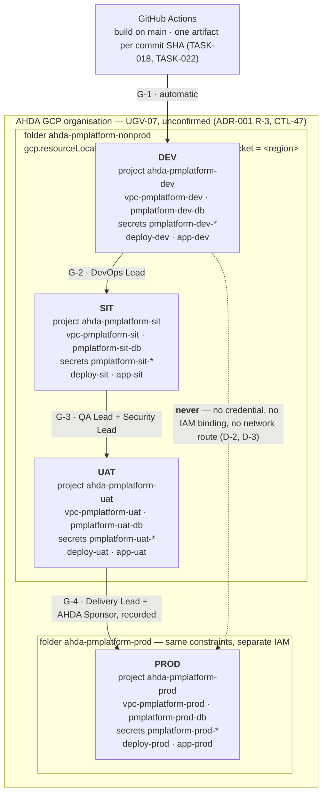

# Environment Separation — DEV / SIT / UAT / PROD

| Field | Value |
| --- | --- |
| Task | TASK-016 — Provision DEV / SIT / UAT / PROD Environment Separation (P3 - Infrastructure & DevOps) |
| Depends on | TASK-005 — Hosting and data localisation (`docs/architecture/adrs/ADR-001-hosting-and-data-localisation.md`, APPROVED — CONDITIONAL) |
| Record date | 2026-09-22 |
| Status | **BUILT — NOT APPLIED.** The four environments are declared, the provisioning is scripted and dry-run verified, and the separation invariants are enforced in CI. Nothing is provisioned: the region (R-2), the tenancy (R-3) and the written confirmation (R-1) are outstanding, and the scripts refuse to run until they close (§2, §5) |
| Branch | `infra/task-016-environment-separation` |
| Deliverables | `infra/environments/environments.json`, `apply-org-policy.sh`, `provision-environment.sh`, `verify-separation.sh`, `lib/common.sh`, `README.md`; `infra/environments/github/environments.json` and `apply.sh`; `docs/architecture/environment-separation-check.py` wired into the `repo-checks` CI job; topology diagram (§3.2); promotion path (§4); this record |
| Environment variables / secrets | Per environment, distinct values: `DB_CONNECTION_STRING`, `JWT_SIGNING_KEY` (secret-store entries, created empty), `APP_BASE_URL` (configuration, unresolved — F-1) |
| Implements | CTL-01, CTL-02, CTL-23, CTL-28 (project creation), CTL-47 (`cybersecurity-control-matrix.md`); ADR-001 §7 C-1, C-4, C-5, C-6, C-7 |
| Workbook read | Google Sheet "Implementation work" (ID `1JQdbw-S9wAS247cP3PpSCme_D2NAPVnWzhXhvvxrtl0`), sheets Implementation Plan (TASK-016 row and the P3 rows it hands work to), Environment and Secrets, Architecture Decisions (ADR-001), Release Checklist, Open Questions (OQ-001), as read 2026-09-22 |
| Controlled sources and authority order | per TASK-001 |

## 1. What this record is

TASK-016 is the first task that creates anything outside the repository. Its acceptance criterion is
four environments, each with its own database instance, its own secret-store namespace and no
credential shared between PROD and any non-PROD environment, plus a documented promotion path with
named approval gates.

Two things shape how that was built. First, **the hosting parameters are not yet known**: ADR-001 is
approved as a decision, but the in-Kingdom region name and the GCP organisation that holds the
platform are UGV-07, owed by AHDA IT, and ADR-001 §9 proposes a hold on every apply — DEV included —
until they and the written confirmation close. Inventing a region here would be the one mistake the
ADR says cannot be corrected without rebuilding every environment. Second, **most of what an
environment contains belongs to other tasks**: the network is TASK-021, the database instance is
TASK-020, the runtime is TASK-017, secret values are TASK-019, the pipeline is TASK-018.

So this task builds the *boundary*, not the contents: the manifest that says what each environment
owns and what it may not share, the scripts that create that boundary, the drills that prove the
separation, and the promotion path the pipeline will be bound to. The boundary is declared before the
contents exist precisely so the tasks that create the contents inherit the names rather than invent
them — "its own database instance" is auditable today, before any instance exists.

## 2. The gate

TASK-016's Gate Decision cell:

> UNBLOCKED by ADR-001. All four environments are provisioned in an in-Kingdom GCP region. No
> resource may be created in any region outside Saudi Arabia.

The first sentence unblocks the task; the second and third are constraints on how. What the cell does
not say, and ADR-001 does, is that the region has no name yet.

| Item | State | Effect here |
| --- | --- | --- |
| ADR-001 decision (GCP, in-Kingdom) | Approved at the AHDA gate, 19 Sep 2026 | The substrate is GCP. `environments.json` is a GCP manifest and the scripts are `gcloud`. |
| R-1 — written confirmation | Outstanding | `ADR001_CONFIRMATION_REF` must name it or every script exits (§3.4, ADR-001 §9). |
| R-2 — the in-Kingdom region name (UGV-07) | Outstanding | `platform.region` is empty. Every script exits with the UGV reference; `region_allowlist` holds the single candidate, `me-central2` (Dammam), unconfirmed. |
| R-3 — tenancy: AHDA's GCP organisation or the vendor's (UGV-07) | Outstanding | `platform.organization_id` is empty and every script exits. The manifest is written for AHDA's own organisation (CTL-47); if the answer is the vendor's, ADR-001 §6 says the decision is re-taken and this manifest is re-written, not amended. |
| R-4 — data classification | Outstanding | All four environments are treated identically for localisation (ADR-001 C-7, CTL-23). Nothing here is relaxed for a non-production environment. |

This is why the status is BUILT — NOT APPLIED rather than BLOCKED. Everything that does not depend on
the three unknowns is finished and verified; the three unknowns are three values in one file.

## 3. What was built

### 3.1 The isolation model

One GCP project per environment. The project is the unit of IAM, quota, billing, logging and Secret
Manager, so making it the environment boundary means separation is the default rather than a set of
rules applied to a shared space. The projects sit in two folders — `ahda-pmplatform-nonprod` for DEV,
SIT and UAT, `ahda-pmplatform-prod` for PROD alone — so that the PROD boundary is a structural line an
IAM grant cannot cross by accident, and so the locality constraints bind at a level above every
project (§3.3).

| Acceptance criterion | Mechanism | Declared in | Proved by |
| --- | --- | --- | --- |
| Four environments exist | Four projects in two folders, created by `provision-environment.sh` | `environments.json` `.environments[]` | S-1; the provisioning run |
| Each with its own database instance | A distinct instance name, database and database user per environment; the instance itself is created by TASK-020 from these names | `.environments[].database` | S-2, S-3; D-1 |
| Each with its own secret store namespace | The environment's project *is* the namespace — Secret Manager has no namespace of its own — and every secret carries the environment's prefix, so a misrouted read is visibly wrong in a log line | `.environments[].secret_store` | S-2, S-3; D-2 |
| No shared credentials between PROD and any non-PROD environment | §3.4 | `.environments[].service_accounts` | S-4; D-2, D-3, D-3b |
| A documented promotion path with named approval gates | §4, and the four GitHub deployment environments that carry the reviewers | `github/environments.json` | S-8, S-9 |

Two alternatives were considered and rejected. **One project with per-environment namespaces**
(prefixes, separate service accounts, separate instances) satisfies the words of the criterion and
fails its intent: a project-level IAM grant, a quota exhaustion or a mis-scoped `roles/owner` reaches
all four environments at once, and PROD secrets would sit one IAM condition away from DEV.
**One organisation per environment** isolates further but puts the organisation-level
`gcp.resourceLocations` policy — the control ADR-001 C-1 relies on — in four places to be kept in
step, and multiplies the tenancy question by four.

### 3.2 Topology

Every box is inside the one in-Kingdom region. The promotion arrows carry a build artifact and an
approval, never a credential: each environment's deploy service account exists only in its own
project, so a promotion is a deployment *into* the next environment by that environment's own
identity, not an identity travelling with the artifact.

### 3.3 Locality, fixed before anything is created

`apply-org-policy.sh` runs once per folder, before any project exists, and does two things that
cannot be done afterwards:

| Step | Why it is first |
| --- | --- |
| `constraints/gcp.resourceLocations` = `in:<region>-locations` on both folders | ADR-001 C-1: an apply naming any other region must *fail*, not be caught in review. Bound at the folder so every project created underneath inherits it, including any added later. |
| Default log-bucket storage location = the named region | ADR-001 C-6: a project's `_Default` log bucket location is fixed at project creation and cannot be changed. Setting it on the folder first means the four projects are created correct rather than discovered wrong. |

The policy is written per folder, not at the organisation, because the organisation may hold AHDA
systems this engagement does not govern.

The region guard is in `lib/common.sh` and every script shares it: empty region → exit with UGV-07;
region not on the allowlist → exit citing C-1. The allowlist holds `me-central2` (Dammam) alone.
`me-central1` is Doha, Qatar — adjacent in name, outside the Kingdom, and the typo a reviewer is most
likely to miss; the check script rejects it as an allowlist entry and the shell guard rejects it as a
region.

### 3.4 The credential boundary

"No shared credentials between PROD and any non-PROD environment" is enforced in four places rather
than asserted once:

| # | Rule | Enforced by |
| --- | --- | --- |
| 1 | Every service account is hosted by the environment's own project (`deploy-dev@ahda-pmplatform-dev…`), so a credential names the environment it belongs to | S-3 (static); `provision-environment.sh` creates accounts only in the project it is creating |
| 2 | No identifier of any kind is shared between two environments — project, network, instance, database user, bucket, prefix, service account, secret | S-2, S-4 (static) |
| 3 | No cross-project IAM binding, and no service-account binding at either folder, where it would be inherited by three environments at once | D-3, D-3b (against the live projects) |
| 4 | PROD secrets are unreadable by every non-PROD principal, tested by impersonation rather than by reading the policy | D-2 |
| 5 | No apply happens at all until the ADR-001 confirmation is named in `ADR001_CONFIRMATION_REF`, which is echoed into the run log as the record of what authorised it | `require_authorisation`, every script |

The scripts create secret *containers* and never a secret version, so no value passes through this
directory or an operator's shell history. Replication is user-managed and pinned to the one region
(ADR-001 C-5); the default automatic policy would place secret material outside the Kingdom.

### 3.5 The three environment-scoped variables

The workbook assigns TASK-016 three variables, all "distinct value per environment":

| Variable | Sheet classification | How it is environment-scoped here | State |
| --- | --- | --- | --- |
| `DB_CONNECTION_STRING` | Secret | Secret-store entry `pmplatform-<env>-db-connection-string` in the environment's own project, readable only by that environment's runtime service account | Container created empty; the value is written by the DevOps/Platform Lead under TASK-019 once TASK-020 has created the instance |
| `JWT_SIGNING_KEY` | Secret | Secret-store entry `pmplatform-<env>-jwt-signing-key`, same scoping. A distinct key per environment means a token minted in DEV is not valid in SIT — the same boundary as the database credential, one layer up | Container created empty; the value is written by the Security Lead under TASK-019 |
| `APP_BASE_URL` | Public | Configuration, one origin per environment | **Unresolved (F-1).** No AHDA-owned DNS zone is named anywhere in the workbook. All four values are empty; the check enforces that they are either all empty or all distinct and `https` |

**Decision D-1 — one origin per environment.** TASK-013 F-2 left an open question here and assigned
it to this task: the Environment and Secrets sheet has no variable telling the SPA where the API is,
while `CORS_ALLOWED_ORIGINS` presumes the two can differ. The decision is that **the SPA and the API
are served from one origin per environment** — the environment's ingress serves the static bundle at
`/` and routes `/api` to the API — so `APP_BASE_URL` is the whole address of an environment and no
`API_BASE_URL` row is added to the sheet. Two consequences follow, and both are improvements:
`CORS_ALLOWED_ORIGINS` becomes a same-origin allowlist holding one value (TASK-078), and the SPA
calls the API on relative paths, so TASK-013 F-5 dissolves — the frontend bundle stops being
environment-specific and one artifact is promoted through all four environments, which is what
TASK-018's promotion model requires anyway. The decision is reversible at the cost of one sheet row
if TASK-021 puts the SPA behind a separate hostname.

## 4. Promotion path

Four gates. G-1 is automatic; the rest are named approvals. The pipeline that enforces them is
TASK-018's; what this task fixes is the path, the approver of each gate and the substrate that makes
an approval unskippable — the four GitHub deployment environments in
`infra/environments/github/environments.json`, whose reviewers GitHub requires before a job targeting
that environment may run.

| Gate | Promotion | Approver(s) | Preconditions | Recorded evidence |
| --- | --- | --- | --- | --- |
| **G-1** | build → DEV | — automatic | Quality gates green on `main` (TASK-015); artifact built and scanned (TASK-022) | Commit SHA and Task ID on the deployment (CTL-40) |
| **G-2** | DEV → SIT | DevOps Lead | Migration dry-run succeeds; dependency and secret scans clean (TASK-080) | GitHub deployment approval: identity and timestamp |
| **G-3** | SIT → UAT | QA Lead **and** Security Lead | The 15 cross-domain e2e journeys pass against SIT (TASK-085); no open High/Critical threat-model finding without a signed AHDA risk acceptance (TASK-081) | GitHub deployment approval, self-review prevented |
| **G-4** | UAT → PROD | Delivery Lead **and** AHDA Sponsor | Signed UAT acceptance (Release Checklist); penetration test with no unresolved Critical (TASK-082); restore drill passed (TASK-023); rollback rehearsed within 30 days (CTL-37) | GitHub deployment approval with approver identity and timestamp — the Release Checklist gate "Production Deployment Approval Recorded" |

The rules that make the path a path rather than a diagram: one artifact is built once and promoted
unchanged (G-1 builds it, G-2 to G-4 move the same image); no environment may be deployed to except
from the gate before it; and no environment's deploy credential exists outside its own project, so
skipping a gate is not a matter of policy but of not holding the credential.

Approver roles are the Release Checklist's own owners. The GitHub teams they map to are those of
`.github/CODEOWNERS` — `devops`, `qa`, `security` — plus `delivery` for G-4, which does not exist yet
(F-5).

## 5. Verification

What was run in this environment, against the committed files:

| # | Check | Result |
| --- | --- | --- |
| 1 | `python3 docs/architecture/environment-separation-check.py` | `OK: 4 isolated environments; 11 identifiers per environment, none shared; region UNNAMED (UGV-07); unresolved platform values: organization_id, billing_account_id, base_domain.` |
| 2 | Mutation test of the check: eleven edits that break an invariant, one at a time | Each caught, with the finding naming the invariant; files restored, check green (§5.1) |
| 3 | `provision-environment.sh dev --dry-run` and `prod --dry-run` against a scratch manifest carrying placeholder values | The full `gcloud` sequence printed, shell-pasteable, nothing executed |
| 4 | `apply-org-policy.sh --dry-run` | Both folders, both policy documents, both logging settings printed |
| 5 | Guard tests: region empty; region `me-central1`; `organization_id` empty; `ADR001_CONFIRMATION_REF` unset; unknown environment name | Five distinct refusals, exit code 1, each naming the residual item that owes the value |
| 6 | `sh -n` on all five shell scripts; `jq`/`python3 -m json.tool` on both JSON files | Clean |
| 7 | `gitleaks detect --no-git` over this task's files | `no leaks found` — the manifest holds no value, secret or otherwise |

What is **owed**, and cannot be run until the environments exist:

| Drill | From | Blocked by |
| --- | --- | --- |
| D-1 — a DEV credential rejected by the SIT database | TASK-016 Validation Checks | The instances (TASK-020) |
| D-2 — PROD secrets unreadable from DEV/SIT/UAT | TASK-016 Validation Checks | The projects (R-1, R-2, R-3) |
| D-3, D-3b — no cross-environment or folder-level IAM | ADR-001 C-1 intent | The projects |
| D-4 — every secret and bucket in the named region | ADR-001 C-1, C-4, C-5 | The projects |

`verify-separation.sh` implements all four and **exits non-zero on a SKIP**: an unexecuted drill is
not a passed drill, and the acceptance criterion is not met by a script that would have proved it.

### 5.1 Mutation test

The check is only worth the failures it catches, so each invariant was broken once, in the committed
files, and the files restored afterwards. Every case exited 1.

| # | Edit | Reported |
| --- | --- | --- |
| M1 | UAT given PROD's secret prefix | S-2 shared boundary, S-3 prefix mismatch on both UAT secrets, S-4 shares with prod |
| M2 | `"value": "s3cr3t"` added to a secret entry | S-6 — a secret entry names its secret-store entry and nothing else |
| M3 | `me-central1` added to the region allowlist | S-5 — outside Saudi Arabia |
| M4 | PROD moved into the non-prod folder | S-4 ×4 — three environments in the PROD folder, and the folder's declared contents |
| M5 | PROD's reviewer teams emptied | S-8 — no named approval gate |
| M6 | SIT renamed to `staging` | S-1 — environment set and order |
| M7 | SIT's runtime account hosted by the PROD project | S-3 — not hosted by its own project |
| M8 | `APP_BASE_URL` set for DEV and SIT only, to the same value | S-6 ×2 — partial population, and values not distinct |
| M9 | G-4's approver cell emptied | S-9 — `G-4 (UAT → PROD) names no approver` |
| M10 | `platform.region` set to `europe-west1` | S-5 — not on the allowlist |
| M11 | G-3 rewritten as SIT → PROD | S-9 — expected SIT to UAT |

M9 initially reported "the promotion table has 3 gate rows" because the row no longer matched the
parser; the parser now accepts an empty cell so the finding names the gate that lost its approver.

`gitleaks detect --no-git` is clean over `infra/environments/`, the check script and this record. The
repository-wide scan reports the same five pre-existing false positives TASK-013 recorded — example
`idempotencyKey` UUIDs in the TASK-009/TASK-010 sample files — which are TASK-080's to allowlist.

## 6. Acceptance criteria

| # | Criterion | Status |
| --- | --- | --- |
| 1 | Four environments exist | **NOT MET — and cannot be, today.** Four are fully declared and the provisioning is scripted and dry-run verified; nothing is created, because R-1, R-2 and R-3 are outstanding and ADR-001 §9 holds the first apply (§2). One `apply-org-policy.sh` run and four `provision-environment.sh` runs stand between this record and the criterion, once three values arrive. |
| 2 | Each with its own database instance | **DECLARED.** Distinct instance, database and user per environment, checked unique (S-2); the instances are TASK-020's to create from these names. |
| 3 | Each with its own secret store namespace | **BUILT, unapplied.** The project is the namespace; the two secret containers per environment are created by `provision-environment.sh` with replication pinned to the region and access granted only to that environment's runtime account. |
| 4 | No shared credentials between PROD and any non-PROD environment | **BUILT, unapplied.** Five mechanisms (§3.4); statically checked now (S-2, S-3, S-4), drilled against the live environments by D-2, D-3, D-3b. |
| 5 | A documented promotion path (DEV → SIT → UAT → PROD) with named approval gates | **MET.** §4, with the approver of each gate, its preconditions and the evidence it records; the gates are declared as GitHub deployment environments for TASK-018 to deploy through, and the check fails if a gate loses its approver. |
| — | Validation cell: a DEV credential rejected by the SIT database; PROD secrets unreadable from DEV/SIT/UAT | **SCRIPTED, NOT EXECUTED** — `verify-separation.sh` D-1 and D-2 (§5). |
| — | Gate cell: all four in an in-Kingdom GCP region; no resource in any region outside Saudi Arabia | **ENFORCED.** Folder-level `gcp.resourceLocations` before any project exists (§3.3), an allowlist of one region, a guard in every script, a CI check that rejects any other region in the manifest, and a post-provisioning drill that reads locations back from the provider (D-4). |

## 7. Findings and open items

| ID | Finding | Owner / where it goes |
| --- | --- | --- |
| **F-1** | **No DNS zone is named anywhere in the workbook**, so the four `APP_BASE_URL` values cannot be written. The variable is required per environment by the sheet and by this task's own row, and TASK-028's SSO callback URLs, TASK-039's notification links and G-1's smoke test all derive from it. It is an AHDA-owned value with no PTBC ID and no Open Question — the same shape as the UGV rows. Proposed: register as **UGV-12**, owner AHDA IT, gate Before Build/Integration Build. | PMO (register); AHDA IT (value); `docs/governance/unassigned-gated-values.csv` |
| **F-2** | The sheet's `DEPLOY_SERVICE_ACCOUNT_KEY` presumes a **downloadable service-account key per environment**. A downloadable key is the one credential that can leave the environment it belongs to, which is exactly what criterion 4 forbids; it also cannot be rotated without a pipeline edit. Recommended: Workload Identity Federation from GitHub Actions to each environment's deploy account, after which the sheet row becomes a workload-identity provider reference (Public) rather than a Secret, and `constraints/iam.disableServiceAccountKeyCreation` can be bound to both folders. | TASK-018, TASK-019; sheet edit — DevOps/Platform Lead |
| **F-3** | **CI runner location is undecided** (ADR-001 C-8, confirmation request Q8b). The promotion pipeline runs migrations against each environment's database from GitHub-hosted runners, which execute outside the Kingdom. The environment definitions do not change either way; the deployment jobs move to self-hosted in-region runners if AHDA Cybersecurity requires it. | AHDA Cybersecurity (answer); TASK-018 (effect) |
| **F-4** | D-3 reads project IAM policies, which do **not** show group membership. "No shared credentials" is proved for service accounts and disproved for humans only by AHDA's own directory: a person in a group that holds a role in both PROD and a non-PROD project is invisible to this drill. Recommended: PROD project access through a dedicated AHDA group with its own membership review, named in the access model ADR-001 C-9 owes. | AHDA Cybersecurity; TASK-019, TASK-093 |
| **F-5** | The `delivery` GitHub team G-4 names **does not exist**, nor do the other six teams (TASK-012 S-2). `github/apply.sh` fails loudly naming the missing team rather than applying a gate with no reviewer. | Repository owner; TASK-012 S-2 |
| **F-6** | The **managed PostgreSQL product is still unresolved** (ADR-001 R-7: AlloyDB or Cloud SQL). The manifest names instances product-neutrally (`pmplatform-<env>-db`) and creates none, so nothing here has to change when ADR-002 settles it; TASK-020 does. | ADR-002 / TASK-006 → TASK-020 |
| **F-7** | The **compute runtime is unresolved** (ADR-001 R-6: Cloud Run or GKE) and has no owner. It does not block this task — no compute resource is created here — and it does block TASK-017, which is next. | Engagement Architect + AHDA IT |
| **F-8** | `LOG_LEVEL` is still assigned to no task (TASK-013 F-1). It is per-environment runtime configuration, not part of the isolation boundary, so it is not in this manifest; it belongs with the runtime that reads it. | Workbook edit: assign to TASK-017 or TASK-090 — PMO |
| **F-9** | The two Secret containers are created **empty**, and an application started against an empty secret fails at boot rather than at first use. That is the intended behaviour (`DB_CONNECTION_STRING`'s Verification Method: "application fails to start with a clear error if unset"), and it means an environment provisioned by this task is deliberately not yet bootable. | TASK-019 (values), TASK-091 (health checks) |

## 8. Change log

| Date | Change | By |
| --- | --- | --- |
| 2026-09-22 | Initial record. Four environments declared as one GCP project each in two folders; provisioning, locality and verification scripted; promotion path fixed with four gates and named approvers; static invariants wired into the `repo-checks` CI job. Decision D-1 (one origin per environment) closes TASK-013 F-2 and dissolves F-5. Nine findings raised, one of them a proposed new gated value (F-1). | Infrastructure (TASK-016) |
