# Canonical Entity-Relationship Diagram

| Field | Value |
| --- | --- |
| Task | TASK-008 — Produce Canonical Entity-Relationship Diagram (P1 - Architecture Decisions) |
| Depends on | TASK-007 — Define Three-Tier Solution Architecture & Module Boundaries (`docs/architecture/solution-architecture.md`, ADR-003, PROPOSED — PENDING AHDA APPROVAL) |
| Record date | 2026-09-20 |
| Status | **PROPOSED — PENDING APPENDIX D/C RECONCILIATION AND ADR-003 APPROVAL.** The model is complete against every business fact the workbook states; the Blueprint appendices it must be checked against cannot be read (§3). |
| Decision owner | Engagement Architect (proposer) → AHDA IT with ADR-002/ADR-003 (§14) |
| Branch | `chore/task-008-task-008-canonical-erd` |
| Deliverables | This record; `erd.dbml` (column-level source, 121 tables); `erd-appendix-crosswalk.csv` (109 business-fact rows); `erd-check.py` (consistency check) |
| Workbook read | Google Sheet "Implementation work" (ID `1JQdbw-S9wAS247cP3PpSCme_D2NAPVnWzhXhvvxrtl0`), sheets Implementation Plan (112 rows), Architecture Decisions (ADR-001–ADR-013), Open Questions, as exported 2026-09-20 |
| Controlled sources and authority order | per TASK-001 |

## 1. What this record is

TASK-007 fixed *which* module owns *which* fact and forbade any module from touching another module's tables (M-1, M-3, M-13). It handed this task an ownership register (solution architecture §9) and a finding: the platform's most-consumed calculated fact, Overall Project Health, had an owner with no table (S-2).

This record is the data model that makes those rules physical. It has four parts:

1. **Conventions** (§4) — seventeen rules, D-1 to D-17, that every table follows. They carry the four gate decisions (ADR-008, ADR-009, ADR-011, ADR-012) and the three participation amendments (financial provenance, narrative language tag, Declared Baseline and intake marker) as *types and columns*, not as guidance. A reviewer can check a table against them mechanically, and `erd-check.py` does.
2. **The model by module** (§5) — 121 tables in 21 module schemas plus one infrastructure schema, each with a purpose, its lifecycle column and states, its delete policy and whether other modules may hold its identity. The diagrams show keys and relationships; `erd.dbml` is the column-level source and governs where the two differ. The two files are maintained together, and `erd-check.py` fails when they diverge.
3. **Three registers the acceptance criteria ask for** — the lifecycle-state matrix for the Appendix C review (§6), the derived and duplicated field register with a justification per column (§7), and the delete-policy census (§8).
4. **The Appendix D crosswalk** (§9) — 109 business facts as the workbook restates them, each mapped to a table or column, with the Appendix D row number left blank because Appendix D cannot be read (§3). The completeness check the task defines is specified and ready to run; it has not been run.

The status stays Proposed. The model does not approve itself, and a model that has not been reconciled with the register it is supposed to cover cannot claim to cover it.

## 2. Scope

| | Subject | Owner |
| --- | --- | --- |
| **Decides** | Entities, attributes, keys, relationships, normalisation, lifecycle-state columns, delete policy | This record |
| **Decides** | The physical representation of the four gate decisions and three amendments in the TASK-008 row | This record (§4) |
| **Decides** | The WF-02 aggregates TASK-007 found missing (S-2) | This record (§5.5) |
| **Does not decide** | Which module owns which fact | **TASK-007 §9.** This record places every table in the owning module's schema and departs from §9 nowhere |
| **Does not decide** | Indexes beyond primary and unique keys | **TASK-026.** Partial unique indexes that *are* invariants (single Active baseline, single ActiveSuspension) are stated here because they are rules, not tuning |
| **Does not decide** | Migration order, EF configuration, seed data | TASK-024, TASK-025, TASK-027 |
| **Does not decide** | Business values — thresholds, matrices, cadences, retention periods | PTBC/TBC tracker (TASK-004). Every such value has a column here and no value |
| **Does not decide** | Event and API shapes | TASK-009 |

## 3. Sources — what was read and what could not be

The TASK-008 description names two inputs: **Blueprint Appendix D** (the 33-row Domain/Entity Ownership Register) and **Blueprint Appendix C** (the integrated lifecycle matrix). Neither is obtainable. The Blueprint is held neither in the repository nor in the connected Google Drive; TASK-001 §5.1 recorded this on 2026-09-19, TASK-007 S-1 re-verified it on 2026-09-20, and a search of the Drive by title and full text for "Blueprint", "Appendix D", "Step 14A" and every WF/FG identifier on the same day returned only copies of the Implementation Plan workbook.

The model is therefore built from the next-best source under the TASK-001 authority order: **the workbook's restatement of the Blueprint** — the aggregate list in the TASK-008 row, the entity ownership register TASK-007 built from it (§9), and the 112 task rows, whose Detailed Description, Acceptance Criteria, Gate Decision and Participation Amendment cells name lifecycle states, invariants and columns for every module. Each fact in §9 cites the row it comes from.

What this means for the acceptance criteria is stated plainly in §13: coverage is 100% of the *workbook's* register, and 0 of 33 Appendix D rows are matched by number. The crosswalk CSV has the Appendix D columns empty and ready. When the Blueprint is located (TASK-007 Q6), the check is: for each of the 33 rows, find its fact in the CSV, fill in the row number, and record any row with no match as an Open Question — never by adding a table to make the count come out.

## 4. Conventions

Each rule states what it is, why, and how it is checked. `erd-check.py` verifies D-1, D-2, D-5, D-7 and D-14 over `erd.dbml` and the crosswalk on every run.

| # | Rule | Rationale | Check |
| --- | --- | --- | --- |
| **D-1** | **Primary key.** Every table has `id uuid`, generated by the application, never a natural key. Business identifiers (Formal Project ID, codes) are `unique` columns beside it. | Modules hold each other's identities as opaque values in commands, events and outbox payloads (M-4); a uuid needs no coordination and survives module extraction (ADR-003 §5.5). A natural key would put a business rule (format of the Formal Project ID) into every foreign key. | `erd-check.py`: first column of every table is `id uuid pk`. |
| **D-2** | **Audit columns.** Every table has `created_at`, `created_by`, `updated_at`, `updated_by`. The `_by` columns hold `User.id` **by convention without a foreign-key constraint**; on APPEND_ONLY tables `updated_*` are constrained equal to `created_*`. | The four columns are the TASK-008/TASK-025 criterion. No FK constraint: users are never physically deleted (D-3), one EF interceptor writes the columns, and a declared FK would require 121×2 indexes under TASK-025's "every FK has an index" for columns that are never a join path. Service principals are `User` rows with `user_type = SERVICE`, so `created_by` is never null. | `erd-check.py`: all four present and `not null` on every table. |
| **D-3** | **Delete policy.** Every table carries one of six classes (§8): `APPEND_ONLY`, `RETAIN`, `HARD_DRAFT`, `HARD_OWNER`, `HARD_WORKING`, `CASCADE`. There is **no `deleted_at` column anywhere**: a row that must stop being active has a lifecycle terminal state or an end timestamp, and a row that may vanish is hard-deleted and audited. | A soft-delete flag is a second lifecycle that every query must remember to filter. Every aggregate here already has a lifecycle (§6), so the flag would be a duplicate of it. Retention *periods* are PTBC-048-class values and are not set here. | §8 census; the DBML table note names the class. |
| **D-4** | **Schemas and names.** One PostgreSQL schema per module (M-13), named as the module in snake_case (`project_task`, `identity_access`, …), plus `common` for infrastructure tables that no module owns (D-17). Tables and columns are snake_case; the entity name in this record is the PascalCase of the table name and is the C# class name in `PMPlatform.Domain`. | One derivation rule, no exceptions, so ADR-002 §6.4's folder/namespace identity extends to the database. | `erd-check.py`: entity = PascalCase(table) for every table. |
| **D-5** | **Money (ADR-008).** One shared value type `Money` in `Domain/Common` (M-10) maps to a single column `numeric(18,2)` whose name ends in `_sar`. **There is no currency column.** The currency is the type's constant, `SAR`, and nothing in the schema can hold another value. | ADR-008: SAR only, no conversion, no rate source, no selector. A per-row `currency_code` that a CHECK constrains to `'SAR'` is a column that can hold one value — a constant stored 16 times, which is exactly the duplicated field the acceptance criterion forbids. The code lives in the type and the suffix. If AHDA wants the literal column, it is one line in the type (Q3, §14). | `erd-check.py`: every `numeric(18,2)` column ends in `_sar` and vice versa. 16 money columns. |
| **D-6** | **Bilingual labels (ADR-012).** Every controlled label — master data items, catalogues, roles, permissions, departments, entities, configuration rows, dashboard and report definitions, widget titles, parameters, notification templates — is a pair `<name>_ar`, `<name>_en` with the same nullability — labels and names `not null`, descriptions optional. A shared `BilingualLabel` type (M-10) owns the pair. | ADR-012 Option B: structured data is bilingual so filters, labels and dashboards work fully in either language. Two columns, not a translation table: every label is exactly two languages and always both, so a child table would be a join for nothing. | 28 bilingual pairs. |
| **D-7** | **Narrative language tag (ADR-012 extension, TASK-109).** Every free-text field a person types is a pair `<field> text`, `<field>_lang char(2)` holding `ar` or `en`, with the same nullability. Nothing is translated and no translation is stored as the record. | The tag cannot be backfilled once narrative exists (TASK-109). Per field, not per row: a row with two narrative fields may hold them in different languages. | `erd-check.py`: every `_lang` column has its narrative column. 51 tagged fields. |
| **D-8** | **No derived or duplicated column without a register entry.** §7 lists every stored value that is computed from, or copies, another stored value, with the justification. A column not in §7 is an entered fact. | The acceptance criterion. The register is the place a reviewer looks first. | §7, 29 entries; `erd-check.py` verifies every entry names a real column. |
| **D-9** | **Impact (ADR-011).** Impact is never a single column. `RiskAssessmentImpact` and `ConcernImpact` hold one row per dimension with `impact_level 1–5`; dimensions are `IMPACT_DIMENSION` master data items and their level definitions are versioned configuration. Risk and issue share the dimension set. | ADR-011: "several dimensions … each on five levels", the dimension count changes the record structure and the set is "cost, schedule, reputation and at least one operational". A fixed set of columns would be a repeating group and would need a migration when AHDA adds a dimension. | `RiskAssessmentImpact`, `ConcernImpact`; level definitions in `ImpactLevelDefinition`, cells in `RiskMatrixCell`. |
| **D-10** | **Financial provenance (ADR-008 extension, TASK-108).** Every financial record carries `source_type` (MANUAL / ETIMAD / OTHER), `source_reference`, `as_of_date`, `entered_by_user_id`. | Four fields named by the ADR. `entered_by` beside `created_by` is in §7. | 3 financial records. |
| **D-11** | **Duration weighting (ADR-009).** `ScheduleActivity`, `BaselineActivity` and `ProjectTask` carry `planned_duration_days`. Progress is never entered at project level: `ProgressSubmission` stores the calculated roll-up and a separate override with a reason. | ADR-009 Option C and TASK-025's "must carry activity duration weighting". | 3 weighted tables. |
| **D-12** | **Governed lifecycle primitive** (solution architecture §11.3). Everything authored and published — configuration versions, master data items, KPI definitions, permission profile versions, notification templates, dashboard and report definitions — uses the same six columns: `lifecycle_state` DRAFT → VALIDATED → PUBLISHED → RETIRED, `validated_by/at`, `published_by/at`, `retired_at`. Author, reviewer and publisher must differ. A PUBLISHED row is immutable. | One primitive in `Application/Common` (M-10), used by five modules, per TASK-034 and TASK-110. | 7 tables carry the primitive. |
| **D-13** | **Pin or resolve.** A domain row references *stable* configuration identity (a `MasterDataItem`, a `KpiDefinition`) by id and lets FG-04 resolve the values effective at the transaction date (TASK-034). Where the workbook requires that a later publication never changes a recorded outcome, the row **pins** the `ConfigurationVersion` id it used: risk assessments, severity, materiality evaluations, approval routing, health rules, financial thresholds. Effectivity state (FUTURE_EFFECTIVE / ACTIVE / SUPERSEDED) is derived from `effective_from`/`effective_to` and is not stored. | Two needs, two mechanisms, stated once. Storing effectivity would be a derived column that goes stale at midnight. | Every `*_configuration_version_id` is a pin. |
| **D-14** | **Cross-module references.** A foreign key may cross a schema only to a table marked *referenceable* (an identity another module is allowed to hold — M-4, M-13). Polymorphic references (`subject_module`, `subject_type`, `subject_id`; `target_*`) carry no FK, by design: Approval, Notifications, Audit and DocumentManagement are subject-agnostic. No navigation property crosses a module (A-3). | The dashed edges in §5 are exactly these FKs. | `erd-check.py`: every cross-schema FK targets a referenceable table. 167 cross-schema FKs, 59 referenceable tables. |
| **D-15** | **Revisions and approval subjects.** Every aggregate that goes through WF-11 carries `revision_no`. `ApprovalInstance` references (`subject_module`, `subject_type`, `subject_id`, `subject_revision_no`) and is unique on the four. A RETURNED decision creates revision+1 and a new linked instance (TASK-035). Subjects do not store their approval instance id — Approval is queried by subject (M-4). | The idempotency and "never mutate the rejected one" rules of TASK-035 fall out of the unique key. | 13 approvable aggregates. |
| **D-16** | **Concurrency.** Optimistic concurrency uses PostgreSQL's `xmin` system column through Npgsql; no `row_version` column exists. | A concurrency token is not a business fact and should not look like one. | — |
| **D-17** | **Outbox.** `common.outbox_message` is the single transactional outbox (M-5, M-6). Its `payload jsonb` is the one jsonb column in the platform: it is a serialised envelope, never queried by attribute. `__EFMigrationsHistory` is the only other table outside a module schema. | Blueprint Section 15 (commit-before-notify) and Section 18 (durable audit capture) both need a write inside the source transaction that a dispatcher reads after commit; that table can belong to no module. | — |

### 4.1 Semantic state is a property of the table, not a column

FG-01 reads projections that carry CURRENT/LIVE, PUBLISHED/OFFICIAL or HISTORICAL/SNAPSHOT semantic state (TASK-069). In this model the state is decided by *which table* a row is in: `ProjectHealthStatus`, `ScheduleHealthStatus` and `IntegrationInstance` are CURRENT/LIVE and are rewritten; `PublishedProgressSnapshot` and `PublishedFinancialSnapshot` are APPEND_ONLY and are HISTORICAL/SNAPSHOT, with PUBLISHED/OFFICIAL being the latest row per project — derived, not stored. Freshness is `computed_at`/`published_at`; coverage is the presence or absence of a row. No `semantic_state` column exists.

## 5. The model by module

Diagram legend: boxes show the primary key, foreign keys, the lifecycle column and unique business keys only — `erd.dbml` has every column. Solid edges are foreign keys inside the module; dashed edges are cross-module references to a referenceable identity (D-14). Edges to the six foundation identities (`User`, `Role`, `Department`, `ExternalEntity`, `MasterDataItem`, `ConfigurationVersion`) are omitted from the diagrams to keep them readable; the FK columns are still shown and the DBML declares them. Column types in diagrams are abbreviated (`money` = `numeric(18,2)` SAR, `lang` = `char(2)`).

Register columns: *Lifecycle* is the state column and its states as the workbook restates them (§6 gives the source per row); *Delete policy* per D-3 (§8); *Identity* marks tables other modules may reference.

### 5.1 Common — infrastructure schema (D-17)

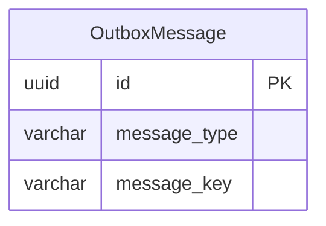
```mermaid
erDiagram
    OutboxMessage {
        uuid id PK
        varchar message_type
        varchar message_key
    }
```

| Entity | Table | Purpose | Lifecycle column → states | Delete policy | Identity |
| --- | --- | --- | --- | --- | --- |
| **OutboxMessage** | `common.outbox_message` | Transactional outbox: audit events, notification intents and domain events written inside the source transaction and dispatched after commit (M-5, M-6). | — | RETAIN | — |

### 5.2 IdentityAccess — FG-03

The permission profile is placed here, not in FG-04, per solution architecture §11.3: it is a permission artefact composed from the FG-03 catalogue. `Role` is retained as the canonical R01–R08 identity that routing rules, landing dashboards and notification matrices reference; every `PermissionProfile` descends from one, and the eight shipped defaults are profiles with `is_shipped_default`. `AccessRelationship` is the Blueprint's name (TASK-025) for what ADR-018 turns into a binding to a profile *version* with its scope anchors; the ADR-013 per-project external grant is an `AccessRelationship` with `project_id`, `external_entity_id` and `sponsor_user_id` set.

`User.user_type` has three values. INTERNAL and EXTERNAL are the two human types; the workbook's "third user type" (TASK-028, TASK-031) — an external identity holding an internal-grade project role — is an EXTERNAL user with an R04-based `AccessRelationship`, because what distinguishes it is the grant, not the person (ADR-013: "the boundary is authority and scope, not employer"). SERVICE is the non-human principal that lets `created_by` be `not null` on integration-written rows. Session and MFA factor state are held by the identity and MFA providers (ADR-007), not here.

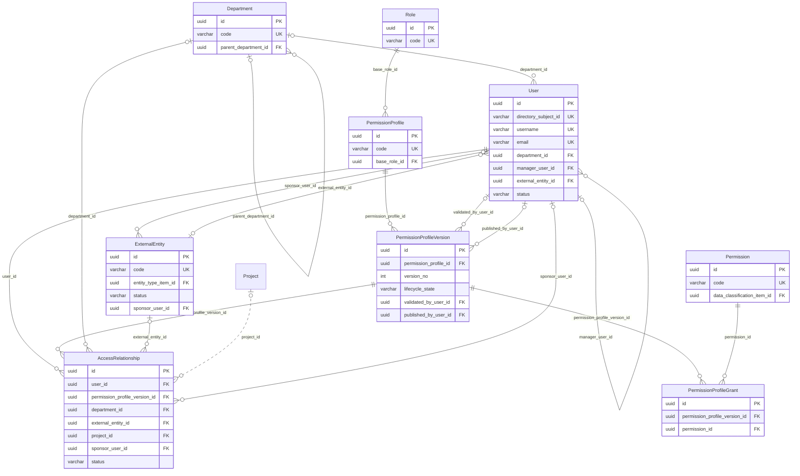
```mermaid
erDiagram
    Department {
        uuid id PK
        varchar code UK
        uuid parent_department_id FK
    }
    ExternalEntity {
        uuid id PK
        varchar code UK
        uuid entity_type_item_id FK
        varchar status
        uuid sponsor_user_id FK
    }
    User {
        uuid id PK
        varchar directory_subject_id UK
        varchar username UK
        varchar email UK
        uuid department_id FK
        uuid manager_user_id FK
        uuid external_entity_id FK
        varchar status
    }
    Role {
        uuid id PK
        varchar code UK
    }
    Permission {
        uuid id PK
        varchar code UK
        uuid data_classification_item_id FK
    }
    PermissionProfile {
        uuid id PK
        varchar code UK
        uuid base_role_id FK
    }
    PermissionProfileVersion {
        uuid id PK
        uuid permission_profile_id FK
        int version_no
        varchar lifecycle_state
        uuid validated_by_user_id FK
        uuid published_by_user_id FK
    }
    PermissionProfileGrant {
        uuid id PK
        uuid permission_profile_version_id FK
        uuid permission_id FK
    }
    AccessRelationship {
        uuid id PK
        uuid user_id FK
        uuid permission_profile_version_id FK
        uuid department_id FK
        uuid external_entity_id FK
        uuid project_id FK
        uuid sponsor_user_id FK
        varchar status
    }
    Department |o--o{ Department : "parent_department_id"
    User |o--o{ ExternalEntity : "sponsor_user_id"
    Department |o--o{ User : "department_id"
    User |o--o{ User : "manager_user_id"
    ExternalEntity |o--o{ User : "external_entity_id"
    Role ||--o{ PermissionProfile : "base_role_id"
    PermissionProfile ||--o{ PermissionProfileVersion : "permission_profile_id"
    User |o--o{ PermissionProfileVersion : "validated_by_user_id"
    User |o--o{ PermissionProfileVersion : "published_by_user_id"
    PermissionProfileVersion ||--o{ PermissionProfileGrant : "permission_profile_version_id"
    Permission ||--o{ PermissionProfileGrant : "permission_id"
    User ||--o{ AccessRelationship : "user_id"
    PermissionProfileVersion ||--o{ AccessRelationship : "permission_profile_version_id"
    Department |o--o{ AccessRelationship : "department_id"
    ExternalEntity |o--o{ AccessRelationship : "external_entity_id"
    Project |o..o{ AccessRelationship : "project_id"
    User |o--o{ AccessRelationship : "sponsor_user_id"
```

| Entity | Table | Purpose | Lifecycle column → states | Delete policy | Identity |
| --- | --- | --- | --- | --- | --- |
| **Department** | `identity_access.department` | AHDA organisation structure node (ADM-011/012). Directory is authoritative for membership (ADR-007). | — | RETAIN | referenceable |
| **ExternalEntity** | `identity_access.external_entity` | An organisation delivering a regional project: government entity, public authority or private company (ADR-013, ADM-013). | `status` → ACTIVE · SUSPENDED · RETIRED | RETAIN | referenceable |
| **User** | `identity_access.user` | Platform user. Deactivation never rewrites historical attribution (Appendix A.1, TASK-031). | `status` → ACTIVE · DISABLED | RETAIN | referenceable |
| **Role** | `identity_access.role` | Canonical role R01–R08: shipped, undeletable, referenced by routing, landing dashboards and notification matrices. | — | RETAIN | referenceable |
| **Permission** | `identity_access.permission` | Protected permission catalogue (Appendix A). A profile may only select from it (TASK-110). | — | RETAIN | referenceable |
| **PermissionProfile** | `identity_access.permission_profile` | A named composition of catalogue permissions rooted at a canonical role. R01–R08 defaults are profiles with is_shipped_default (ADR-018, TASK-110). | — | RETAIN | referenceable |
| **PermissionProfileVersion** | `identity_access.permission_profile_version` | Immutable-once-published version of a profile; assignments bind to a version (ADR-018). | `lifecycle_state` → DRAFT · VALIDATED · PUBLISHED · RETIRED | RETAIN | referenceable |
| **PermissionProfileGrant** | `identity_access.permission_profile_grant` | One permission with its data scope inside a profile version (Appendix A scopes). | — | CASCADE | — |
| **AccessRelationship** | `identity_access.access_relationship` | Binds a user to a profile version with its scope anchors; per-project external grants carry a sponsor and end on closure or role change (TASK-025, TASK-031, ADR-013). | `status` → ACTIVE · ENDED | RETAIN | — |

### 5.3 MasterDataConfig — FG-04

Two kinds of thing live here and the model keeps them apart. **Master data** (`MasterDataItem`) is a stable identity with a bilingual label that domain rows reference forever; it is retired, never deleted, and never versioned — a label correction is an audited edit. **Configuration** is versioned: a `ConfigurationVersion` is the unit of publication for one family, the typed rows inside it (governance profile settings, materiality bands, impact levels, matrix cells, authority rules, notification matrices, allowlists) are CASCADE children that become immutable with it, and effectivity is resolved by date (D-13). The gate decisions that are *shapes without values* — OQ-005 authority matrix, OQ-006 matrix and KPI formulas, OQ-013 band values, OQ-014 profile thresholds — each have their table and no rows.

```mermaid
erDiagram
    MasterDataCatalogue {
        uuid id PK
        varchar code UK
    }
    MasterDataItem {
        uuid id PK
        uuid catalogue_id FK
        varchar code
        uuid parent_item_id FK
        varchar lifecycle_state
        uuid validated_by_user_id FK
        uuid published_by_user_id FK
    }
    ConfigurationFamily {
        uuid id PK
        varchar code UK
    }
    ConfigurationVersion {
        uuid id PK
        uuid configuration_family_id FK
        int version_no
        varchar lifecycle_state
        uuid validated_by_user_id FK
        uuid published_by_user_id FK
    }
    ConfigurationValue {
        uuid id PK
        uuid configuration_version_id FK
        varchar value_key
    }
    GovernanceProfileSetting {
        uuid id PK
        uuid configuration_version_id FK
        uuid governance_profile_item_id FK
        uuid document_control_level_item_id FK
    }
    GovernanceProfileMandatoryField {
        uuid id PK
        uuid governance_profile_setting_id FK
        varchar field_code
    }
    MaterialityBand {
        uuid id PK
        uuid configuration_version_id FK
        uuid governance_profile_item_id FK
        smallint band_no
    }
    ImpactLevelDefinition {
        uuid id PK
        uuid configuration_version_id FK
        uuid impact_dimension_item_id FK
        smallint level
    }
    ProbabilityLevelDefinition {
        uuid id PK
        uuid configuration_version_id FK
        smallint level
    }
    RiskRatingDefinition {
        uuid id PK
        uuid configuration_version_id FK
        varchar code
    }
    RiskMatrixCell {
        uuid id PK
        uuid configuration_version_id FK
        smallint probability_level
        smallint impact_level
        uuid risk_rating_definition_id FK
    }
    ApprovalAuthorityRule {
        uuid id PK
        uuid configuration_version_id FK
        uuid governance_profile_item_id FK
        uuid approver_role_id FK
    }
    NotificationEventFamily {
        uuid id PK
        uuid configuration_version_id FK
        varchar code
    }
    NotificationChannelRule {
        uuid id PK
        uuid notification_event_family_id FK
        varchar channel
    }
    NotificationRecipientRule {
        uuid id PK
        uuid notification_event_family_id FK
        uuid role_id FK
    }
    ParticipationContributionRule {
        uuid id PK
        uuid configuration_version_id FK
        varchar participation_mode
        uuid contribution_type_item_id FK
    }
    EvidenceRequirementRule {
        uuid id PK
        uuid configuration_version_id FK
        uuid milestone_category_item_id FK
        uuid evidence_type_item_id FK
    }
    KpiDefinition {
        uuid id PK
        varchar code UK
        uuid unit_item_id FK
        varchar lifecycle_state
        uuid validated_by_user_id FK
        uuid published_by_user_id FK
    }
    KpiPolicyRule {
        uuid id PK
        uuid configuration_version_id FK
        uuid kpi_definition_id FK
    }
    FieldClassificationRule {
        uuid id PK
        uuid configuration_version_id FK
        varchar entity_code
        varchar field_code
        uuid data_classification_item_id FK
    }
    ReportAllowlistEntry {
        uuid id PK
        uuid configuration_version_id FK
        varchar source_entity_code
        varchar field_code
        uuid data_classification_item_id FK
    }
    MasterDataCatalogue ||--o{ MasterDataItem : "catalogue_id"
    MasterDataItem |o--o{ MasterDataItem : "parent_item_id"
    ConfigurationFamily ||--o{ ConfigurationVersion : "configuration_family_id"
    ConfigurationVersion ||--o{ ConfigurationValue : "configuration_version_id"
    ConfigurationVersion ||--o{ GovernanceProfileSetting : "configuration_version_id"
    MasterDataItem ||--o{ GovernanceProfileSetting : "governance_profile_item_id"
    MasterDataItem ||--o{ GovernanceProfileSetting : "document_control_level_item_id"
    GovernanceProfileSetting ||--o{ GovernanceProfileMandatoryField : "governance_profile_setting_id"
    ConfigurationVersion ||--o{ MaterialityBand : "configuration_version_id"
    MasterDataItem ||--o{ MaterialityBand : "governance_profile_item_id"
    ConfigurationVersion ||--o{ ImpactLevelDefinition : "configuration_version_id"
    MasterDataItem ||--o{ ImpactLevelDefinition : "impact_dimension_item_id"
    ConfigurationVersion ||--o{ ProbabilityLevelDefinition : "configuration_version_id"
    ConfigurationVersion ||--o{ RiskRatingDefinition : "configuration_version_id"
    ConfigurationVersion ||--o{ RiskMatrixCell : "configuration_version_id"
    RiskRatingDefinition ||--o{ RiskMatrixCell : "risk_rating_definition_id"
    ConfigurationVersion ||--o{ ApprovalAuthorityRule : "configuration_version_id"
    MasterDataItem |o--o{ ApprovalAuthorityRule : "governance_profile_item_id"
    ConfigurationVersion ||--o{ NotificationEventFamily : "configuration_version_id"
    NotificationEventFamily ||--o{ NotificationChannelRule : "notification_event_family_id"
    NotificationEventFamily ||--o{ NotificationRecipientRule : "notification_event_family_id"
    ConfigurationVersion ||--o{ ParticipationContributionRule : "configuration_version_id"
    MasterDataItem ||--o{ ParticipationContributionRule : "contribution_type_item_id"
    ConfigurationVersion ||--o{ EvidenceRequirementRule : "configuration_version_id"
    MasterDataItem ||--o{ EvidenceRequirementRule : "milestone_category_item_id"
    MasterDataItem ||--o{ EvidenceRequirementRule : "evidence_type_item_id"
    MasterDataItem ||--o{ KpiDefinition : "unit_item_id"
    ConfigurationVersion ||--o{ KpiPolicyRule : "configuration_version_id"
    KpiDefinition ||--o{ KpiPolicyRule : "kpi_definition_id"
    ConfigurationVersion ||--o{ FieldClassificationRule : "configuration_version_id"
    MasterDataItem ||--o{ FieldClassificationRule : "data_classification_item_id"
    ConfigurationVersion ||--o{ ReportAllowlistEntry : "configuration_version_id"
    MasterDataItem |o--o{ ReportAllowlistEntry : "data_classification_item_id"
```

| Entity | Table | Purpose | Lifecycle column → states | Delete policy | Identity |
| --- | --- | --- | --- | --- | --- |
| **MasterDataCatalogue** | `master_data_config.master_data_catalogue` | A controlled list (ADM-020–029): project classification, milestone category, risk category, impact dimension, KPI unit, document type, evidence type, Etimad cost category, data classification, governance profile, region, … | — | RETAIN | referenceable |
| **MasterDataItem** | `master_data_config.master_data_item` | A stable, referenceable controlled value with mandatory bilingual labels (ADR-012). Retired, never deleted. | `lifecycle_state` → DRAFT · VALIDATED · PUBLISHED · RETIRED | RETAIN | referenceable |
| **ConfigurationFamily** | `master_data_config.configuration_family` | A versioned policy configuration family: GOVERNANCE_PROFILE, MATERIALITY_BAND, RISK_MATRIX, APPROVAL_AUTHORITY, NOTIFICATION_ROUTING, KPI_POLICY, PARTICIPATION, EVIDENCE_POLICY, FIELD_CLASSIFICATION, REPORT_RULES, DASHBOARD_RULES, WORKFLOW_POLICY. | — | RETAIN | referenceable |
| **ConfigurationVersion** | `master_data_config.configuration_version` | The unit of publication. Effectivity (FUTURE_EFFECTIVE/ACTIVE/SUPERSEDED) is derived from the dates and is not stored (D-13). | `lifecycle_state` → DRAFT · VALIDATED · PUBLISHED · RETIRED | RETAIN | referenceable |
| **ConfigurationValue** | `master_data_config.configuration_value` | Scalar policy value inside a version (update cadence, reminder offsets, freshness thresholds, override tolerance, …). Key catalogue is fixed per family in code. | — | CASCADE | — |
| **GovernanceProfileSetting** | `master_data_config.governance_profile_setting` | Switches for one governance profile (Light/Standard/Full — master data items) inside a version (TASK-105, ADR-015). | — | CASCADE | — |
| **GovernanceProfileMandatoryField** | `master_data_config.governance_profile_mandatory_field` | Registration fields made mandatory by a profile (TASK-105). | — | CASCADE | — |
| **MaterialityBand** | `master_data_config.materiality_band` | Three-band change routing thresholds per governance profile (TASK-106, ADR-016). Values outstanding (OQ-013). | — | CASCADE | — |
| **ImpactLevelDefinition** | `master_data_config.impact_level_definition` | One of five levels of one impact dimension (ADR-011). Dimensions are IMPACT_DIMENSION master data items; level descriptions and boundaries outstanding (OQ-006). | — | CASCADE | — |
| **ProbabilityLevelDefinition** | `master_data_config.probability_level_definition` | One of five probability levels (PTBC-017). | — | CASCADE | — |
| **RiskRatingDefinition** | `master_data_config.risk_rating_definition` | A rating label (e.g. Low/Medium/High/Critical) inside a matrix version. | — | CASCADE | referenceable |
| **RiskMatrixCell** | `master_data_config.risk_matrix_cell` | 5×5 probability × overall-impact cell → rating (ADR-011; mapping outstanding, OQ-006). | — | CASCADE | — |
| **ApprovalAuthorityRule** | `master_data_config.approval_authority_rule` | Approval authority matrix row: who approves which subject at which band/value (OQ-005; shape only). | — | CASCADE | — |
| **NotificationEventFamily** | `master_data_config.notification_event_family` | Event family with its Mandatory / User-configurable flag (ADR-004 matrices). | — | CASCADE | — |
| **NotificationChannelRule** | `master_data_config.notification_channel_rule` | Event family → channel matrix (ADR-004). | — | CASCADE | — |
| **NotificationRecipientRule** | `master_data_config.notification_recipient_rule` | Recipient role → event family matrix (ADR-004). | — | CASCADE | — |
| **ParticipationContributionRule** | `master_data_config.participation_contribution_rule` | Contribution types enabled per participation mode (ADR-013, TASK-034). | — | CASCADE | — |
| **EvidenceRequirementRule** | `master_data_config.evidence_requirement_rule` | Mandatory evidence per milestone category (PTBC-006/PTBC-019; TASK-051). | — | CASCADE | — |
| **KpiDefinition** | `master_data_config.kpi_definition` | Stable KPI identity in the catalogue; formulas/targets outstanding (OQ-006). | `lifecycle_state` → DRAFT · VALIDATED · PUBLISHED · RETIRED | RETAIN | referenceable |
| **KpiPolicyRule** | `master_data_config.kpi_policy_rule` | Versioned calculation rule and RAG thresholds for a KPI (OQ-006). | — | CASCADE | — |
| **FieldClassificationRule** | `master_data_config.field_classification_rule` | Field-level sensitivity classification and masking rule (ADR-010; taxonomy and field list outstanding with AHDA Cybersecurity). | — | CASCADE | — |
| **ReportAllowlistEntry** | `master_data_config.report_allowlist_entry` | A field the SCR-138 controlled explorer may expose (TASK-071, ADR-019). | — | CASCADE | referenceable |

### 5.4 Project — WF-01

`Project.formal_project_id` is nullable and unique: under ADR-013 an entity may create a DRAFT and the identifier is issued when AHDA approves. `legacy_intake_date` is the ADR-014 permanent intake marker — one nullable column is both the flag and the date, set once and never cleared. `ProjectIntake` is the one-time declaration TASK-104 describes and the source of the `ProjectIntakeRecorded` event; the Declared Baseline, opening progress, opening spend and achieved milestones it names are each written by their owning module (solution architecture §11.1) with a `project_intake_id` back-reference, which is what makes the reconciliation testable (§7).

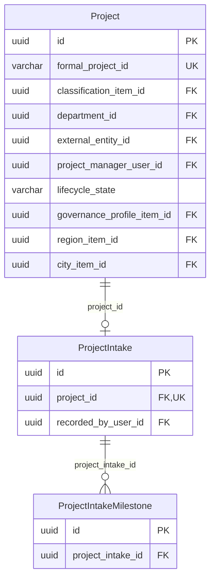
```mermaid
erDiagram
    Project {
        uuid id PK
        varchar formal_project_id UK
        uuid classification_item_id FK
        uuid department_id FK
        uuid external_entity_id FK
        uuid project_manager_user_id FK
        varchar lifecycle_state
        uuid governance_profile_item_id FK
        uuid region_item_id FK
        uuid city_item_id FK
    }
    ProjectIntake {
        uuid id PK
        uuid project_id FK, UK
        uuid recorded_by_user_id FK
    }
    ProjectIntakeMilestone {
        uuid id PK
        uuid project_intake_id FK
    }
    Project ||--o| ProjectIntake : "project_id"
    ProjectIntake ||--o{ ProjectIntakeMilestone : "project_intake_id"
```

| Entity | Table | Purpose | Lifecycle column → states | Delete policy | Identity |
| --- | --- | --- | --- | --- | --- |
| **Project** | `project.project` | Project master aggregate (Blueprint Sections 5, 9; ICD-02). Root of the core-domain graph. | `lifecycle_state` → DRAFT · SUBMITTED · UNDER_REVIEW · RETURNED · APPROVED_PLANNED · ACTIVE · SUSPENDED · COMPLETED · CLOSED | HARD_DRAFT | referenceable |
| **ProjectIntake** | `project.project_intake` | The one-time declaration for a project already under way: Declared Baseline inputs and opening position (ADR-014, TASK-104). Source of the ProjectIntakeRecorded event (§11.1 of the solution architecture). | — | APPEND_ONLY | referenceable |
| **ProjectIntakeMilestone** | `project.project_intake_milestone` | A milestone declared as already achieved at intake; WF-05 records the achievement on the event. | — | APPEND_ONLY | — |

### 5.5 Progress — WF-02 (closes TASK-007 S-2)

TASK-007 found that the TASK-008 aggregate list gave WF-02 no table. These six close it. `ProgressSubmission` is the working record per reporting cycle and carries ADR-009 exactly as written: the calculated duration-weighted roll-up, the never-editable planned percentage, and a separate override with a reason. `PublishedProgressSnapshot` is the immutable published row and the only place Overall Project Health is *published*; `ProjectHealthStatus` is the CURRENT/LIVE value FG-01 reads. Both are computed by WF-02 and nowhere else (ICD-03). `PeriodicUpdateSession` is TASK-107's consolidated flow, holding references to the items it surfaces and no copies (solution architecture §11.2).

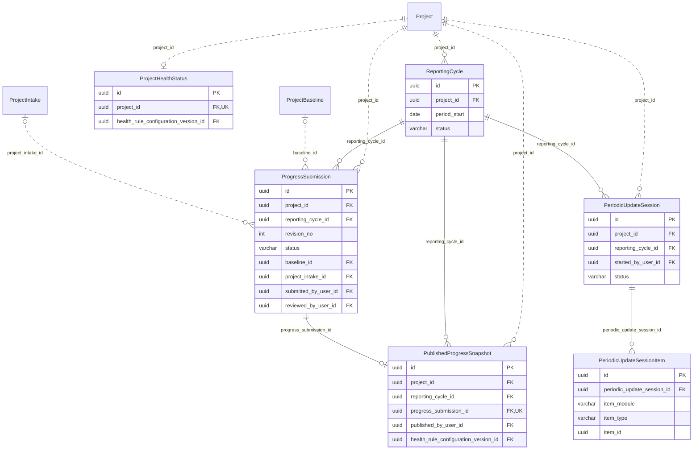
```mermaid
erDiagram
    ReportingCycle {
        uuid id PK
        uuid project_id FK
        date period_start
        varchar status
    }
    ProgressSubmission {
        uuid id PK
        uuid project_id FK
        uuid reporting_cycle_id FK
        int revision_no
        varchar status
        uuid baseline_id FK
        uuid project_intake_id FK
        uuid submitted_by_user_id FK
        uuid reviewed_by_user_id FK
    }
    PublishedProgressSnapshot {
        uuid id PK
        uuid project_id FK
        uuid reporting_cycle_id FK
        uuid progress_submission_id FK, UK
        uuid published_by_user_id FK
        uuid health_rule_configuration_version_id FK
    }
    ProjectHealthStatus {
        uuid id PK
        uuid project_id FK, UK
        uuid health_rule_configuration_version_id FK
    }
    PeriodicUpdateSession {
        uuid id PK
        uuid project_id FK
        uuid reporting_cycle_id FK
        uuid started_by_user_id FK
        varchar status
    }
    PeriodicUpdateSessionItem {
        uuid id PK
        uuid periodic_update_session_id FK
        varchar item_module
        varchar item_type
        uuid item_id
    }
    Project ||..o{ ReportingCycle : "project_id"
    Project ||..o{ ProgressSubmission : "project_id"
    ReportingCycle ||--o{ ProgressSubmission : "reporting_cycle_id"
    ProjectBaseline |o..o{ ProgressSubmission : "baseline_id"
    ProjectIntake |o..o{ ProgressSubmission : "project_intake_id"
    Project ||..o{ PublishedProgressSnapshot : "project_id"
    ReportingCycle ||--o{ PublishedProgressSnapshot : "reporting_cycle_id"
    ProgressSubmission ||--o| PublishedProgressSnapshot : "progress_submission_id"
    Project ||..o| ProjectHealthStatus : "project_id"
    Project ||..o{ PeriodicUpdateSession : "project_id"
    ReportingCycle ||--o{ PeriodicUpdateSession : "reporting_cycle_id"
    PeriodicUpdateSession ||--o{ PeriodicUpdateSessionItem : "periodic_update_session_id"
```

| Entity | Table | Purpose | Lifecycle column → states | Delete policy | Identity |
| --- | --- | --- | --- | --- | --- |
| **ReportingCycle** | `progress.reporting_cycle` | A reporting period for a project, generated from the governance profile cadence (TASK-044, ADR-015). | `status` → OPEN · CLOSED | RETAIN | referenceable |
| **ProgressSubmission** | `progress.progress_submission` | The working progress record for a cycle: derived actual %, planned %, override and narrative (ADR-009, ADR-014). | `status` → DRAFT · SUBMITTED · UNDER_REVIEW · RETURNED · PUBLISHED | HARD_DRAFT | referenceable |
| **PublishedProgressSnapshot** | `progress.published_progress_snapshot` | Immutable PUBLISHED/OFFICIAL snapshot of a cycle, including Overall Project Health computed only here (ICD-03, TASK-044). | — | APPEND_ONLY | referenceable |
| **ProjectHealthStatus** | `progress.project_health_status` | CURRENT/LIVE Overall Project Health projection, rewritten by WF-02 on each recompute; the only writer (ICD-03, M-12). | — | RETAIN | — |
| **PeriodicUpdateSession** | `progress.periodic_update_session` | Consolidated periodic update flow: draft/resume and completion-time instrumentation (TASK-107, ADR-017). Holds references, not copies (solution architecture §11.2). | `status` → IN_PROGRESS · COMPLETED · ABANDONED | RETAIN | — |
| **PeriodicUpdateSessionItem** | `progress.periodic_update_session_item` | An item surfaced in a session (progress, milestone, risk, concern, narrative) and whether it was confirmed or changed. | — | CASCADE | — |

### 5.6 Schedule — WF-03

`ProjectBaseline` is one table for both baseline types. The TASK-008 list names `ApprovedBaseline`; ADR-014 adds a Declared Baseline "as a first-class baseline type distinguishable from an Approved Baseline". Same structure, one discriminator, one partial unique index enforcing a single ACTIVE row per project — the TASK-046 invariant — and TASK-104's "renders as Declared everywhere" is a `WHERE baseline_type = 'DECLARED'` rather than a second code path. A DECLARED baseline for a legacy project has no `BaselineActivity` rows ("registered without a retrospective plan") and carries `declared_end_date` instead.

`ProjectMilestone` is the shared ICD-04 identity. This table holds what WF-03 owns — schedule representation and dates. What WF-05 owns is in `MilestoneAchievement` (§5.8), keyed to this row. One row, two authorities, each writing only its own table.

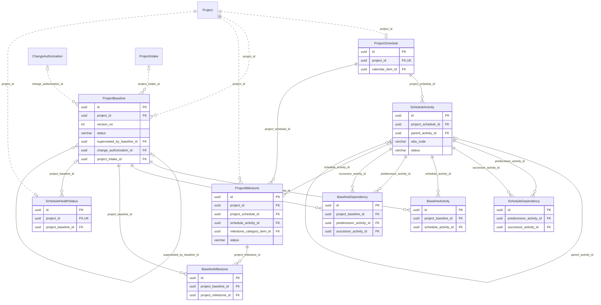
```mermaid
erDiagram
    ProjectSchedule {
        uuid id PK
        uuid project_id FK, UK
        uuid calendar_item_id FK
    }
    ScheduleActivity {
        uuid id PK
        uuid project_schedule_id FK
        uuid parent_activity_id FK
        varchar wbs_code
        varchar status
    }
    ScheduleDependency {
        uuid id PK
        uuid predecessor_activity_id FK
        uuid successor_activity_id FK
    }
    ProjectBaseline {
        uuid id PK
        uuid project_id FK
        int version_no
        varchar status
        uuid superseded_by_baseline_id FK
        uuid change_authorization_id FK
        uuid project_intake_id FK
    }
    BaselineActivity {
        uuid id PK
        uuid project_baseline_id FK
        uuid schedule_activity_id FK
    }
    BaselineDependency {
        uuid id PK
        uuid project_baseline_id FK
        uuid predecessor_activity_id FK
        uuid successor_activity_id FK
    }
    ProjectMilestone {
        uuid id PK
        uuid project_id FK
        uuid project_schedule_id FK
        uuid schedule_activity_id FK
        uuid milestone_category_item_id FK
        varchar status
    }
    BaselineMilestone {
        uuid id PK
        uuid project_baseline_id FK
        uuid project_milestone_id FK
    }
    ScheduleHealthStatus {
        uuid id PK
        uuid project_id FK, UK
        uuid project_baseline_id FK
    }
    Project ||..o| ProjectSchedule : "project_id"
    ProjectSchedule ||--o{ ScheduleActivity : "project_schedule_id"
    ScheduleActivity |o--o{ ScheduleActivity : "parent_activity_id"
    ScheduleActivity ||--o{ ScheduleDependency : "predecessor_activity_id"
    ScheduleActivity ||--o{ ScheduleDependency : "successor_activity_id"
    Project ||..o{ ProjectBaseline : "project_id"
    ProjectBaseline |o--o{ ProjectBaseline : "superseded_by_baseline_id"
    ChangeAuthorization |o..o{ ProjectBaseline : "change_authorization_id"
    ProjectIntake |o..o{ ProjectBaseline : "project_intake_id"
    ProjectBaseline ||--o{ BaselineActivity : "project_baseline_id"
    ScheduleActivity ||--o{ BaselineActivity : "schedule_activity_id"
    ProjectBaseline ||--o{ BaselineDependency : "project_baseline_id"
    ScheduleActivity ||--o{ BaselineDependency : "predecessor_activity_id"
    ScheduleActivity ||--o{ BaselineDependency : "successor_activity_id"
    Project ||..o{ ProjectMilestone : "project_id"
    ProjectSchedule ||--o{ ProjectMilestone : "project_schedule_id"
    ScheduleActivity |o--o{ ProjectMilestone : "schedule_activity_id"
    ProjectBaseline ||--o{ BaselineMilestone : "project_baseline_id"
    ProjectMilestone ||--o{ BaselineMilestone : "project_milestone_id"
    Project ||..o| ScheduleHealthStatus : "project_id"
    ProjectBaseline |o--o{ ScheduleHealthStatus : "project_baseline_id"
```

| Entity | Table | Purpose | Lifecycle column → states | Delete policy | Identity |
| --- | --- | --- | --- | --- | --- |
| **ProjectSchedule** | `schedule.project_schedule` | The project's working schedule (Current Forecast) container (TASK-046). | — | RETAIN | referenceable |
| **ScheduleActivity** | `schedule.schedule_activity` | WBS node of the working schedule with planned and forecast dates; carries planned duration for weighting (ADR-009). | `status` → PLANNED · IN_PROGRESS · COMPLETED · CANCELLED | RETAIN | referenceable |
| **ScheduleDependency** | `schedule.schedule_dependency` | Directed dependency between activities of the working schedule; cycles rejected at save (TASK-046). | — | HARD_WORKING | — |
| **ProjectBaseline** | `schedule.project_baseline` | A baseline of the schedule. baseline_type APPROVED is the Approved Baseline; DECLARED is the legacy-intake Declared Baseline (ADR-014). At most one ACTIVE per project (partial unique index). Partial unique index: (project_id) WHERE status = 'ACTIVE' — never two Active baselines (TASK-046). | `status` → DRAFT · SUBMITTED · UNDER_REVIEW · RETURNED · ACTIVE · SUPERSEDED · REJECTED · WITHDRAWN | HARD_DRAFT | referenceable |
| **BaselineActivity** | `schedule.baseline_activity` | Immutable copy of an activity's planned dates and duration at baseline approval; the reference for variance and planned % (ADR-009). | — | APPEND_ONLY | — |
| **BaselineDependency** | `schedule.baseline_dependency` | Immutable copy of the dependency network at baseline approval, so a baseline is fully reproducible. | — | APPEND_ONLY | — |
| **ProjectMilestone** | `schedule.project_milestone` | The single shared milestone identity (ICD-04). WF-03 owns this row: schedule representation and dates. WF-05 owns achievement evidence and the accepted actual date in MilestoneAchievement — one identity, never duplicated (TASK-050). | `status` → PLANNED · ACHIEVED · CANCELLED | RETAIN | referenceable |
| **BaselineMilestone** | `schedule.baseline_milestone` | Immutable copy of a milestone's planned date at baseline approval. | — | APPEND_ONLY | — |
| **ScheduleHealthStatus** | `schedule.schedule_health_status` | CURRENT/LIVE Schedule Health and variance projection computed by WF-03 against the ACTIVE baseline (TASK-046); consumers read, never recompute. | — | RETAIN | — |

### 5.7 ProjectTask — WF-04

Task and Subtask are one table with `parent_task_id`: identical structure, one level of nesting by rule. Leaf tasks carry the entered `actual_percent_complete`; a parent's percentage is computed on read and not stored. `ActivityExecutionProgress` is the WF-04-owned roll-up per schedule activity that WF-02 consumes — the physical progress split-authority pair in solution architecture §9.

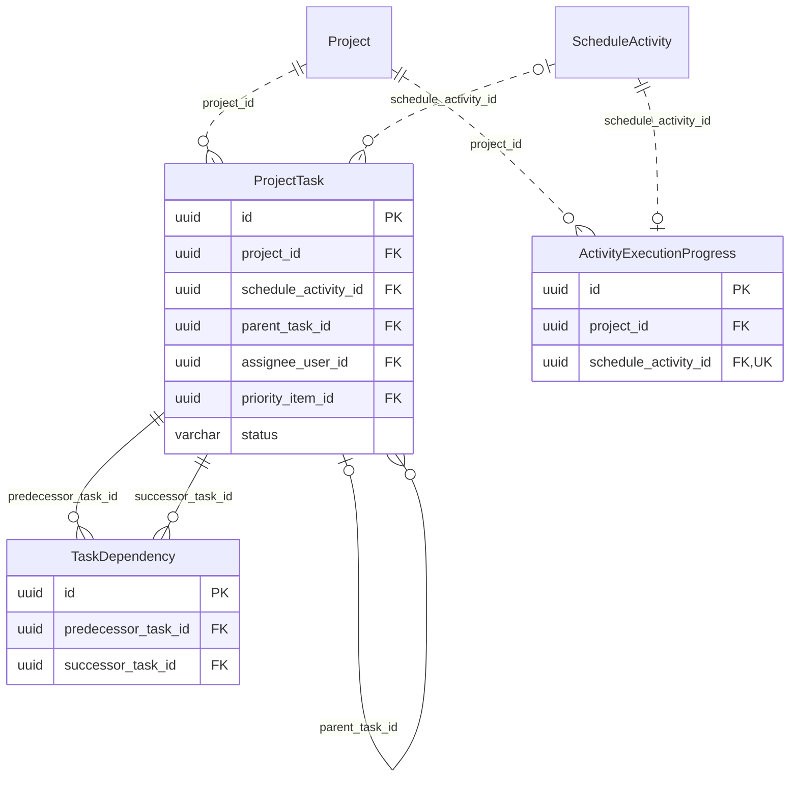
```mermaid
erDiagram
    ProjectTask {
        uuid id PK
        uuid project_id FK
        uuid schedule_activity_id FK
        uuid parent_task_id FK
        uuid assignee_user_id FK
        uuid priority_item_id FK
        varchar status
    }
    TaskDependency {
        uuid id PK
        uuid predecessor_task_id FK
        uuid successor_task_id FK
    }
    ActivityExecutionProgress {
        uuid id PK
        uuid project_id FK
        uuid schedule_activity_id FK, UK
    }
    Project ||..o{ ProjectTask : "project_id"
    ScheduleActivity |o..o{ ProjectTask : "schedule_activity_id"
    ProjectTask |o--o{ ProjectTask : "parent_task_id"
    ProjectTask ||--o{ TaskDependency : "predecessor_task_id"
    ProjectTask ||--o{ TaskDependency : "successor_task_id"
    Project ||..o{ ActivityExecutionProgress : "project_id"
    ScheduleActivity ||..o| ActivityExecutionProgress : "schedule_activity_id"
```

| Entity | Table | Purpose | Lifecycle column → states | Delete policy | Identity |
| --- | --- | --- | --- | --- | --- |
| **ProjectTask** | `project_task.project_task` | Task or Subtask (parent_task_id set) executing against a schedule activity; owner maintains actual % (ADR-009). Named ProjectTask per solution architecture §4.4b. | `status` → NOT_STARTED · IN_PROGRESS · BLOCKED · COMPLETED · CANCELLED | RETAIN | referenceable |
| **TaskDependency** | `project_task.task_dependency` | Blocking dependency between tasks (TASK-048). | — | HARD_WORKING | — |
| **ActivityExecutionProgress** | `project_task.activity_execution_progress` | WF-04-owned duration-weighted roll-up of task actuals per activity (ADR-009); the fact WF-02 consumes. Stored — D-8 register. | — | RETAIN | — |

### 5.8 Milestone — WF-05

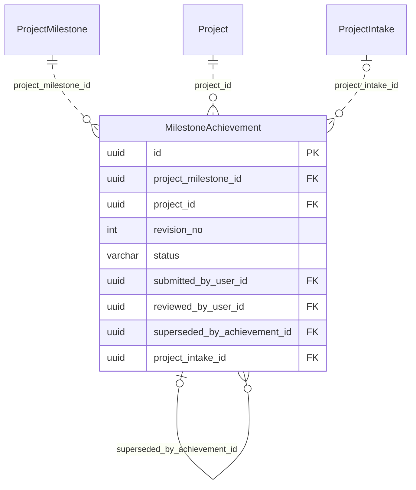
```mermaid
erDiagram
    MilestoneAchievement {
        uuid id PK
        uuid project_milestone_id FK
        uuid project_id FK
        int revision_no
        varchar status
        uuid submitted_by_user_id FK
        uuid reviewed_by_user_id FK
        uuid superseded_by_achievement_id FK
        uuid project_intake_id FK
    }
    ProjectMilestone ||..o{ MilestoneAchievement : "project_milestone_id"
    Project ||..o{ MilestoneAchievement : "project_id"
    MilestoneAchievement |o--o{ MilestoneAchievement : "superseded_by_achievement_id"
    ProjectIntake |o..o{ MilestoneAchievement : "project_intake_id"
```

| Entity | Table | Purpose | Lifecycle column → states | Delete policy | Identity |
| --- | --- | --- | --- | --- | --- |
| **MilestoneAchievement** | `milestone.milestone_achievement` | An achievement claim revision for a shared ProjectMilestone; a correction creates a new revision and marks the old SUPERSEDED (TASK-050). The current ACCEPTED revision holds the accepted Actual Achievement Date (ICD-04). Partial unique index: (project_milestone_id) WHERE status = 'ACCEPTED' — one current accepted revision. | `status` → DRAFT · SUBMITTED · RETURNED · ACCEPTED · SUPERSEDED | HARD_DRAFT | referenceable |

### 5.9 Risk — WF-06

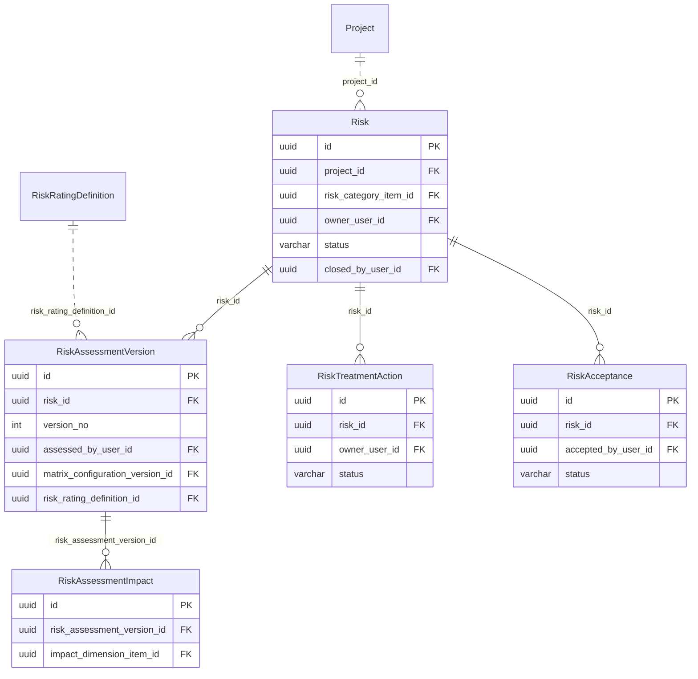
```mermaid
erDiagram
    Risk {
        uuid id PK
        uuid project_id FK
        uuid risk_category_item_id FK
        uuid owner_user_id FK
        varchar status
        uuid closed_by_user_id FK
    }
    RiskAssessmentVersion {
        uuid id PK
        uuid risk_id FK
        int version_no
        uuid assessed_by_user_id FK
        uuid matrix_configuration_version_id FK
        uuid risk_rating_definition_id FK
    }
    RiskAssessmentImpact {
        uuid id PK
        uuid risk_assessment_version_id FK
        uuid impact_dimension_item_id FK
    }
    RiskTreatmentAction {
        uuid id PK
        uuid risk_id FK
        uuid owner_user_id FK
        varchar status
    }
    RiskAcceptance {
        uuid id PK
        uuid risk_id FK
        uuid accepted_by_user_id FK
        varchar status
    }
    Project ||..o{ Risk : "project_id"
    Risk ||--o{ RiskAssessmentVersion : "risk_id"
    RiskRatingDefinition ||..o{ RiskAssessmentVersion : "risk_rating_definition_id"
    RiskAssessmentVersion ||--o{ RiskAssessmentImpact : "risk_assessment_version_id"
    Risk ||--o{ RiskTreatmentAction : "risk_id"
    Risk ||--o{ RiskAcceptance : "risk_id"
```

| Entity | Table | Purpose | Lifecycle column → states | Delete policy | Identity |
| --- | --- | --- | --- | --- | --- |
| **Risk** | `risk.risk` | Risk register entry (TASK-055). Materialisation into an issue is recorded on the ManagementConcern (originating_risk_id). | `status` → IDENTIFIED · ASSESSED · TREATMENT · MONITORING · CLOSED | RETAIN | referenceable |
| **RiskAssessmentVersion** | `risk.risk_assessment_version` | An immutable assessment pinned to the matrix version in force (TASK-055, TASK-059). | — | APPEND_ONLY | — |
| **RiskAssessmentImpact** | `risk.risk_assessment_impact` | Impact level per dimension within an assessment (ADR-011): one row per dimension, no repeating groups. | — | APPEND_ONLY | — |
| **RiskTreatmentAction** | `risk.risk_treatment_action` | Treatment / mitigation action (TASK-055). | `status` → PLANNED · IN_PROGRESS · COMPLETED · CANCELLED | RETAIN | — |
| **RiskAcceptance** | `risk.risk_acceptance` | Time-bound acceptance; expires and returns for review — no permanent acceptance (ADR-011 gate note). | `status` → ACTIVE · EXPIRED · REVOKED | RETAIN | — |

### 5.10 ManagementConcern — WF-07

Materialisation of a risk (edge 15) is one FK, `originating_risk_id`, plus `Risk.materialised_at`. TASK-055's "queryable from both sides" needs an index, not a second FK.

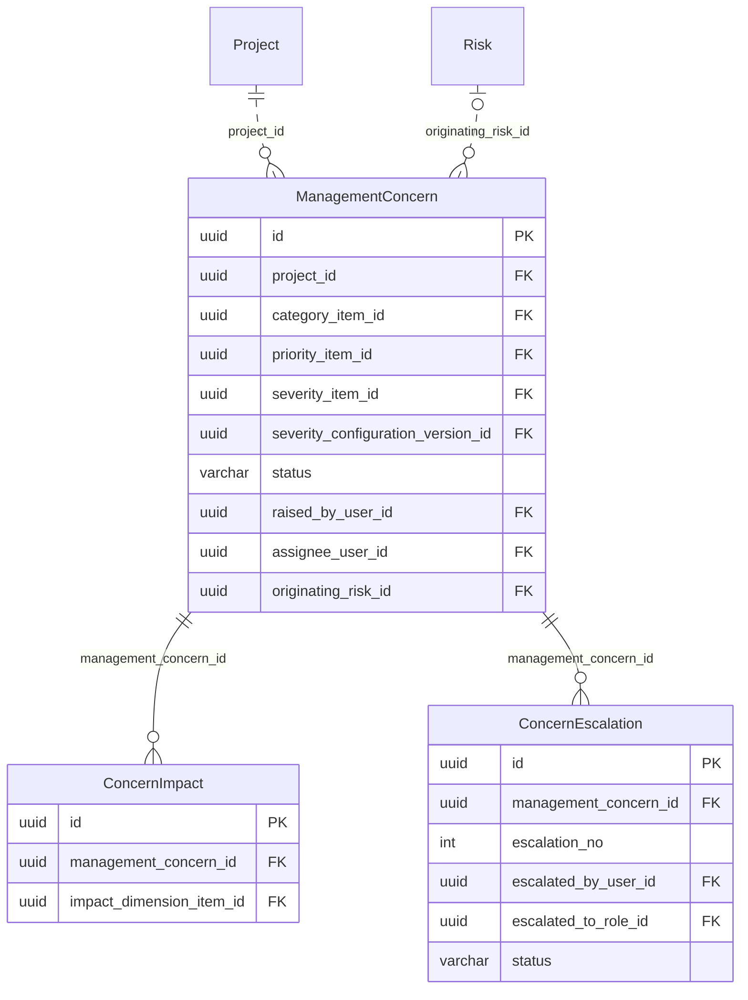
```mermaid
erDiagram
    ManagementConcern {
        uuid id PK
        uuid project_id FK
        uuid category_item_id FK
        uuid priority_item_id FK
        uuid severity_item_id FK
        uuid severity_configuration_version_id FK
        varchar status
        uuid raised_by_user_id FK
        uuid assignee_user_id FK
        uuid originating_risk_id FK
    }
    ConcernImpact {
        uuid id PK
        uuid management_concern_id FK
        uuid impact_dimension_item_id FK
    }
    ConcernEscalation {
        uuid id PK
        uuid management_concern_id FK
        int escalation_no
        uuid escalated_by_user_id FK
        uuid escalated_to_role_id FK
        varchar status
    }
    Project ||..o{ ManagementConcern : "project_id"
    Risk |o..o{ ManagementConcern : "originating_risk_id"
    ManagementConcern ||--o{ ConcernImpact : "management_concern_id"
    ManagementConcern ||--o{ ConcernEscalation : "management_concern_id"
```

| Entity | Table | Purpose | Lifecycle column → states | Delete policy | Identity |
| --- | --- | --- | --- | --- | --- |
| **ManagementConcern** | `management_concern.management_concern` | Issue or Challenge (TASK-057). Severity is computed server-side and distinct from user-set Priority. | `status` → OPEN · ASSIGNED · IN_PROGRESS · PENDING_VALIDATION · RESOLVED · CLOSED | RETAIN | referenceable |
| **ConcernImpact** | `management_concern.concern_impact` | Impact level per dimension for a concern — the same dimension set as risks (ADR-011). | — | CASCADE | — |
| **ConcernEscalation** | `management_concern.concern_escalation` | An escalation event; its identity is the idempotency key for the single NotificationIntent it produces (TASK-057). | `status` → OPEN · RESOLVED · WITHDRAWN | RETAIN | referenceable |

### 5.11 ChangeRequest — WF-08

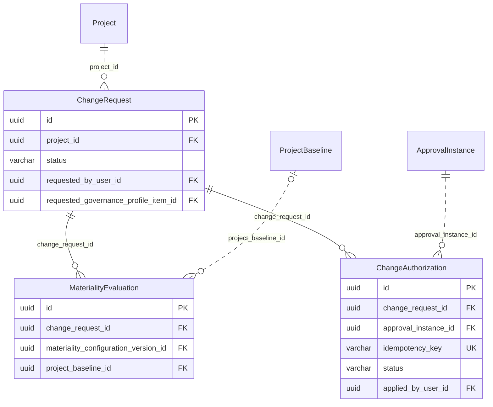
```mermaid
erDiagram
    ChangeRequest {
        uuid id PK
        uuid project_id FK
        varchar status
        uuid requested_by_user_id FK
        uuid requested_governance_profile_item_id FK
    }
    MaterialityEvaluation {
        uuid id PK
        uuid change_request_id FK
        uuid materiality_configuration_version_id FK
        uuid project_baseline_id FK
    }
    ChangeAuthorization {
        uuid id PK
        uuid change_request_id FK
        uuid approval_instance_id FK
        varchar idempotency_key UK
        varchar status
        uuid applied_by_user_id FK
    }
    Project ||..o{ ChangeRequest : "project_id"
    ChangeRequest ||--o{ MaterialityEvaluation : "change_request_id"
    ProjectBaseline |o..o{ MaterialityEvaluation : "project_baseline_id"
    ChangeRequest ||--o{ ChangeAuthorization : "change_request_id"
    ApprovalInstance ||..o{ ChangeAuthorization : "approval_instance_id"
```

| Entity | Table | Purpose | Lifecycle column → states | Delete policy | Identity |
| --- | --- | --- | --- | --- | --- |
| **ChangeRequest** | `change_request.change_request` | Formal change request lifecycle (TASK-060) with materiality band routing (TASK-106). | `status` → DRAFT · SUBMITTED · UNDER_REVIEW · RETURNED · APPROVED · REJECTED · IMPLEMENTATION · IMPLEMENTED · CLOSED · WITHDRAWN | HARD_DRAFT | referenceable |
| **MaterialityEvaluation** | `change_request.materiality_evaluation` | Provenance of one materiality evaluation: band per dimension, cumulative position against the active baseline, pinned configuration (TASK-106). | — | APPEND_ONLY | — |
| **ChangeAuthorization** | `change_request.change_authorization` | Idempotent, scoped, version-pinned authorisation consumed by a target module through a typed adapter (TASK-060, TASK-065). | `status` → ISSUED · APPLIED · EXPIRED · REVOKED | RETAIN | referenceable |

### 5.12 Suspension — WF-09

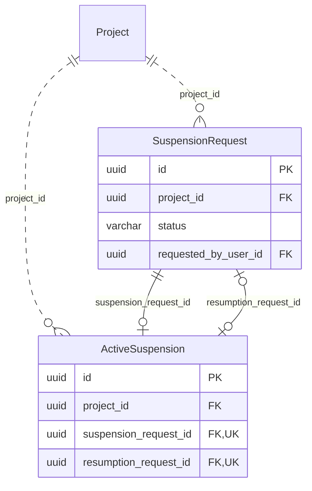
```mermaid
erDiagram
    SuspensionRequest {
        uuid id PK
        uuid project_id FK
        varchar status
        uuid requested_by_user_id FK
    }
    ActiveSuspension {
        uuid id PK
        uuid project_id FK
        uuid suspension_request_id FK, UK
        uuid resumption_request_id FK, UK
    }
    Project ||..o{ SuspensionRequest : "project_id"
    Project ||..o{ ActiveSuspension : "project_id"
    SuspensionRequest ||--o| ActiveSuspension : "suspension_request_id"
    SuspensionRequest |o--o| ActiveSuspension : "resumption_request_id"
```

| Entity | Table | Purpose | Lifecycle column → states | Delete policy | Identity |
| --- | --- | --- | --- | --- | --- |
| **SuspensionRequest** | `suspension.suspension_request` | Suspension or resumption request approved via WF-11, distinct from the Project lifecycle transition (TASK-062). | `status` → DRAFT · SUBMITTED · UNDER_REVIEW · RETURNED · APPROVED · REJECTED · WITHDRAWN · EFFECTED | HARD_DRAFT | referenceable |
| **ActiveSuspension** | `suspension.active_suspension` | The suspension in force. At most one open per project (partial unique index). No automatic rebaseline on resumption (TASK-062). Partial unique index: (project_id) WHERE ended_at IS NULL — at most one ActiveSuspension per Project (TASK-065). | — | RETAIN | referenceable |

### 5.13 Closure — WF-10

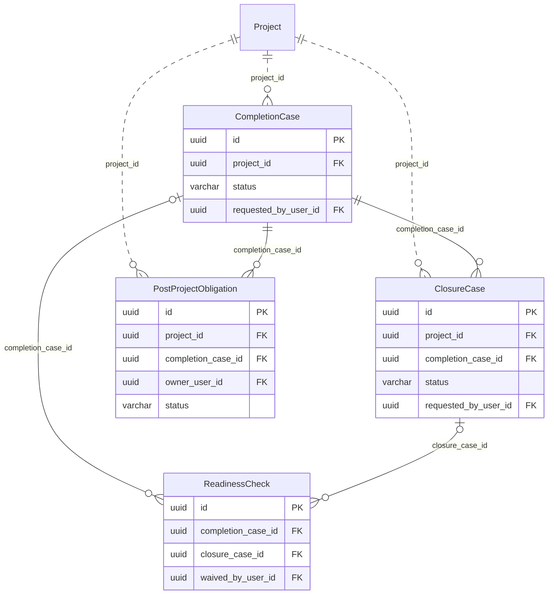
```mermaid
erDiagram
    CompletionCase {
        uuid id PK
        uuid project_id FK
        varchar status
        uuid requested_by_user_id FK
    }
    ClosureCase {
        uuid id PK
        uuid project_id FK
        uuid completion_case_id FK
        varchar status
        uuid requested_by_user_id FK
    }
    ReadinessCheck {
        uuid id PK
        uuid completion_case_id FK
        uuid closure_case_id FK
        uuid waived_by_user_id FK
    }
    PostProjectObligation {
        uuid id PK
        uuid project_id FK
        uuid completion_case_id FK
        uuid owner_user_id FK
        varchar status
    }
    Project ||..o{ CompletionCase : "project_id"
    Project ||..o{ ClosureCase : "project_id"
    CompletionCase ||--o{ ClosureCase : "completion_case_id"
    CompletionCase |o--o{ ReadinessCheck : "completion_case_id"
    ClosureCase |o--o{ ReadinessCheck : "closure_case_id"
    Project ||..o{ PostProjectObligation : "project_id"
    CompletionCase ||--o{ PostProjectObligation : "completion_case_id"
```

| Entity | Table | Purpose | Lifecycle column → states | Delete policy | Identity |
| --- | --- | --- | --- | --- | --- |
| **CompletionCase** | `closure.completion_case` | Readiness-gated completion case; captures ActualProjectCompletionDate (TASK-063). Partial unique index: (project_id) WHERE status = 'EFFECTED' — one effective completion per project. | `status` → DRAFT · SUBMITTED · UNDER_REVIEW · RETURNED · APPROVED · REJECTED · WITHDRAWN · EFFECTED | HARD_DRAFT | referenceable |
| **ClosureCase** | `closure.closure_case` | Closure case following an effected completion; Closed is terminal and read-only (TASK-063). | `status` → DRAFT · SUBMITTED · UNDER_REVIEW · RETURNED · APPROVED · REJECTED · WITHDRAWN · EFFECTED | HARD_DRAFT | referenceable |
| **ReadinessCheck** | `closure.readiness_check` | Result of one readiness check run for a completion or closure case (exactly one case FK set). CHECK: exactly one of completion_case_id, closure_case_id is not null. | — | APPEND_ONLY | — |
| **PostProjectObligation** | `closure.post_project_obligation` | Obligation that may remain active after Completion until closure policy is satisfied (TASK-063). | `status` → OPEN · IN_PROGRESS · SATISFIED · WAIVED · CANCELLED | RETAIN | — |

### 5.14 Approval — WF-11

Approval holds no source-module type (M-8): a subject is four columns and a routing key. `scope_project_id` and `scope_department_id` are authorization anchors the source supplies (M-7), so the inbox can be scoped without Approval learning what a project is. Approval history (SCR-115) is the ordered set of `ApprovalTask` rows plus Audit; it has no table of its own.

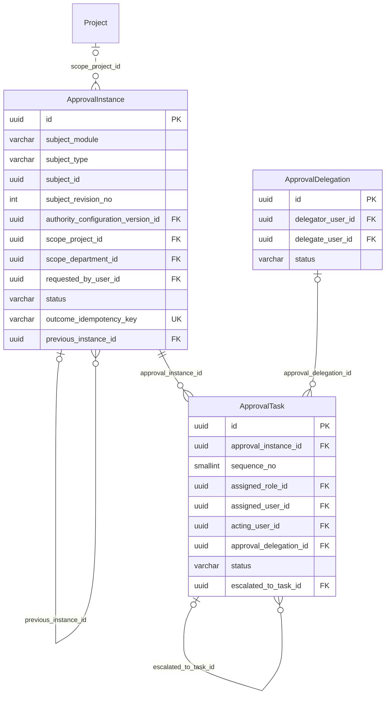
```mermaid
erDiagram
    ApprovalInstance {
        uuid id PK
        varchar subject_module
        varchar subject_type
        uuid subject_id
        int subject_revision_no
        uuid authority_configuration_version_id FK
        uuid scope_project_id FK
        uuid scope_department_id FK
        uuid requested_by_user_id FK
        varchar status
        varchar outcome_idempotency_key UK
        uuid previous_instance_id FK
    }
    ApprovalTask {
        uuid id PK
        uuid approval_instance_id FK
        smallint sequence_no
        uuid assigned_role_id FK
        uuid assigned_user_id FK
        uuid acting_user_id FK
        uuid approval_delegation_id FK
        varchar status
        uuid escalated_to_task_id FK
    }
    ApprovalDelegation {
        uuid id PK
        uuid delegator_user_id FK
        uuid delegate_user_id FK
        varchar status
    }
    Project |o..o{ ApprovalInstance : "scope_project_id"
    ApprovalInstance |o--o{ ApprovalInstance : "previous_instance_id"
    ApprovalInstance ||--o{ ApprovalTask : "approval_instance_id"
    ApprovalDelegation |o--o{ ApprovalTask : "approval_delegation_id"
    ApprovalTask |o--o{ ApprovalTask : "escalated_to_task_id"
```

| Entity | Table | Purpose | Lifecycle column → states | Delete policy | Identity |
| --- | --- | --- | --- | --- | --- |
| **ApprovalInstance** | `approval.approval_instance` | A subject-agnostic approval run (module, aggregate id, revision) with an idempotent outcome callback (TASK-035, M-8). | `status` → PENDING · APPROVED · REJECTED · RETURNED · WITHDRAWN | RETAIN | referenceable |
| **ApprovalTask** | `approval.approval_task` | A stage assignment and its decision; history is the ordered set of tasks (SCR-115). | `status` → PENDING · APPROVED · REJECTED · RETURNED · DELEGATED · ESCALATED · CANCELLED · EXPIRED | RETAIN | — |
| **ApprovalDelegation** | `approval.approval_delegation` | Standing delegation from one internal user to another for a period (SCR-114). | `status` → ACTIVE · REVOKED · EXPIRED | RETAIN | — |

### 5.15 DocumentManagement — WF-12

Blueprint Section 13's chain Document → immutable DocumentVersion → Attachment/BusinessLink → EvidenceReference is four tables. *Attachment* is a `BusinessLink` with `link_role = ATTACHMENT`; a separate table would duplicate every column. `EvidenceReference` pins a `document_version_id` so a later version never alters historical evidence (TASK-037). Unlinking sets `unlinked_at`; nothing is deleted.

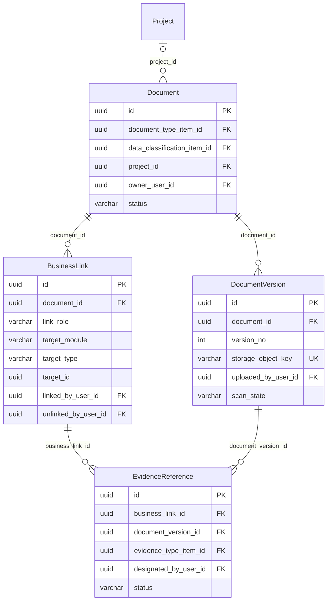
```mermaid
erDiagram
    Document {
        uuid id PK
        uuid document_type_item_id FK
        uuid data_classification_item_id FK
        uuid project_id FK
        uuid owner_user_id FK
        varchar status
    }
    DocumentVersion {
        uuid id PK
        uuid document_id FK
        int version_no
        varchar storage_object_key UK
        uuid uploaded_by_user_id FK
        varchar scan_state
    }
    BusinessLink {
        uuid id PK
        uuid document_id FK
        varchar link_role
        varchar target_module
        varchar target_type
        uuid target_id
        uuid linked_by_user_id FK
        uuid unlinked_by_user_id FK
    }
    EvidenceReference {
        uuid id PK
        uuid business_link_id FK
        uuid document_version_id FK
        uuid evidence_type_item_id FK
        uuid designated_by_user_id FK
        varchar status
    }
    Project |o..o{ Document : "project_id"
    Document ||--o{ DocumentVersion : "document_id"
    Document ||--o{ BusinessLink : "document_id"
    BusinessLink ||--o{ EvidenceReference : "business_link_id"
    DocumentVersion ||--o{ EvidenceReference : "document_version_id"
```

| Entity | Table | Purpose | Lifecycle column → states | Delete policy | Identity |
| --- | --- | --- | --- | --- | --- |
| **Document** | `document_management.document` | Logical document (Blueprint Section 13). Files are versions; the row is never deleted. | `status` → ACTIVE · ARCHIVED | RETAIN | referenceable |
| **DocumentVersion** | `document_management.document_version` | Immutable file version with malware-scan state; later versions never alter historical evidence (TASK-037). | `scan_state` → SCAN_PENDING · CLEAN · QUARANTINED · SCAN_FAILED | RETAIN | referenceable |
| **BusinessLink** | `document_management.business_link` | Attachment of a document to a business context (link_role ATTACHMENT) or a reference to it; unlink never deletes (TASK-037). | — | RETAIN | referenceable |
| **EvidenceReference** | `document_management.evidence_reference` | A link designated as evidence, pinned to a specific version; a QUARANTINED or SCAN_PENDING version cannot be referenced (TASK-037). | `status` → VALID · WITHDRAWN | RETAIN | referenceable |

### 5.16 ExternalParticipation — WF-13

Path A (direct source action by an assigned entity Project Manager) is authorization, not data — it is an `AccessRelationship` and needs no table here. Path B is `ExternalContribution` with normalised `ExternalContributionField` rows (no jsonb) and `SourceApplication` attempts. The contribution's `target_module` is nullable because the target set is unconfirmed (TASK-007 S-5).

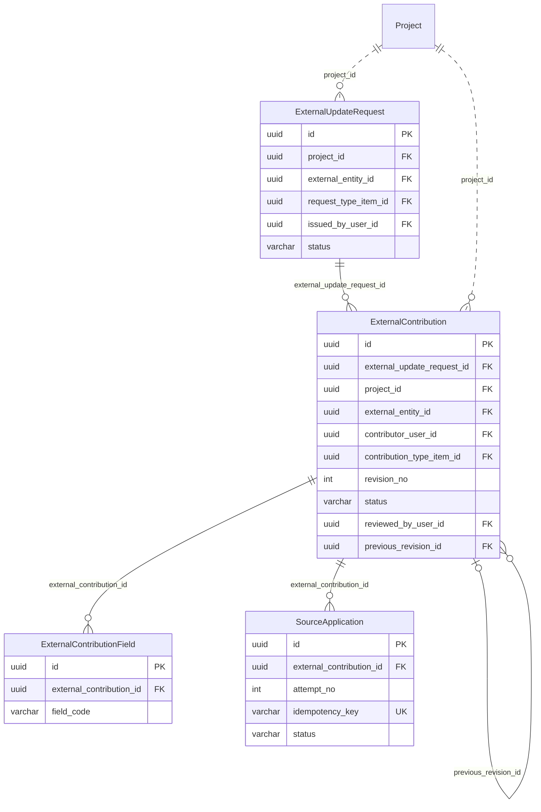
```mermaid
erDiagram
    ExternalUpdateRequest {
        uuid id PK
        uuid project_id FK
        uuid external_entity_id FK
        uuid request_type_item_id FK
        uuid issued_by_user_id FK
        varchar status
    }
    ExternalContribution {
        uuid id PK
        uuid external_update_request_id FK
        uuid project_id FK
        uuid external_entity_id FK
        uuid contributor_user_id FK
        uuid contribution_type_item_id FK
        int revision_no
        varchar status
        uuid reviewed_by_user_id FK
        uuid previous_revision_id FK
    }
    ExternalContributionField {
        uuid id PK
        uuid external_contribution_id FK
        varchar field_code
    }
    SourceApplication {
        uuid id PK
        uuid external_contribution_id FK
        int attempt_no
        varchar idempotency_key UK
        varchar status
    }
    Project ||..o{ ExternalUpdateRequest : "project_id"
    ExternalUpdateRequest ||--o{ ExternalContribution : "external_update_request_id"
    Project ||..o{ ExternalContribution : "project_id"
    ExternalContribution |o--o{ ExternalContribution : "previous_revision_id"
    ExternalContribution ||--o{ ExternalContributionField : "external_contribution_id"
    ExternalContribution ||--o{ SourceApplication : "external_contribution_id"
```

| Entity | Table | Purpose | Lifecycle column → states | Delete policy | Identity |
| --- | --- | --- | --- | --- | --- |
| **ExternalUpdateRequest** | `external_participation.external_update_request` | AHDA-issued or entity-initiated update request within entity and project scope (TASK-066, ADR-013). | `status` → DRAFT · ISSUED · IN_PROGRESS · RESPONDED · CLOSED · CANCELLED · EXPIRED | HARD_DRAFT | referenceable |
| **ExternalContribution** | `external_participation.external_contribution` | Path B staged contribution: immutable once submitted; review produces Accept / Return / Reject and a new revision, never an in-place edit (TASK-066). | `status` → DRAFT · SUBMITTED · UNDER_REVIEW · RETURNED · REJECTED · ACCEPTED_PENDING_APPLICATION · APPLIED · APPLICATION_FAILED | HARD_DRAFT | referenceable |
| **ExternalContributionField** | `external_participation.external_contribution_field` | One proposed field value inside a contribution; normalised, immutable after submission. | — | CASCADE | — |
| **SourceApplication** | `external_participation.source_application` | One attempt to apply an accepted contribution to its source through the typed adapter, with revalidation, idempotency and conflict state (SCR-166). | `status` → PENDING · REVALIDATING · APPLIED · CONFLICT · FAILED · RETRY_SCHEDULED | RETAIN | — |

### 5.17 FinancialKpi — WF-14

Two subdomains (Blueprint Section 8.1), kept as two clusters. Financial Progress: `FinancialCommitment` (each row a version; `commitment_type` distinguishes the approved budget, the ADR-014 declared budget and the open commitment not used at launch), `FinancialProgressUpdate` (current/live) and `PublishedFinancialSnapshot` (immutable). KPI Performance: `KpiAssignment`, `KpiTargetVersion`, `KpiMeasurement` pinned to the target version in force. Every financial row carries D-10 provenance and every amount is D-5 money. `FinancialSourceMode` is the ADR-008 "per project and per field" source mode. Cost breakdown by Etimad category is a line table on the commitment and on the update; the ADR-008 gate note says launch is project-total only, and the amendment says the structure is aligned from day one — so the lines exist and may be empty.

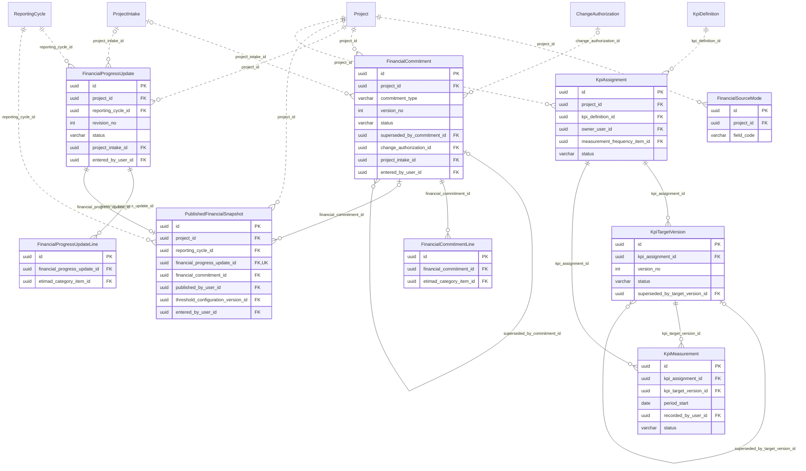
```mermaid
erDiagram
    FinancialSourceMode {
        uuid id PK
        uuid project_id FK
        varchar field_code
    }
    FinancialCommitment {
        uuid id PK
        uuid project_id FK
        varchar commitment_type
        int version_no
        varchar status
        uuid superseded_by_commitment_id FK
        uuid change_authorization_id FK
        uuid project_intake_id FK
        uuid entered_by_user_id FK
    }
    FinancialCommitmentLine {
        uuid id PK
        uuid financial_commitment_id FK
        uuid etimad_category_item_id FK
    }
    FinancialProgressUpdate {
        uuid id PK
        uuid project_id FK
        uuid reporting_cycle_id FK
        int revision_no
        varchar status
        uuid project_intake_id FK
        uuid entered_by_user_id FK
    }
    FinancialProgressUpdateLine {
        uuid id PK
        uuid financial_progress_update_id FK
        uuid etimad_category_item_id FK
    }
    PublishedFinancialSnapshot {
        uuid id PK
        uuid project_id FK
        uuid reporting_cycle_id FK
        uuid financial_progress_update_id FK, UK
        uuid financial_commitment_id FK
        uuid published_by_user_id FK
        uuid threshold_configuration_version_id FK
        uuid entered_by_user_id FK
    }
    KpiAssignment {
        uuid id PK
        uuid project_id FK
        uuid kpi_definition_id FK
        uuid owner_user_id FK
        uuid measurement_frequency_item_id FK
        varchar status
    }
    KpiTargetVersion {
        uuid id PK
        uuid kpi_assignment_id FK
        int version_no
        varchar status
        uuid superseded_by_target_version_id FK
    }
    KpiMeasurement {
        uuid id PK
        uuid kpi_assignment_id FK
        uuid kpi_target_version_id FK
        date period_start
        uuid recorded_by_user_id FK
        varchar status
    }
    Project ||..o{ FinancialSourceMode : "project_id"
    Project ||..o{ FinancialCommitment : "project_id"
    FinancialCommitment |o--o{ FinancialCommitment : "superseded_by_commitment_id"
    ChangeAuthorization |o..o{ FinancialCommitment : "change_authorization_id"
    ProjectIntake |o..o{ FinancialCommitment : "project_intake_id"
    FinancialCommitment ||--o{ FinancialCommitmentLine : "financial_commitment_id"
    Project ||..o{ FinancialProgressUpdate : "project_id"
    ReportingCycle ||..o{ FinancialProgressUpdate : "reporting_cycle_id"
    ProjectIntake |o..o{ FinancialProgressUpdate : "project_intake_id"
    FinancialProgressUpdate ||--o{ FinancialProgressUpdateLine : "financial_progress_update_id"
    Project ||..o{ PublishedFinancialSnapshot : "project_id"
    ReportingCycle ||..o{ PublishedFinancialSnapshot : "reporting_cycle_id"
    FinancialProgressUpdate ||--o| PublishedFinancialSnapshot : "financial_progress_update_id"
    FinancialCommitment |o--o{ PublishedFinancialSnapshot : "financial_commitment_id"
    Project ||..o{ KpiAssignment : "project_id"
    KpiDefinition ||..o{ KpiAssignment : "kpi_definition_id"
    KpiAssignment ||--o{ KpiTargetVersion : "kpi_assignment_id"
    KpiTargetVersion |o--o{ KpiTargetVersion : "superseded_by_target_version_id"
    KpiAssignment ||--o{ KpiMeasurement : "kpi_assignment_id"
    KpiTargetVersion ||--o{ KpiMeasurement : "kpi_target_version_id"
```

| Entity | Table | Purpose | Lifecycle column → states | Delete policy | Identity |
| --- | --- | --- | --- | --- | --- |
| **FinancialSourceMode** | `financial_kpi.financial_source_mode` | Source mode per project and per financial field (ADR-008 gate: manual at launch; integrated/hybrid built, unconnected). | — | RETAIN | — |
| **FinancialCommitment** | `financial_kpi.financial_commitment` | An approved commitment/budget version in SAR (ADR-008). Each row is one version; the ACTIVE row is the budget of record. Partial unique index: (project_id, commitment_type) WHERE status = 'ACTIVE'. | `status` → DRAFT · SUBMITTED · UNDER_REVIEW · RETURNED · ACTIVE · SUPERSEDED · REJECTED · WITHDRAWN | HARD_DRAFT | referenceable |
| **FinancialCommitmentLine** | `financial_kpi.financial_commitment_line` | Cost breakdown by Etimad category (ADR-008 extension); optional at launch (project total only). | — | CASCADE | — |
| **FinancialProgressUpdate** | `financial_kpi.financial_progress_update` | Periodic CURRENT/LIVE actuals and forecast for a reporting cycle with provenance (TASK-052, TASK-108). | `status` → DRAFT · SUBMITTED · UNDER_REVIEW · RETURNED · PUBLISHED | HARD_DRAFT | referenceable |
| **FinancialProgressUpdateLine** | `financial_kpi.financial_progress_update_line` | Actual expenditure by Etimad category within an update. | — | CASCADE | — |
| **PublishedFinancialSnapshot** | `financial_kpi.published_financial_snapshot` | Immutable PUBLISHED/OFFICIAL financial position for a cycle; unchanged by later corrections (TASK-054). | — | APPEND_ONLY | referenceable |
| **KpiAssignment** | `financial_kpi.kpi_assignment` | A KPI assigned to a project (TASK-052). | `status` → ACTIVE · SUSPENDED · RETIRED | RETAIN | referenceable |
| **KpiTargetVersion** | `financial_kpi.kpi_target_version` | Immutable-once-approved target for an assignment; measurements pin to the version in force when recorded (TASK-052). | `status` → DRAFT · SUBMITTED · UNDER_REVIEW · RETURNED · ACTIVE · SUPERSEDED · REJECTED · WITHDRAWN | HARD_DRAFT | referenceable |
| **KpiMeasurement** | `financial_kpi.kpi_measurement` | A periodic measurement pinned to its target version; Missing/Stale/N/A are explicit, never zero (TASK-052, TASK-053). | `status` → DRAFT · SUBMITTED · PUBLISHED | HARD_DRAFT | — |

### 5.18 Notifications — WF-15

`NotificationIntent` is unique on (`source_event_type`, `source_reference`): the source's own identity — a `ConcernEscalation` id, a `ReportJob` id — is the idempotency key, which is how TASK-057's "exactly once per escalation event" is a constraint rather than a test. Templates are here rather than in FG-04 because they are content rendered by this module; the routing *matrices* are FG-04's (TASK-034 amendment) and are referenced by `event_family_code`.

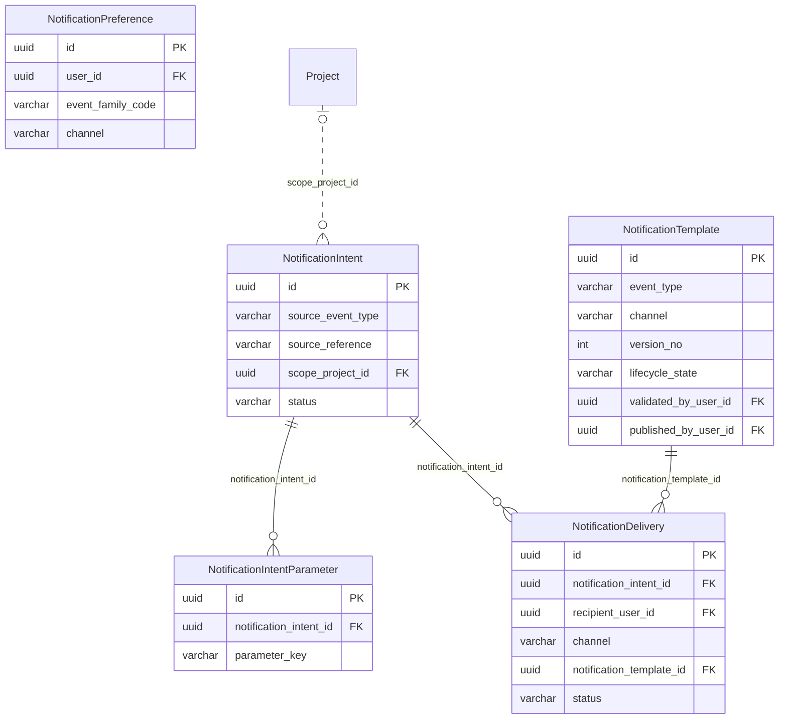
```mermaid
erDiagram
    NotificationTemplate {
        uuid id PK
        varchar event_type
        varchar channel
        int version_no
        varchar lifecycle_state
        uuid validated_by_user_id FK
        uuid published_by_user_id FK
    }
    NotificationIntent {
        uuid id PK
        varchar source_event_type
        varchar source_reference
        uuid scope_project_id FK
        varchar status
    }
    NotificationIntentParameter {
        uuid id PK
        uuid notification_intent_id FK
        varchar parameter_key
    }
    NotificationDelivery {
        uuid id PK
        uuid notification_intent_id FK
        uuid recipient_user_id FK
        varchar channel
        uuid notification_template_id FK
        varchar status
    }
    NotificationPreference {
        uuid id PK
        uuid user_id FK
        varchar event_family_code
        varchar channel
    }
    Project |o..o{ NotificationIntent : "scope_project_id"
    NotificationIntent ||--o{ NotificationIntentParameter : "notification_intent_id"
    NotificationIntent ||--o{ NotificationDelivery : "notification_intent_id"
    NotificationTemplate ||--o{ NotificationDelivery : "notification_template_id"
```

| Entity | Table | Purpose | Lifecycle column → states | Delete policy | Identity |
| --- | --- | --- | --- | --- | --- |
| **NotificationTemplate** | `notifications.notification_template` | Bilingual, mandatory template per event family and channel (ADR-012, ADR-004); SMS variants carry event + deep link only. | `lifecycle_state` → DRAFT · VALIDATED · PUBLISHED · RETIRED | RETAIN | referenceable |
| **NotificationIntent** | `notifications.notification_intent` | Typed intent received from a source module after commit (commit-before-notify, Blueprint Section 15). Idempotent on (source_event_type, source_reference). | `status` → RECEIVED · SCHEDULED · RESOLVING · ROUTED · SUPPRESSED · COMPLETED · FAILED | RETAIN | referenceable |
| **NotificationIntentParameter** | `notifications.notification_intent_parameter` | Template parameter supplied by the source; never a sensitive field value for SMS (TASK-103). | — | CASCADE | — |
| **NotificationDelivery** | `notifications.notification_delivery` | One rendered delivery to one recipient on one channel with retry, suppression, dead-letter and read state (SCR-150–154). | `status` → PENDING · SENT · DELIVERED · FAILED · DEAD_LETTER · SUPPRESSED · READ | RETAIN | referenceable |
| **NotificationPreference** | `notifications.notification_preference` | Recipient opt-out per non-mandatory family and channel; in-app always on (ADR-004, TASK-040). | — | HARD_OWNER | — |

### 5.19 Dashboards — FG-01

No projection table lives here. Widgets bind to a `source_projection_code` that names the owning module's projection (`ProjectHealthStatus`, `ScheduleHealthStatus`, `PublishedFinancialSnapshot`, …) and the dashboard reads it (edge 29). This is M-12 made structural: there is no table in this schema that could hold a recomputed health.

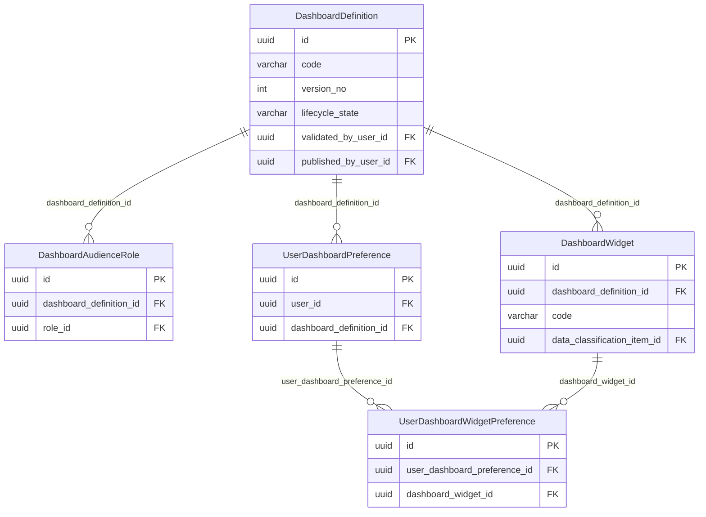
```mermaid
erDiagram
    DashboardDefinition {
        uuid id PK
        varchar code
        int version_no
        varchar lifecycle_state
        uuid validated_by_user_id FK
        uuid published_by_user_id FK
    }
    DashboardAudienceRole {
        uuid id PK
        uuid dashboard_definition_id FK
        uuid role_id FK
    }
    DashboardWidget {
        uuid id PK
        uuid dashboard_definition_id FK
        varchar code
        uuid data_classification_item_id FK
    }
    UserDashboardPreference {
        uuid id PK
        uuid user_id FK
        uuid dashboard_definition_id FK
    }
    UserDashboardWidgetPreference {
        uuid id PK
        uuid user_dashboard_preference_id FK
        uuid dashboard_widget_id FK
    }
    DashboardDefinition ||--o{ DashboardAudienceRole : "dashboard_definition_id"
    DashboardDefinition ||--o{ DashboardWidget : "dashboard_definition_id"
    DashboardDefinition ||--o{ UserDashboardPreference : "dashboard_definition_id"
    UserDashboardPreference ||--o{ UserDashboardWidgetPreference : "user_dashboard_preference_id"
    DashboardWidget ||--o{ UserDashboardWidgetPreference : "dashboard_widget_id"
```

| Entity | Table | Purpose | Lifecycle column → states | Delete policy | Identity |
| --- | --- | --- | --- | --- | --- |
| **DashboardDefinition** | `dashboards.dashboard_definition` | Governed dashboard definition (DRAFT→VALIDATED→PUBLISHED→RETIRED); three at launch per ADR-006 (Portfolio, Project, Governance). | `lifecycle_state` → DRAFT · VALIDATED · PUBLISHED · RETIRED | RETAIN | referenceable |
| **DashboardAudienceRole** | `dashboards.dashboard_audience_role` | Roles that may open a definition and whether it is their default landing (Blueprint Section 20.2). | — | CASCADE | — |
| **DashboardWidget** | `dashboards.dashboard_widget` | A widget bound to a controlled source projection; renders semantic state, freshness and coverage, never recomputes (TASK-069). | — | CASCADE | referenceable |
| **UserDashboardPreference** | `dashboards.user_dashboard_preference` | Presentation-only personalisation per user and definition (TASK-111); reset deletes it. | — | HARD_OWNER | — |
| **UserDashboardWidgetPreference** | `dashboards.user_dashboard_widget_preference` | Hidden/ordered state of one OptionalVisibility widget. | — | CASCADE | — |

### 5.20 Reports — FG-02

`SavedView` serves both a saved parameter set for a published definition and an SCR-138 explorer composition (`view_type`). A composition can reference only `ReportAllowlistEntry` rows — the FK is the allowlist enforcement (TASK-071, TASK-112). A share carries configuration; authorisation is evaluated per viewer at `ReportJob` time.

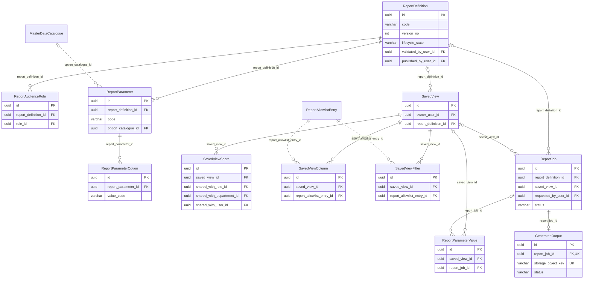
```mermaid
erDiagram
    ReportDefinition {
        uuid id PK
        varchar code
        int version_no
        varchar lifecycle_state
        uuid validated_by_user_id FK
        uuid published_by_user_id FK
    }
    ReportAudienceRole {
        uuid id PK
        uuid report_definition_id FK
        uuid role_id FK
    }
    ReportParameter {
        uuid id PK
        uuid report_definition_id FK
        varchar code
        uuid option_catalogue_id FK
    }
    ReportParameterOption {
        uuid id PK
        uuid report_parameter_id FK
        varchar value_code
    }
    SavedView {
        uuid id PK
        uuid owner_user_id FK
        uuid report_definition_id FK
    }
    SavedViewShare {
        uuid id PK
        uuid saved_view_id FK
        uuid shared_with_role_id FK
        uuid shared_with_department_id FK
        uuid shared_with_user_id FK
    }
    SavedViewColumn {
        uuid id PK
        uuid saved_view_id FK
        uuid report_allowlist_entry_id FK
    }
    SavedViewFilter {
        uuid id PK
        uuid saved_view_id FK
        uuid report_allowlist_entry_id FK
    }
    ReportParameterValue {
        uuid id PK
        uuid saved_view_id FK
        uuid report_job_id FK
    }
    ReportJob {
        uuid id PK
        uuid report_definition_id FK
        uuid saved_view_id FK
        uuid requested_by_user_id FK
        varchar status
    }
    GeneratedOutput {
        uuid id PK
        uuid report_job_id FK, UK
        varchar storage_object_key UK
        varchar status
    }
    ReportDefinition ||--o{ ReportAudienceRole : "report_definition_id"
    ReportDefinition ||--o{ ReportParameter : "report_definition_id"
    MasterDataCatalogue |o..o{ ReportParameter : "option_catalogue_id"
    ReportParameter ||--o{ ReportParameterOption : "report_parameter_id"
    ReportDefinition |o--o{ SavedView : "report_definition_id"
    SavedView ||--o{ SavedViewShare : "saved_view_id"
    SavedView ||--o{ SavedViewColumn : "saved_view_id"
    ReportAllowlistEntry ||..o{ SavedViewColumn : "report_allowlist_entry_id"
    SavedView ||--o{ SavedViewFilter : "saved_view_id"
    ReportAllowlistEntry ||..o{ SavedViewFilter : "report_allowlist_entry_id"
    SavedView |o--o{ ReportParameterValue : "saved_view_id"
    ReportJob |o--o{ ReportParameterValue : "report_job_id"
    ReportDefinition |o--o{ ReportJob : "report_definition_id"
    SavedView |o--o{ ReportJob : "saved_view_id"
    ReportJob ||--o| GeneratedOutput : "report_job_id"
```

| Entity | Table | Purpose | Lifecycle column → states | Delete policy | Identity |
| --- | --- | --- | --- | --- | --- |
| **ReportDefinition** | `reports.report_definition` | Governed parameterised report definition; ten at launch (ADR-006), modes and scopes carried as parameters. | `lifecycle_state` → DRAFT · VALIDATED · PUBLISHED · RETIRED | RETAIN | referenceable |
| **ReportAudienceRole** | `reports.report_audience_role` | Roles that may run a definition; R08 limited to the entity report set (ADR-013). | — | CASCADE | — |
| **ReportParameter** | `reports.report_parameter` | A parameter (including mode and scope) of a definition. | — | CASCADE | — |
| **ReportParameterOption** | `reports.report_parameter_option` | Fixed option of an OPTION parameter (report mode / scope variants absorbed per ADR-006). | — | CASCADE | — |
| **SavedView** | `reports.saved_view` | Saved parameter set for a definition, or an SCR-138 explorer composition (ADR-019). A shared view carries configuration only; authorisation is per viewer at execution (TASK-112). | — | HARD_OWNER | referenceable |
| **SavedViewShare** | `reports.saved_view_share` | Who a view is shared with. CHECK: exactly one of the three shared_with columns is not null. | — | CASCADE | — |
| **SavedViewColumn** | `reports.saved_view_column` | An allowlisted column selected in an explorer composition (MOD-061). | — | CASCADE | — |
| **SavedViewFilter** | `reports.saved_view_filter` | An allowlisted filter in a composition; operators from a closed set — no free-text SQL, formulas or joins. | — | CASCADE | — |
| **ReportParameterValue** | `reports.report_parameter_value` | Pinned parameter value of a saved view or a job. CHECK: exactly one of saved_view_id, report_job_id is not null. | — | CASCADE | — |
| **ReportJob** | `reports.report_job` | A generation run (REQUESTED→VALIDATING→QUEUED→RUNNING→COMPLETED/FAILED/CANCELLED/EXPIRED) for a definition or an explorer view (TASK-071). CHECK: at least one of report_definition_id, saved_view_id is not null. | `status` → REQUESTED · VALIDATING · QUEUED · RUNNING · COMPLETED · FAILED · CANCELLED · EXPIRED | RETAIN | referenceable |
| **GeneratedOutput** | `reports.generated_output` | The secured output of a completed job; downloads are authorised at download time (TASK-071). The file is purged at expiry; the row is kept. | `status` → AVAILABLE · EXPIRED · PURGED | RETAIN | — |

### 5.21 IntegrationMonitoring — FG-05

Blueprint Section 17.1's object model, five tables. Nothing here references a business lifecycle state and nothing in a domain schema references integration health (TASK-075: the two are strictly separate). `IntegrationInstance.availability` and `freshness` are two columns because ADM-047 must show them as two indicators.

```mermaid
erDiagram
    IntegrationDefinition {
        uuid id PK
        varchar code UK
        uuid owner_role_id FK
        varchar status
    }
    IntegrationInstance {
        uuid id PK
        uuid integration_definition_id FK
        varchar code
    }
    SyncRun {
        uuid id PK
        uuid integration_instance_id FK
        varchar status
    }
    Invocation {
        uuid id PK
        uuid integration_instance_id FK
        uuid sync_run_id FK
        varchar status
    }
    OperationalAlert {
        uuid id PK
        uuid integration_instance_id FK
        uuid sync_run_id FK
        uuid invocation_id FK
        varchar status
        uuid acknowledged_by_user_id FK
    }
    IntegrationDefinition ||--o{ IntegrationInstance : "integration_definition_id"
    IntegrationInstance ||--o{ SyncRun : "integration_instance_id"
    IntegrationInstance ||--o{ Invocation : "integration_instance_id"
    SyncRun |o--o{ Invocation : "sync_run_id"
    IntegrationInstance ||--o{ OperationalAlert : "integration_instance_id"
    SyncRun |o--o{ OperationalAlert : "sync_run_id"
    Invocation |o--o{ OperationalAlert : "invocation_id"
```

| Entity | Table | Purpose | Lifecycle column → states | Delete policy | Identity |
| --- | --- | --- | --- | --- | --- |
| **IntegrationDefinition** | `integration_monitoring.integration_definition` | A named external integration (AD/LDAP, SSO, Exchange, SMS provider, Nafath, SIEM, malware scan, Etimad-future, legacy source) — Blueprint Section 17.1. | `status` → ACTIVE · DISABLED · RETIRED | RETAIN | referenceable |
| **IntegrationInstance** | `integration_monitoring.integration_instance` | A configured endpoint of a definition. Availability and Freshness are two separate indicators (ADM-047); stored as an operational projection — D-8 register. | — | RETAIN | referenceable |
| **SyncRun** | `integration_monitoring.sync_run` | A directory sync or reconciliation run; mismatches raise alerts and never auto-repair authoritative data (TASK-075). | `status` → RUNNING · SUCCEEDED · PARTIAL · FAILED | RETAIN | referenceable |
| **Invocation** | `integration_monitoring.invocation` | One call to or from an integration with retry, dead-letter and correlation (TASK-075). Never carries a secret or a sensitive payload. | `status` → IN_PROGRESS · SUCCEEDED · FAILED · RETRY_SCHEDULED · DEAD_LETTER | RETAIN | referenceable |
| **OperationalAlert** | `integration_monitoring.operational_alert` | An alert for investigation: availability, freshness, reconciliation mismatch, dead-letter, delivery rate (ADR-004). | `status` → OPEN · ACKNOWLEDGED · RESOLVED · DISMISSED | RETAIN | — |

### 5.22 AuditActivity — FG-06

`AuditEvent` is append-only and hash-chained; SIEM forwarding state lives in `AuditForwardingRecord` so the event row is never updated. `BusinessActivityEntry` is the derived, rebuildable projection Blueprint Section 18 requires to be kept separate from Audit.

```mermaid
erDiagram
    AuditEvent {
        uuid id PK
        uuid actor_user_id FK
        uuid scope_project_id FK
        uuid scope_external_entity_id FK
        uuid data_classification_item_id FK
    }
    AuditEventAttribute {
        uuid id PK
        uuid audit_event_id FK
        varchar attribute_name
    }
    AuditForwardingRecord {
        uuid id PK
        uuid audit_event_id FK, UK
        uuid invocation_id FK
        varchar status
    }
    BusinessActivityEntry {
        uuid id PK
        uuid audit_event_id FK, UK
        uuid project_id FK
        uuid actor_user_id FK
    }
    Project |o..o{ AuditEvent : "scope_project_id"
    AuditEvent ||--o{ AuditEventAttribute : "audit_event_id"
    AuditEvent ||--o| AuditForwardingRecord : "audit_event_id"
    Invocation |o..o{ AuditForwardingRecord : "invocation_id"
    AuditEvent ||--o| BusinessActivityEntry : "audit_event_id"
    Project |o..o{ BusinessActivityEntry : "project_id"
```

| Entity | Table | Purpose | Lifecycle column → states | Delete policy | Identity |
| --- | --- | --- | --- | --- | --- |
| **AuditEvent** | `audit_activity.audit_event` | Append-only, tamper-evident formal audit record (Blueprint Section 18; TASK-033, TASK-073). Hash-chained; no update or delete by any application role. | — | APPEND_ONLY | referenceable |
| **AuditEventAttribute** | `audit_activity.audit_event_attribute` | Old/new value pair captured with the event (the diff TASK-110 requires). | — | APPEND_ONLY | — |
| **AuditForwardingRecord** | `audit_activity.audit_forwarding_record` | SIEM forwarding state kept apart from the immutable event (PTBC-029). | `status` → PENDING · FORWARDED · FAILED | RETAIN | — |
| **BusinessActivityEntry** | `audit_activity.business_activity_entry` | Derived, rebuildable business-readable projection of audit events (SCR-057); rebuild-and-diff must reproduce it exactly (TASK-073). Stored — D-8 register. | — | RETAIN | — |

## 6. Lifecycle-state review (Appendix C)

The acceptance criterion asks that the ERD be reviewed against Blueprint Appendix C for lifecycle-state columns. Appendix C cannot be read (§3). The review that *can* be done is recorded here: every lifecycle column, its states, and the workbook row that states them. Where the workbook names the states, the column carries them verbatim (upper snake case). Where it names only the workflow shape — "approved via WF-11", "retry/dead-letter" — the states follow the WF-11 request pattern of TASK-035/036 (DRAFT → SUBMITTED → UNDER_REVIEW → RETURNED / APPROVED / REJECTED, plus WITHDRAWN from MOD-044) and are marked *inferred*. Every inferred set is put to the Appendix C check as a single question (Q2, §14).

53 lifecycle columns:

| # | Entity | Column | States (as restated by the workbook) | Workbook source | Appendix C check |
| --- | --- | --- | --- | --- | --- |
| 1 | ExternalEntity | `status` | ACTIVE · SUSPENDED · RETIRED | Inferred — no workbook statement (E-1; Q2) | NOT RUN (E-1) |
| 2 | User | `status` | ACTIVE · DISABLED | TASK-031 (activate/disable; deactivation preserves attribution) | NOT RUN (E-1) |
| 3 | PermissionProfileVersion | `lifecycle_state` | DRAFT · VALIDATED · PUBLISHED · RETIRED | TASK-110; §11.3 (governed lifecycle primitive) | NOT RUN (E-1) |
| 4 | AccessRelationship | `status` | ACTIVE · ENDED | TASK-031 (access ending on project closure or role change) | NOT RUN (E-1) |
| 5 | MasterDataItem | `lifecycle_state` | DRAFT · VALIDATED · PUBLISHED · RETIRED | TASK-034 (DRAFT → VALIDATED → PUBLISHED → RETIRED) | NOT RUN (E-1) |
| 6 | ConfigurationVersion | `lifecycle_state` | DRAFT · VALIDATED · PUBLISHED · RETIRED | TASK-034 (DRAFT → VALIDATED → PUBLISHED → RETIRED; effectivity derived, D-13) | NOT RUN (E-1) |
| 7 | KpiDefinition | `lifecycle_state` | DRAFT · VALIDATED · PUBLISHED · RETIRED | TASK-034 governed lifecycle | NOT RUN (E-1) |
| 8 | Project | `lifecycle_state` | DRAFT · SUBMITTED · UNDER_REVIEW · RETURNED · APPROVED_PLANNED · ACTIVE · SUSPENDED · COMPLETED · CLOSED | TASK-041 (Draft → Submitted → Under Review → Returned/Approved-Planned; Planned→Active command); TASK-062 (Active ↔ Suspended); TASK-063 (Completed → Closed, terminal) | NOT RUN (E-1) |
| 9 | ReportingCycle | `status` | OPEN · CLOSED | Inferred — no workbook statement (E-1; Q2) | NOT RUN (E-1) |
| 10 | ProgressSubmission | `status` | DRAFT · SUBMITTED · UNDER_REVIEW · RETURNED · PUBLISHED | TASK-044 (review/publication workflow) — state names inferred from the WF-11 pattern | NOT RUN (E-1) |
| 11 | PeriodicUpdateSession | `status` | IN_PROGRESS · COMPLETED · ABANDONED | Inferred — no workbook statement (E-1; Q2) | NOT RUN (E-1) |
| 12 | ScheduleActivity | `status` | PLANNED · IN_PROGRESS · COMPLETED · CANCELLED | Inferred — no workbook statement (E-1; Q2) | NOT RUN (E-1) |
| 13 | ProjectBaseline | `status` | DRAFT · SUBMITTED · UNDER_REVIEW · RETURNED · ACTIVE · SUPERSEDED · REJECTED · WITHDRAWN | TASK-046 (single ACTIVE; supersession) + WF-11 request pattern | NOT RUN (E-1) |
| 14 | ProjectMilestone | `status` | PLANNED · ACHIEVED · CANCELLED | Inferred — no workbook statement (E-1; Q2) | NOT RUN (E-1) |
| 15 | ProjectTask | `status` | NOT_STARTED · IN_PROGRESS · BLOCKED · COMPLETED · CANCELLED | TASK-048 (Not Started → In Progress/Blocked → Completed; controlled reopen/cancel) | NOT RUN (E-1) |
| 16 | MilestoneAchievement | `status` | DRAFT · SUBMITTED · RETURNED · ACCEPTED · SUPERSEDED | TASK-050 (Draft/Submitted/Returned/Accepted; superseded on correction) | NOT RUN (E-1) |
| 17 | Risk | `status` | IDENTIFIED · ASSESSED · TREATMENT · MONITORING · CLOSED | TASK-055 (Identified → Assessed → Treatment/Monitoring → Closed) | NOT RUN (E-1) |
| 18 | RiskTreatmentAction | `status` | PLANNED · IN_PROGRESS · COMPLETED · CANCELLED | Inferred — no workbook statement (E-1; Q2) | NOT RUN (E-1) |
| 19 | RiskAcceptance | `status` | ACTIVE · EXPIRED · REVOKED | TASK-055 gate note (acceptance carries an expiry and returns for review) — state names inferred | NOT RUN (E-1) |
| 20 | ManagementConcern | `status` | OPEN · ASSIGNED · IN_PROGRESS · PENDING_VALIDATION · RESOLVED · CLOSED | TASK-057 (Open → Assigned → In Progress → Pending Validation → Resolved → Closed) | NOT RUN (E-1) |
| 21 | ConcernEscalation | `status` | OPEN · RESOLVED · WITHDRAWN | Inferred — no workbook statement (E-1; Q2) | NOT RUN (E-1) |
| 22 | ChangeRequest | `status` | DRAFT · SUBMITTED · UNDER_REVIEW · RETURNED · APPROVED · REJECTED · IMPLEMENTATION · IMPLEMENTED · CLOSED · WITHDRAWN | TASK-060 (Draft → Submitted → Under Review → Returned/Approved/Rejected → Implementation → Implemented → Closed); WITHDRAWN from MOD-044 (TASK-036) | NOT RUN (E-1) |
| 23 | ChangeAuthorization | `status` | ISSUED · APPLIED · EXPIRED · REVOKED | TASK-060 (presented exactly once; separate application step) — state names inferred | NOT RUN (E-1) |
| 24 | SuspensionRequest | `status` | DRAFT · SUBMITTED · UNDER_REVIEW · RETURNED · APPROVED · REJECTED · WITHDRAWN · EFFECTED | TASK-062 + WF-11 request pattern (TASK-035/036); EFFECTED = the separately audited lifecycle activation | NOT RUN (E-1) |
| 25 | CompletionCase | `status` | DRAFT · SUBMITTED · UNDER_REVIEW · RETURNED · APPROVED · REJECTED · WITHDRAWN · EFFECTED | TASK-063 + WF-11 request pattern; EFFECTED = Project → COMPLETED command | NOT RUN (E-1) |
| 26 | ClosureCase | `status` | DRAFT · SUBMITTED · UNDER_REVIEW · RETURNED · APPROVED · REJECTED · WITHDRAWN · EFFECTED | TASK-063 + WF-11 request pattern; EFFECTED = Project → CLOSED command | NOT RUN (E-1) |
| 27 | PostProjectObligation | `status` | OPEN · IN_PROGRESS · SATISFIED · WAIVED · CANCELLED | Inferred — no workbook statement (E-1; Q2) | NOT RUN (E-1) |
| 28 | ApprovalInstance | `status` | PENDING · APPROVED · REJECTED · RETURNED · WITHDRAWN | TASK-036 (pending/approved/rejected/returned; Withdraw modal MOD-044) | NOT RUN (E-1) |
| 29 | ApprovalTask | `status` | PENDING · APPROVED · REJECTED · RETURNED · DELEGATED · ESCALATED · CANCELLED · EXPIRED | TASK-036 (Approve/Reject/Return/Delegate/Escalate modals MOD-040–045) | NOT RUN (E-1) |
| 30 | ApprovalDelegation | `status` | ACTIVE · REVOKED · EXPIRED | Inferred — no workbook statement (E-1; Q2) | NOT RUN (E-1) |
| 31 | Document | `status` | ACTIVE · ARCHIVED | TASK-038 (Archive modal MOD-053) | NOT RUN (E-1) |
| 32 | DocumentVersion | `scan_state` | SCAN_PENDING · CLEAN · QUARANTINED · SCAN_FAILED | TASK-037 (SCAN_PENDING/CLEAN/QUARANTINED/SCAN_FAILED) | NOT RUN (E-1) |
| 33 | EvidenceReference | `status` | VALID · WITHDRAWN | Inferred — no workbook statement (E-1; Q2) | NOT RUN (E-1) |
| 34 | ExternalUpdateRequest | `status` | DRAFT · ISSUED · IN_PROGRESS · RESPONDED · CLOSED · CANCELLED · EXPIRED | TASK-066/067 (SCR-160–163) — state names inferred | NOT RUN (E-1) |
| 35 | ExternalContribution | `status` | DRAFT · SUBMITTED · UNDER_REVIEW · RETURNED · REJECTED · ACCEPTED_PENDING_APPLICATION · APPLIED · APPLICATION_FAILED | TASK-066 (immutable submission → AHDA review → Accepted Pending Application → source revalidation/application; Accept/Return/Reject) | NOT RUN (E-1) |
| 36 | SourceApplication | `status` | PENDING · REVALIDATING · APPLIED · CONFLICT · FAILED · RETRY_SCHEDULED | TASK-067 (SCR-166 conflict/retry states) | NOT RUN (E-1) |
| 37 | FinancialCommitment | `status` | DRAFT · SUBMITTED · UNDER_REVIEW · RETURNED · ACTIVE · SUPERSEDED · REJECTED · WITHDRAWN | TASK-052 (approved versions) + WF-11 pattern — route inferred (S-4) | NOT RUN (E-1) |
| 38 | FinancialProgressUpdate | `status` | DRAFT · SUBMITTED · UNDER_REVIEW · RETURNED · PUBLISHED | Inferred — no workbook statement (E-1; Q2) | NOT RUN (E-1) |
| 39 | KpiAssignment | `status` | ACTIVE · SUSPENDED · RETIRED | Inferred — no workbook statement (E-1; Q2) | NOT RUN (E-1) |
| 40 | KpiTargetVersion | `status` | DRAFT · SUBMITTED · UNDER_REVIEW · RETURNED · ACTIVE · SUPERSEDED · REJECTED · WITHDRAWN | TASK-052 (immutable approved Target Versions) + WF-11 pattern — route inferred (S-4) | NOT RUN (E-1) |
| 41 | KpiMeasurement | `status` | DRAFT · SUBMITTED · PUBLISHED | Inferred — no workbook statement (E-1; Q2) | NOT RUN (E-1) |
| 42 | NotificationTemplate | `lifecycle_state` | DRAFT · VALIDATED · PUBLISHED · RETIRED | TASK-039 + governed lifecycle primitive | NOT RUN (E-1) |
| 43 | NotificationIntent | `status` | RECEIVED · SCHEDULED · RESOLVING · ROUTED · SUPPRESSED · COMPLETED · FAILED | TASK-039 (recipient resolution, eligibility recheck, suppression) — state names inferred | NOT RUN (E-1) |
| 44 | NotificationDelivery | `status` | PENDING · SENT · DELIVERED · FAILED · DEAD_LETTER · SUPPRESSED · READ | TASK-039 (delivery, retry, suppression/dead-letter, history); TASK-103 (delivered/failed/pending); TASK-040 (read) | NOT RUN (E-1) |
| 45 | DashboardDefinition | `lifecycle_state` | DRAFT · VALIDATED · PUBLISHED · RETIRED | TASK-069 (DRAFT → VALIDATED → PUBLISHED → RETIRED) | NOT RUN (E-1) |
| 46 | ReportDefinition | `lifecycle_state` | DRAFT · VALIDATED · PUBLISHED · RETIRED | TASK-071 + governed lifecycle primitive | NOT RUN (E-1) |
| 47 | ReportJob | `status` | REQUESTED · VALIDATING · QUEUED · RUNNING · COMPLETED · FAILED · CANCELLED · EXPIRED | TASK-071 (REQUESTED → VALIDATING/QUEUED/RUNNING → COMPLETED/FAILED/CANCELLED/EXPIRED) | NOT RUN (E-1) |
| 48 | GeneratedOutput | `status` | AVAILABLE · EXPIRED · PURGED | Inferred — no workbook statement (E-1; Q2) | NOT RUN (E-1) |
| 49 | IntegrationDefinition | `status` | ACTIVE · DISABLED · RETIRED | TASK-076 (Enable/Disable modal MOD-101) | NOT RUN (E-1) |
| 50 | SyncRun | `status` | RUNNING · SUCCEEDED · PARTIAL · FAILED | TASK-075 (sync run, reconciliation) — state names inferred | NOT RUN (E-1) |
| 51 | Invocation | `status` | IN_PROGRESS · SUCCEEDED · FAILED · RETRY_SCHEDULED · DEAD_LETTER | TASK-075 (retry/dead-letter) — state names inferred | NOT RUN (E-1) |
| 52 | OperationalAlert | `status` | OPEN · ACKNOWLEDGED · RESOLVED · DISMISSED | TASK-075 (alert for investigation) — state names inferred | NOT RUN (E-1) |
| 53 | AuditForwardingRecord | `status` | PENDING · FORWARDED · FAILED | Inferred — no workbook statement (E-1; Q2) | NOT RUN (E-1) |

Two lifecycle facts are deliberately not columns:

- **Project CANCELLED.** No workbook row states a cancelled or abandoned project state; TASK-042 has a Delete-Draft modal (hard delete under D-3) and TASK-063 makes Closed the only terminal state. A cancellation state is not invented here; it is Q2.
- **Effectivity of a `ConfigurationVersion`** (FUTURE_EFFECTIVE / ACTIVE / SUPERSEDED) — derived from dates (D-13).

## 7. Derived and duplicated field register (D-8)

29 entries. Each names the column (and its siblings where a snapshot copies several), what it is derived from or copies, and why storing it is the right call. A column that is not here is an entered fact.

| # | Column | Nature | Justification |
| --- | --- | --- | --- |
| 1 | `ScheduleActivity.planned_duration_days` | Derived from planned dates under the schedule calendar | It is the ADR-009 weight, read on every roll-up; a later calendar edit must not silently reweight history. Stored and pinned. |
| 2 | `ProjectTask.planned_duration_days` | Derived from planned dates | Same as above; the task-level weight (TASK-048). |
| 3 | `BaselineActivity.planned_start_date` | Snapshot copy of ScheduleActivity at approval (with finish and duration) | The Approved Baseline is the immutable variance reference (ADR-009, TASK-046); the working schedule moves, the baseline must not. |
| 4 | `BaselineMilestone.planned_date` | Snapshot copy | Milestone variance reference; same reason. |
| 5 | `BaselineDependency.dependency_type` | Snapshot copy of ScheduleDependency | A baseline must be fully reproducible after later planning edits. |
| 6 | `ProgressSubmission.actual_percent_calculated` | Computed duration-weighted roll-up from WF-04 | ADR-009 requires the calculated value retained beside an override and flagged; it is the value that was submitted, not a live figure. |
| 7 | `ProgressSubmission.planned_percent` | Computed from the active baseline at submission | ADR-009: planned % is calculated and never editable; the value shown at submission must remain reproducible after a rebaseline. |
| 8 | `PublishedProgressSnapshot.actual_percent` | Snapshot copy (with planned_percent, schedule_health, financial_status) | PUBLISHED/OFFICIAL and HISTORICAL/SNAPSHOT semantic states require a self-contained row unchanged by later corrections (TASK-044, TASK-054). |
| 9 | `PublishedProgressSnapshot.overall_health` | Computed by WF-02 rules (also ProjectHealthStatus.overall_health) | ICD-03 forbids recomputation anywhere else, so consumers must read a stored value; the current/live row is the projection FG-01 reads (M-12). |
| 10 | `ScheduleHealthStatus.schedule_health` | Computed projection (with finish_variance_days) | M-12: the read side never recalculates; WF-03 publishes, FG-01 reads. Rewritten on each recompute with computed_at as freshness. |
| 11 | `ActivityExecutionProgress.actual_percent_complete` | Weighted roll-up of leaf task actuals | The WF-04-owned fact WF-02 consumes (§9 split-authority pair); parent-task % is not stored, only the activity level. |
| 12 | `RiskAssessmentVersion.risk_rating_definition_id` | Computed from the pinned matrix (with overall_impact_level) | TASK-055/059: re-publishing the matrix must not change a recorded rating; storing the outcome beside the pinned version id makes the invariant testable. |
| 13 | `ManagementConcern.severity_item_id` | Computed server-side from impact levels | TASK-057/058: displayed read-only and never accepted as client input; pinned to severity_configuration_version_id so a rule change does not rewrite history. |
| 14 | `MaterialityEvaluation.resulting_band_no` | Computed evaluation (with per-dimension bands and cumulative figures) | TASK-106: cumulative escalation must be explainable after the fact; the evaluation is provenance, appended per evaluation. |
| 15 | `PublishedFinancialSnapshot.approved_budget_sar` | Snapshot copy (with actuals, forecast, financial_status) | TASK-054: snapshots remain immutable after later corrections; variance is not stored — it is computed from the stored pair. |
| 16 | `FinancialCommitment.amount_sar` | Equals the sum of FinancialCommitmentLine when lines exist | ADR-008 gate: launch is project-total only with no lines, so the total must exist on its own; when lines exist a rule enforces equality. |
| 17 | `KpiMeasurement.rag_status` | Computed against the pinned target version | TASK-052: a target-version change never rewrites an earlier measurement; the status recorded at the time is the fact. |
| 18 | `ProjectIntake.declared_budget_sar` | Declaration record whose figures are re-written by owning modules from the ProjectIntakeRecorded event (ProjectBaseline DECLARED, FinancialCommitment DECLARED_BUDGET, opening ProgressSubmission and FinancialProgressUpdate, MilestoneAchievement) | M-1 and §11.1: each module writes its own fact; the intake row is the immutable declaration and the project_intake_id FKs make the reconciliation testable. |
| 19 | `Project.registration_budget_sar` | Budget stated at registration | Input to governance-profile assignment by rule (TASK-105) before any WF-14 commitment exists; a distinct fact from the budget of record, not a copy. |
| 20 | `Project.activated_at` | Lifecycle timestamp also present in Audit (with closed_at) | Registers and variance need business dates as columns; Audit is not a query source (Blueprint Section 18 separation). |
| 21 | `IntegrationInstance.availability` | Derived from invocation history (with freshness, last_success_at, last_failure_at) | ADM-047 renders both indicators on every load; an operational projection rewritten by the runtime, never a business state (TASK-075). |
| 22 | `BusinessActivityEntry.summary_ar` | Derived projection of AuditEvent | Blueprint Section 18 requires the derived, rebuildable Activity projection kept separate from Audit; TASK-073 tests rebuild-and-diff. |
| 23 | `NotificationDelivery.rendered_body` | Rendered from a template version at send time | History (SCR-153) must show what was sent; templates are versioned and retired. |
| 24 | `AuditEventAttribute.old_value` | Copy of a value at change time (with new_value) | The diff TASK-110 requires; append-only. |
| 25 | `ProjectMilestone.status` | ACHIEVED mirrors WF-05 acceptance | ICD-04 split authority: WF-03 keeps the schedule representation current from the WF-05 acceptance event; the accepted date itself lives only in MilestoneAchievement. |
| 26 | `ExternalContribution.external_entity_id` | Copied from the request (with project_id; also MilestoneAchievement.project_id) | The ENTITY-scope predicate must apply on every query without a join (TASK-066 authorization-boundary test). |
| 27 | `ApprovalInstance.scope_project_id` | Scope anchor supplied by the source (also NotificationIntent.scope_project_id, AuditEvent.scope_project_id) | M-7: the foundation/workflow module holds no domain dependency; the caller supplies the anchor for data-scope authorization and inbox filtering. |
| 28 | `FinancialCommitment.entered_by_user_id` | Provenance attribute beside created_by | ADR-008 extension names entered-by explicitly; on integrated records created_by is the service principal and entered_by the accountable person. They coincide only on manual records. |
| 29 | `AuditEvent.updated_at` | Audit columns on APPEND_ONLY tables equal created_at/created_by | The acceptance criterion requires all four on every entity and one interceptor writes them; a CHECK keeps them equal so the row stays immutable. |

**Explicitly not stored** (would have been derived): parent-task percentage; `ConfigurationVersion` effectivity state; `Document` current version number; `PeriodicUpdateSession` completion time; financial variance in a snapshot; `is_current` on any versioned row; the approval instance id on any subject; PUBLISHED/OFFICIAL as a column (§4.1).

## 8. Delete-policy census (D-3)

| Class | Meaning | Tables |
| --- | --- | --- |
| `APPEND_ONLY` | Never updated, never deleted; `updated_*` equal `created_*`. Snapshots, assessments, evaluations, audit. | 13 |
| `RETAIN` | Never physically deleted. A terminal lifecycle state or an end timestamp ends its active life; retention period per PTBC-048-class decision. | 55 |
| `HARD_DRAFT` | Physical delete permitted only while the row is in its DRAFT (unsubmitted) state, by its owner, with an audit event; forbidden once submitted. | 14 |
| `HARD_OWNER` | User-owned convenience rows deletable by the owner at any time (preferences, saved views); audited. | 3 |
| `HARD_WORKING` | Planning edits on the working schedule (dependencies) may be deleted; the approved baseline copies them, so history is unaffected; audited via the attribute diff. | 2 |
| `CASCADE` | Follows its parent's policy. | 34 |

Sum 121. `HARD_DRAFT` applies to business aggregates a person submits; governed configuration drafts (D-12) are `RETAIN` because author, reviewer and publisher separation makes every authored version audit-relevant (TASK-110) — an abandoned draft is RETIRED, not deleted. The physical `GeneratedOutput` file is purged at expiry while its row is retained as PURGED; `DocumentVersion` files are never purged.

## 9. Appendix D crosswalk

`erd-appendix-crosswalk.csv` has one row per business fact the workbook states — 109 rows — with the ERD table or column that carries it, the workbook basis, and two empty columns for the Appendix D row number and the Appendix D wording. The table below is the same content.

Completeness check as the task defines it, restated for the day Appendix D is available: *every row in Appendix D's "Entity/Business Fact" column has a matching table or column in the ERD; any gap is listed as an Open Question rather than filled by inventing structure.*

| Ref | Business fact (workbook restatement) | Owning module | ERD table / column | Basis |
| --- | --- | --- | --- | --- |
| F-001 | Project master aggregate | Project | `Project` | TASK-008; TASK-041; §9 |
| F-002 | Formal Project ID — one authoritative identifier, unique, issued on AHDA approval | Project | `Project.formal_project_id` | TASK-041; TASK-025; ADR-013 |
| F-003 | Project lifecycle state (Draft … Closed) | Project | `Project.lifecycle_state` | TASK-041; TASK-062; TASK-063 |
| F-004 | Permanent intake marker with its date | Project | `Project.legacy_intake_date` | TASK-104; ADR-014 |
| F-005 | Legacy intake declaration and opening position, entered once | Project | `ProjectIntake`, `ProjectIntakeMilestone` | TASK-104; §11.1 |
| F-006 | Governance profile assignment by rule with AHDA override; change is a governed change | Project | `Project.governance_profile_item_id`, `Project.governance_profile_overridden`, `ChangeRequest.requested_governance_profile_item_id` | TASK-105; TASK-042 |
| F-007 | Participation mode per project | Project | `Project.participation_mode` | TASK-034 amendment; ADR-013 |
| F-008 | Reporting cycle | Progress | `ReportingCycle` | TASK-044; S-2 |
| F-009 | Progress submission — derived actual %, planned %, override with reason and retained calculated value | Progress | `ProgressSubmission` | TASK-044; ADR-009 |
| F-010 | Published progress snapshot, immutable and distinct from current/live | Progress | `PublishedProgressSnapshot` | TASK-044 |
| F-011 | Overall Project Health — calculated and published by WF-02 only | Progress | `ProjectHealthStatus.overall_health`, `PublishedProgressSnapshot.overall_health` | ICD-03; TASK-044; TASK-069 |
| F-012 | Consolidated periodic update session with draft/resume and completion-time instrumentation | Progress | `PeriodicUpdateSession`, `PeriodicUpdateSessionItem` | TASK-107; §11.2 |
| F-013 | ProjectSchedule (Current Forecast container) | Schedule | `ProjectSchedule` | TASK-008; TASK-046 |
| F-014 | ScheduleActivity hierarchy with validated dependencies | Schedule | `ScheduleActivity`, `ScheduleDependency` | TASK-046; TASK-047 |
| F-015 | Approved Baseline — single Active at a time, approved via WF-11 | Schedule | `ProjectBaseline`, `BaselineActivity`, `BaselineDependency`, `BaselineMilestone` | TASK-046; TASK-054 |
| F-016 | Declared Baseline — first-class type distinguishable from Approved | Schedule | `ProjectBaseline.baseline_type`, `ProjectBaseline.project_intake_id` | TASK-104; ADR-014 |
| F-017 | Schedule variance and Schedule Health against the Approved Baseline | Schedule | `ScheduleHealthStatus` | TASK-046; TASK-054 |
| F-018 | ProjectMilestone — one shared identity; WF-03 owns schedule representation and dates | Schedule | `ProjectMilestone`, `BaselineMilestone` | ICD-04; TASK-050 |
| F-019 | Planned-duration weighting on activities | Schedule | `ScheduleActivity.planned_duration_days`, `BaselineActivity.planned_duration_days` | ADR-009; TASK-025 |
| F-020 | Task | ProjectTask | `ProjectTask` | TASK-008; TASK-048 |
| F-021 | Subtask | ProjectTask | `ProjectTask.parent_task_id` | TASK-008; TASK-048 |
| F-022 | Task dependency and blocking rules; controlled reopen/cancel | ProjectTask | `TaskDependency`, `ProjectTask.blocked_reason`, `ProjectTask.reopened_count` | TASK-048 |
| F-023 | Activity Execution Progress aggregate | ProjectTask | `ActivityExecutionProgress` | TASK-048; §9 |
| F-024 | Task actual % maintained by owner; planned duration for weighting | ProjectTask | `ProjectTask.actual_percent_complete`, `ProjectTask.planned_duration_days` | ADR-009; TASK-048 |
| F-025 | MilestoneAchievement with revisions; correction never edits history | Milestone | `MilestoneAchievement` | TASK-050 |
| F-026 | Accepted Actual Achievement Date — WF-05-owned | Milestone | `MilestoneAchievement.accepted_actual_achievement_date` | ICD-04; TASK-050 |
| F-027 | Risk register entry | Risk | `Risk` | TASK-055 |
| F-028 | RiskAssessmentVersion pinned to the matrix version at assessment | Risk | `RiskAssessmentVersion` | TASK-055; TASK-059 |
| F-029 | Multi-dimensional five-level impact on a risk | Risk | `RiskAssessmentImpact` | ADR-011 |
| F-030 | Treatment / mitigation actions | Risk | `RiskTreatmentAction` | TASK-055 |
| F-031 | Risk acceptance with expiry — no permanent acceptance | Risk | `RiskAcceptance` | TASK-055 gate note |
| F-032 | Risk materialisation into an issue, queryable from both sides | Risk | `ManagementConcern.originating_risk_id`, `Risk.materialised_at` | TASK-055; edge 15 |
| F-033 | ManagementConcern — Issue and Challenge types | ManagementConcern | `ManagementConcern` | TASK-057 |
| F-034 | Calculated Severity distinct from user-set Priority | ManagementConcern | `ManagementConcern.severity_item_id`, `ManagementConcern.priority_item_id` | TASK-057; TASK-058 |
| F-035 | Multi-dimensional five-level impact on an issue — same dimension set as risks | ManagementConcern | `ConcernImpact` | ADR-011; TASK-057 |
| F-036 | Escalation producing exactly one NotificationIntent | ManagementConcern | `ConcernEscalation` | TASK-057 |
| F-037 | ChangeRequest lifecycle | ChangeRequest | `ChangeRequest` | TASK-060 |
| F-038 | Materiality band evaluation — highest band any dimension triggers; cumulative against active baseline | ChangeRequest | `MaterialityEvaluation`, `MaterialityBand` | TASK-106; ADR-016 |
| F-039 | ChangeAuthorization — idempotent, scoped, version-pinned | ChangeRequest | `ChangeAuthorization` | TASK-060; TASK-065 |
| F-040 | Suspension and resumption requests, approved separately from the lifecycle transition | Suspension | `SuspensionRequest` | TASK-062 |
| F-041 | ActiveSuspension — at most one per project | Suspension | `ActiveSuspension` | TASK-062; TASK-065 |
| F-042 | CompletionCase with readiness checks | Closure | `CompletionCase`, `ReadinessCheck` | TASK-063 |
| F-043 | ClosureCase — Closed is terminal | Closure | `ClosureCase` | TASK-063 |
| F-044 | ActualProjectCompletionDate | Closure | `CompletionCase.actual_project_completion_date` | TASK-063; §9 |
| F-045 | PostProjectObligation active after Completion until closure policy is satisfied | Closure | `PostProjectObligation` | TASK-063 |
| F-046 | ApprovalInstance — subject reference, routing, idempotent outcome callback | Approval | `ApprovalInstance` | TASK-035; M-8 |
| F-047 | ApprovalTask — decisions, reasons, escalation, decision-time revalidation | Approval | `ApprovalTask` | TASK-035; TASK-036 |
| F-048 | Delegation without expansion of authority | Approval | `ApprovalDelegation`, `ApprovalTask.approval_delegation_id` | TASK-035 |
| F-049 | Approval history | Approval | `ApprovalTask` | TASK-036 (SCR-115) — the ordered task set; no separate table |
| F-050 | Document | DocumentManagement | `Document` | TASK-037 |
| F-051 | Immutable DocumentVersion | DocumentManagement | `DocumentVersion` | TASK-037 |
| F-052 | Malware scan state | DocumentManagement | `DocumentVersion.scan_state` | TASK-037 |
| F-053 | Attachment / BusinessLink — unlink never deletes | DocumentManagement | `BusinessLink` | TASK-037; Blueprint Section 13 |
| F-054 | EvidenceReference pinned to a version | DocumentManagement | `EvidenceReference` | TASK-037 |
| F-055 | ExternalUpdateRequest — AHDA-issued or entity-initiated | ExternalParticipation | `ExternalUpdateRequest` | TASK-066; ADR-013 |
| F-056 | ExternalContribution — immutable submission, Accept/Return/Reject producing a new revision | ExternalParticipation | `ExternalContribution`, `ExternalContributionField` | TASK-066 |
| F-057 | Source application with revalidation, idempotency and conflict state | ExternalParticipation | `SourceApplication` | TASK-066; TASK-067 |
| F-058 | Mandatory ENTITY-scope isolation | ExternalParticipation | `ExternalUpdateRequest.external_entity_id`, `ExternalContribution.external_entity_id`, `AccessRelationship.external_entity_id` | TASK-066; TASK-030 |
| F-059 | FinancialCommitment — approved commitment/budget versions | FinancialKpi | `FinancialCommitment` | TASK-052 |
| F-060 | Cost breakdown aligned to Etimad categories | FinancialKpi | `FinancialCommitmentLine`, `FinancialProgressUpdateLine` | TASK-108; ADR-008 extension |
| F-061 | Financial progress — periodic current/live actuals and forecast | FinancialKpi | `FinancialProgressUpdate` | TASK-052 |
| F-062 | Published Financial Snapshot, immutable | FinancialKpi | `PublishedFinancialSnapshot` | TASK-052; TASK-054 |
| F-063 | Financial source mode per project and per field | FinancialKpi | `FinancialSourceMode` | TASK-052 gate note; ADR-008 |
| F-064 | Financial provenance — source, source reference, as-of date, entered-by on every financial record | FinancialKpi | `FinancialCommitment.source_type`, `FinancialProgressUpdate.source_type`, `PublishedFinancialSnapshot.source_type` | TASK-108; ADR-008 extension |
| F-065 | SAR-only money — no conversion, no rate source, no currency selector | FinancialKpi | `FinancialCommitment.amount_sar`, `FinancialProgressUpdate.actual_expenditure_to_date_sar` | ADR-008; D-5 |
| F-066 | KpiAssignment | FinancialKpi | `KpiAssignment` | TASK-052 |
| F-067 | Immutable approved KPI Target Version | FinancialKpi | `KpiTargetVersion` | TASK-052 |
| F-068 | KpiMeasurement pinned to its target version; Missing/Stale/N/A explicit | FinancialKpi | `KpiMeasurement` | TASK-052; TASK-053 |
| F-069 | NotificationIntent — typed, received after commit | Notifications | `NotificationIntent`, `NotificationIntentParameter` | TASK-039; M-5 |
| F-070 | NotificationDelivery — channel routing, retry, delivery receipt, history, read state | Notifications | `NotificationDelivery` | TASK-039; TASK-040; TASK-103 |
| F-071 | Suppression, dead-letter and recipient preferences | Notifications | `NotificationDelivery.suppression_reason`, `NotificationDelivery.dead_lettered_at`, `NotificationPreference` | TASK-039; TASK-040; ADR-004 |
| F-072 | Bilingual, mandatory notification templates | Notifications | `NotificationTemplate` | TASK-039; ADR-012 |
| F-073 | DashboardDefinition — governed, bound to controlled projections | Dashboards | `DashboardDefinition`, `DashboardWidget`, `DashboardAudienceRole` | TASK-069; ADR-006 |
| F-074 | UserDashboardPreference — presentation-only personalisation | Dashboards | `UserDashboardPreference`, `UserDashboardWidgetPreference` | TASK-111; ADR-019 |
| F-075 | ReportDefinition — parameterised, ten at launch | Reports | `ReportDefinition`, `ReportParameter`, `ReportParameterOption`, `ReportAudienceRole` | TASK-071; ADR-006 |
| F-076 | SavedView including shared controlled-explorer compositions | Reports | `SavedView`, `SavedViewShare`, `SavedViewColumn`, `SavedViewFilter` | TASK-071; TASK-112; ADR-019 |
| F-077 | ReportJob lifecycle with pinned parameters | Reports | `ReportJob`, `ReportParameterValue` | TASK-071 |
| F-078 | Secure generated output, authorised at download time | Reports | `GeneratedOutput` | TASK-071 |
| F-079 | User — internal, external and service principals; deactivation preserves attribution | IdentityAccess | `User` | TASK-031; ADR-013; Appendix A.1 |
| F-080 | Role R01–R08 — undeletable shipped defaults | IdentityAccess | `Role` | TASK-028; TASK-110 |
| F-081 | Protected permission catalogue | IdentityAccess | `Permission` | TASK-110; ADR-019 |
| F-082 | AccessRelationship — scopes, per-project external grant with named sponsor, ends on closure or role change | IdentityAccess | `AccessRelationship` | TASK-025; TASK-031; ADR-013 |
| F-083 | PermissionProfile and its versions; assignments bound to a version | IdentityAccess | `PermissionProfile`, `PermissionProfileVersion`, `PermissionProfileGrant` | TASK-110; ADR-018; §11.3 |
| F-084 | Organization / Department / Entity structures | IdentityAccess | `Department`, `ExternalEntity` | TASK-025; TASK-031 |
| F-085 | Mobile number with E.164 validation and verification | IdentityAccess | `User.mobile_number`, `User.mobile_verified_at` | TASK-031 amendment; ADR-004 |
| F-086 | Nafath verification — minimum attributes only | IdentityAccess | `User.nafath_verification_reference`, `User.nafath_verified_at` | TASK-068; OQ-007 |
| F-087 | MasterDataItem with mandatory bilingual labels | MasterDataConfig | `MasterDataCatalogue`, `MasterDataItem` | TASK-034; ADR-012 |
| F-088 | ConfigurationVersion — immutable published history, as-of resolution, fail closed | MasterDataConfig | `ConfigurationFamily`, `ConfigurationVersion`, `ConfigurationValue` | TASK-034; Blueprint Section 12 |
| F-089 | Governance profile definitions | MasterDataConfig | `GovernanceProfileSetting`, `GovernanceProfileMandatoryField` | TASK-105; ADR-015 |
| F-090 | Materiality band values per governance profile | MasterDataConfig | `MaterialityBand` | TASK-106; ADR-016 |
| F-091 | Probability/impact matrix, level definitions and rating labels | MasterDataConfig | `ImpactLevelDefinition`, `ProbabilityLevelDefinition`, `RiskRatingDefinition`, `RiskMatrixCell` | ADR-011; PTBC-017; OQ-006 |
| F-092 | Approval authority matrix | MasterDataConfig | `ApprovalAuthorityRule` | TASK-034 amendment; OQ-005 |
| F-093 | Notification matrices — family→channel, role→family, mandatory flag | MasterDataConfig | `NotificationEventFamily`, `NotificationChannelRule`, `NotificationRecipientRule` | TASK-034 amendment; ADR-004 |
| F-094 | Contribution types enabled per participation mode | MasterDataConfig | `ParticipationContributionRule` | TASK-034 amendment; ADR-013 |
| F-095 | Mandatory evidence per milestone category | MasterDataConfig | `EvidenceRequirementRule` | TASK-051; PTBC-006/019 |
| F-096 | KPI catalogue and versioned policy | MasterDataConfig | `KpiDefinition`, `KpiPolicyRule` | TASK-034; OQ-006 |
| F-097 | Field-level sensitivity classification and masking | MasterDataConfig | `FieldClassificationRule` | ADR-010 |
| F-098 | Controlled explorer allowlist | MasterDataConfig | `ReportAllowlistEntry` | TASK-071; TASK-112 |
| F-099 | IntegrationDefinition | IntegrationMonitoring | `IntegrationDefinition` | TASK-075 |
| F-100 | IntegrationInstance with Availability and Freshness as separate indicators | IntegrationMonitoring | `IntegrationInstance` | TASK-075; TASK-076 |
| F-101 | Invocation with retry, dead-letter and correlation | IntegrationMonitoring | `Invocation` | TASK-075 |
| F-102 | SyncRun and reconciliation | IntegrationMonitoring | `SyncRun` | TASK-075 |
| F-103 | OperationalAlert — never auto-repair | IntegrationMonitoring | `OperationalAlert` | TASK-075; ADR-004 |
| F-104 | AuditEvent — append-only, tamper-evident, with diff | AuditActivity | `AuditEvent`, `AuditEventAttribute` | TASK-033; TASK-073; Blueprint Section 18 |
| F-105 | SIEM forwarding of a defined subset | AuditActivity | `AuditForwardingRecord` | TASK-033; PTBC-029 |
| F-106 | Business Activity projection — derived, rebuildable | AuditActivity | `BusinessActivityEntry` | TASK-073; TASK-074 |
| F-107 | Transactional outbox for audit, notification and domain events | Common | `OutboxMessage` | M-5; M-6; TASK-073 |
| F-108 | Entry-language attribute on every narrative field | Common | `Project.title_lang`, `Risk.description_lang`, `ProgressSubmission.narrative_lang` | TASK-109; ADR-012 extension — 51 columns platform-wide |
| F-109 | Audit columns on every table | Common | `Project.id` | TASK-008; TASK-025 — created_at/by, updated_at/by on all 121 tables |

## 10. Normalisation

The model is in third normal form by construction, and the three checks TASK-025 will run are stated so they can be run against this record now:

1. **No repeating groups.** Every list is a child table: impact dimensions (`RiskAssessmentImpact`, `ConcernImpact`), cost lines, contribution fields, intent parameters, saved-view columns and filters, profile grants, audit attributes. The only multi-valued column is `OutboxMessage.payload` (D-17), which is an envelope, not data.
2. **No partial dependency.** Every table has a single-column surrogate key (D-1); business keys are unique constraints. Nothing depends on part of a key.
3. **No transitive dependency on a non-key attribute.** Bilingual labels depend on the item id, not on the code (D-6). Configuration values depend on the version id. Every column that *would* be transitively derivable — a rating from a matrix, a total from lines, a health from its inputs — is in §7 with its reason, and the reason is in every case pinning or snapshot immutability, never convenience.

Two places a reviewer will look twice: `ConfigurationValue` is a key/value table, and it is in 3NF — (`version`, `key`) → `value`, with the key catalogue fixed per family in code; it holds scalar policy values whose *set* is closed per family and whose *shape* is not worth a table each. And `ExternalContributionField` is the same pattern for a contribution's proposed values, chosen over jsonb so the review UI, the diff and the source application read typed rows.

## 11. Consequences for the workbook

Specified, not applied — per TASK-001 §4. Authorisation is Q5 (§14).

| Row | Cell | Change |
| --- | --- | --- |
| TASK-008 | Detailed Description | Add the WF-02 aggregates to the list: `ReportingCycle/ProgressSubmission/PublishedProgressSnapshot`. Rename `Task/Subtask` to `ProjectTask` (solution architecture §4.4b) and `ApprovedBaseline` to `ProjectBaseline` (APPROVED / DECLARED). |
| TASK-025 | Detailed Description | Its "foundational tables" are `project`, `identity_access` and `master_data_config` here — 34 tables, not four. The row should point at `erd.dbml` and name the three schemas. |
| TASK-024 | Depends On | Already depends on TASK-008; add that migrations are generated per module schema (D-4) with the `common` schema first. |
| TASK-109 | Canonical File Directory | ADR-002 §7.2 routes it to `PMPlatform.Domain/Narrative`; under D-7 it is the `Narrative` value type in `Domain/Common` (M-10), not a folder of its own. One word. |
| TASK-108 | Canonical File Directory | The provenance columns are on WF-14 tables (D-10) and the `Money` and provenance types are `Domain/Common`; the directory is correct as re-issued by ADR-002. No change. |
| TASK-052 | Gate Decision | "Project total level only; no category breakdown" and the amendment "cost breakdown aligns to Etimad categories from day one" are reconciled as: lines exist, may be empty at launch (§5.17). The cell should say so. |

## 12. Residual items

| # | Item | Owner | Owed by | Consequence if unresolved |
| --- | --- | --- | --- | --- |
| E-1 | **Appendix D and Appendix C not obtainable** (§3). The crosswalk has no Appendix D row numbers and the lifecycle review has not been run against Appendix C. | PMO Engagement Lead (TASK-007 Q6) | Before TASK-025 | Criteria 1 and 4 read against the workbook restatement only. Any Appendix D fact the workbook does not restate has no table, and would be discovered during build. |
| E-2 | **Inferred lifecycle sets** — 25 of 53 state columns follow the WF-11 pattern or name states the workbook implies but does not list (§6). | Engagement Architect, against Appendix C and the rank-1 specs | With E-1 | State names in migrations and API contracts (TASK-009) would be renamed after code exists. |
| E-3 | **Project cancellation** has no state (§6). | Engagement Architect, against WF-01 | Before TASK-041 | A project abandoned after submission has no terminal state other than Closed. |
| E-4 | **Three approval routes inferred** (TASK-007 S-4): `FinancialCommitment`, `KpiTargetVersion` and `MilestoneAchievement` carry `revision_no` and the WF-11 states on the assumption that they use the shared framework. | Engagement Architect | Before TASK-050/052 | If WF-05/WF-14 do not route through WF-11, their state columns shrink and `MilestoneAchievement` keeps its own Draft/Submitted/Returned/Accepted set. |
| E-5 | **WF-13 target set** (TASK-007 S-5): `ExternalContribution.target_module` is nullable until the set is known. | Engagement Architect | Before TASK-066 | The adapter allowlist cannot be seeded. |
| E-6 | **Values, not shapes** — OQ-005, OQ-006, OQ-013, OQ-014, PTBC-048 (retention), ADR-010 taxonomy. Every one has its table and no rows. | PTBC tracker owners | Per tracker gate | None for this record; seeding is TASK-027. |
| E-7 | **Project title as narrative** (D-7) rather than a bilingual pair (D-6). ADR-012 puts free text in the language entered; a title is free text. If AHDA wants project titles in both languages, `title` becomes a D-6 pair. | AHDA PMO | Before TASK-041 | Register screens show titles in one language. Q3. |

## 13. Acceptance-criteria check

| # | Criterion | Result |
| --- | --- | --- |
| 1 | ERD covers 100% of the Appendix D ownership register rows | **MET against the workbook restatement; NOT VERIFIED against Appendix D.** 109 of 109 business facts the workbook states (TASK-008 aggregate list, TASK-007 §9 register, 112 task rows) have a table or column (§9). 0 of 33 Appendix D rows are matched by number because Appendix D cannot be read (E-1). The check is defined and the CSV is ready to receive it. |
| 2 | Every entity has a primary key, audit fields (CreatedAt, CreatedBy, UpdatedAt, UpdatedBy) and a documented soft-delete or hard-delete policy | **MET.** 121 of 121 tables: `id uuid` primary key (D-1), the four audit columns (D-2), one of six delete-policy classes in the DBML note and the §5 registers (D-3, §8). `erd-check.py` verifies the first two on every run. |
| 3 | No duplicated/derived field exists without a documented performance justification | **MET.** §7 lists 29 entries covering every stored derived or copied column; each has a justification. The justifications are pinning and snapshot immutability more often than performance — they are stated as what they are. |
| 4 | ERD is reviewed against Blueprint Appendix C for lifecycle-state columns | **NOT RUN — Appendix C not obtainable (E-1).** §6 is the review that could be run: 53 lifecycle columns with states and the workbook row that states them, inferred sets marked. |

Gate Decision Applied: SAR-only money with no currency column beyond the fixed code — D-5, 16 columns. Bilingual labels on all controlled master data — D-6, 28 pairs. Multi-dimensional five-level impact on risk and issue — D-9. Planned-duration weighting on activities and tasks — D-11. Participation Amendment: financial provenance — D-10, 3 records; language attribute on narrative — D-7, 51 fields; Declared Baseline and intake marker — `ProjectBaseline.baseline_type`, `Project.legacy_intake_date`, `ProjectIntake`.

Validation check from the TASK-008 definition ("every row in Appendix D's Entity/Business Fact column has a matching table or column; flag any gap as an Open Question rather than inventing the missing structure"): **specified in §9, not run (E-1).** Nothing was invented to fill a gap; the gaps are E-1 to E-5.

## 14. Confirmation required

| # | Question | Answer |
| --- | --- | --- |
| **Q1** | **The model in §5 and `erd.dbml`** as the canonical ERD TASK-024/025 build from, subject to the Appendix D/C reconciliation in E-1. | ☐ Confirmed  ☐ Amended: ____________ |
| **Q2** | **The inferred lifecycle sets in §6** (marked *inferred*), and whether Project has a cancellation state (E-3). | ☐ Confirmed as drawn  ☐ Corrected per Appendix C: ____________ |
| **Q3** | **Two ADR-012 readings:** (a) money carries no currency column — the code is the type's constant (D-5); (b) project title is narrative with a language tag, not a bilingual pair (E-7). | (a) ☐ No column  ☐ Literal `currency_code = 'SAR'` column  (b) ☐ Narrative  ☐ Bilingual pair |
| **Q4** | **The delete-policy classes (D-3, §8)** — in particular that no `deleted_at` column exists and that DRAFT rows are hard-deleted. | ☐ Confirmed  ☐ Amended: ____________ |
| **Q5** | **Authorisation for the workbook edits in §11.** | ☐ Authorised  ☐ Declined  ☐ Partial: ____________ |
| **Q6** | **Location of Blueprint v2.0 Appendices C and D** (E-1; same as TASK-007 Q6). | Location: ______________  ☐ Not available |

On Q1 and Q6, the E-1 reconciliation is run, the crosswalk's Appendix D columns are filled, and the header status becomes **APPROVED** together with ADR-003.

| Role | Decision | Name | Date |
| --- | --- | --- | --- |
| Engagement Architect | Q1–Q4; §4–§10 proposed and, on confirmation, binding on TASK-024/025 onward | | |
| AHDA IT | Q1 with ADR-002/ADR-003; Q6 | | |
| AHDA PMO | Q3(b) | | |
| PMO Engagement Lead | Q5 | | |

## 15. Change log

| Date | Change | By |
| --- | --- | --- |
| 2026-09-20 | Initial record. 121 tables across 21 module schemas and `common`; seventeen conventions (D-1 to D-17) carrying ADR-008/009/011/012 and the provenance, language-tag and Declared-Baseline amendments; WF-02 aggregates added (TASK-007 S-2); 53 lifecycle columns reviewed against the workbook restatement; 29 derived/duplicated columns justified; delete-policy census; 109-row Appendix D crosswalk with row numbers pending (E-1); six workbook consequences; seven residual items. | Architecture (TASK-008) |
