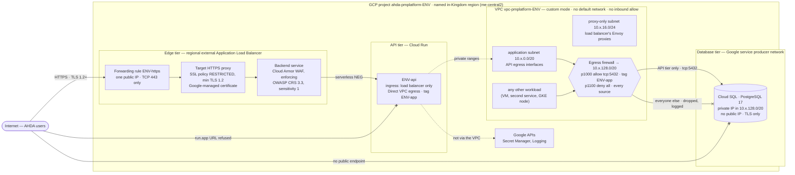

# Network security — WAF, load balancer and segmentation

| Field | Value |
| --- | --- |
| Task | TASK-021 — Configure Network Security: WAF, Load Balancer & Segmentation (P3 - Infrastructure & DevOps) |
| Depends on | TASK-017 — Infrastructure as Code (`docs/architecture/infrastructure-as-code.md`, BUILT — NOT APPLIED) |
| Record date | 2026-09-25 |
| Status | **BUILT — NOT APPLIED.** The segmentation, ingress, TLS and WAF configuration is written, formatted, schema-validated, planned end to end in all four environments against a placeholder manifest, and scanned with zero HIGH/CRITICAL findings. The verification script that performs the validation cell was exercised end to end against stand-ins: 35 cases, 35 correct. **The validation cell itself — the external scan and the database probe — has not run, because no environment exists** (§4.4) |
| Branch | `infra/task-021-network-security-segmentation` |
| Deliverables | Network, WAF and security-group IaC: `infra/terraform/network/` (firewall rules, the private services range the database is pinned to) and `infra/terraform/load-balancer/` (single 443 listener, RESTRICTED TLS policy, enforcing WAF); three folder policies in `infra/environments/apply-org-policy.sh`; `infra/terraform/network/verify-network-security.sh` — the validation cell, scripted; `docs/architecture/network-security-check.py` wired into `repo-checks`; **the network diagram, §3.1**; this record |
| Environment variables / secrets | None. The workbook cell reads "None (network topology, not application secrets)", and nothing here reads, writes or holds one |
| Implements | CTL-03 (segmentation, least privilege between tiers), CTL-04 (HTTPS-only, in-region ingress), control matrix gap G-7 (WAF rule baseline); ADR-001 §7 C-2 |
| Workbook read | Google Sheet "Implementation work" (ID `1JQdbw-S9wAS247cP3PpSCme_D2NAPVnWzhXhvvxrtl0`), Implementation Plan row TASK-021, read 2026-09-25 from the sheet's CSV export |
| Controlled sources and authority order | per TASK-001 |

## 1. What this record is

TASK-021's acceptance criteria are four properties of a running environment:

1. only the API tier can reach the database tier on its port;
2. the database has no public endpoint;
3. all inbound traffic terminates TLS 1.2+ at the load balancer/WAF;
4. a port scan from outside the network confirms no unintended open ports.

Its validation cell turns 1 and 4 into two experiments: *run an external port scan and confirm
only 443 is reachable; attempt a direct connection to the database port from outside the API
tier's security group and confirm it is blocked.*

TASK-017 had already authored the network and load-balancer modules, and left the security
configuration in them to this task — the firewall "tunes from evidence", the WAF sat in preview
"until TASK-021", and the rule baseline was recorded as control matrix gap G-7. So this task started
from working modules, not an empty directory. Reading them against the four criteria found three
places where they did not yet hold:

- **"Only the API tier" was enforced for the API tier, not for everyone else.** The firewall
  restricted what the API tier's tag may send. Nothing restricted what any *other* source in the VPC
  may send, and GCP's implied rule allows all egress. The database sits in Google's service producer
  network, where a consumer cannot write an ingress rule, so the only place to say "nobody else" is
  at the source — and nothing said it (§3.2).
- **Port 80 was open.** It only redirected to 443, but the validation cell asks for a scan on which
  *only 443* is reachable, and a listener that answers in plaintext is an open port however little
  it says (§3.3).
- **The WAF blocked nothing.** Every rule was in preview in every environment (§3.4).

## 2. The gate

TASK-021's Gate Decision cell:

> UNBLOCKED by ADR-001. In-Kingdom edge and load balancing.

| Item | State | Effect here |
| --- | --- | --- |
| ADR-001 (GCP, in-Kingdom) | Approved at the AHDA gate, 19 Sep 2026 | The WAF is Cloud Armor, the "e.g." the task names; no on-premises equivalent is in play |
| ADR-001 §7 C-2 — TLS terminates in the Kingdom | Constraint | Every ingress resource is regional; NS-3 fails the pull request on a global load balancer, proxy, URL map, backend service, security policy or SSL policy |
| CTL-54 — the regional load balancer/WAF pairing confirmed available in the named region | **Outstanding** with UGV-07 | Finding N-F3 |
| ADR-001 R-1, R-2, R-3 | Outstanding | No apply is possible in this task or any other; TASK-017's preflight guards refuse the plan first |
| G-7 — WAF rule baseline and tuning | "Engineering value, not an AHDA value; TASK-021 records the baseline" | §3.4 is that record |

## 3. What was built

### 3.1 The network diagram

One environment. All four are identical in shape; only the `10.x` address plan differs
(DEV 10.10, SIT 10.20, UAT 10.30, PROD 10.40), and no two environments share a network, a route or
a peering (TASK-016 §3.1, CTL-02).

Firewall rules on `vpc-pmplatform-<env>` — the "security groups" of this architecture. GCP firewall
rules attach to the VPC, not to the managed database, so the database tier is protected at the
source: by what may *leave* for its range.

| Priority | Rule | Direction | Applies to | Destination / source | Action | Logged |
| --- | --- | --- | --- | --- | --- | --- |
| 1000 | `allow-app-egress-to-database` | egress | tag `<prefix>-<env>-app` — the API tier | `10.x.128.0/20` tcp:5432 | allow | — |
| 1100 | `deny-egress-to-database` (TASK-021) | egress | **every instance** | `10.x.128.0/20`, all protocols | deny | yes |
| 65534 | `deny-app-egress` | egress | tag `<prefix>-<env>-app` | `0.0.0.0/0`, all protocols | deny | yes |
| 65535 | `deny-all-ingress` | ingress | every instance | from `0.0.0.0/0`, all protocols | deny | yes |

There is no ingress allow rule. The API's egress to Google APIs does not traverse the VPC
(`PRIVATE_RANGES_ONLY`), so the p65534 deny does not cut Secret Manager or logging.

| Tier | What reaches it | What it reaches | Enforced by |
| --- | --- | --- | --- |
| Edge | The internet, on TCP 443 only | The API tier, through a serverless network endpoint group | One forwarding rule (NS-2); SSL policy and WAF on the proxy and backend (NS-4, NS-5) |
| API | The edge tier only | The database on 5432; Google APIs directly, not via the VPC | Cloud Run ingress `INTERNAL_LOAD_BALANCER` (NS-8); the p1000 allow and p65534 deny, both scoped to its tag |
| Database | The API tier only, on 5432 only | Nothing | No public IP (DB-2, `sql.restrictPublicIp`); the p1000 allow scoped to the API tag and the p1100 deny scoped to everyone (NS-6); pinned to the range those rules name (NS-7) |

### 3.2 Segmentation: only the API tier reaches the database

**The gap.** A Cloud SQL instance with a private IP lives in Google's service producer network,
peered to the environment's VPC through private services access. No consumer firewall rule can be
attached to it — there is no "database security group" to write an ingress rule on. What TASK-017
wrote was the API tier's half: its tag may send TCP 5432 to the private services range and nothing
else (p1000 allow, p65534 deny). Every other source in the VPC fell through to GCP's implied
allow-egress rule. Today there is no other source, so the gap is latent; the first VM, second Cloud
Run service or GKE node added to the VPC would have reached 5432 with nothing in the configuration
saying otherwise.

**The rule.** `deny_egress_to_database` in `network/main.tf`: egress, **no target** (every instance
in the VPC), destination the private services range, all protocols, priority 1100, logged. Priority
1100 sits below the API tier's allow at 1000, so the API tag is matched first and everything else is
dropped. This is the least-privilege statement the task asks for, written the only way GCP allows it
to be written for a managed database.

**The range the rule names is the database's range.** The instance used to take its address from
whichever range the peering offered; it is now pinned with `allocated_ip_range` to the network
module's private services range. Today that is the only range, so this changes nothing; it is what
keeps the firewall's destination equal to the database tier when a second producer service is added
with its own range.

**Three things are now impossible rather than absent.** `apply-org-policy.sh` binds three more
constraints to both folders, so the posture does not depend on nobody clicking in the console:

| Constraint | What it prevents |
| --- | --- |
| `compute.skipDefaultNetworkCreation` | GCP creates a `default` VPC — with SSH and RDP open to `0.0.0.0/0` — the moment the Compute API is enabled on a project. Nothing in this repository deleted it. The constraint stops it existing; it takes effect for projects created after it is bound, which is every environment project, since `provision-environment.sh` runs after this script |
| `compute.vmExternalIpAccess` (deny all) | Any VM holding a public address — the most common unintended open port there is |
| `sql.restrictPublicIp` | A Cloud SQL public IP, whatever a future Terraform change says |

Unchanged and restated, because the criteria rest on them: the database has `ipv4_enabled = false`
and `ssl_mode = ENCRYPTED_ONLY` (TASK-020, DB-2); GCP's implied ingress deny is made explicit and
logged at p65535; there is no ingress allow rule at all, because nothing in this architecture
receives traffic on the VPC path — the load balancer reaches Cloud Run through a serverless endpoint
group, not through the VPC.

### 3.3 Ingress: 443 and nothing else

TASK-017 opened port 80 on the load balancer's address to redirect to 443. This task **closed it**:
the HTTP URL map, target proxy and forwarding rule are removed, and the address has exactly one
listener. The reasons, in order:

- the validation cell says *only 443 is reachable*, and the control matrix's CTL-03 evidence says
  the same. A redirect listener is reachable.
- a plaintext listener is where a first request — including one carrying a session cookie the
  browser was careless with — crosses the network unencrypted before being redirected.

The cost is that a user who types `http://` gets a refused connection instead of a redirect. HSTS
removes that for any browser that has visited once, and HSTS preload removes it entirely once AHDA's
domain is on the preload list. HSTS is CTL-12, added to every response by TASK-078 — **not yet
built**, so until it is, a typed `http://` address is refused on every visit. If
AHDA would rather keep the redirect, that is a change to the validation cell, not to this module —
finding N-F1.

The API's own `run.app` URL is the other way in, and it answers nothing from outside: Cloud Run
ingress is `INGRESS_TRAFFIC_INTERNAL_LOAD_BALANCER` (TASK-017), NS-8 fails the pull request if that
changes, and N-5 reads it from the running service.

### 3.4 The WAF rule baseline (control matrix G-7)

| Rule set | Sensitivity | Why it is in |
| --- | --- | --- |
| `sqli-v33-stable` | 1 | SQL injection. The data tier is PostgreSQL |
| `xss-v33-stable` | 1 | Cross-site scripting. The SPA and the API share one origin (TASK-016 D-1) |
| `lfi-v33-stable` | 1 | Local file inclusion — path traversal in document and attachment endpoints (WF-12) |
| `rfi-v33-stable` | 1 | Remote file inclusion |
| `rce-v33-stable` | 1 | Remote code execution — shell and command injection |
| `scannerdetection-v33-stable` | 1 | Known scanner user agents and signatures |
| `protocolattack-v33-stable` | 1 | Request smuggling, response splitting, header injection |
| `sessionfixation-v33-stable` | 1 | Session fixation |

| Rule set | Why it is out |
| --- | --- |
| `methodenforcement-v33-stable` | At sensitivity 1 it admits only GET, HEAD, POST and OPTIONS. The API uses PUT, PATCH and DELETE (`api-conventions.md`), so enabling it would block the application's own writes. NS-5 fails the pull request if it is added |
| `php-`, `java-`, `nodejs-`, `cve-canary` | Signatures for runtimes the platform does not run (ASP.NET Core API, static React SPA — ADR-002). They add false-positive surface and no protection |

**Sensitivity 1** is Cloud Armor's lowest-false-positive tier and the level Google's guidance
starts from. Higher sensitivities add paranoia-level signatures that need tuning against real traffic,
which does not exist yet.

**Enforcing in all four environments**, not preview. TASK-017 set preview everywhere so that a rule
set turned straight to enforcing could not take a working application off the air on its first day.
The reasoning holds for PROD and inverts for everything before it: a WAF in preview in DEV, SIT and
UAT means every false positive stays invisible until the day PROD is switched to enforcing — which
is precisely the first-day outage preview was meant to prevent. Enforcing from DEV onward makes a
false positive a failed test in SIT, with the request, the rule and the signature ID in the load
balancer's log, weeks before anyone is using PROD. `waf_preview` now defaults to false everywhere,
all four `terraform.tfvars` set it false, and NS-5 fails the pull request if any root sets it true.

**Handling a false positive.** The load balancer logs every request at 100% sampling with its
verdict — the Cloud Armor rule that matched and, for a preconfigured rule, the signature ID:

1. find the request and the signature ID that matched it in the load balancer log;
2. confirm the request is legitimate application behaviour, not a finding in the application;
3. exclude **that signature, for that request field, on that path** — a scoped exclusion on the rule
   (`preconfigured_waf_config`), or a higher-priority allow rule whose match names the path — and
   never lower a whole rule set to preview or drop its sensitivity;
4. record the exclusion and the reason in this section, in the same pull request.

Turning the whole WAF to preview in an environment is possible, deliberately loud, and a two-file
change: the root's `terraform.tfvars` and NS-5, both reviewed. That is the right cost for switching
off the control CTL-04 names.

Not in the baseline, and why — finding N-F4: **rate limiting at the edge.** Regional Cloud Armor
supports rate-based rules, but a per-client-IP threshold is a number no one has derived, and AHDA's
users most likely reach the platform through a small number of corporate egress addresses — a
per-IP limit set without that knowledge is how a WAF blocks a whole ministry. Per-client limits on
authentication and sensitive endpoints are CTL-12, in the application, owned by TASK-078.

### 3.5 TLS

The SSL policy's profile is now **`RESTRICTED`**, not `MODERN`, with the minimum still TLS 1.2. At
TLS 1.2, `MODERN` also offers AES-CBC suites with SHA-1 MACs (for example
`ECDHE-RSA-AES128-SHA`), which every TLS scanner reports as weak; `RESTRICTED` leaves only AEAD
suites (AES-GCM, ChaCha20-Poly1305) with forward secrecy, which every browser from the last several
years offers. TLS 1.3 is unaffected. `min_tls_version` remains validated to `TLS_1_2` or `TLS_1_3`,
and NS-4 fails the pull request if the validation, the profile or the policy's attachment to the
proxy is removed.

TLS terminates at the regional proxy in the named region: every ingress resource is regional, the
certificate is a regional Certificate Manager certificate, and NS-3 fails the pull request on any
global counterpart (ADR-001 C-2, CTL-04).

### 3.6 What differs between environments

Nothing. The firewall, the TLS policy, the WAF baseline and its enforcement, the single listener
and the folder policies are identical in DEV, SIT, UAT and PROD. The only per-environment values in
this area remain TASK-017's address plan.

## 4. Verification

Everything below was executed on this branch with Terraform 1.16.3 — the version
`infra/terraform/.terraform-version` pins and CI runs — under `linux/amd64`, which is what CI runs
and what the committed lock files cover.

| | Check | Result |
| --- | --- | --- |
| 1 | `terraform fmt -check -recursive infra/terraform` | clean |
| 2 | `terraform init -lockfile=readonly` and `validate`, all four roots | 4/4 success |
| 3 | `terraform plan`, all four roots, before (branch `dev`) and after, placeholder manifest | Before: DEV **40**, SIT/UAT/PROD **49** — TASK-020's figures. After: DEV **38**, SIT/UAT/PROD **47** |
| 4 | Plan diff, by address and attribute | Exactly the intended change and nothing else: **removed** the HTTP forwarding rule, target proxy and URL map; **added** `deny_egress_to_database`; **changed** the SSL policy profile `MODERN → RESTRICTED`, all eight WAF rules `preview true → false`, and the instance's `allocated_ip_range` `null → vpc-pmplatform-<env>-private-services` |
| 5 | Two consecutive SIT plans through `compare-plans.py` | **identical — after fixing a defect in the comparator** (§4.1) |
| 6 | Trivy 0.74.0 config scan, `infra/terraform` | **zero HIGH, zero CRITICAL.** The same two LOW rules TASK-017 recorded (GCP-0075, false positive on the proxy-only subnet; GCP-0066, CMEK on buckets — F-6), and nothing new |
| 7 | `network-security-check.py`, mutation test | **20 mutations, 20 caught**; the unmutated tree passes (§4.2) |
| 8 | `verify-network-security.sh`, end to end against stand-ins | **35 cases, 35 correct** (§4.3) |
| 9 | `verify-network-security.sh sit --dry-run --scan --probe` | prints every read, the scan commands, and the probe's create and delete calls |
| 10 | `apply-org-policy.sh --dry-run`, before and after, placeholder organisation | the `gcp.resourceLocations` output is byte-identical; the three new policies are emitted per folder |
| 11 | shellcheck on the two changed shell scripts | clean apart from SC1091 (info): the sourced helper is resolved at run time |
| 12 | All ten `repo-checks` scripts, this task's included | all pass |

### 4.1 A defect in `compare-plans.py`, found and fixed

Row 5 first reported *"the two plans differ in: planned_values"* on two SIT plans with nothing
changed between them. The content was identical: sorted by address, the two `planned_values` hash
to the same SHA-256. What differed was the order of `child_modules` — the first plan listed
storage, network, load balancer, database, compute; the second network, storage, database, load
balancer, compute. Terraform emits that list in map-iteration order, exactly as it does
`relevant_attributes`, which the comparator already treated as a set.

It passed for TASK-017 and TASK-020 because their two runs happened to come out in the same order —
which is also what happened on a re-run of `dev` today. On the day an environment exists, V-4 of
`verify-idempotency.sh` would have reported non-idempotency at random. The comparator now orders
every `child_modules` list by address before comparing. Checked both ways: the reordered pair and
the baseline pair compare identical, a plan differing only in `timestamp` compares identical, and a
dropped nested resource, an altered nested value and a dropped resource change are each still
reported.

### 4.2 Mutation test

Each mutation was applied to a copy of the repository, `network-security-check.py` run, and the copy
discarded. The first run caught 18 of 20; the two misses are recorded because one was a real defect.

| | Mutation | Caught by |
| --- | --- | --- |
| M1 | a second forwarding rule, on port 80 | NS-2 |
| M2 | the listener widened to `443-444` | NS-2 |
| M3 | a global SSL policy added | NS-3 |
| M4 | SSL profile back to `MODERN` | NS-4 |
| M5 | `min_tls_version` defaulted to `TLS_1_0` | NS-4 |
| M6 | the TLS version validation neutralised | NS-4 |
| M7 | the WAF detached from the backend service | NS-5 |
| M8 | PROD's WAF put in preview | NS-5 |
| M9 | `waf_preview` defaulted to true in the module | NS-5 |
| M10 | `methodenforcement` added to the baseline | NS-5 |
| M11 | the explicit ingress deny turned into an allow | NS-6 |
| M12 | the database allow's tag scope removed | NS-6 |
| M13 | the database allow widened to every port | NS-6 |
| M14 | the database deny scoped to a tag, so it no longer covers everyone | NS-6 |
| M15 | the database deny moved above the API tier's allow | NS-6 |
| M16 | the database's `allocated_ip_range` removed | NS-7 |
| M17 | Cloud Run ingress opened to all | NS-8 |
| M18 | the API tier given a different tag from the one the firewall names | NS-8 — **missed on the first run.** The pattern `network_tag = local.app_network_tag` also matched inside the `app_network_tag = …` line; both patterns are now anchored to the start of the line |
| M19 | `sql.restrictPublicIp` dropped from the folder policies | NS-9 |
| M20 | N-9 documented in the verification script's header and removed from its body | NS-10 — on the first run the mutation removed one comment and left the implementation, so the check was right to pass; the mutation was corrected |

### 4.3 The verification script, exercised

The validation cell's two experiments can only be performed against a real environment, and a check
that has never run is a claim rather than a control. So the script was driven end to end before any
environment exists, with only `gcloud` replaced:

- **N-1 to N-5** read `gcloud` output shaped as this Terraform's resources return it, with one
  control broken per case.
- **N-6 to N-8** ran the real `nmap`, `openssl` and `curl` against real nginx TLS servers standing in
  for the load balancer — one configured as it is (443 only, TLS 1.2/1.3, AEAD suites only, a
  SQL-injection signature returning 403) and one per broken control.
- **N-9** ran the real startup script the script generates, against a real listener on 5432, with
  the firewall emulated by an actual `iptables` egress DROP — which is what a GCP egress deny does:
  the packet is discarded, and the connect times out.

| | Case | Result |
| --- | --- | --- |
| G0 | everything correct, `--scan --probe` | **exit 0**. TLS 1.0 and 1.1 refused *by the server* (`tlsv1 alert protocol version`, alert 70, not a client-side refusal); only 443 open on a 65,535-port scan; the SQL-injection probe 403 and the ordinary request 200; the tagged probe connected and the untagged one was dropped; both probe VMs deleted |
| G1 | everything correct, no flags | exit 0, and says the scan and the probe were **not run** |
| C1–C4 | public IP on; authorised networks; no pinned range; a non-private address | N-1 |
| C5–C12 | an ingress allow; the database allow unscoped; widened to every port; the database deny deleted; disabled; placed above the allow; unlogged; an egress allow evaluated ahead of it | N-2 |
| C13–C16 | a `default` network; a second public address; a port-80 listener; a VM with a public IP | N-3 |
| C17–C21 | TLS 1.0 minimum; `MODERN`; no SSL policy on the proxy; no WAF on the backend; a WAF rule in preview | N-4 |
| C22–C23 | Cloud Run ingress `all`; the API interface without the tag | N-5 |
| S1 | port 80 listening beside 443 | N-6 — *found open: 80 443* |
| S2 | a host with nothing listening | N-6 — **nothing proved**, not a pass |
| S3–S4 | TLS 1.0 accepted; a CBC suite accepted | N-7 |
| S5 | no WAF | N-8 — probe returned 200 |
| S6 | a "WAF" that blocks everything | N-8 — **nothing proved**: a 403 means nothing if an ordinary request also gets one |
| P1 | the firewall open to untagged hosts | N-9 — *CONNECTED* |
| P2 | the firewall closed to the API tier too | N-9 — the positive control failed, so the untagged result proves nothing |
| P3 | the database not listening | N-9 — a reset means the packet *reached* the database tier |
| P4 | a probe VM that never reports | N-9 — **nothing proved** |

After every `--probe` case the harness confirmed the delete call was made. The one branch not driven
is N-7's *untested* outcome — an OpenSSL build that cannot offer TLS 1.0 at all; it is classified
as a failure ("nothing was proved"), never a pass.

### 4.4 What could not be executed, and what it leaves owed

**The validation cell has not been run, because there is nothing to run it against.** No project
exists, no Terraform state exists anywhere in the repository, and the plan refuses at TASK-017's
preflight guards until R-1, R-2 and R-3 close. What §4.3 proves is that the script performing the
cell is correct; it does not prove the cell.

| Owed | Why it cannot run today | Command, at the first apply |
| --- | --- | --- |
| **External port scan: only 443 reachable** | No public address exists. Must run from **outside** the network | `verify-network-security.sh <env> --scan` from a laptop or CI runner on the internet |
| **Direct connection to the database port from outside the API tier: blocked** | No VPC or database exists. Needs rights to create and delete two VMs | `verify-network-security.sh <env> --probe` |
| The running configuration (N-1 to N-5) | No environment | `verify-network-security.sh <env>` |
| TLS 1.2+ observed at the load balancer | The certificate needs AHDA's DNS zone (TASK-017 F-2) before a handshake is possible | `--scan`, N-7 |

## 5. Acceptance criteria

| # | Criterion | Status |
| --- | --- | --- |
| 1 | Only the API tier can reach the database tier on its port | **BUILT, NOT OBSERVED.** Allow at p1000 scoped to the API tier's tag and tcp:5432; deny at p1100 for every other source, logged; the database pinned to the range both rules name. NS-6 and NS-7 fail the pull request on any regression. The probe (N-9) was proved correct against an emulated firewall in both directions, with a positive control; it has not run against a VPC because none exists. |
| 2 | The database has no public endpoint | **MET in configuration.** `ipv4_enabled = false` (TASK-020, DB-2), no authorised networks, and `sql.restrictPublicIp` bound to both folders so no future change can add one. N-1 reads it from the running instance at the first apply. |
| 3 | All inbound traffic terminates TLS 1.2+ at the load balancer/WAF | **MET in configuration.** One listener, HTTPS on 443; SSL policy `RESTRICTED`, minimum TLS 1.2, validated; regional proxy in the named region; the WAF attached and enforcing. N-4 reads it and N-7 performs the handshakes at the first apply. |
| 4 | A port scan from outside the network confirms no unintended open ports | **BUILT, NOT OBSERVED.** The one address has one listener, and three folder policies make a default network, a public VM and a public database impossible. N-6 scans all 65,535 TCP ports and was proved to detect a second open port and to refuse an empty result as a pass; it has not run against the environment because none exists. |
| — | Validation cell: external scan shows only 443; direct database connection from outside the API tier blocked | **SCRIPTED, NOT RUN** — §4.4. Both exit non-zero rather than pass when they cannot prove anything. |
| — | Deliverable: network diagram | **MET** — §3.1. |

## 6. Findings and open items

| ID | Finding | Owner / where it goes |
| --- | --- | --- |
| **N-F1** | **Port 80 is closed, so `http://` is refused rather than redirected** (§3.3). This follows the validation cell literally. HSTS (TASK-078, not yet built) removes the effect for returning browsers and preload removes it for everyone; until TASK-078 lands, every typed `http://` is refused. If AHDA prefers a redirect, the validation cell and CTL-03's evidence line change first ("only 443 and a redirect-only 80"), and then this module — not the other way round. | AHDA IT (preference); TASK-078 (HSTS, preload) |
| **N-F2** | **The APIs this network needs are not enabled anywhere.** Restating TASK-020's D-1 with this task's list: `compute`, `servicenetworking` and `certificatemanager`. It surfaces at the first apply as an API error. **Recommended, unchanged: one `gcloud services enable` step in `provision-environment.sh` with the platform's full list.** | TASK-016 (the script), TASK-017 (the list) |
| **N-F3** | **Regional Cloud Armor and the `RESTRICTED` regional SSL policy are not yet confirmed available in the named region.** CTL-54 requires the regional load balancer/WAF pairing to be confirmed before the region is fixed; it is on the ADR-001 confirmation request. If regional Cloud Armor is unavailable there, ADR-001 C-2 rules out the global alternative, so the answer is a different WAF in front of the regional load balancer — a design change, not a variable. | AHDA IT — with UGV-07, CTL-54 |
| **N-F4** | **No rate limiting at the edge** (§3.4). A per-IP threshold set without knowing AHDA's egress addresses risks blocking AHDA itself. Per-client limits on authentication and sensitive endpoints are CTL-12, in the application. **Recommended: revisit with a month of PROD load balancer logs, which show real per-address request rates.** | TASK-078; revisit after go-live |
| **N-F5** | **The probe needs rights and images an organisation might restrict.** `--probe` creates two `e2-micro` VMs from `debian-cloud` with no public IP, no service account and Shielded VM secure boot. An organisation enforcing `constraints/compute.trustedImageProjects` without `debian-cloud` will refuse them. The fallback is the same startup script on any image AHDA trusts; the classification logic is unchanged. | AHDA IT — with UGV-07 (organisation policy set) |
| **N-F6** | **TASK-017's F-8 (no fixed egress address) and F-4 (`allUsers` invoker) are unchanged.** F-8 is still not needed until an integration counterparty allowlists source addresses. F-4 is still safe because ingress is restricted to the load balancer — which N-5 now verifies on the running service — and still needs an answer with the tenancy (R-3). | As in `infrastructure-as-code.md` |
| **N-F7** | **`compare-plans.py` compared `child_modules` in emission order** (§4.1), so TASK-017's V-4 would have reported non-idempotency at random against an unchanged environment. Fixed here, in TASK-017's file, because this task's verification depends on it. | Closed — TASK-021 |

## 7. Change log

| Date | Change | By |
| --- | --- | --- |
| 2026-09-25 | Initial record. The database range denied to every VPC source but the API tier, and the instance pinned to that range; port 80 closed so 443 is the only listener; SSL profile `RESTRICTED`; the WAF baseline recorded (G-7) and switched to enforcing in all four environments; three folder policies (default network, VM public IPs, Cloud SQL public IPs). `verify-network-security.sh` (N-1 to N-9, including the external scan and the in-VPC probe) and `network-security-check.py` (NS-1 to NS-10, wired into `repo-checks`) written. Verified: plans before and after in four environments, 20/20 mutations, 35/35 end-to-end cases, zero HIGH/CRITICAL. A defect in `compare-plans.py` found and fixed. Seven findings registered. | Infrastructure (TASK-021) |
