# Reports, Filters & Export Service (FG-02 Backend)

| Field | Value |
| --- | --- |
| Task | TASK-071 — Build Reports, Filters & Export Service (FG-02 Backend) (P12 - Management Intelligence (FG-01/02)) |
| Depends on | TASK-069 — Build Dashboard Projection & Definition Service (`dashboards.md`): FG-01's projection register, each projection's source adapter and `ProjectionMeta` (R-20(c)), read through ADR-003 §8.2 edge 30. Also TASK-034 (`master-data-configuration.md`): the `REPORT_RULES` family and `ReportAllowlistEntry` the SCR-138 allowlist is configured in, and the governed lifecycle ADM-037 reuses; TASK-030 (`authorization-engine.md`): `RecordScope`, field masks and R-47; TASK-063 (`closure.md`): the closeout readers the five new projections count through |
| Record date | 2026-10-10 |
| Status | **BUILT AND VERIFIED LOCALLY** against `AHDA-postgres` and `AHDA-ldap`, in process through the real API pipeline and over HTTP against this branch's images (§8). In a real environment the ten reports are seeded PUBLISHED; **the SCR-138 allowlist is seeded as a DRAFT proposal and the explorer answers 422 `CONFIGURATION_MISSING` until AHDA publishes a `REPORT_RULES` version** (F-5), and **AHDA's internal roles hold no export grant until Blueprint Appendix A** (F-3) |
| Branch | `feat/task-071-fg02-reports-export-backend` |
| Directory | `src/backend/PMPlatform.Application/Features/Reports` |
| Deliverables | **FG-02 report definition/job engine**: `IReportDefinitionService` (ADM-037's draft, edit, validate, publish, retire), `IReportService` (the catalogue, a report's view, its synchronous run and its export request), `IReportJobService` (the requester's jobs, cancel, download), `ISavedViewService`, and `IReportMaintenance` — the job runner `ReportJobWorker` drives through REQUESTED → VALIDATING → QUEUED → RUNNING → COMPLETED / FAILED / CANCELLED / EXPIRED. **PDF/XLSX/CSV export generators**: `PdfReportRenderer` (a PDF 1.7 writer with an embedded, subset DejaVu Sans, Arabic shaping and right-to-left layout), `XlsxReportRenderer` (OOXML, typed numbers, no formulas) and `CsvReportRenderer` (RFC 4180, UTF-8 with BOM), all behind `IReportRenderer`, with `SpreadsheetSafety` against formula injection. **Allowlisted query builder**: `ReportQueryBuilder` — a report's request and an SCR-138 composition become a `ReportPlan` of registered fields only, every explorer field and join checked against the PUBLISHED `REPORT_RULES` allowlist before anything is read. Supporting: the `reports` schema (13 tables, three migrations), FG-01's `IProjectionRowReader` and five new projections (edges 48–52), the seeded catalogue and allowlist proposal, `REPORT_EXPORT`, six controllers (24 operations), a CI step |
| Environment variables / secrets | None. `Reports:Jobs` (`PollInterval` 15 s, `BatchSize` 10, `OutputLifetime` 1 day, `MaxExportRows` 10,000, `AbandonAfter` 15 min) has defaults in code; each is a TBC-RPT value (F-6) |
| Gate decision applied | **"FIXED at 10 reports (ADR-006). Export formats PDF, XLSX, CSV only (ADR-005) and do not multiply the report count. Sensitive financial fields masked in exports (ADR-010)."** — D-2 and D-12 (ten PUBLISHED reports, an eleventh code refused by the schema), D-9 (three formats, one job each, the same report), D-6 (financial amounts masked for an external caller, authorised on `FINANCIAL_VIEW` and its field mask for everyone, and an output that reveals one classified SENSITIVE) |
| Participation amendment | **ADR-013**: an entity's person runs and exports the entity report set — Project Register, Project Report, Progress Reporting, Published Progress History, Financial Performance, KPI Performance — on its own projects, with financial amounts masked and no other entity's data (D-6). **ADR-006 MAPPED**: ten report definitions absorb FG-02 §5.1's catalogue as parameters, options, scopes and audiences; RPT-DOC-001 is served by WF-12's document register; RPT-EXC-001 and RPT-AUD-001 remain Conditional (D-2). **ADR-019**: the ten published reports plus the SCR-138 Controlled Explorer with saved views for R02, R03 and R07, on allowlisted columns, filters and parameters only (D-8, D-10). ADR-019 is not in the repository's ADR register (F-2) |
| Sources read | The TASK-071 row as supplied on 2026-10-10 (description, acceptance criteria, directory, deliverables, participation amendment, gate decision), checked against the workbook's Implementation Plan row (branch, validation checks). The **FG-02 Reports, Filters & Export Functional Specification v1.0** (`Project Files.zip`), read whole: §1–§30. ADR-005, ADR-006, ADR-010, ADR-012, ADR-013 (`adrs/ADR-register.md`); `step-14b-rtm-findings-closure.md` F-02 (TASK-002's count: 3 dashboards, 10 reports); ERD §5.20, F-075–F-078, F-098; `solution-architecture.md` §8.2 edge 30; `api-conventions.md` R-6 to R-8, R-16, R-20, R-21, R-27 to R-30, R-35, R-37, R-40, R-47; `authorization-engine.md` D-9, F-8; `dashboards.md` D-3 to D-7; `master-data-configuration.md` (REPORT_RULES); `indexing-strategy.md` I-52, I-53 |

## 1. Scope

| | Subject | Owner |
| --- | --- | --- |
| **In** | Governed report definitions DRAFT → VALIDATED → PUBLISHED → RETIRED (ADM-037's backend), the catalogue fixed at ADR-006's ten | This task |
| **In** | Running a report on screen, paged, with every cell's freshness and as-of and every source's R-20(c) metadata; parameters that narrow and never widen | This task |
| **In** | The SCR-138 Controlled Explorer over the PUBLISHED `REPORT_RULES` allowlist; private saved views of a report's parameters or an explorer composition | This task |
| **In** | Report jobs and their lifecycle, PDF/XLSX/CSV generation, secured outputs authorised again at download, expiry and purge | This task |
| **In** | Five projections over WF-04, WF-05, WF-07, WF-08 and WF-09, registered in FG-01's register for reports (edges 48–52) | This task |
| **Out** | The report screens SCR-130 to SCR-140, MOD-060 to MOD-062 | TASK-072 |
| **Out** | Shared and team saved views (`saved_view_share`) | TASK-112 (TBC-RPT-20) |
| **Out** | Scheduled reports, formal report snapshots retained in WF-12, version preview, comparison and impact, retry, download tokens, operational job search and metrics (RPT-API-012, -014, -025 to -034, -040 to -042, -049, -050, -052, -053) | Later tasks (F-7) |
| **Out** | Per-record detail listings (the rows of a risk, task, milestone, issue or change register) and the WF-10 obligations, WF-11 approvals and WF-13 requests of the Governance and Change report | Later tasks: each needs a detail reader in its module and an ADR-003 edge (F-8) |
| **Out** | Which internal roles may export | Blueprint Appendix A (F-3) |

## 2. Decisions

| # | Decision | Source |
| --- | --- | --- |
| D-1 | **Module shape.** `Features/Reports`: `Contracts` (the five service interfaces, views, inputs and pages, `ReportErrorCodes` and `ReportIssueCodes`, `Events`), the services (`ReportService`, `ReportExplorerService`, `ReportJobService`, `SavedViewService`, `ReportDefinitionService`, `ReportMaintenance`), the engine (`ReportQueryBuilder` → `ReportPlan`; `ReportExecutor` → `ReportExecution`; `ReportValues` for filters and sorts; `ReportDocumentBuilder` → `ReportDocument`), the authorisation pieces (`ReportAccess`, `ReportJobAuthorization`, `ReportFootprint`), `ReportCatalogue` (what is fixed by decision), `ReportFields` (the register as report fields), `ReportDefinitionRules` (ADM-037's validation), `ReportAudit` and the repository port. Entities in `Domain/Reports`; repository, twelve configurations, the renderers, the worker and its options in Infrastructure | ADR-003 §4.3; M-10 |
| D-2 | **Ten reports carry FG-02 §5.1's catalogue** (ADR-006: modes, scopes and audiences are parameters, not reports). Each of the twenty-three delivered entries is absorbed once — whole, as an audience rendering, or as an OPTION whose `catalogue_entry_reference` names it (§3). RPT-DOC-001 is WF-12's document register; RPT-EXC-001 and RPT-AUD-001 stay Conditional; no report is made for them. A report's code is one of the ten by the table's CHECK. `ReportCatalogue.CatalogueEntries` is the mapping in code, and the unit tests hold it to 23 + 3 = 26 entries, each once | ADR-006 MAPPED; FG-02 §5.1, §5.2; participation amendment |
| D-3 | **A report reads FG-01's register, nothing else** (edge 30). Dashboards gains `IProjectionRowReader` (`ProjectionRowReader`): for a base projection and a set of columns, one row per project the caller's `RecordScope` reaches under the base projection's permission (and, for an export, `REPORT_EXPORT` too), or one per published snapshot for the history projection; each cell read through the same adapter, the same per-projection permission and DATA_CLASSIFICATION clearance (`RecordScope.Matches`) and the same field mask a widget uses; each source observed once per run, its failure isolated to its cells (SOURCE_UNAVAILABLE). A report never recomputes a source-owned value: every column is a registered field of a registered projection — a state, a count, a percentage, days, SAR — and the projections now list their fields (code, type, sensitivity). The row's identity columns (Formal Project ID, title, department, delivering entity) are shown for a project the base permission reaches; department and entity names come from IdentityAccess's `IOrganizationDirectory.ListNamesAsync` | BR-RPT-001 to -006; FG-02 §4.1; `dashboards.md` D-4, D-6 |
| D-4 | **Five projections are added for reports** (edges 48–52, Dashboards → ProjectTask, Milestone, ManagementConcern, ChangeRequest, Suspension): open tasks, open milestone achievement claims, open issues and challenges, change requests undecided / approved and not started / in implementation, and open suspension and resumption requests, per project. Each is a count the source module already computes for WF-10's readiness (its closeout reader), registered with its source's view permission; none authorises anyone and none of those modules calls Dashboards. They give the Schedule and Delivery, Risks and Issues, Governance and Change, and Project reports their WF-04/05/07/08/09 content without a source being read twice | FG-02 §12; ADR-003 §8.2 |
| D-5 | **Missing is never zero, stale is never current** (FG-02 §7.1). A cell carries `value`, `freshness` (FRESH, STALE, UNKNOWN), its own `asOf` and, when UNKNOWN, `unknownReason` — MISSING, NOT_APPLICABLE, RESTRICTED or SOURCE_UNAVAILABLE — with no value. A STALE value keeps its value and its own as-of (BR-RPT-020). Every result section carries the projection's `ProjectionMeta` (semantic state, freshness, least-current as-of, coverage). In a file, a cell without a value is its reason in words (PDF, XLSX) or its code (CSV), never empty and never 0, and stale values are listed per row ("STALE: …") and noted. A historical report's rows are the source's own snapshots, oldest first, never rebuilt from current data (BR-RPT-029) | FG-02 §7, BR-RPT-019, -020, -029 |
| D-6 | **Authorisation is the data's, at every step** (FG-02 §8). A role selects a report and grants nothing: the catalogue is the PUBLISHED reports whose audience holds one of the caller's roles; then rows and cells are authorised as D-3 says. Parameters only narrow: a DEPARTMENT or PROJECT value is checked against the population the caller may see, and one they may not know — or one that does not exist — is 422 `REPORT_PARAMETER_UNAUTHORIZED`, never a hint (BR-RPT-010). A filter matches only a value the caller is shown, so a restricted value cannot be probed (`ReportValues.Matches`). **ADR-013**: an external entity's person — R08, or an entity Project Manager in R04 — runs the entity set only (`ReportCatalogue.MayRun`), sees its own entity's projects only (the ENTITY scope), and every sensitive (SAR) field is masked for it whatever it holds. **ADR-010**: SAR amounts are `FINANCIAL_VIEW`'s and WF-14's audience mask's for everyone; a run that reveals one is audited (`Reports.SensitiveReportExecuted`, RPT-EVT-003) and an output that reveals one is SENSITIVE | FG-02 §8, BR-RPT-007 to -013; ADR-010, ADR-013 |
| D-7 | **Export is its own permission, and a download is authorised again** (acceptance criterion 2). `REPORT_EXPORT` (Read, group REPORTS) is required to request a job and is a row permission of the job's run: its rows are the projects the requester reaches under it as well as under each projection's own. The job is authorised when requested, again when it runs (a requester who lost the permission or the report gets FAILED with its code and no file), and again at every download: the job's plan is re-run for its requester as they are now — filters and narrowing parameters removed, ineligible projects included — and the download is allowed only if every project the output holds is still reached and no value it revealed is now RESTRICTED or masked (`ReportFootprint`, stored as `authorization_footprint`). Otherwise 403, audited `Reports.OutputAccessDenied`. A job and its output are the requester's alone: anyone else's is 404 (R-47). The bytes' SHA-256 is checked on every download | FG-02 §9.3, US-RPT-SYS-026, RPT-E035; workbook validation check 2 |
| D-8 | **SCR-138 is the allowlist and nothing else** (acceptance criterion 1). An explorer request names columns, filters and sorts by `sourceEntityCode` and `fieldCode`. `ReportQueryBuilder.ForExplorer` resolves each against the PUBLISHED `REPORT_RULES` version in force: a projection the allowlist does not name is `JOIN_NOT_ALLOWLISTED`, a field it does not name `FIELD_NOT_ALLOWLISTED`, a filter on a field it marks not filterable or a sort on one not sortable is refused, an operator the field's type does not take is refused — all 422 before any source is read. There is no SQL, join, formula or expression anywhere in the request or the configuration; the explorer's row basis is fixed (`PROJECT.LIFECYCLE_STATE`, every project the caller may see). A saved composition stores allowlist entry ids, so the database's foreign key refuses any other field. An entity's person is refused the explorer | FG-02 §11.3, BR-RPT-046; ADR-019 |
| D-9 | **ADR-005's three formats, generated asynchronously** (R-7). `POST …/export` validates the request, stores the job REQUESTED with its whole request pinned (`request_snapshot`), and answers 202 with `Location: /api/v1/report-jobs/{id}`; the same `Idempotency-Key` with the same request replays the job (`Idempotent-Replayed: true`), with another request is 422 `REPORT_DUPLICATE_REQUEST`. `ReportJobWorker` moves jobs one claimed step at a time, each in its own save, with a per-job catch so one failing job never stops the pass; a job left RUNNING past `AbandonAfter` is FAILED. The renderers lay out an already authorised, masked and worded `ReportDocument` and can neither add nor reveal a value: **CSV** RFC 4180, UTF-8 with BOM, source codes and exact decimals; **XLSX** inline strings, typed numbers with SAR, percent and integer formats, a Context sheet, right-to-left for Arabic, no formula; **PDF** A4 landscape, an embedded subset of DejaVu Sans 2.37 (Identity-H with ToUnicode, so text copies out; the font ships as an embedded resource under its Bitstream Vera/DejaVu licence, `Fonts/LICENSE-DejaVu.txt`, and adds no package), Arabic shaped into its joined forms and laid out right to left, the classification and page number on every page. Text a spreadsheet could run — first visible character `=`, `+`, `-`, `@` or their full-width forms, or a leading tab or carriage return — is written with a leading apostrophe (OWASP), counted and audited (BR-RPT-039). A format never makes another report | ADR-005; FG-02 §9.1, §9.2, §10.1; api-conventions R-7, R-8 |
| D-10 | **Saved views are private configuration** (MOD-062, SAV-001 to -012). A view is a report's parameter values or an SCR-138 composition, saved under `REPORT_COMPOSE` (R02, R03, R07, OWN; ADR-019). It holds no data: run, it is run for its owner as they may see now. Anyone else's view is 404, and their DELETE is 204 with nothing removed (R-40). A view is checked against the report version and the allowlist in force at every read and run: what no longer fits is listed (`compatibility: INCOMPATIBLE`, `issues[]`) and the run is 422 `REPORT_SAVED_VIEW_INCOMPATIBLE` — never silently reinterpreted (SAV-012). Sharing is TASK-112's | ADR-019; FG-02 §10.2, BR-RPT-031 to -034 |
| D-11 | **The database holds it, whoever writes** (migration 3, `TASK-071_GuardReports`). Report code within the ten; a definition born DRAFT (the seed alone ships PUBLISHED); code, number and author unchanged; lifecycle edges only; content (columns, audience, parameters, options) written only while DRAFT; never deleted or truncated; at commit one PUBLISHED version per code; one version on its way per code (partial unique index). A job is born REQUESTED and moves only along its lifecycle; an output exists only for a COMPLETED or EXPIRED job, and a PURGED output has no bytes; bytes are never updated. Codes are checked as codes, `primary_projection_code` as `<SOURCE>.<PROJECTION>`, the storage key as 32 hex characters and the file name as `[A-Za-z0-9_-]+.(pdf\|xlsx\|csv)`, so no column can hold an expression or a path | FG-02 §11.1; ERD D-3 |
| D-12 | **The catalogue and the allowlist proposal are seeded** (`seed-master-data.sql` §7, §8). The ten reports as PUBLISHED version 1 by the seed principal, with 66 audience rows, 105 columns, 15 parameters and 23 options, every label in Arabic and English (ADR-012), inserted once and never re-seeded over. `REPORT_RULES` version 1 is seeded **DRAFT**: 42 entries over the identity columns and eleven projections, the live financial amounts among them — a proposal for AHDA to review and publish on FG-04, since which fields an explorer may combine is AHDA's decision (F-5) | ADR-006, ADR-012, ADR-019 |
| D-13 | **The `reports` schema is the ERD's, as built** (ERD change log 2026-10-10). Added: `report_column` (a definition's columns, bound to the register) and `report_output_content` (a file's bytes, deleted at expiry while `generated_output` is kept); `report_definition.primary_projection_code`, `.allows_saved_views`; `report_parameter.sort_order`, `.source_entity_code`, `.field_code`; `report_job.kind`, `.idempotency_key`, `.request_snapshot`, `.failure_code` (a code, never a message, REP-011); `generated_output.sensitivity`, `.row_count`, `.source_as_of`, `.authorization_footprint`. Removed: `report_parameter.option_catalogue_id`, `report_job.saved_view_id`, `report_parameter_value.report_job_id` — a job pins its request whole. Outputs are stored in PostgreSQL (`bytea`) behind an opaque key, so the platform needs no object store for them; their lifetime is one day by default (TBC-RPT-12) | ERD §5.20; FG-02 §9.3, §20 |
| D-14 | **The API is the conventions' shape of §22's catalogue** (24 operations). `GET /reports`, `GET /reports/{reportCode}` (columns, parameters with authorised options, formats), `POST /reports/{reportCode}/run` (RPT-API-005/007/008 folded into one paged read: a `GET` sub-path after a resource is not a convention, C-2), `POST /reports/{reportCode}/export`; `/report-explorer/run`, `/export` and `GET /report-allowlist-entries`; `/report-jobs` with `cancel` and the binary `GET …/content` (R-8); `/saved-views` with `run`; ADM-037 as `/report-definitions` with `validate`, `publish`, `retire`. `run` is a POST because its body is a structured request, marked non-sensitive (R-35): it stores nothing | api-conventions R-3, R-4, R-7, R-8, R-28, R-35; FG-02 §22 |

## 3. The ten reports and the catalogue they absorb

| Report | Rows (primary projection) | Audience | Parameters | FG-02 §5.1 entries absorbed |
| --- | --- | --- | --- | --- |
| `PORTFOLIO_SUMMARY` | every project in scope (`PROJECT.LIFECYCLE_STATE`) | R02–R07 | DEPARTMENT; PUBLISHED_HEALTH (AMBER, RED → RPT-PRJ-004) | RPT-PRJ-001 Project Portfolio Summary; RPT-EXE-001 Executive Management Report (R07's rendering); RPT-PRJ-004 Project Health (the exception option) |
| `PROJECT_REGISTER` | every project in scope | R02–R08 | DEPARTMENT; LIFECYCLE_STATE (ACTIVE → RPT-PRJ-003, SUSPENDED → RPT-SUS-001, COMPLETED and CLOSED → RPT-CLO-001) | RPT-PRJ-002 Project Register; RPT-PRJ-003 Lifecycle/Status; RPT-SUS-001 Suspended Projects; RPT-CLO-001 Completed/Closed Projects |
| `PROJECT_REPORT` | one project (required PROJECT) | R02–R08 | PROJECT | RPT-PRJ-005 Project Detail/Summary |
| `PROGRESS_REPORTING` | ACTIVE projects (`PROGRESS.REPORTING_COMPLETENESS`) | R02–R08 | DEPARTMENT; REPORTING_STATUS (OVERDUE → RPT-PRG-001) | RPT-PRG-001 Progress Reporting Status |
| `PROGRESS_HISTORY` | one project's published snapshots (`PROGRESS.PUBLISHED_PROGRESS_HISTORY`) | R02–R08 | PROJECT | RPT-PRG-002 Published Progress History |
| `SCHEDULE_DELIVERY` | activated projects (`SCHEDULE.SCHEDULE_HEALTH_STATUS`) | R02–R07 | DEPARTMENT; SCHEDULE_HEALTH | RPT-SCH-001 Schedule/Baseline/Forecast; RPT-TSK-001 Task Register (open tasks); RPT-MIL-001 Milestone Register (open claims) |
| `RISK_ISSUE` | activated projects (`RISK.RISK_EXPOSURE`) | R02–R07 | DEPARTMENT | RPT-RSK-001 Risk Register; RPT-RSK-002 Risk Exception/Exposure; RPT-ISS-001 Issue/Challenge Register |
| `FINANCIAL_PERFORMANCE` | activated projects (`FINANCIAL_KPI.PUBLISHED_FINANCIAL_SNAPSHOT`) | R02–R08 | DEPARTMENT; FINANCIAL_CONDITION | RPT-FIN-001 Financial Performance |
| `KPI_PERFORMANCE` | activated projects (`FINANCIAL_KPI.KPI_CONDITION`) | R02–R08 | DEPARTMENT | RPT-KPI-001 KPI Performance; RPT-CMP-001 Financial/KPI Reporting Completeness |
| `GOVERNANCE_CHANGE` | activated projects (`CHANGE_REQUEST.CHANGE_POSITION`) | R02–R07 | DEPARTMENT | RPT-CHG-001 Change Request Register; RPT-APR-001, RPT-CLO-002, RPT-EXT-001 (F-8: their sources are not yet projected) |
| — | — | — | — | Not delivered by a report: RPT-DOC-001 (WF-12's document register), RPT-EXC-001 and RPT-AUD-001 (Conditional) |

R01 is in no audience (BR-RPT-011); R08 is in the entity set's only (ADR-013).

## 4. Lifecycles

```mermaid
stateDiagram-v2
    [*] --> DRAFT : create (author; a copy of the PUBLISHED version)
    DRAFT --> DRAFT : edit (author only)
    DRAFT --> VALIDATED : validate (a second person; §11.2 passes)
    VALIDATED --> PUBLISHED : publish (a third person; validated again)
    PUBLISHED --> RETIRED : the next version is published
    DRAFT --> RETIRED : retire (abandoned)
    VALIDATED --> RETIRED : retire (abandoned)
    RETIRED --> [*]
```

```mermaid
stateDiagram-v2
    [*] --> REQUESTED : export (202; request pinned)
    REQUESTED --> VALIDATING : worker claims it
    VALIDATING --> QUEUED : the request is still valid for its requester
    QUEUED --> RUNNING : worker claims it
    RUNNING --> COMPLETED : authorised again, rows read, file rendered and stored
    VALIDATING --> FAILED : no longer valid (a code, no file)
    RUNNING --> FAILED : not permitted, too large, or a step failed (a code, no file)
    REQUESTED --> CANCELLED : cancel (requester)
    VALIDATING --> CANCELLED : cancel
    QUEUED --> CANCELLED : cancel
    COMPLETED --> EXPIRED : output lifetime passed (bytes purged, records kept)
```

## 5. Endpoints

| Operation | Method and path | Permission | Notes |
| --- | --- | --- | --- |
| `Reports_ListReports` | `GET /api/v1/reports` | any signed-in person | the PUBLISHED reports the caller's roles are in the audience of (an entity's person: the entity set) |
| `Reports_GetReport` | `GET /api/v1/reports/{reportCode}` | audience | columns, parameters with the options the caller may choose, formats |
| `Reports_RunReport` | `POST /api/v1/reports/{reportCode}/run?page&pageSize` | audience; each projection's permission | rows with each cell's freshness and as-of, sections with `ProjectionMeta`, coverage; non-sensitive write (R-35) |
| `Reports_ExportReport` | `POST /api/v1/reports/{reportCode}/export` | audience + `REPORT_EXPORT` | 202 + `Location`; `Idempotency-Key` required |
| `Reports_RunExplorer` | `POST /api/v1/report-explorer/run` | `REPORT_COMPOSE` | allowlisted columns, filters, sorts |
| `Reports_ExportExplorer` | `POST /api/v1/report-explorer/export` | `REPORT_COMPOSE` + `REPORT_EXPORT` | 202 + `Location` |
| `Reports_ListReportAllowlistEntries` | `GET /api/v1/report-allowlist-entries` | `REPORT_COMPOSE` | the PUBLISHED allowlist, with each field's type and filter/sort flags |
| `Reports_ListReportJobs` | `GET /api/v1/report-jobs` | any signed-in person | the caller's own jobs, newest first (SCR-140) |
| `Reports_GetReportJob` | `GET /api/v1/report-jobs/{jobId}` | requester | status, failure code, output metadata |
| `Reports_CancelReportJob` | `POST /api/v1/report-jobs/{jobId}/cancel` | requester | REQUESTED, VALIDATING or QUEUED only |
| `Reports_DownloadReportOutput` | `GET /api/v1/report-jobs/{jobId}/content` | requester, authorised again (D-7) | the file, `Content-Disposition: attachment` |
| `Reports_ListSavedViews` … `Reports_RunSavedView` | `GET`, `POST /api/v1/saved-views`; `GET`, `PUT`, `DELETE /api/v1/saved-views/{savedViewId}`; `POST …/run` | `REPORT_COMPOSE`; owner | `PUT` requires `If-Match`; `DELETE` 204 (R-40) |
| `Reports_ListReportDefinitions` … `Reports_RetireReportDefinition` | `/api/v1/report-definitions` (`GET`, `POST`), `/{definitionId}` (`GET`, `PUT`), `…/validate`, `…/publish`, `…/retire` | `CONFIGURATION_VIEW`, `CONFIGURATION_MANAGE` | as ADM-036's (`dashboards.md` §5) |

## 6. Error codes

| Status | Code | When |
| --- | --- | --- |
| 422 | `REPORT_COLUMN_NOT_SUPPORTED` | a column the report does not publish (`FIELD_NOT_IN_REPORT`), or an explorer field or projection outside the allowlist (`FIELD_NOT_ALLOWLISTED`, `JOIN_NOT_ALLOWLISTED`), or of another grain (`GRAIN_MISMATCH`) |
| 422 | `REPORT_FILTER_NOT_SUPPORTED`, `REPORT_FILTER_VALUE_INVALID`, `REPORT_SORT_NOT_SUPPORTED` | a filter or sort the allowlist or the report does not allow, or a value not of the field |
| 422 | `REPORT_PARAMETER_INVALID`, `REPORT_PARAMETER_REQUIRED`, `REPORT_PARAMETER_UNAUTHORIZED` | an unknown or ill-typed parameter or option; a missing required one; a project or department the caller may not know (the same for one that does not exist) |
| 422 | `REPORT_SAVED_VIEW_NOT_ALLOWED`, `REPORT_SAVED_VIEW_INCOMPATIBLE` | a view the report does not allow or the caller may not save; a view that no longer fits (`errors[]` names what) |
| 422 | `REPORT_DUPLICATE_REQUEST` | an `Idempotency-Key` reused with another request |
| 422 | `REPORT_DEFINITION_INVALID`, `REPORT_SEPARATION_OF_DUTIES` | ADM-037's validation (`errors[]`: `PROJECTION_NOT_REGISTERED`, `GRAIN_MISMATCH`, `AUDIENCE_NOT_PERMITTED`, `FIELD_NOT_IN_REPORT`, `OPERATOR_NOT_SUPPORTED`, `VALUE_INVALID`, `DUPLICATE`, `NOT_ALLOWED`, `REQUIRED`); the author validating or the author or reviewer publishing |
| 422 | `CONFIGURATION_MISSING` | the explorer with no PUBLISHED `REPORT_RULES` version |
| 409 | `REPORT_VERSION_OPEN`, `REPORT_RETIREMENT_NOT_PERMITTED` | a second version on its way; retiring a PUBLISHED version |
| 409 | `REPORT_JOB_NOT_CANCELLABLE`, `REPORT_OUTPUT_NOT_AVAILABLE`, `REPORT_OUTPUT_EXPIRED` | cancelling a job past it; downloading before COMPLETED or after FAILED/CANCELLED; downloading after expiry |
| 403 | `PERMISSION_DENIED` | a download the requester may no longer see (D-7), audited `Reports.OutputAccessDenied` with reason `REPORT_DOWNLOAD_ACCESS_DENIED` |
| 404 | `NOT_FOUND` | a report outside the caller's audience or the ten; another person's job, output or saved view (R-47) |
| — | `failureCode` of a FAILED job | `REPORT_EXPORT_NOT_PERMITTED`, `REPORT_ACCESS_DENIED`, `REPORT_NOT_ACTIVE`, `REPORT_PARAMETER_UNAUTHORIZED`, `REPORT_EXPORT_SIZE_LIMIT_EXCEEDED`, `REPORT_OUTPUT_GENERATION_FAILED` — a code, never a message (REP-011) |

## 7. How other modules build on it

1. **TASK-072** renders these payloads: the catalogue and a report's parameters from `GET /reports/{code}`; a run's cells by `freshness` and `unknownReason` (Missing, Not applicable, Restricted, Source unavailable — never 0), each section's `projection` metadata; exports as jobs it polls at `Location` and downloads from `…/content`; SCR-138 from `GET /report-allowlist-entries`; saved views with their `compatibility` and `issues`.
2. **A new report column** is a registered projection field; a new projection is FG-01's (`dashboards.md` §7 item 3). A column is added to a report by a new version on ADM-037, and to the explorer by a new `REPORT_RULES` version on FG-04.
3. **TASK-112** adds sharing over `saved_view_share`; a shared view stays configuration only, run as each viewer may see (D-10).
4. **Blueprint Appendix A** grants `REPORT_EXPORT` and the source view permissions to AHDA's roles (F-3); nothing here changes.

## 8. Verification

Run 2026-10-10 on macOS, Docker Desktop, PostgreSQL 17 (`AHDA-postgres`) and `AHDA-ldap`, with `NUGET_PACKAGES` set to `/Volumes/SanDisk/Bader/Development/Caches/nuget`.

| # | Command | Result |
| --- | --- | --- |
| 1 | `dotnet build src/backend/PMPlatform.slnx -warnaserror`, and `--configuration Release -warnaserror` | 0 warnings, 0 errors, both |
| 2 | `dotnet test src/backend/PMPlatform.Tests.Unit` | 1653 passed (1619 on `dev` at a155d5c: 34 new): `ReportCatalogueTests` 4, `ReportRendererTests` 20, and ten `ShippedGrantTests` cases for `REPORT_EXPORT`; the architecture tests (`ModuleBoundaryTests` with edges 48–52) green |
| 3 | `DB_CONNECTION_STRING=… dotnet test src/backend/PMPlatform.Tests.Integration` | 782 run, 781 passed (761 on `dev`: 21 new) — `ReportAcceptanceTests` 3, `ReportRuntimeTests` 9, `ReportSavedViewTests` 2, `ReportDefinitionTests` 3, `ReportContractTests` 4. The one failure was `RegisterQueryPlanTests` "SCR-081 critical count" at 77.5 ms against its 50 ms ceiling under the parallel run, a risk query this change does not touch; alone, the class passed 75 of 75. Updated for this change: `DashboardDefinitionTests` (17 projections), `AdministrationContractTests` (75 permissions), `SeedDataTests` (395 bilingual labels, now including the reports' and the allowlist's; 37 ERD master-data references), `RepresentativeVolume` (stand-in values for `jsonb` and `bytea`) |
| 4 | `.github/scripts/migration-dry-run.sh`, then `seed-dry-run.sh`, on one scratch database in `AHDA-postgres` (dropped after), after a Release build | "3911 statement(s), applied twice, no destructive statement" (54 lines of `artifacts/migrations.sql` name TASK-071); "21 table(s) seeded, unchanged by a second run, no integrity violation" |
| 5 | `UPDATE_OPENAPI_SNAPSHOT=1 … --filter ReportContractTests`, then a JSON diff of `docs/api/openapi.v1.json` against `dev` | The snapshot gains 19 paths (24 operations) and 61 schemas; `DashboardProjectionDetail` gains `entityCode`, `grain` and `fields` (D-3); no other path or schema changed |
| 6 | `python3 docs/architecture/contract-check.py docs/api/openapi.v1.json` | 379 operations, 1646 findings (1547 on `dev`). The 99 new ones are all on the Reports surface: C-12 26, C-4 24, C-5 24, C-7 20, C-8 2 (the two `PUT`s, which do require `If-Match`), and C-2 1 and C-9 2 on R-8's `GET …/content` (F-4) |
| 7 | `contract-check.py --self-test`, and the eight other `docs/architecture/*-check.py` gates | 29 mutations, 0 missed; all OK (`erd-check.py`: 123 tables, 123 register rows, 123 diagram entities, 109 crosswalk rows) |
| 8 | `.github/scripts/migration-forward-only.sh` (`BASE_REF=origin/dev`) | "no migration on origin/dev was changed; 3 added after 20261010092157_TASK-069_GuardDashboardDefinitions" |
| 9 | `artifacts/task-071/live/check.py` (not committed) over HTTP against `AHDA-api-071`, this branch's `ahda-api` image on a scratch database migrated by its `ahda-migrate` image and seeded by the compose seed, with a fixture of local.r02's and local.r03's view and export grants, a PUBLISHED `REPORT_RULES` version (the seed's proposal without the live Approved Budget) and two ACTIVE projects with published progress and financials; container and database removed after | All checks passed. **Count**: ten PUBLISHED reports, `GET /reports` totalCount 10, an eleventh code refused by `ck_report_definition_code`. **Check 1**: the allowlist offered is REPORT_RULES v2's 41 entries without the live Approved Budget; an allowlisted composition runs (200); the Approved Budget, a projection the allowlist does not name, a database column (`PROJECT_MANAGER_USER_ID`) and a filter on the Approved Budget are each 422 on run and on export (`FIELD_NOT_ALLOWLISTED`, `JOIN_NOT_ALLOWLISTED`), and no job was stored. **Check 2**: local.r02's Project Register CSV export — 202 with `Location`, COMPLETED, 2 rows; local.r02 downloads it (200, `attachment`, SHA-256 equal to the stored checksum, project A's `=HYPERLINK(…)` title written `'=HYPERLINK(…)`); local.r03 (same department, may export), local.r06 (no data access) and local.r08 (external) each 404; with local.r02's `PROJECT_VIEW` narrowed to OWN, its own download is 403 `PERMISSION_DENIED`, audited `Reports.OutputAccessDenied` DENIED `REPORT_DOWNLOAD_ACCESS_DENIED`; restored, 200 again. **ADR-013**: local.r08 is offered the six entity reports, PORTFOLIO_SUMMARY is 404; its Financial Performance holds its entity's project only, the Approved Budget RESTRICTED and masked with no value, the Financial Condition GREEN; its CSV the same (amounts `RESTRICTED`), while local.r02 sees 1250000.00 and 800000.00 |

The tests, by criterion:

| Criterion | Tests |
| --- | --- |
| 1. The SCR-138 query surface is restricted to an explicit allowlist of fields and joins defined in configuration; a request outside it is rejected | `AFieldOutsideTheAllowlistIsRefusedBeforeAnythingIsRead` (the workbook's check: a field the PUBLISHED allowlist leaves out, a projection it does not name and a field the register does not have, each by a direct API call, each 422 naming the field before anything is read; a filter on a field the allowlist does not make filterable, and an operator its type does not take; a body that is not codes refused at the edge; an export of an out-of-allowlist field refused with no job made; the allowlist offered is exactly the configuration's, and the database refuses a saved composition naming any other field); `AViewIsHeldToTheAllowlistAndOnlyItsComposersSaveOne` (a saved view of an out-of-allowlist field refused); `ParametersNarrowAndNeverWiden` (a sort the report does not allow refused); `AVersionIsAuthoredReviewedAndPublishedByThreePeopleAndReplacesTheOneInForce` (a report version naming an unregistered field fails validation) |
| 2. A report job's output is access-controlled at download time using the same authorisation rules as the underlying data | `AnOutputIsAuthorisedAgainAtDownloadTimeOnTheRulesOfItsData` (the workbook's check: an output generated by one user is 404 to another user's session; and the requester, once their grants no longer reach the data, is refused at download, audited); `AJobMovesOnlyAlongItsLifecycleAndLeavesNoFileWhenItDoesNotComplete` (a requester who lost the export permission before the job ran gets FAILED and no file; an expired output is purged and refused); `AnExportHoldsOnlyTheProjectsItsRequesterMayExport` (the file holds only what the requester may export, though the screen shows more) |
| Gate: ten reports, three formats, sensitive financial fields masked | `TheCatalogueIsTheTenReportsOfAdr006` (ten PUBLISHED, an eleventh code refused by the database, every seeded version valid against the register); `TheThreeFormatsAreGeneratedWithoutAFormulaASpreadsheetCouldRun`; `AnEntityRunsAndExportsItsReportSetOnItsOwnProjectsWithFinancialsMasked` (ADR-013: the entity set only, its own entity's projects only, SAR amounts masked on screen and in the file); `ARunThatRevealsFinancialAmountsIsAudited`. Unit: `ReportCatalogueTests` (4), `ReportRendererTests` (20) |
| Description: parameterised definitions, saved views, the job lifecycle, secure outputs | `MissingIsNeverZeroAndStaleIsNeverCurrent`, `ParametersNarrowAndNeverWiden`, `AFilterMatchesOnlyWhatTheCallerIsShown`, `AHistoricalReportIsTheSourcesOwnSnapshots`, `AViewIsItsOwnersAloneAndRunsWithTheRunnersAuthorisation`, `AnAbandonedDraftIsRetiredAndConfigurationIsForItsManagersOnly`, `TheDatabaseHoldsTheGovernanceWhateverWrites`; the contract tests (`ReportContractTests`, 4) |

### 8.1 Mutation tests

`artifacts/task-071/mutations/run.py` (not committed) applies each mutation to the source alone, builds, runs the unit tests and the `Reports` integration suite, and restores the file; after each run every mutated file was compared with its saved original (identical) and the solution rebuilt. 20 mutations: 20 killed. The first run left three alive, and each exposed a gap the record now closes: M-6 and M-11 were untested paths — a source row present with one field empty, and an export scope narrower than the view scope — and gained `MissingIsNeverZeroAndStaleIsNeverCurrent`'s explorer case and `AnExportHoldsOnlyTheProjectsItsRequesterMayExport`; the first M-13 (the replay looked up under a wrong key) was equivalent, because the `(requested_by_user_id, idempotency_key)` unique key refuses a second job and the duplicate path replays under the right key, so it was replaced by the mutant below.

| # | Mutation | Result | Killed by |
| --- | --- | --- | --- |
| M-1 | The explorer accepts a field outside the allowlist | KILLED | `AFieldOutsideTheAllowlistIsRefusedBeforeAnythingIsRead`, `AViewIsHeldToTheAllowlistAndOnlyItsComposersSaveOne` |
| M-2 | A download is not authorised again | KILLED | `AnOutputIsAuthorisedAgainAtDownloadTimeOnTheRulesOfItsData` |
| M-3 | Anyone may open a job and its output | KILLED | `AnOutputIsAuthorisedAgainAtDownloadTimeOnTheRulesOfItsData` |
| M-4 | An external caller's financial amounts are not masked | KILLED | `AnEntityRunsAndExportsItsReportSetOnItsOwnProjectsWithFinancialsMasked` |
| M-5 | An entity's person may run every report | KILLED | `AnEntityRunsAndExportsItsReportSetOnItsOwnProjectsWithFinancialsMasked`, unit `TheAdministratorIsOfferedNoReportAndAnEntityOnlyItsSet` |
| M-6 | A missing value is shown as 0 | KILLED | `MissingIsNeverZeroAndStaleIsNeverCurrent` |
| M-7 | A stale value is labelled current | KILLED | `MissingIsNeverZeroAndStaleIsNeverCurrent` |
| M-8 | A parameter outside the caller's scope widens the run | KILLED | `ParametersNarrowAndNeverWiden` |
| M-9 | Formula-like text is written as it is | KILLED | `TheThreeFormatsAreGeneratedWithoutAFormulaASpreadsheetCouldRun`, unit `ACsvIsUtf8WithAByteOrderMarkTypedNumbersAndNeutralizedText`, unit `TextASpreadsheetCouldRunIsNeutralized` |
| M-10 | A filter matches a restricted value | KILLED | `AFilterMatchesOnlyWhatTheCallerIsShown` |
| M-11 | A job's rows are not narrowed by its requester's export scope | KILLED | `AnExportHoldsOnlyTheProjectsItsRequesterMayExport` |
| M-12 | An expired output keeps its bytes | KILLED | `AJobMovesOnlyAlongItsLifecycleAndLeavesNoFileWhenItDoesNotComplete` |
| M-13 | A repeated Idempotency-Key is not answered with its job | KILLED | `AJobMovesOnlyAlongItsLifecycleAndLeavesNoFileWhenItDoesNotComplete` |
| M-14 | A PUBLISHED report version may be retired alone | KILLED | `AVersionIsAuthoredReviewedAndPublishedByThreePeopleAndReplacesTheOneInForce` |
| M-15 | The author may validate their own report version | KILLED | `AVersionIsAuthoredReviewedAndPublishedByThreePeopleAndReplacesTheOneInForce` |
| M-16 | An output revealing financial amounts is classified STANDARD | KILLED | `TheThreeFormatsAreGeneratedWithoutAFormulaASpreadsheetCouldRun` |
| M-17 | A run revealing financial amounts is not audited | KILLED | `ARunThatRevealsFinancialAmountsIsAudited` |
| M-18 | Another person's saved view is theirs to read and run | KILLED | `AViewIsItsOwnersAloneAndRunsWithTheRunnersAuthorisation` |
| M-19 | The System Administrator may be offered a report | KILLED | `AVersionIsAuthoredReviewedAndPublishedByThreePeopleAndReplacesTheOneInForce`, unit `TheAdministratorIsOfferedNoReportAndAnEntityOnlyItsSet` |
| M-20 | An unregistered column passes ADM-037 validation | KILLED | `AVersionIsAuthoredReviewedAndPublishedByThreePeopleAndReplacesTheOneInForce` |

## 9. Acceptance criteria and deliverables

| Item | Result |
| --- | --- |
| The SCR-138 query surface is restricted to an explicit allowlist of fields/joins defined in configuration, verified by a test attempting an out-of-allowlist field and confirming rejection | **MET.** D-8; §8 criterion 1. The allowlist in force is AHDA's to publish (F-5) |
| A report job's generated output is access-controlled at download time using the same authorization rules as the underlying data | **MET.** D-7; §8 criterion 2 |
| Validation: request a field outside the SCR-138 allowlist via direct API call and confirm rejection | **MET** in process through the real API (§8) and over HTTP against this branch's images (§8, live check) |
| Validation: generate a report as one role, then download the output with a different, unauthorised user's session and confirm rejection | **MET** in process (§8) and over HTTP (§8, live check) |
| Description: formal parameterised report definitions, saved views, report jobs REQUESTED → VALIDATING/QUEUED/RUNNING → COMPLETED/FAILED/CANCELLED/EXPIRED, secure outputs, PDF/XLSX/CSV, no DOCX; SCR-138 with no arbitrary SQL, joins or formulas | **MET** (D-2, D-8 to D-11). Scheduled reports, snapshots and the rest of §22 are F-7 |
| Deliverables: FG-02 report definition/job engine, PDF/XLSX/CSV export generators, allowlisted query builder | **MET** (header row "Deliverables") |
| Gate decision: 10 reports; PDF, XLSX, CSV only, not multiplying the count; sensitive financial fields masked in exports | **MET** (D-2, D-6, D-9, D-11, D-12) |
| Participation amendment: ADR-013, ADR-006 MAPPED, ADR-019 | **MET** (D-2, D-6, D-8, D-10); the Governance and Change report's WF-10/11/13 sections are F-8 |

## 10. Findings

| # | Finding | Owner | Consequence if unresolved |
| --- | --- | --- | --- |
| F-1 | **ADR-006's mapping tables are "pending AHDA".** §3's mapping of FG-02's 23 delivered entries onto the ten reports, the audiences and the entity set's membership are the delivery team's reading of FG-02 §5 and the amendment (D-2) | PMO Engagement Lead + AHDA Business Sponsor | A different mapping is a new version on ADM-037, not a code change |
| F-2 | **ADR-019 is not in the repository's ADR register** (as `dashboards.md` F-2 and `external-participation-ui.md` F-5 recorded). This task applies it as the task row quotes it | Engineering Architect (register) | The rule is traceable to the task row only |
| F-3 | **Few export grants ship.** `REPORT_EXPORT` ships to R04 and R08 at ENTITY (ADR-013's entity export); AHDA's internal roles hold none, and most hold no source view permission (`dashboards.md` F-3), until Blueprint Appendix A. Their reports open and every business cell answers RESTRICTED, which is the correct answer to the grants. The tests and the live check use test grants | PMO (Appendix A); TASK-110 | AHDA's managers can run reports but see no data and export nothing until the grants are decided |
| F-4 | **R-8's binary download meets the contract linter's C-2 and C-9** on `GET /report-jobs/{jobId}/content` (a GET sub-path after an id; not a page envelope), as WF-12's `…/content` does. The download is R-8's own shape; `OpenApiDocument.OpenPlatformFindings` records both | Engineering Architect (api-conventions) | None at runtime; the linter reports two known findings |
| F-5 | **The SCR-138 allowlist is AHDA's decision.** `REPORT_RULES` version 1 is seeded DRAFT with the delivery team's 42-field proposal; until a version is PUBLISHED on FG-04 the explorer answers 422 `CONFIGURATION_MISSING` (D-12). Whether live financial amounts belong in it is ADR-010's (TBC-RPT-25) | AHDA (FG-04 publisher); AHDA Cybersecurity | The explorer is closed in every environment until a version is published |
| F-6 | **TBC values are defaults in code.** Output lifetime 1 day (TBC-RPT-12), 10,000 rows per export (TBC-RPT-10), 15 minutes to abandon a stuck job, a 15-second poll and batches of 10 (TBC-RPT-11); the classification marking is "Standard" or "Sensitive" (TBC-RPT-14); outputs are generated in the language requested, Arabic or English (TBC-RPT-07); PDF branding is plain (TBC-RPT-06) | PMO / AHDA Security (TBC-RPT-06, -07, -10 to -12, -14) | Exports follow the defaults until AHDA decides |
| F-7 | **The rest of FG-02's API catalogue is not built**: scheduled reports (RPT-API-025–031, TBC-RPT-16), formal snapshots and WF-12 retention (-032–034), retry (-012), download tokens (-014; the download is authorised on the session instead), version preview, comparison, impact and history (-040–042, -045), lineage (-049), manual expiry (-050), operational job search and metrics (-052, -053), parameter-value resolution as its own call (-004; options are in `GET /reports/{code}`) | PMO / Business Analyst; TASK-072 for what it needs first | The SPA runs, exports and saves views; nothing is scheduled or retained as a record |
| F-8 | **Counts, not registers, for five domains.** Tasks, milestone claims, issues, changes and suspensions are reported as counts per project (D-4); a per-record listing (each risk, task or change as a row) needs a detail reader in its module and an edge, and the Governance and Change report's WF-10 obligations, WF-11 approvals and WF-13 requests (RPT-CLO-002, RPT-APR-001, RPT-EXT-001) need projections that do not exist yet | Engineering Architect (ADR-003); later tasks | Those registers show per-project totals only |
| F-9 | **Per-project reads.** WF-14's financial position is read one project at a time (`financial-kpi.md`), and each run reads every project the caller reaches. At TASK-086's volumes a portfolio export may need batching or materialised projections (FG-02 §26) | Engineering Architect; TASK-086 | Large portfolio exports are slower |
| F-10 | **The PDF's Arabic is shaped and ordered by the platform.** Letters are joined through Unicode's presentation forms and lines laid out by a simplified bidirectional algorithm, enough for labels, names and numbers; text copies out as presentation forms. A full shaping engine (HarfBuzz) would add a native dependency (F-6's TBC-RPT-07) | Engineering Architect | Complex Arabic typography (diacritics, rare ligatures) is plain |
| F-11 | **Security Lead review (CTL-43) cannot be requested**: the CODEOWNERS teams do not exist (TASK-031 F-13). This change adds an export surface, stored outputs and an allowlisted query surface | Maintainer | The PR's CTL-43 box stays unticked |

## 11. Change log

| Date | Change |
| --- | --- |
| 2026-10-10 | Initial record (TASK-071). |
