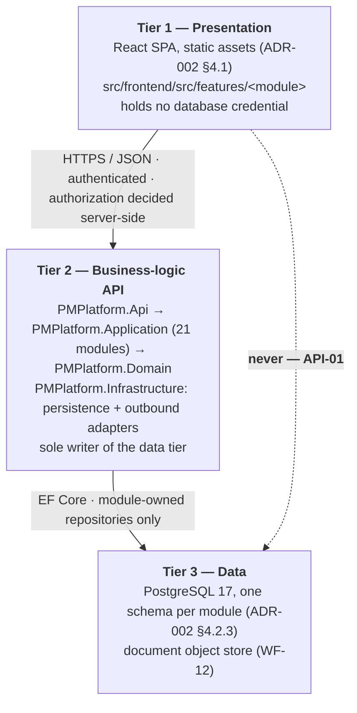
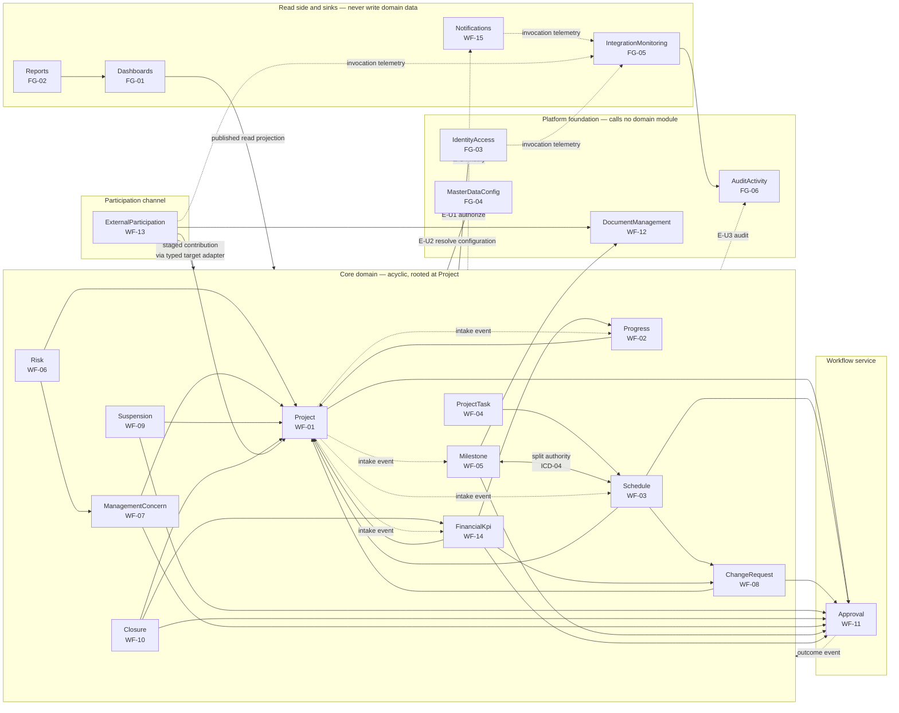

# Solution Architecture — Three Tiers and Module Boundaries

| Field | Value |
| --- | --- |
| Task | TASK-007 — Define Three-Tier Solution Architecture & Module Boundaries (P1 - Architecture Decisions) |
| Depends on | TASK-006 — Ratify Application Technology Stack ADR (`docs/architecture/adrs/ADR-002-technology-stack.md`, PROPOSED — PENDING AHDA APPROVAL) |
| Record date | 2026-09-20 |
| Register row | **ADR-003 — Solution architecture pattern.** This document is the full record behind that row. No separate `adrs/ADR-003-*.md` file is created: a pointer file would be a second place to keep in step. TASK-007 names this path and this file is the record |
| Decision status | **PROPOSED — PENDING AHDA APPROVAL.** Not answered at the AHDA decision gate of 19 Sep 2026. Per the TASK-007 gate note it is put to AHDA IT **in the same session as ADR-002** (§14) |
| Decision owner | Engagement Architect (proposer) → AHDA IT (confirming authority, §14) |
| Branch | `chore/task-007-task-007-module-boundaries` |
| Workbook read | Google Sheet "Implementation work" (ID `1JQdbw-S9wAS247cP3PpSCme_D2NAPVnWzhXhvvxrtl0`), sheets Implementation Plan (112 task rows, TASK-001–TASK-112), Architecture Decisions (ADR-001–ADR-013), Release Checklist, Open Questions, as exported 2026-09-20 |
| Controlled sources and authority order | per TASK-001 |

## 1. What this record is

The Architecture Decisions sheet already selects the pattern. Its ADR-003 row reads: *"Option A — Modular monolith, one module per WF/FG domain"*, with the rationale that this *"matches the platform's scale (150 named users, 21 WF/FG domains with explicit single-owner-per-fact rules in Blueprint Appendix D) without the operational overhead of microservices; module boundaries still enforce API-01/API-03 (no direct cross-domain DB writes)."*

That is a pattern name. It is not yet an architecture. Nothing in the register says which 21 modules exist, what a module may call, what it may not call, or how "no direct cross-domain DB writes" is enforced in a codebase where — under ADR-002 §6.1 — all 21 modules live in one C# project and share one database.

This record supplies those four things:

1. **The three tiers and the rules that make API-01 structural** rather than a convention (§4.1).
2. **The 21-module registry**, each mapped 1:1 to a WF/FG identifier, with the canonical module name that ADR-002 §6.3's directory scheme is built on (§4.3).
3. **The call rules and the module dependency diagram** — every allowed edge, its mechanism, and its basis in a workbook row or an ICD (§6–§8). The mechanism set contains no repository access, which is how the acceptance criterion's "zero cross-module direct-repository edges" is satisfied by construction rather than by inspection.
4. **The enforcement** that keeps the diagram true after the first sprint (§10), which is the part a modular monolith normally loses.

Per the TASK-007 gate note, the status stays **Proposed — Pending AHDA Approval** and is paired with ADR-002. This record does not approve itself.

### 1.1 Why the pairing is not a formality

ADR-002 §1.1 already recorded it from the other side: `src/backend/PMPlatform.Application/Features/<Module>` needs both records — ADR-002 fixes the prefix, this record fixes `<Module>`. TASK-011's own Gate Decision cell says the same: *"Do not initialize the monorepo before ADR-002 and ADR-003 are approved — the directory layout depends on them."* The Release Checklist gate "Architecture Decisions Approved" names the two records as *"the only remaining blockers to this gate — and to starting code."*

Approving either one alone leaves TASK-011 blocked. There is no partial credit here.

## 2. Scope — what this record decides and what it does not

| | Subject | Owner |
| --- | --- | --- |
| **Decides** | The three-tier separation and the rules enforcing API-01 | This record |
| **Decides** | The modular-monolith pattern, its layering, and the 21-module boundary set | This record |
| **Decides** | The canonical module name for each WF/FG domain (closing ADR-002 §7.3(a)) | This record |
| **Decides** | Allowed call directions between modules, and the mechanism permitted for each | This record |
| **Decides** | How the boundary is enforced automatically (§10) | This record |
| **Does not decide** | Language, framework, runtime version, ORM, repository layout | **ADR-002** |
| **Does not decide** | Hosting, region, tenancy, compute runtime | **ADR-001** |
| **Does not decide** | Entity attributes, keys, normalisation — the ERD | **TASK-008.** §9 hands it the entity-to-module ownership register it consumes |
| **Does not decide** | REST naming, versioning, error envelope, event schema format | **TASK-009.** §5 fixes *which* calls exist; TASK-009 fixes what they look like on the wire |
| **Does not decide** | Screen inventory, dashboard and report counts, notification channels | ADR-004 to ADR-013 |

## 3. Options considered

The register's three options, assessed.

| Option | As recorded in the ADR-003 row | Assessment |
| --- | --- | --- |
| **A** | Modular monolith with one bounded module per WF/FG domain | **Selected.** §5's rationale. |
| **B** | Microservices per domain | **Not selected.** 21 services for 150 named users, 25 concurrent and 50 at peak (Release Checklist capacity baseline) buys nothing and costs a great deal. The domain's hardest rules are cross-module transactional invariants — single Active Approved Baseline (WF-03), at most one ActiveSuspension per Project (WF-09), ChangeAuthorization idempotency (WF-08), Published snapshots immutable after later correction (WF-14) — and TASK-054/TASK-059/TASK-065 are written to prove them under real interaction. In a monolith each is a database constraint plus one transaction. Split across services each becomes a saga with a compensating path and an eventual-consistency window that the Blueprint's "fail closed on critical ambiguity" rule (Section 12, cited by TASK-034) does not tolerate. It also multiplies the ADR-001 surface: 21 deployables to localise, patch and monitor in-Kingdom. |
| **C** | Monolith with no internal module boundaries | **Not selected.** It fails the acceptance criterion by construction — with no boundary there is no dependency diagram to draw and no such thing as a cross-module repository edge, because every repository is everyone's. It also forfeits the single property that makes B available later: a module set that can be lifted out one at a time. |

Option A's real risk is not architectural, it is entropic: a modular monolith is a monolith that has not eroded yet. §10 is the answer to that and is part of the decision, not a recommendation attached to it.

## 4. Decision

### 4.1 Three tiers (API-01)



The rules that make the dotted edge impossible rather than merely discouraged:

| # | Rule | How it is verified |
| --- | --- | --- |
| **T-1** | No database credential exists in the presentation tier. `DB_CONNECTION_STRING` (Environment and Secrets sheet) is server-side only and is never injected into a Vite build. | CI check in TASK-015: no database driver in `src/frontend/package.json`; no `DB_` variable in `vite` env exposure. |
| **T-2** | Every write enters through a `PMPlatform.Api` endpoint that delegates to exactly one module application service. There is no second write path — no direct SQL from a client, no reporting tool with write access, no shared stored procedure. | T-1 removes the client's ability to hold a connection; architecture test A-5 (§10) removes the server's second path. |
| **T-3** | `PMPlatform.Api` contains no business rule. It authenticates, binds, maps HTTP to an application-service call, and maps the result back. Validation of *shape* belongs here; validation of *meaning* belongs to the module. | Architecture test A-2 (§10); code review against CODEOWNERS (TASK-012). |
| **T-4** | Authorization is decided server-side for every request (Blueprint Section 10.1, TASK-030). The SPA hiding a control is presentation, never a control. | TASK-043/TASK-054/TASK-059/TASK-065 negative cases for unauthorized transitions. |
| **T-5** | Report generation and export (FG-02) run in tier 2 as report jobs against module projections, not as direct database queries from a reporting tool. TASK-071's allowlisted explorer (SCR-138, "no arbitrary SQL/joins/formulas") is the only composition surface. | Architecture test A-5; TASK-071 acceptance. |
| **T-6** | The presentation tier **may** compose several modules on one screen; it may never enforce a cross-module invariant. A screen that needs two modules makes two calls. A rule that spans two modules lives in tier 2. | §11.2 (TASK-107). |

### 4.2 One deployable, four projects, 21 modules

Inside tier 2, ADR-002 §6.1 fixes four projects. Their dependency directions are fixed here:

```
PMPlatform.Api  ──────────────▶ PMPlatform.Application ──────────▶ PMPlatform.Domain
       │                                   ▲                              ▲
       └── composition root only ──▶ PMPlatform.Infrastructure ───────────┘
                                    (implements Application/Domain interfaces)
```

| # | Rule |
| --- | --- |
| **L-1** | `PMPlatform.Domain` references no other project. Entities, value objects and domain rules only. |
| **L-2** | `PMPlatform.Application` references `Domain`. It defines the interfaces `Infrastructure` implements (repositories, clocks, outbound ports). It never references `Infrastructure` or `Api`. |
| **L-3** | `PMPlatform.Infrastructure` references `Application` and `Domain` and implements their interfaces. EF Core `DbContext`, EF configurations, migrations and outbound adapters live here and nowhere else. |
| **L-4** | `PMPlatform.Api` references `Application`, and `Infrastructure` **only** in its composition root (dependency-injection registration). No controller, filter or middleware touches an `Infrastructure` type directly. |
| **L-5** | A module is a folder in `Application/Features/<Module>` plus its entities in `Domain`, its EF configuration and repository implementation in `Infrastructure/Persistence`, and its controllers in `Api`. The module is the unit of ownership across all four projects — CODEOWNERS (TASK-012) is written against it. |

### 4.3 The 21 modules

One module per WF/FG domain, 1:1, no module without a domain and no domain without a module. Backend directories are relative to `src/backend/PMPlatform.Application/`, frontend to `src/frontend/src/`, per ADR-002 §6.2–6.3.

| # | Module | Domain | Backend | Frontend | Owning task rows |
| --- | --- | --- | --- | --- | --- |
| 1 | Project | WF-01 Project Creation & Registration | `Features/Project` | `features/projects` | TASK-041, 042, 043, 104 |
| 2 | Progress | WF-02 Progress Update & Overall Health | `Features/Progress` | `features/progress` | TASK-044, 045, 107 |
| 3 | Schedule | WF-03 Schedule & Baseline Management | `Features/Schedule` | `features/schedule` | TASK-046, 047 |
| 4 | **ProjectTask** (§4.4) | WF-04 Task Management | `Features/ProjectTask` | `features/tasks` | TASK-048, 049 |
| 5 | Milestone | WF-05 Milestone Management | `Features/Milestone` | `features/milestones` | TASK-050, 051 |
| 6 | Risk | WF-06 Risk Management | `Features/Risk` | `features/risks` | TASK-055, 056 |
| 7 | ManagementConcern | WF-07 Issue & Challenge Management | `Features/ManagementConcern` | `features/issues-challenges` | TASK-057, 058 |
| 8 | ChangeRequest | WF-08 Change Request & Authorization | `Features/ChangeRequest` | `features/change-requests` | TASK-060, 061, 106 |
| 9 | Suspension | WF-09 Suspension & Resumption | `Features/Suspension` | `features/suspension-closure` | TASK-062, 064 |
| 10 | Closure | WF-10 Completion & Closure | `Features/Closure` | `features/suspension-closure` | TASK-063, 064 |
| 11 | Approval | WF-11 Shared Approval Framework | `Features/Approval` | `features/approvals` | TASK-035, 036 |
| 12 | DocumentManagement | WF-12 Document & Evidence Management | `Features/DocumentManagement` | `features/documents` | TASK-037, 038 |
| 13 | ExternalParticipation | WF-13 External Entity Update & Review | `Features/ExternalParticipation` | `features/external-participation` | TASK-066, 067, 068 |
| 14 | FinancialKpi | WF-14 Financial Progress & KPI Performance | `Features/FinancialKpi` | `features/financial-kpi` | TASK-052, 053, 108 |
| 15 | Notifications | WF-15 Notifications, Reminders & Escalations | `Features/Notifications` | `features/notifications` | TASK-039, 040, 103 |
| 16 | Dashboards | FG-01 Dashboards | `Features/Dashboards` | `features/dashboards` | TASK-069, 070, 111 |
| 17 | Reports | FG-02 Reports, Filters & Export | `Features/Reports` | `features/reports` | TASK-071, 072, 112 |
| 18 | IdentityAccess | FG-03 Users, Roles & Permissions | `Features/IdentityAccess` | `features/identity-access` | TASK-028, 029, 030, 031, 032, 110 |
| 19 | MasterDataConfig | FG-04 Master Data & Configuration | `Features/MasterDataConfig` | — (§11.4) | TASK-034, 105 |
| 20 | IntegrationMonitoring | FG-05 Integration Monitoring & Administration | `Features/IntegrationMonitoring` | `features/integration-admin` | TASK-075, 076, 092 |
| 21 | AuditActivity | FG-06 Formal Audit & Activity | `Features/AuditActivity` | `features/audit-activity` | TASK-073, 074, 033 |

**The 1:1 mapping holds in both directions**: 15 WF domains + 6 FG domains = 21 modules, each appearing once. Two places where it looks otherwise, and does not:

- **Suspension and Closure share one frontend folder** (`suspension-closure`), because TASK-064 delivers one UI over both. They are two modules with two backends, two lifecycles and two aggregates. A shared screen folder is a presentation-tier convenience, not a boundary merge — and under T-6 it cannot become one.
- **Milestone and Schedule share the ProjectMilestone identity** under explicit split authority (ICD-04). That is a modelled contract between two modules, not one module. §8 states who owns which fact.

### 4.4 Module names — two decisions

**(a) The six names ADR-002 §7.3(a) left disputed.** The TASK-007 description names them one way and 22 workbook directory cells another. This record owns the name, so it settles them, adopting the directory-column form exactly as ADR-002 §6.3 anticipated:

| TASK-007 description | Directory column | Adopted |
| --- | --- | --- |
| Concern | ManagementConcern | **ManagementConcern** — matches the aggregate TASK-057 actually builds, which covers both Issue and Challenge types |
| Change | ChangeRequest | **ChangeRequest** — "Change" alone collides with change *data* in every module's audit trail |
| Document | DocumentManagement | **DocumentManagement** — `Document` is the entity inside the module; a module and its entity must not share a name |
| Notification | Notifications | **Notifications** |
| Dashboard | Dashboards | **Dashboards** |
| Report | Reports | **Reports** |

**(b) WF-04 is named `ProjectTask`, not `Task`.** This is the one place this record departs from both the TASK-007 description and ADR-002 §6.3, for a reason that is a compile error rather than a preference:

- A C# namespace `PMPlatform.Application.Features.Task` shadows `System.Threading.Tasks.Task` for every type declared inside it. Every `async Task` signature in the module then fails with CS0118 ("Task is a namespace but is used like a type") unless each file carries a `using Task = System.Threading.Tasks.Task;` alias or fully qualifies the return type. ADR-002 §6.4 requires the folder path and the namespace to stay identical, so the folder name is the namespace name; and TASK-011's acceptance criterion is a zero-warning build, which this starts by fighting.
- "Task" is already overloaded in this platform: WF-04 has Task/Subtask, and WF-11 has ApprovalTask (TASK-008's aggregate list). Two unrelated things called Task in one solution is a defect generator in its own right.
- The frontend folder stays `features/tasks` unchanged — kebab-case plural does not collide with anything, and ADR-002 §6.4 keeps the two tiers' conventions deliberately different.

Cost of the change: one row in ADR-002 §6.3, one word in the TASK-007 description, and the Canonical File Directory cells of TASK-048 and TASK-049. Cost of not making it: an alias directive in every file of the module for the life of the platform. It is put to the Engagement Architect as Q3 (§14); if declined, §4.3 row 4 reverts to `Features/Task` and the alias becomes a documented convention in CONTRIBUTING.md.

### 4.5 Module groups

The 21 modules fall into five groups. The group determines what a module may call, which is what keeps §7's edge register short and checkable.

| Group | Modules | Rule |
| --- | --- | --- |
| **Platform foundation** | IdentityAccess, MasterDataConfig, DocumentManagement, AuditActivity | May be called by any module. **Calls no domain module, ever.** A foundation module never reads a domain module's data to do its job; the caller supplies what it needs (§5, M-7). |
| **Workflow service** | Approval | Called by a domain module to start an approval. Returns its result as a typed outcome event, never by calling the source module back. It holds no domain knowledge — an approval subject is a module id, an aggregate id and a version. |
| **Core domain** | Project, Progress, Schedule, ProjectTask, Milestone, Risk, ManagementConcern, ChangeRequest, Suspension, Closure, FinancialKpi | A directed acyclic graph rooted at Project. |
| **Participation channel** | ExternalParticipation | Applies staged external contributions to core-domain modules through one typed adapter interface, never by writing their data. |
| **Read side and sinks** | Dashboards, Reports, Notifications, IntegrationMonitoring | Read from, or are published to by, other modules. **Never write domain data and never recompute a source-owned fact** (ICD-03, TASK-069). |

## 5. Rationale

1. **The scale argues for one deployable.** 150 named users, 25 concurrent, 50 at peak. The operational cost of a distributed system is paid whatever the load; the benefit arrives only at a scale this platform does not have and is not forecast to reach inside the engagement.
2. **The domain's invariants are transactional and cross-module.** They are listed in Option B's assessment above. One database and one transaction make them constraints; distribution makes them sagas. ADR-002 §5 (point 2) chose the stack on the same premise.
3. **API-03/P-08 is a boundary rule, and boundaries need a place to exist.** Option C has nowhere to put it. Option A puts it at the module's application-service surface, where it can be stated (§5's M-rules), drawn (§6), listed (§7) and tested (§10).
4. **The module set is not a design choice — it is given.** Blueprint Sections 5–6 define 15 WF and 6 FG domains with single-owner-per-fact rules in Appendix D. Inventing a different decomposition would break every traceability path the Step 14B RTM depends on. What this record adds is the call graph between them, which the Blueprint does not state in one place.
5. **Option B stays reachable.** Each module owns its schema, publishes a typed contract surface, and never reaches into another module's tables. That is the precondition for extracting a module into a service later. Nothing here forecloses it; nothing here pays for it now.

## 6. Module call rules

"Typed application-service call" is the load-bearing phrase in TASK-007's description. This is what it means, and what it excludes.

| # | Rule |
| --- | --- |
| **M-1** | Every entity, table and business fact is owned by exactly one module. Ownership means: that module's code is the only code that writes it. §9 is the register. |
| **M-2** | A module's **public surface** is its application-service interfaces and its contracts (commands, queries, DTOs, events) under `Features/<Module>/Contracts`. Handlers, repositories, EF configurations, domain entities and internal services are **not** public surface, whatever their C# accessibility (§10 explains why accessibility alone cannot express this). |
| **M-3** | A **cross-module write** is performed by calling the owning module's application service with a typed command. Never by writing its tables, never by loading its aggregate through a repository or `DbSet`, never by an `UPDATE` in a shared migration. This is API-03/P-08. |
| **M-4** | A **cross-module read** is performed by calling the owning module's query service or reading its published read projection. No EF navigation property crosses a module boundary: a foreign reference is held as an identifier, not as an object reference. |
| **M-5** | **No module calls Notifications synchronously.** A module publishes a typed `NotificationIntent` after its own transaction commits — commit-before-notify, Blueprint Section 15 and TASK-039. A failed notification never rolls back a business fact, and a business fact never waits on a channel. |
| **M-6** | **Audit is emitted through the outbox inside the writing transaction** (durable capture, Blueprint Section 18, TASK-073). AuditActivity never calls back into the emitting module and never re-derives what happened. |
| **M-7** | **The authorization engine is never given a data dependency on a domain module.** The calling module supplies the authorization subject — owner, assignment, lifecycle state, sensitivity classification — as a typed value; IdentityAccess evaluates the Section 10.1 formula and returns a decision. Without this rule FG-03 acquires a read edge into all 20 other modules and the diagram inverts. |
| **M-8** | **Approval is subject-agnostic.** A source module starts an approval with a subject reference (module, aggregate id, version) and a routing key. Approval returns the outcome as an idempotent typed event the source module handles (TASK-035). Approval holds no reference to any source module's types. |
| **M-9** | **The core-domain call graph is acyclic.** Where a genuine two-way need exists, one direction is a synchronous call and the other is an event (the intake path in §7, edge 36, is the worked example). The rule is counted over the core-domain group. The foundation, workflow-service and sink groups are exempt because by §4.5 they never call a domain module at all, and the universal edges (E-U1 to E-U4) may therefore run between foundation modules in both directions — they carry a decision, a configuration value or an event, never a write to the caller's data. |
| **M-10** | **Shared code lives in `Application/Common` and `Domain/Common` and is domain-neutral**: identifiers, the SAR money type (ADR-008), bilingual label types (ADR-012), audit columns, pagination, the governed-configuration lifecycle primitive (§11.3). A type that means something to one domain never lands there. |
| **M-11** | **One command, one transaction.** A command that legitimately writes two modules does so through both modules' application services inside one transaction against the single database. This is a deliberate benefit of the monolith and is not a boundary violation — the boundary is about *whose code writes*, not about transaction scope. |
| **M-12** | **The read side never writes and never recalculates.** Dashboards and Reports read projections that carry semantic state (CURRENT/LIVE, PUBLISHED/OFFICIAL, HISTORICAL/SNAPSHOT), freshness and coverage, and they render what the owning module published. Overall Project Health is computed in WF-02 and nowhere else (ICD-03, TASK-044, TASK-069). |
| **M-13** | **One PostgreSQL schema per module.** A module's migrations touch only its own schema. A cross-schema foreign key is permitted only to another module's aggregate-root primary key — never to an internal table of that module. |

## 7. Module dependency diagram

Arrows show **call direction**: the tail calls the head. Solid = synchronous typed application-service call. Dashed = asynchronous typed event (publisher → subscriber). The four universal edges are drawn once, from the core-domain group, rather than 21 times; §8.1 states that they apply to every module, the foundation, workflow-service and sink groups included.



The diagram is the readable form. **§8 is the normative form** — where the two disagree, §8 governs and the diagram is corrected.

## 8. Edge register

Every allowed cross-module edge. "Mechanism" is drawn from a closed set: *command*, *query*, *read projection*, *event*, *outcome event*, *split-authority contract*. **Repository access is not in the set**, which is how the acceptance criterion's zero-repository-edge requirement is met by construction.

### 8.1 Universal edges

| # | From | To | Mechanism | What crosses | Basis |
| --- | --- | --- | --- | --- | --- |
| E-U1 | every module | IdentityAccess | query | effective-authorization decision on a supplied subject (M-7) | Blueprint Section 10.1; TASK-030 |
| E-U2 | every module | MasterDataConfig | query | resolved master data and versioned policy configuration, failing closed on ambiguity | Blueprint Section 12; TASK-034 |
| E-U3 | every module | AuditActivity | event | mandatory audit-class events via the transactional outbox | Blueprint Section 18; TASK-073, TASK-033 |
| E-U4 | every module | Notifications | event | `NotificationIntent`, published after commit | Blueprint Section 15; TASK-039 |

### 8.2 Specific edges

| # | From | To | Mechanism | What crosses | Basis |
| --- | --- | --- | --- | --- | --- |
| 1 | Progress | Project | query | project identity, classification, lifecycle state for a reporting cycle | TASK-044 dep TASK-041 |
| 2 | Schedule | Project | query | same | TASK-046 dep TASK-041 |
| 3 | Risk | Project | query | same | TASK-055 dep TASK-041 |
| 4 | ManagementConcern | Project | query | same | TASK-057 dep TASK-041 |
| 5 | FinancialKpi | Project | query | same | TASK-052 dep TASK-041 |
| 6 | ChangeRequest | Project | query | same | TASK-060 dep TASK-041 |
| 7 | Suspension | Project | command | Active↔Suspended lifecycle transition, distinct from the request record | TASK-062 |
| 8 | Closure | Project | command | Completed then Closed transitions; Closed is terminal | TASK-063 |
| 9 | ProjectTask | Schedule | query | activity identity and dates the task executes against | TASK-048 dep TASK-046 |
| 10 | Milestone ↔ Schedule | — | split-authority contract | WF-03 owns schedule representation and dates; WF-05 owns achievement evidence and the accepted Actual Achievement Date | ICD-04; TASK-050 |
| 11 | Schedule | ChangeRequest | query | version-pinned ChangeAuthorization, read before rebaseline | TASK-060 |
| 12 | FinancialKpi | ChangeRequest | query | version-pinned ChangeAuthorization, read before a commitment change | TASK-060 |
| 13 | FinancialKpi | Progress | query | reporting-cycle and period alignment | TASK-052 dep TASK-044 |
| 14 | Closure | FinancialKpi | query | closure readiness checks against financial state | TASK-063 dep TASK-052 |
| 15 | Risk | ManagementConcern | command | materialisation of a risk into an issue | TASK-055 |
| 16 | Milestone | DocumentManagement | command | achievement evidence attachment | TASK-051 |
| 17 | ExternalParticipation | DocumentManagement | command | contribution attachments | TASK-066 dep TASK-037 |
| 18 | ExternalParticipation | Project | query | ENTITY-scoped, least-disclosure project projection for R08 | TASK-066 |
| 19 | ExternalParticipation | owning core module | command via `IExternalContributionTarget` | Path B staged contribution, applied after source revalidation. **Target module set unconfirmed — S-5** | TASK-066 |
| 20 | Project | Approval | command | registration / activation approval | TASK-041 |
| 21 | Schedule | Approval | command | baseline approval | TASK-046 |
| 22 | ChangeRequest | Approval | command | change authorisation | TASK-060 |
| 23 | Suspension | Approval | command | suspension / resumption approval | TASK-062 |
| 24 | ManagementConcern | Approval | command | escalation | TASK-057 |
| 25 | Milestone | Approval | command | achievement acceptance. **Route inferred — S-4** | TASK-050 (WF-11 not named) |
| 26 | FinancialKpi | Approval | command | approved commitment/budget versions and KPI target versions. **Route inferred — S-4** | TASK-052 (WF-11 not named) |
| 27 | Closure | Approval | command | completion and closure approval. **Route inferred — S-4** | TASK-063 (WF-11 not named) |
| 28 | Approval | source module | outcome event | idempotent decision outcome carrying the subject reference and version | TASK-035 |
| 29 | Dashboards | Progress, Schedule, Risk, FinancialKpi | read projection | controlled source projections with semantic state, freshness and coverage; read-only | TASK-069 deps |
| 30 | Reports | Dashboards | query | the same controlled projections, for report definitions and jobs | TASK-071 dep TASK-069 |
| 31 | IdentityAccess | IntegrationMonitoring | event | AD/LDAP/SSO invocation and sync-run telemetry | TASK-075 dep TASK-028 |
| 32 | Notifications | IntegrationMonitoring | event | email/SMS channel invocation telemetry | TASK-075 dep TASK-039; TASK-103 |
| 33 | ExternalParticipation | IntegrationMonitoring | event | Nafath invocation telemetry, if in scope | TASK-068; TASK-075 |
| 34 | IntegrationMonitoring | AuditActivity | query | integration audit log view (ADM-053) | TASK-075 dep TASK-073 |
| 35 | Project | Schedule, Progress, Milestone, FinancialKpi | event (`ProjectIntakeRecorded`) | legacy-intake Declared Baseline and opening position, each written by its owning module (§11.1) | TASK-104 |

### 8.3 Count

| | Count |
| --- | --- |
| Modules | **21** |
| WF/FG domains mapped | **21** (WF-01–WF-15, FG-01–FG-06), 1:1 |
| Universal edge rules | 4 |
| Specific edges | 35 |
| Edges whose mechanism is direct cross-module repository or table access | **0** |
| Edges flagged as inferred pending a rank-1 spec | 4 (nos. 19, 25, 26, 27) |
| Cycles in the core-domain call graph | **0** (edge 35 is an event; edge 10 is a declared split-authority contract, not two calls) |

## 9. Entity ownership register

TASK-007's validation check asks that every business fact in Blueprint Appendix D have exactly one owning module, or an explicitly modelled split-authority pair. **Appendix D cannot be read**: the Blueprint is held neither in the repository nor in the connected Drive (TASK-001 §5.1, re-verified 2026-09-20). The register below is therefore built from the aggregate list the workbook itself states in TASK-008, mapped to §4.3. Running it against Appendix D is S-1.

| Module | Aggregates and owned facts (from TASK-008) |
| --- | --- |
| Project | Project master aggregate; formal project identifier; project lifecycle state; permanent intake marker (TASK-104) |
| Progress | **no aggregate named in TASK-008 — see below.** Owns: reporting cycles, progress submissions, Published progress snapshots, and the calculated Overall Project Health (ICD-03) |
| Schedule | ProjectSchedule, ScheduleActivity, ApprovedBaseline, Declared Baseline (TASK-104), schedule variance and Schedule Health; ProjectMilestone schedule representation and dates |
| ProjectTask | Task, Subtask, Activity Execution Progress. TASK-008 should name the entity `ProjectTask` for the reason in §4.4b — a class named `Task` shadows `System.Threading.Tasks.Task` for every file in its namespace |
| Milestone | MilestoneAchievement, accepted Actual Achievement Date, achievement revisions |
| Risk | Risk, RiskAssessmentVersion, treatment/mitigation actions |
| ManagementConcern | ManagementConcern (Issue and Challenge types), calculated Severity |
| ChangeRequest | ChangeRequest, ChangeAuthorization, materiality band (TASK-106) |
| Suspension | SuspensionRequest, ActiveSuspension |
| Closure | CompletionCase, ClosureCase, PostProjectObligation, ActualProjectCompletionDate |
| Approval | ApprovalInstance, ApprovalTask, delegation, approval history |
| DocumentManagement | Document, DocumentVersion, Attachment, BusinessLink, EvidenceReference, scan state |
| ExternalParticipation | ExternalUpdateRequest, ExternalContribution |
| FinancialKpi | FinancialCommitment, Published Financial Snapshot, KpiAssignment, approved Target Version, KpiMeasurement, source provenance (TASK-108) |
| Notifications | NotificationIntent record, NotificationDelivery, suppression and dead-letter state |
| Dashboards | DashboardDefinition, UserDashboardPreference (TASK-111) |
| Reports | ReportDefinition, ReportJob, SavedView, generated output |
| IdentityAccess | User, Role, Permission, AccessRelationship, PermissionProfile and its versions (TASK-110) |
| MasterDataConfig | MasterDataItem, ConfigurationVersion, GovernanceProfile (TASK-105) |
| IntegrationMonitoring | IntegrationDefinition, IntegrationInstance, Invocation, SyncRun, OperationalAlert |
| AuditActivity | AuditEvent (append-only), Business Activity projection (derived, rebuildable) |

**Finding for TASK-008: the aggregate list in TASK-008's own description covers 20 of the 21 modules. WF-02 Progress has none.** The list names Project, schedule, task, milestone, risk, concern, change, suspension, closure, approval, document, external, financial/KPI, notification, dashboard, report, identity, master data, integration and audit aggregates — and no progress-update, reporting-cycle or Overall Project Health entity. Since ICD-03 makes WF-02 the exclusive owner of Overall Project Health, and TASK-069 forbids FG-01 from recomputing it, the fact has an owner with no table. TASK-008 must add the WF-02 aggregates or the ERD will hand the calculation to whoever needs it first. Recorded as S-2.

**Split-authority pairs — the complete set.** Anything not on this list is single-owner.

| Fact | Owners | Rule |
| --- | --- | --- |
| ProjectMilestone | Schedule (WF-03) + Milestone (WF-05) | One identity, two authorities: schedule representation and dates vs. achievement evidence and accepted actual date. One row, never duplicated — TASK-054 tests this (ICD-04) |
| Project lifecycle state vs. suspension/closure case | Project (WF-01) + Suspension (WF-09) + Closure (WF-10) | The request and its approval belong to WF-09/WF-10; the transition on the Project belongs to WF-01 and is made by command (edges 7, 8) |
| Physical progress | ProjectTask (WF-04) captures actual progress at task level; Progress (WF-02) rolls it up and publishes health | ADR-009: weighted rollup by planned duration. WF-02 publishes; nothing else computes |
| Integration health vs. business lifecycle state | IntegrationMonitoring (FG-05) + the source module | Technical health never colours a business state and never appears as one (TASK-075) |

## 10. Enforcement

A boundary that only a reviewer enforces is a boundary that lasts one sprint. Under ADR-002 §6.1 all 21 modules share one C# project, so `internal` accessibility cannot express M-2 — any module can see any other module's types at compile time. That is a real weakness of the chosen layout and it is answered here rather than left implicit.

**The enforcement is an automated architecture-test suite in `PMPlatform.Tests.Unit`, run as a CI gate by TASK-015.** It is authored at TASK-011 alongside the skeleton, before any module exists, so it never has to be retrofitted against violations.

| # | Rule asserted | Fails when |
| --- | --- | --- |
| **A-1** | No type under `Features/<X>` references a type under `Features/<Y>` except types under `Features/<Y>/Contracts`. | A module reaches past another module's public surface (M-2, M-3). |
| **A-2** | No repository interface or implementation, no `DbContext` and no `DbSet` is referenced from outside its owning module. | The cross-module repository edge the acceptance criterion forbids. |
| **A-3** | No entity type declares a navigation property to an entity owned by another module. | M-4 — the silent way a boundary dissolves. |
| **A-4** | `Domain` references nothing; `Application` references no `Infrastructure` or `Api` type; `Api` references `Infrastructure` only from the composition-root namespace. | L-1 to L-4. |
| **A-5** | No SQL string, `DbContext` or migration outside `Infrastructure/Persistence` writes a table belonging to another module's schema. | T-2, T-5, M-13. |
| **A-6** | The edge list derived from actual `Features/<X>` → `Features/<Y>/Contracts` references equals §8.2. | A new edge appears that this record does not allow. The test fails on **any** difference; adding an edge means revising §8.2 first. |

A-6 is the one that keeps this document true. Every other rule prevents a class of violation; A-6 makes the diagram executable, and makes the acceptance criterion re-checkable on every commit rather than on the day it was signed.

Supporting controls, already owned by other tasks: CODEOWNERS per module folder (TASK-012), so a cross-module change requires the other module's owner; the PR template asking which modules a change touches (TASK-012); and TASK-054/TASK-059/TASK-065, which test the domain invariants that the boundary exists to protect.

**If the boundary erodes anyway**, the escape is to promote each module to its own C# project, at which point `internal` enforces M-2 for free. That is a project-file change, not a rewrite, precisely because the folder structure already matches. It is not proposed now: 21 projects slow the build and buy nothing while A-1 to A-6 pass.

## 11. Consequences for the workbook

Specified, not applied — per TASK-001 §4, revisions are re-issued rather than overwritten. Authorisation is Q5 (§14).

### 11.1 TASK-104 is a cross-module write path, and must not be built as one

TASK-104 captures, in one intake, "percent complete, spend to date and milestones already achieved" plus a Declared Baseline. Those four facts belong to four other modules (Progress, FinancialKpi, Milestone, Schedule). The natural implementation writes them directly and breaches API-03 on the first row of legacy data.

Under §8.2 edge 35, Project records the intake and publishes `ProjectIntakeRecorded`; each owning module handles it and writes its own fact. The Declared Baseline is a Schedule-owned baseline type, distinguishable from an ApprovedBaseline. This keeps the core-domain graph acyclic and keeps the opening position inside the modules whose invariants govern it. TASK-104's description should name this path.

### 11.2 TASK-107's single-pass update is composed in the presentation tier

TASK-107 asks for one flow covering "progress, milestones, risks, issues and narrative in one pass". Building that as a backend orchestration service would add three cross-module command edges and put an update to a Risk under WF-02's authority.

Instead: **Progress owns the periodic-update session** — draft, resume, pre-filled defaults, completion-time instrumentation — and holds references to the items, not copies. The screen submits each item to its owning module's endpoint (T-6). This is available because the requirement is already a save-as-draft-and-resume flow, not a single atomic transaction. It adds no edge to §8.2.

### 11.3 TASK-110 places permission profiles in FG-04; the catalogue is FG-03's

TASK-110 says "implement configurable permission profiles in FG-04", composed from "the protected FG-03 permission catalogue", with R01–R08 as undeletable shipped defaults and user assignments bound to a profile *version*. Split across two modules, this makes FG-04 the writer of an FG-03-owned fact, which M-1 forbids: a permission profile is a permission artefact, and the catalogue it composes from, the R01–R08 defaults it must not delete, and the user assignments it binds are all FG-03's.

Resolution: **IdentityAccess owns PermissionProfile and its versions** (§9), and the governed lifecycle it needs — DRAFT → VALIDATED → PUBLISHED → RETIRED with author/reviewer/publisher separation — is implemented once as a domain-neutral primitive in `Application/Common` (M-10) and used by both MasterDataConfig and IdentityAccess. FG-04 keeps master data and policy configuration; FG-03 keeps the permission catalogue and profile. ADR-002 §7.2 already routes TASK-110 to `Features/IdentityAccess`, so the directory column is unaffected; only TASK-110's wording changes.

### 11.4 Two gaps carried forward from ADR-002 §7.3, now resolved or escalated

| Item | Disposition |
| --- | --- |
| **(a) TASK-045 / TASK-047 overlap.** TASK-045 is named "Progress & Schedule UI (WF-02/WF-03 Frontend)" but its stated content is WF-02 only — SCR-070 Progress Update History, SCR-048 Project Progress tab, MOD-020–022. TASK-047 delivers every WF-03 screen: SCR-060, SCR-045, SCR-061, MOD-015/017/018. | **Resolved: TASK-045 is WF-02 only.** Its name should read "Build Progress UI (WF-02 Frontend)". No WF-03 screen is lost and the folder split in ADR-002 §6.3 is correct as it stands. |
| **(b) FG-04 has no frontend task.** MasterDataConfig is the only module with a backend task and no frontend counterpart, yet ADM-020–029 are in the screen inventory and master data is the surface AHDA populates for the matrices UGV-03/04/05 are waiting on. | **Escalated unchanged.** This is a scope gap for the PMO, not a boundary defect. It becomes visible again here because §4.3 is the only place all 21 modules are listed against their delivery tasks. S-3. |

### 11.5 Nine amendment rows depend on tasks that do not exist

The workbook holds 157 dependency edges across its 112 rows. All but **nine** resolve to a task row by exact name match, and all nine failures sit on rows added 19–20 Sep 2026:

| Row | Names as its dependency | No task row has that name; the intended row is |
| --- | --- | --- |
| TASK-104 | Build Project Registration & Activation (WF-01 Backend) | TASK-041 Build Project Creation & Registration |
| TASK-105 | Build Master Data & Configuration Services (FG-04 Backend) | TASK-034 Build Master Data & Configuration Service |
| TASK-106 | Build Change Request Workflow (WF-08 Backend) | TASK-060 Build Change Request & Authorization |
| TASK-107 | Build Progress Reporting Workflow (WF-02 Frontend) | TASK-045 Build Progress & Schedule UI |
| TASK-108 | Build Financial Tracking Workflow (WF-14 Backend) | TASK-052 Build Financial Progress & KPI Performance |
| TASK-109 | Build Core Data Model & Migrations | TASK-025 Implement Core Platform Schema |
| TASK-110 | Build User & Role Administration (FG-03 Backend) | TASK-031 Build Users, Roles & Permissions Administration |
| TASK-111 | Build Dashboards & Widgets (FG-01 Frontend) | TASK-070 Build Dashboards UI |
| TASK-112 | Build Reports, Filters & Export (FG-02) | TASK-071 / TASK-072 Reports service and UI |

This does not change any module assignment — each row carries its WF/FG identifier, which is what §4.3 maps on — but it breaks the workbook's own dependency graph, and with it the wave dependency check in `docs/planning/wave-to-phase-crossreference.md` §6, which was run over TASK-001–TASK-102 only. It sits alongside the duplicate phase-numbering scheme ADR-002 §7.4 recorded on the same ten rows. For the PMO. S-6.

## 12. Residual items

| # | Item | Owner | Owed by | Consequence if unresolved |
| --- | --- | --- | --- | --- |
| S-1 | **Blueprint v2.0 Sections 3–8, Section 5–6 and Appendix D are not obtainable.** Neither the repository nor the connected Drive holds them (TASK-001 §5.1, re-verified 2026-09-20). The 21 modules are mapped to WF/FG identifiers as the workbook states them; the "matching Sections 3–8 exactly" and Appendix D single-owner checks in TASK-007 are specified in §9 but have not been run. | PMO Engagement Lead | Before TASK-008 | The acceptance criterion's third clause and the validation check rest on the workbook's restatement of the Blueprint rather than on the Blueprint. Any Appendix D fact this record has not seen has no confirmed owner. |
| S-2 | **WF-02 Progress has no aggregate in TASK-008's list** (§9), while ICD-03 makes it the exclusive owner of Overall Project Health. | Engagement Architect | Into TASK-008 | The ERD gives the platform's most-consumed calculated fact no table, and the first consumer that needs it will compute it — which is exactly what ICD-03 forbids. |
| S-3 | **FG-04 has no frontend task** (§11.4b). | PMO Engagement Lead | Before W1 closes | Master data and configuration are backend-only, so AHDA cannot populate the catalogues the platform fails closed without. |
| S-4 | **Three approval routes are inferred, not stated** (§8.2 edges 25, 26, 27): milestone achievement acceptance, financial commitment and KPI target versions, and completion/closure. Each task describes an approval-shaped workflow without naming WF-11. | Engagement Architect, against the WF-05/WF-10/WF-14 specs (rank 1) | Before TASK-050, TASK-052, TASK-063 | Three modules either reuse the shared framework or each build their own — the outcome the Shared Approval Framework exists to prevent. |
| S-5 | **The WF-13 staged-contribution target set is not enumerated** (§8.2 edge 19). The workbook states Path A and Path B and the revalidation rule, but not which object types an external entity may contribute to. | Engagement Architect, against the WF-13 spec (rank 1) | Before TASK-066 | The adapter interface can be defined without it; the set of implementing modules cannot, so the last edge in the diagram stays open. |
| S-6 | **Nine amendment rows name dependencies that match no task row** (§11.5). | PMO Engagement Lead | Before W1 planning | The workbook's dependency graph and the ratified wave dependency check no longer cover the ten newest rows. |
| S-7 | **ADR-002 §6.3 row 4 re-issue** if `ProjectTask` is adopted (§4.4b), plus the TASK-007 description and the TASK-048/049 directory cells. | Engagement Architect + PMO | Before TASK-011 | Either the folder name or the namespace has to give, and a `using Task =` alias in every file of the module is the alternative. |
| S-8 | **The architecture-test suite (§10) is not in any task's acceptance criteria.** TASK-011 creates the skeleton and TASK-015 gates CI, but neither names A-1 to A-6. | Engagement Architect + PMO | Into TASK-011 and TASK-015 | This record becomes documentation rather than a constraint, and the acceptance criterion is verified once, on the day it is signed. |

## 13. Acceptance-criteria check

| # | Criterion | Result |
| --- | --- | --- |
| 1 | A module dependency diagram exists showing all 21 modules and allowed call directions | **MET.** §7 draws all 21 modules, grouped, with call direction on every edge and the four universal edges drawn per group. §8 is the normative edge register behind it: 4 universal rules and 35 specific edges, each with a mechanism and a basis. |
| 2 | The diagram has zero cross-module direct-repository edges | **MET by construction, and testable.** The mechanism set (§8) is closed and contains no repository or table access; the count is in §8.3. §10 A-2 asserts it in CI, and A-6 asserts the whole edge set matches §8.2 on every commit. |
| 3 | Each module maps 1:1 to a WF/FG ID from Blueprint Section 5-6 | **MET against the workbook's WF/FG identifiers; unconfirmed against the Blueprint.** §4.3 maps 21 modules to WF-01–WF-15 and FG-01–FG-06, once each in both directions, with the two apparent exceptions explained. The Blueprint itself cannot be read (S-1), so the mapping is made against the workbook's restatement of Sections 5–6. |

Validation check from the TASK-007 definition:

| Check | Result |
| --- | --- |
| "Review diagram against Blueprint Appendix D (Domain/Entity Ownership Register) to confirm every business fact in Appendix D has exactly one owning module, or an explicitly modeled split-authority pair" | **NOT RUN — Appendix D is not obtainable (S-1).** §9 does what can be done without it: an entity-to-module ownership register built from the aggregate list the workbook states in TASK-008, with the complete set of four split-authority pairs declared, and one gap found and recorded (S-2). The check remains owed and is the first thing TASK-008 should run when the Blueprint is located. |

## 14. Confirmation required from AHDA IT

Per the TASK-007 gate note, these are put in the **same session as ADR-002's Q1–Q6**. ADR-002 Q3 asks AHDA to approve both together; this is the other half of that question.

| # | Question | Answer |
| --- | --- | --- |
| **Q1** | **The modular monolith (Option A) with the 21-module boundary set in §4.3**, one module per WF/FG domain, as the architecture for build. | ☐ Confirmed  ☐ Replaced with: ____________ |
| **Q2** | **The call rules in §6 and the edge register in §8** as the binding statement of what a module may call — in particular M-3 (cross-module writes through typed application-service calls only) and M-7 (the authorization engine is never given a data dependency on a domain module). | ☐ Confirmed  ☐ Amended: ____________ |
| **Q3** | **WF-04's module name: `ProjectTask` or `Task`?** (§4.4b) `Task` shadows `System.Threading.Tasks.Task` for every type in the namespace and collides with WF-11's ApprovalTask. Recommended: `ProjectTask`, which costs one row in ADR-002 §6.3 and two directory cells. (S-7) | ☐ ProjectTask  ☐ Task, with a documented alias convention |
| **Q4** | **The architecture-test suite in §10 added to TASK-011's deliverables and TASK-015's CI gate.** Without it, criterion 2 is verified once rather than continuously. (S-8) | ☐ Added  ☐ Declined |
| **Q5** | **Authorisation for the workbook edits specified in §11**: TASK-045's name (WF-02 only), TASK-104's intake path, TASK-107's composition, TASK-110's module placement, the six module names in §4.4a, and the nine unresolvable dependency names in §11.5. | ☐ Authorised  ☐ Declined  ☐ Partial: ____________ |
| **Q6** | **Location of Blueprint v2.0 and the 21 WF/FG specifications** (S-1), without which the Appendix D ownership check cannot be run and TASK-008 starts on the same footing this record did. | Location: ______________  ☐ Not available |

On Q1 and Q2 being confirmed, the header status becomes **APPROVED**, the register's ADR-003 Status cell is re-issued to match, and — together with ADR-002 — the Release Checklist gate "Architecture Decisions Approved" closes and TASK-011 is unblocked.

| Role | Decision | Name | Date |
| --- | --- | --- | --- |
| AHDA IT | Q1, Q2, Q6 | | |
| Engagement Architect | Q3, Q4; §4–§10 proposed and, on confirmation, binding on TASK-008 onward | | |
| PMO Engagement Lead | Q5: workbook edits authorised / declined | | |

## 15. Change log

| Date | Change | By |
| --- | --- | --- |
| 2026-09-20 | Initial record. Option A ratified as the delivery-team proposal, status held at Proposed — Pending AHDA Approval and paired with ADR-002 per the TASK-007 gate note. Three tiers and six API-01 rules recorded (§4.1); 21-module registry mapped 1:1 to WF-01–WF-15 and FG-01–FG-06 (§4.3); the six disputed module names settled and WF-04 renamed `ProjectTask` (§4.4); thirteen call rules (§6); module dependency diagram and a 4+35 edge register with zero repository edges (§7, §8); entity-to-module ownership register with four declared split-authority pairs and the WF-02 aggregate gap (§9); six-rule architecture-test enforcement suite (§10); five workbook consequences specified (§11); eight residual items (S-1 to S-8). | Architecture (TASK-007) |
